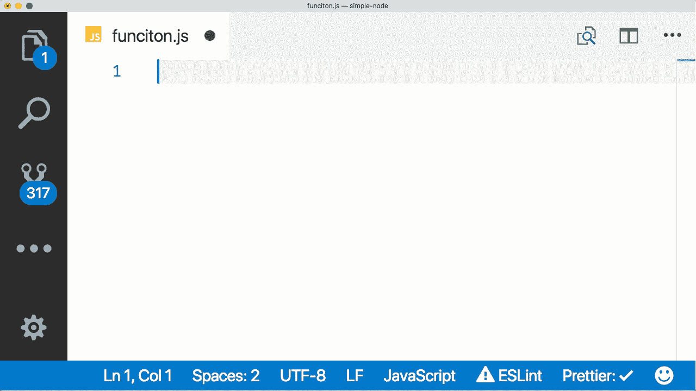
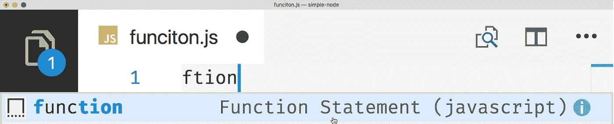
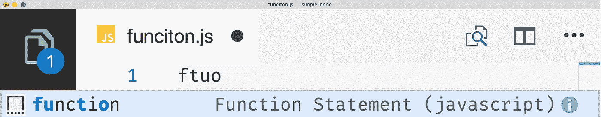
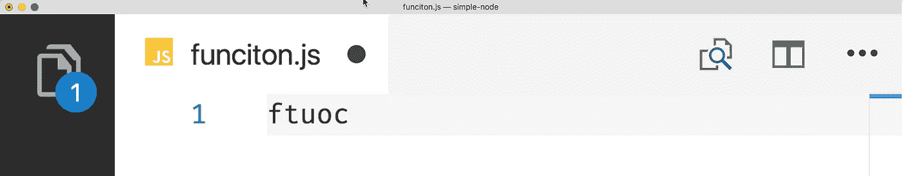
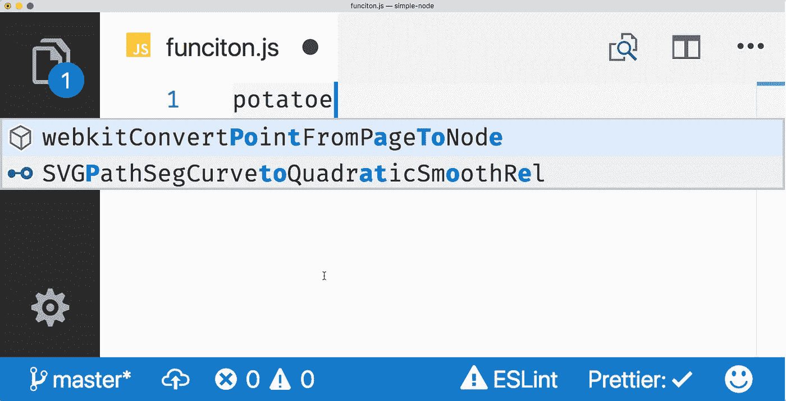

# 为胖手指干杯

> 原文：<https://medium.com/hackernoon/heres-to-fat-fingers-f39a5c778c4c>

今天早上我在看 [Brian Clark](https://twitter.com/_clarkio) 的 [VS 代码发布集锦视频](https://www.youtube.com/watch?v=p6-7GLHWdac&feature=youtu.be)，他在大约 1:16 展示了一个非常有趣的功能…

当我看到这个的时候，我立刻想到了来自 [Raymond Camden](https://twitter.com/raymondcamden) 的一条推文，我知道我已经不止一次看到过这条推文。

我很确定这不是他第一次发微博了。让我检查一下…

没错。显然雷蒙德倾向于调换位置。但是我们都知道斗争是真实的；Raymond 是唯一一个在 ECMAScript 规范中加入“[Fat Fingers](https://hackernoon.com/tagged/fat-fingers)”标准的人。

“嗯，我没有肥胖的手指。”

是的，你有！你刚刚拼错了“手指”！

所以我们所有人的手指都很肥胖(打个比方)，我怀疑 TC39 是否能帮到我们，因为他们正忙于实现像[控制抽象操作符](https://www.ecma-international.org/ecma-262/7.0/#sec-control-abstraction-objects)这样的东西——不管那是什么。

VS Code 显然听到了 Raymond 的呼喊，虽然他们不能改变 JavaScript 本身，但在 VS Code 的智能感知中，输入“Function”对“Function”是有效的。

## **这是如何工作的？！**

虽然我不知道实现这一点的确切代码(即使我知道，我的小光头也可能会爆炸)，但这里是我在 VS 代码中触发智能感知时用眼睛看到的。

Intellisense 非常擅长对您键入的任何术语进行正向查找。在“function”的例子中，只要你输入的字母顺序与单词中的顺序相同，VS Code 就会匹配你要找的单词。例如，如果我们在“function”(**fnto**)中键入每隔一个字符，它将像这样匹配…

这种搜索在单词中前进时跳过任意数量的字母。

这在逻辑上是有道理的，但是没有解决字符换位的问题。

换位是指你有正确的角色，但他们的位置被错误地调换了。打字的时候经常会这样。这可能是键入“function”(⟲一世)或“function”(⟲一世)的错误。这并不是因为大脑试图这样拼写单词，而是因为我们打字太快了，错误就会发生，可能是因为手指的移动速度不如大脑快。

在我看来，为了解决这个问题，VS 代码现在将在字符串中向后查找匹配的字符。字符不**而**必须紧挨着。在这个例子中，VS 代码匹配“函数”中的“c ”,尽管我完全跳过了它，键入了“o ”,然后在后面包含了“c”。

但看起来这个只管用一次。换句话说，VS Code 将进行向后搜索，但是一旦匹配，它将不再进行向后搜索，而是继续向前搜索。

例如，您可以键入“FTO”并获得匹配，因为“u”在“t”之前，“o”在最后。

但是如果你在这里加上一个“c ”, intellisense 将不会进行第二次反向搜索，因此这个词不会被识别。

此外，请注意，任何进一步的向前搜索都将在最后一场比赛后进行。简而言之，VS Code intellisense 现在支持字符串中的一个**转置错误。**

综上所述，只要您的单词*以正确的字符*开头，并且只有一个字母没有按顺序排列，VS Code 就会给你一个匹配。

此外，键入“potatoe”将触发对`webkitConvertPointFromPageToNode`的匹配。

## **更新:**

自从本文发表以来，VS 代码团队已经很好地阐明了*实际上是如何工作的……*

> 逻辑很简单:我们有一个算法，给定一个`pattern`和一个`word`就可以计算分数(见`fuzzyScore`)。这本身不会进行任何排列或反向匹配，但会检查所有模式字符是否按顺序出现在单词中(并从这些出现中挑选出最好的，例如`bk`(T5)对`^black_^knight`)。给定这个算法，我们可以简单地调整`pattern`并多次调用它，要么在没有找到匹配的时候，要么看看是否可以计算出更强的匹配(侵略性的)。
> 
> [约翰内斯·里肯](https://twitter.com/johannesrieken)——VS 代码团队

因此，它比我想象的要聪明得多，因为算法本质上是创建一堆可能的换位错误(准确地说是 7 个——如果单词至少有那么长的话),然后对任何匹配进行评分，以确定最佳结果。

你可以自己去[查看源代码](https://github.com/Microsoft/vscode/blob/master/src/vs/base/common/filters.ts#L710)，因为 VS 代码是开源的。

# 为你干杯

这一个是给你的**雷蒙顿、**和其他那些脑袋太大手指太粗的**。你从未放弃，从未失去希望，你的好日子终于来了。我的意思是这不是真正的*因为这不完全是你想要的，但是去年当我在错误的日子里给我妻子唱“生日快乐”时，她告诉我，“够接近了！”***

看看 11 月发布的 VS 代码中的所有新特性。

*讽刺 Dislcaimer:这篇文章是一个写得很差的诊所。我不认为你有胖手指，无论是字面上还是比喻上。任何拼写错误都是故意的，因为在这种情况下很讽刺。我真的不能做任何错事。*

*特别感谢 VS 代码团队的 Johannes Rieken*