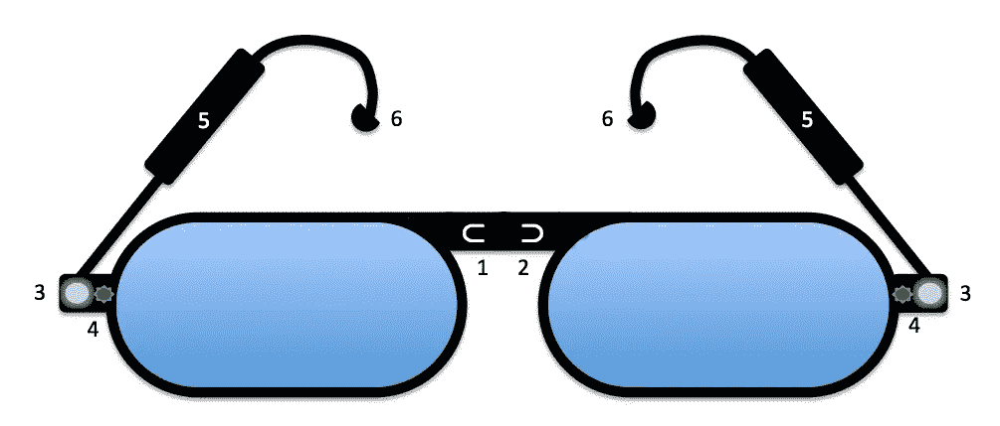
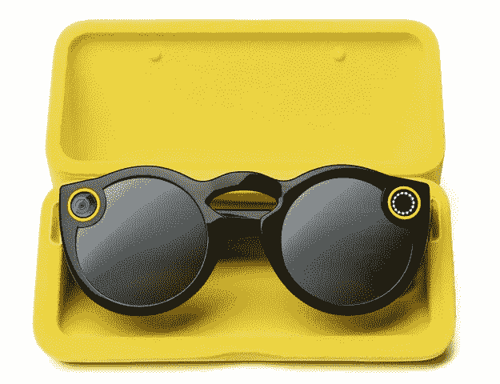

# 一个开放的和尊重隐私的设计为一个按钮眼镜的替代品

> 原文：<https://medium.com/hackernoon/heres-what-snapchat-spectacles-or-its-competitors-ought-to-or-could-be-ea9a363d5481>

Recording glasses should default to appreciating the privacy of others — and do other cool things as well.

多年来，我一直想要一副能帮助我观察和记录我在这个世界上所见所闻的眼镜——但要以礼貌的方式，尊重他人的隐私。因为(据我所知)还没有人做出这样的东西，我决定[发表我的想法](https://blogs.harvard.edu/doc/2014/01/29/searls-glasses-vs-google-glass/)，那是在 2014 年 1 月，当时[【谷歌眼镜](http://en.wikipedia.org/wiki/Google_Glass) [风靡一时](https://www.google.com/search?q=google+glass#newwindow=1&q=google+glass&safe=off&tbm=nws)(这个词有不止一种意思，因为他们对他人隐私的漠视是出了名的)。

我不谦虚地称我的想法为“西尔斯眼镜”，因为幸运的是，我姓氏的前四个字母结合了“看”和“听”(或“耳朵”)——也因为它们仍然是眼镜。而且我当时很着急，也没想到更好的名字。这并不重要，因为我不在乎。你想怎么称呼他们都行。就我而言，这是属于公共领域的可申请专利的想法之一。这是我把它放在这里的主要原因。

无论如何，现在 Snapchat 已经推出了它的[眼镜](https://www.spectacles.com/) …

…而且[功能集似乎相当有限](https://www.cnet.com/products/snapchat-spectacles/preview/)(尽管它们看起来确实很酷，而且很有前途——至少对我来说)，似乎是重新审查我的原始功能集的好时机，要么指导有竞争力的开发人员，要么敦促 Snapchat 做比他们的第一次努力多得多(也尊重得多)的事情。下面是上面眼镜旁边的数字说明:

1.  第一人称*指示器*
2.  第二/第三人称指示器(指示与附近第二或第三方关系状态的灯)。
3.  双目(3D)相机。
4.  关灯/开灯。绿色表示没有录音。红色表示正在录制。
5.  [双耳](http://en.wikipedia.org/wiki/Binaural_recording)麦克风(每个泰恩河一个)和电子部分，加上所有其他需要的电路(录音、蓝牙、电池)。
6.  耳机。

Rindicators (#s 1 和 2)是我们在 [VRM](http://projectvrm.org) 开发社区中称之为 [r-buttons](http://blogs.law.harvard.edu/vrm/2012/09/04/lets-turn-do-not-track-into-a-dialog/) 的东西。我在飞机上重新命名了它们，在那里我构思了整个想法并写了下来。它们是如何工作的以及它们象征着什么仍然悬而未决。我认为，指示相关动作和/或状态的 UI 元素是必不可少的——不仅在这里，在无数其他种类的硬件和软件中也是如此。

双目相机(#3)比普通的单目相机(如谷歌眼镜)要酷得多。嘿，我们的眼睛和眼镜已经是 3d 的了。为什么我们戴在头上的相机不是呢？

然而，这些有一个额外的特点:他们寻找隐私政策的第二方信号。例如，如果西尔斯眼镜看到有人戴着这些[顾客共用](http://customercommons.org)按钮——

—中间有一个二维码，扫描的二维码上写着“不要给我拍照或录像”，这个愿望会得到尊重。同样的道理也适用于一个包含近场发射器[的按钮](http://en.wikipedia.org/wiki/Near_field_communication)，它也表达了同样的意思。这是谷歌眼镜和 Snapchat Spectacles 都缺乏的东西的一个例子:[设计隐私](http://www.privacybydesign.ca/)。(有关更多背景信息，请参见 [Big Privacy](http://www.privacybydesign.ca/index.php/paper/big-privacy/) ，这篇论文深受我们许多人在 VRM 方面所做工作的影响。)

开关灯(#4)告诉其他人摄像机是否打开并记录他们看到的东西。

我很惊讶，现在耳机正处于时尚低潮，我们没有听到太多关于[双耳录音](https://en.wikipedia.org/wiki/Binaural_recording)的消息，也没有智能手机或平板电脑采用它。也许 Snapchat(或一些竞争对手)可以改变这一点。同时，找一些双耳录音，用耳机听。它们与传统的立体声录音有很大不同，因为只使用了两个麦克风，通常位于胸部——人体模型头部——人耳的位置。这样他们就能记录下一个人听到的声音，而不是录音师用混音器合成的声音。这种效果在听觉上相当于 3d 图像:整个“声音舞台”非常像是一种全方位 360 度身临其境的体验。换句话说，比 3D 好。通过我的设计，你可以制作自己的双耳录音，这要感谢耳朵上的双耳麦克风(#5)。泰恩河上的灯还会告诉其他人你是否在录音:另一个设计隐私的例子。

我认为记录和管理这些眼镜所带来的一切的最佳方式是通过蓝牙连接智能手机或平板电脑应用程序。理想情况下，它本身会是一个伟大的应用程序，但不会把人锁在任何一家公司封闭、封闭和专有的封建制度中。(比如谷歌的，Snapchat 的。)

另外，我的设计还能接收低能量的蓝牙信号，并将其辐射出去。最近关于这些已经说了很多，也写了很多。(尤其是我的朋友[罗伯特·斯考伯](http://nextberlin.eu/2013/11/robert-scoble-on-the-future-of-wearable-computing/)。)

但是，不要去想营销人员如何使用这些信标，而是去想你可以用它们做什么*。例如:当你正在购物时，发出你对某种产品或服务感兴趣的信号，或者你对被跟踪不感兴趣。或者告诉商店你不想被跟踪，关闭对营销间谍软件的监视(或者至少要求尊重你的偏好)。*

我想知道你的想法，但我也认为开发者对这个想法(或它激发的想法)所做的事情更重要。

不客气

> [黑客中午](http://bit.ly/Hackernoon)是黑客如何开始他们的下午。我们是 [@AMI](http://bit.ly/atAMIatAMI) 家庭的一员。我们现在[接受投稿](http://bit.ly/hackernoonsubmission)并乐意[讨论广告&赞助](mailto:partners@amipublications.com)机会。
> 
> 如果你喜欢这个故事，我们推荐你阅读我们的[最新科技故事](http://bit.ly/hackernoonlatestt)和[趋势科技故事](https://hackernoon.com/trending)。直到下一次，不要把世界的现实想当然！

