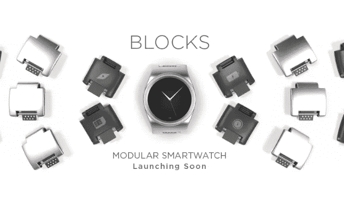
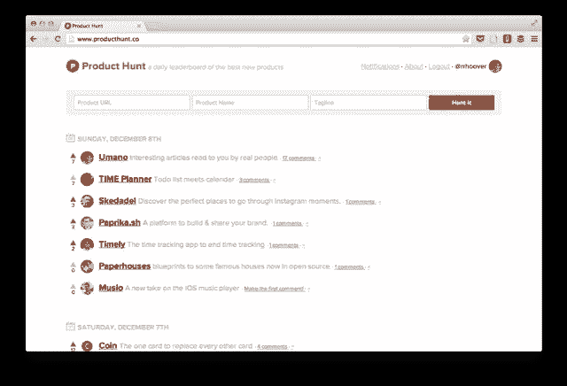

# 这就是为什么 Twitter 是创业公司开始销售的最佳地点

> 原文：<https://medium.com/hackernoon/heres-why-twitter-is-the-best-place-for-startups-to-start-selling-78249cbe94>

[Buffer](http://buffer.com) 、 [Blocks 智能手表](https://new.chooseblocks.com/discover/overview)和 [Product Hunt](http://www.producthunt.com/) 有什么共同点？他们开始通过向人们发推特来获得关注。

这里有一个想法。与其将早期资金投入到谷歌或脸书的广告中，不如从扩展性较差但更有效的东西开始——向人们发布推文。

实话实说吧。寻找有兴趣购买你的(未知)产品的人是创业公司最难做的事情。这并不一定意味着你有一个糟糕的产品——现在仅仅制造它并期望人们来是不够的。

关键是与每个可能对你的解决方案感兴趣的人进行真诚的交谈。如何开始这个过程？嗯……如果有一个地方可以和他们一对一地交谈，展示你的产品并回答他们的问题就好了。一个欢迎陌生人和品牌说话的地方。人们渴望发现新事物并给予反馈。我希望你跟随…

# 一只小鸟告诉我的

乔尔·加斯科因是一个狂热的推特用户。他知道很多有助于维持你在 Twitter 上的存在的工具。然而，他仍然需要一种简单的方法，只需安排“一天 x 次”的推文，而无需选择确切的日期和时间，并让推文自动传播。"如果安排一条推文可以像现在发送一样简单，会怎么样？"。[缓冲](https://buffer.com/)就是这样诞生的。

他们的产品有许多替代品，许多人已经知道其他解决方案。必须让这些人相信 Buffer 是一种优质产品。他们决定利用他们最喜欢的社交网络——Twitter。他们用两种方式做到了。

第一步:影响者。铁杆 Twitter 用户会传播他们发现的新工具的消息。如何联系他们？嗯，Buffer 并没有做什么激进或者超级有创意的事情。他们写了一篇名为[“7 个值得关注的 Twitter 用户及其原因”](https://blog.bufferapp.com/7-twitter-users-worth-following-and-why)的博客，并给文中提到的人发了消息。

他们总是加入个人风格，他们的签名和诚实的观点。由于 Twitter 的开放性，许多追随者看到了对话，Buffer 获得了大量曝光率(和第一批客户)。太甜了？也许吧。但是成功了。有些人甚至直接推荐缓冲剂:

第二种方法是联系 Twitter 的普通用户。这一次竞选失败了。Buffer 在接触到可能对他们的产品感兴趣的人方面并不精确。

这些推文并没有完全展示 Buffer 的价值，而且有些随意。尽管他们获得了一些风险缓冲，但承认他们可以做得更好。不同的方法可能会产生更好的结果。

# 更加…人性化。五个月内从 0 到 1 60 万美元

2015 年 10 月。智能手表是许多人购买的一种常见小工具。在 Pebble(2012 年 4 月)、索尼智能手表(2012 年 7 月)、三星 Gear(2013 年 9 月)、LG G Watch(2014 年 6 月)甚至 iWatch(2015 年 4 月)之后，它已经成为一个真正拥挤的市场。大多数人认为选择足够多样化，可以满足所有需求。但在 2015 年 10 月，iWatch 发布几个月后(iHype 已经启动)，一个不知名的团队推出了一种新的智能手表，开始了他们的 Kickstarter 活动。推出这种产品还会有最糟糕的时机吗？然而，Blocks 最终获得了巨大的成功，筹集了超过 160 万美元。他们是怎么做到的？

从 2015 年 7 月到 11 月，成千上万的人收到了亚当、托尼、艾迪和汤姆的推文。“技术应该是个人的”他们写道。“这个 Kickstarter 值得支持吗？”他们问。人们的反应是:“我想看更多”或“非常感谢分享这个！令人敬畏的概念和迈向可穿戴技术世界的一大步！向你们致敬！”。

产品本身当然很重要——它让每个用户都能用各种零件组装自己的手表。但这并不是 Blocks 与其他类似项目的唯一区别。他们向顾客展示了一种独特的方法。在推销他们的产品时，街区的工作人员努力保持个人的诚实态度。乍看之下，你看不出这实际上是一个产品广告。真实的人在发送推文，他们回应反馈并个性化信息(他们有时甚至会犯打字错误)。他们友好真诚，赢得了信任。

尽管他们发送了数千条推文，但该团队试图准确地关注那些对技术感兴趣并可能需要新智能手表的人。人们收到个性化的推文，参加 Kickstarter 活动，回复或转发。这种方法使他们超出最初目标 6 倍。

# **产品搜索寻找首批用户**

建立一个专门的社区可能比“仅仅”销售你的产品更难。2014 年，为产品 Hunt 编码的 Nathan Bashaw 总结了这个平台的开端。在[他的中型文章](/lets-make-things/the-origin-of-product-hunt-7acb09e2593a#.7hwpie2ya)中，他写道*“我们一开始有一个足够大到有趣，但又足够小到舒适的网络”*。这是建立社区时要记住的最重要的事情。你的目标是找到真正对你的产品感兴趣并愿意和你一起生产的人。你怎么知道的？嗯，你必须像[瑞安·胡佛](https://twitter.com/rrhoover)那样亲自挑选你的第一批用户。

> 瑞安亲自给数百人(可能是数千人)发电子邮件和推特来实现这一目标，如果他没有在过去一年里通过博客建立自己的在线网络，这将会困难得多。

这种战术后来证明确实有效。前 20 名产品搜索用户是杰出的初创公司创始人和技术人员。由于 Ryan 不断的行动和关注，这个团体得以壮大。

最令人惊讶的可能是产品搜索加速他们成长的方式。在建立一个社区的时候，你不能忽视你的第一批成员。这就是为什么瑞安做了一件简单而有见地的事情。他联系现有会员，询问他们是否认识可能喜欢哲学博士的人。然后，他依靠个人接触和积极的交谈来接近这些人。他设法建立了一个积极使用该平台的团队，他们有一种归属感，有一个共同的目标——找到最好、最酷的产品供他人使用。也许你的快乐顾客可以分享他们的经验，并带来其他人:)

# 走出大楼

> 所以我认为这是一件很重要的事情，然后也要真正注意负面反馈，并征求它，特别是从朋友那里。这听起来像是简单的建议，但几乎没有人会这么做，而且非常有帮助。
> 
> 埃隆·马斯克

最初的反馈对每个创业公司来说都是至关重要的。你的客户可以告诉你，你是抓住了重点，还是完全没有抓住重点。一开始，你不需要花费大量的营销资金去接触他们。更好的方法是和他们交谈/写信。您有机会收到反馈或接触潜在的早期用户。你甚至可能会找到非常喜欢这个解决方案的人，他们会成为你的福音传播者。

推特上的人(如果选择明智——喷和祈祷在这里不管用！)非常渴望帮助你，甚至购买你的产品。根据我们(以及其他初创公司创始人)的经验，他们对有人亲自联系他们很感兴趣。这对创业公司来说是一个巨大的优势——表明 Twitter 账户背后有一个真实的人，这种关系是人与人之间的关系。

在我们的初创公司 Rarog 中，我们也有类似的目标。我们希望帮助其他公司接触到最有可能成为他们客户的人。开始一段对话，展示你的创业公司人性化的一面。Rarog 使用关于你的目标客户的信息，创建一个线索列表，并向他们中的每一个人发送个性化信息。我们的活动让你有机会与真实的人交谈，引起对你的产品的兴趣，并证明能很好地锁定潜在客户。我们所有活动的平均点击率约为 46.4%，我们正在努力进一步提高。

尝试 Rarog 的超目标 Twitter 活动并[亲眼看看](http://rarog.io/):)

> [黑客中午](http://bit.ly/Hackernoon)是黑客如何开始他们的下午。我们是 [@AMI](http://bit.ly/atAMIatAMI) 家庭的一员。我们现在[接受投稿](http://bit.ly/hackernoonsubmission)并乐意[讨论广告&赞助](mailto:partners@amipublications.com)机会。
> 
> 如果你喜欢这个故事，我们推荐你阅读我们的[最新科技故事](http://bit.ly/hackernoonlatestt)和[趋势科技故事](https://hackernoon.com/trending)。直到下一次，不要把世界的现实想当然！

