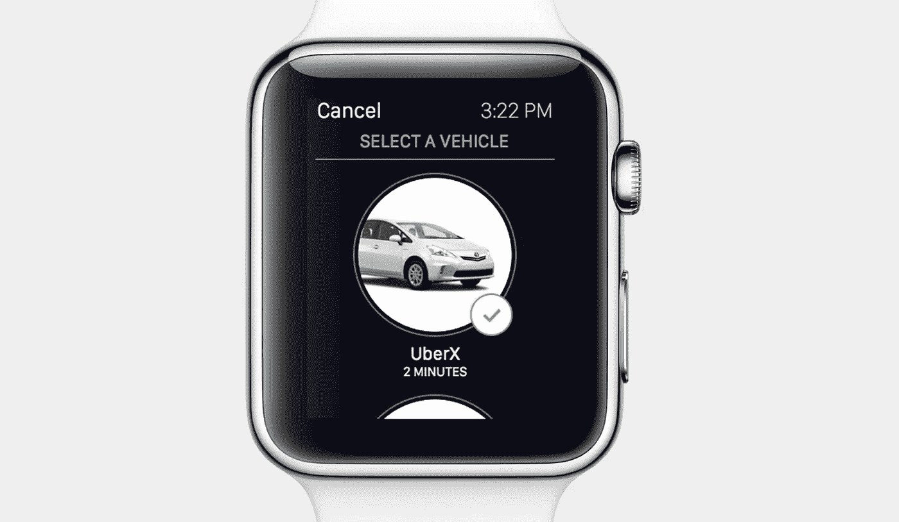

# 嘿，电影推荐者们，我们需要关注用户的体验。

> 原文：<https://medium.com/hackernoon/hey-movie-recommenders-we-need-to-focus-on-the-user-s-experience-1766b75ca466>

“There’s been an awakening. Have you felt it?” The movie recommenders haven’t just yet. Credit: Lucasfilm/Disney

***也发表在 uxmag.com***

我们没有看到电影推荐真正在世界上流行起来。像 T2、金妮、T4 和 T5 这样的网站没有上榜。什么事耽搁了？

***抛开电影推荐的“准确性”，缺少的关键是让推荐成为一种很好的体验。***

A record setting company’s app on a record setting company’s watch

几乎每家科技公司都把体验放在首位，并付诸行动。苹果最近有了历史上最赚钱的一个季度。优步目前是世界上最有价值的风险投资支持的私人公司。整个经济已经从拥有更多便利的体验中诞生。但是推荐落后了。

> “我认为潜意识里人们是非常有洞察力的。我认为他们能感受到关心。”乔尼·伊夫

以下是当今电影推荐的一些特点，以及你对它们的负面感受:

## 永无止境(&超载)

大多数电影推荐网站都给你一个 1 到 5 星等级的选择。我知道，我知道；这里的承诺是，你的评分越高，你挑选的电影就越好。

开始分级后不久，您会注意到要分级的电影列表永无止境。 ***是一场跑不完的马拉松。但是他们告诉你继续前进。正如*** [“我该看什么”:网飞忘记你所有经历的 5 个例子](https://medium.com/u/834f647d1f2f#.jwz5gtl4w)

> [黑客中午](http://bit.ly/Hackernoon)是黑客如何开始他们的下午。我们是 [@AMI](http://bit.ly/atAMIatAMI) 家庭的一员。我们现在[接受投稿](http://bit.ly/hackernoonsubmission)并乐意[讨论广告&赞助](mailto:partners@amipublications.com)机会。
> 
> 如果你喜欢这个故事，我们推荐你阅读我们的[最新科技故事](http://bit.ly/hackernoonlatestt)和[趋势科技故事](https://hackernoon.com/trending)。直到下一次，不要把世界的现实想当然！

