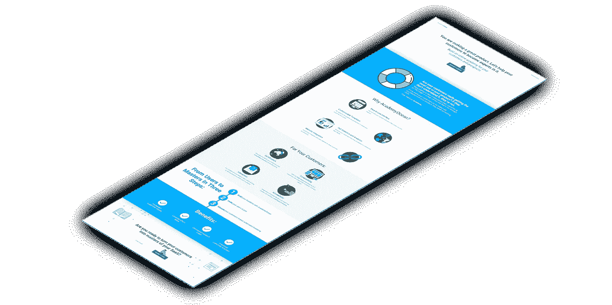
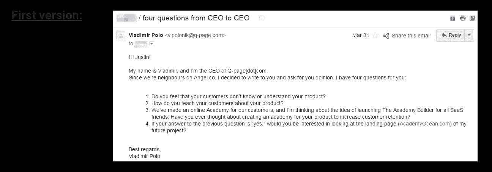
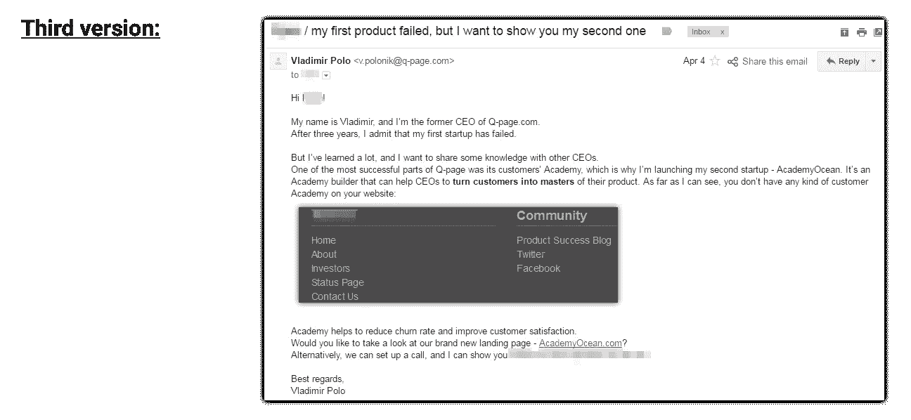
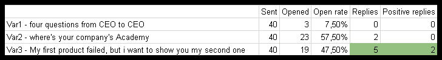
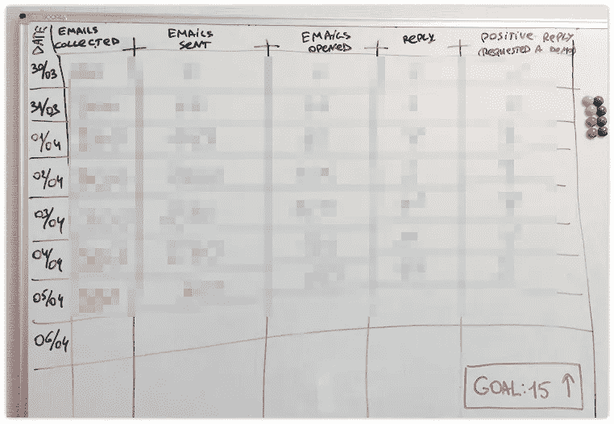
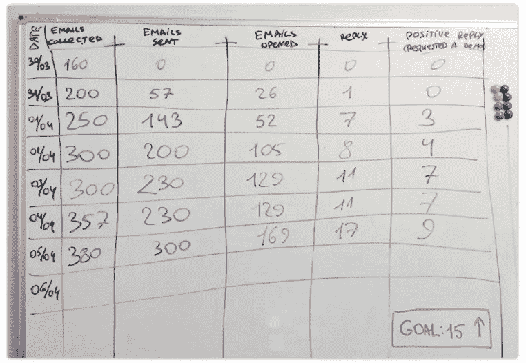
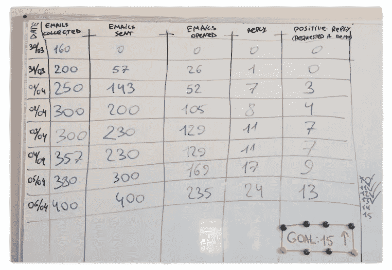
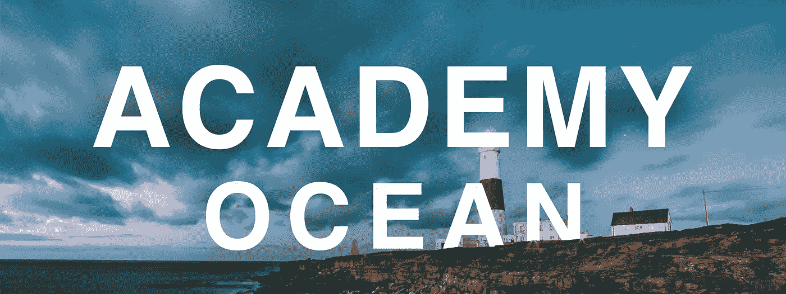

# 嗨，我叫弗拉基米尔，我的第一次创业失败了

> 原文：<https://medium.com/hackernoon/hi-my-name-is-vladimir-and-my-first-startup-failed-ea47007fe244>

  H 一、我叫弗拉基米尔·波罗。三年前，我创办了我的第一家[创业公司](https://hackernoon.com/tagged/startup)。我们拥有一家新公司想要的一切:一个小团队、初始资金、第一批客户、第一批合作伙伴、会议和旅行。我们高兴地收到了第一笔年度付款。我们有传统和内部笑话:对于我们发现的每一个 bug，我们都要向对方收取一块披萨的费用。我们忍受了紧张的情况:正当我在没有 wifi 的情况下登上六小时的飞机时，我们的服务器宕机了(因为 DDOS 攻击)。

总的来说，这是一段激动人心但又艰难的时光。

然而，正如第一次创业的人通常会发现的那样，三年后，我必须承认我的创业没有达到我计划的 KPI。让我说得更具体一些——以下是我失败的主要原因:

## 1.我没有专注于一个观众

当我们还是一个小公司的时候，我试图在四个国家同时发展我的创业公司——我们针对不同的受众，从营销人员到代理商和企业家。

> 我的建议是:当你还很小的时候，专注于一个目标受众。

## 2.我没有明智地选择我的联合创始人

如果你对联合创始人有疑虑，不要和他们一起做生意。记住，你将和这些人一起度过成百上千个小时。三思而后行。

> 我的建议是:在选择你的联合创始人时要非常明智，并且要有书面协议。

## 3.我没有锁定一个利基市场

我们没有做任何真正的研究就开始开发我们的第一家创业公司。我们想，“人们会需要它，所以他们会买”，但我们实际上没有做功课。

> **我的建议:**不要在和几十个潜在客户谈过之前就开始开发，不仅仅是你的朋友。

当我注意到努力失败时，我不想退出。没有人愿意承认他们没有达到目标。没有人喜欢失败。但所有降低客户获取成本(CAC)和为我之前的初创公司 Q-page 建立渠道的努力都没有成功。每天都充满压力，我感到困惑和不舒服。我甚至不再听音乐(除了我最喜欢的乐队平克·弗洛伊德)。

我和我的导师兼投资人谈过，决定给它最后一次机会——尽可能从中获得更多的终极尝试。我设定了一个期限——从那天算起的四周(28 天)。如果我在那段时间里没有任何突破或者想出任何关键的想法，那么我们就会关闭公司。知道我只有最后一次机会有点可怕，但也相当激励人心。

> **以下是我在做出这个决定后的 28 天里所做的事情:**

# 第 1–14 天

在前两周，我用 Angel.co 和 Crunchbase 对成功的创业公司做了大量研究。我研究了数百家甚至数千家初创公司。我想通过浏览其他想法来扩展我的思维。我通过这种方式发现了一些不错的想法，但其中一些太难开发了。其他的与 SaaS 无关(我只想创造 SaaS，因为我真的相信它)。

14 天后，我意识到**查看别人的想法并不是为自己寻找新想法的最佳方式**。至少对我没用。

# 第 15 天

在关键时刻到来的两周前。这一天，我告诉其他公司的几个朋友，我正在为我的创业公司寻找新的想法，这让我们聊了起来。他们对我说，“顺便说一下，你在 Q-page 有一个不错的**学院**。我怎么能给我的 SaaS 买一个这样的呢？”

等一下。

如果我刚刚发现有几家初创公司想要这样的学院，**也许市场上有需求**。我应该去看看这个利基市场！

> *学院是您网站的一个独立部分，您的客户可以在这里了解更多关于您的产品或某个主题的信息。学院由课程组成，完成课程后，您的客户将获得证书或其他奖励(优惠券、折扣等)。这是传递您的教育内容并提高客户忠诚度和参与度的好方法。*

# 第 16 天

我深入思考了这个新想法。

# ***第 17–21 天***

在接下来的四天里，我的团队编写了文本，创建了一个新的登录页面，并收集了未来潜在客户的联系信息。作为一个四人团队，我们能够在三天内完成这项工作。

这是我们的登录页面的样子:

该登录页面的更新版本现已发布在我们的网站上—[AcademyOcean.com](http://academyocean.com/)

# 第 22 天

此时，我已经有了一个登陆页面，看起来好像我们已经开发了我们的产品。接下来，我需要把它展示给我的目标观众，以验证学院建造者的想法。如果人们要求该产品的演示，那么他们将来可能会想要实际的产品。

从第 22 天开始，我决定给 SaaS 的首席执行官们发送个性化的电子邮件。我寻找了那些还没有客户学院但可能需要的 SaaS 公司。

到目前为止，我对冷冰冰的电子邮件毫无经验，所以我用我的信息的几个变体创建了一个 **A/B** 测试。

老实说，他们两个我都不喜欢。他们没有什么特别的，我的读者不会有什么共鸣。这就是为什么我写了第三篇，在那里我坦率地谈论了我的第一次创业。我决定告诉所有人我的失败，于是第三个版本诞生了:

我花了两天时间，将每一个版本的邮件发送了 40 次。我用了一个 [MixMax](http://mixmax.com) 工具来追踪我的电子邮件。以下是我在邮件发出 24 小时后收集的结果:

这不是一个非常大的样本，但结果揭示了很多。他们让我扔掉第一个变体，专注于第三个，记住第二个的高打开率。

当这一切发生的时候，我做了一件非常重要的事情:我在白板上画出了一个 KPI 图表。

可惜第一天没拍照片，当时图表是空的。我将展示一个几乎填满的图表版本，其中的数据被模糊化以代表空白图表，如下图所示。

这些柱子非常简单:

*   日期
*   收集的电子邮件
*   发送的电子邮件
*   打开的电子邮件
*   答复
*   肯定的答复

我每天上班做的第一件事就是用前一天的数字填这张表。在那些日子里，我们是一个四人团队，所以向每个成员展示我们在达到 15 个积极回复的目标方面取得的进展对我来说非常重要。“积极回复”被定义为通过我们的登录页面或电子邮件请求演示。

# 第 23–26 天

此时，我们正在努力收集联系人和发送电子邮件。根据我们在他们网站上看到的内容，选择看起来需要客户学院的初创公司需要时间。然后我们不得不手动给他们发邮件，一天最多发 100 封。

# 第 27 天

这是我们研究的倒数第二天我们的桌子的样子:

那天我们工作了十三个小时。在我们最后一天的早上，我们的白板会是什么样子？

# 第 28 天

4 月 6 日早上，我来到白板前，写下了以下数字:

**我们的目标是 15 个，而演示要求是 13 个。**

让我们深入研究这些数字:

*   我总共发了 **400 封电子邮件**。**已打开 235 封邮件(59%)** 。让我注意一下，这些统计数据是从发送当天最后一封邮件后的 12 个小时开始的。三天后更新图表，打开率跃升至 **63%** 。我们就以此作为本次活动的最终打开率吧。
*   **400 封邮件**中的 24 封回复。 **6%** 回复率。
*   **13** 来自 **400 封邮件的正面回复**。超过 **3%** 的邮件让人们对我的产品充满了好奇。

尽管我们只完成了目标的 87 %( 15 个请求中只有 13 个被收到),但这次测试向我展示了我的想法在未来可能会成功。我发现了一个问题，并找到了解决方案:创业公司缺乏客户教育，这些公司渴望找到解决这个问题的方法。我的产品能帮上忙。

从那一刻起，我的脑海里已经容不下我之前的失败了。可能这是因为有 200 多人打开了我的邮箱，看了我的一部分故事。

> 现在，我有了一个新目标:创建一个新的 SaaS，帮助其他 SaaS 公司解决客户教育水平低下的问题。

对我邮件的大多数回复都非常积极。尽管有些收件人对我的产品不感兴趣，但他们仍然给了我鼓励的话语。他们中的一些人甚至回答说，他们想教他们的销售代表像我一样写电子邮件。令人振奋。当然，有一堆否定的回答，但它们也有帮助。他们帮助我教会自己不要担心负面反应。: )

接下来是一个更加有趣的时期。我已经开始和每个要求演示的人进行 Skype 通话。了解他们业务的特点和问题对我来说非常重要。这有助于我了解我未来产品的核心特性。我将在以后的帖子中更多地谈论我拨打的 Skype 电话。

**经验教训**:

1.  你的第一次创业失败没关系。超过 90%的第一次创业失败。
2.  承认失败是自我发展的一个重要部分。
3.  浏览数百家其他创业公司并不是为自己寻找创意的好方法。
4.  解决一个确切的问题(你的或别人的)是找到一个想法的最好方法。
5.  与人交谈。描述你的目标和意图时要诚实。
6.  设定你的目标，无论是每周还是每月。使用白板。
7.  失败后不要放弃。失败只不过是未来成功的开始。继续工作吧！

如果你现在有类似的情况，请在下面的评论中描述一下，或者直接给我写信:[vladimir@academyocean.com](mailto:vladimir@academyocean.com)。

如果你是 SaaS 的创始人，你需要教育你的客户，请填写这个简短的 [7 个问题的表格](https://docs.google.com/forms/d/1VLUPHypJu-G3P3P2x0adZulafpHakI7OZIOKOI8Y6m0/viewform)。

任何提交此表格的人，如果他们选择在 AcademyOcean 发布后的第一个月内购买我们的产品，他们的订阅期将延长一倍。

**如果你觉得这篇文章读起来很有趣，并且认为它可能对你的朋友有帮助，请分享它。**

> 我和我的团队将继续致力于我们的新创业。很快就会有新的传统，新的快乐客户(他们的问题我们已经解决了)，以及关于首次付款的新快乐。

*感谢您的阅读。祝你的努力成功！*