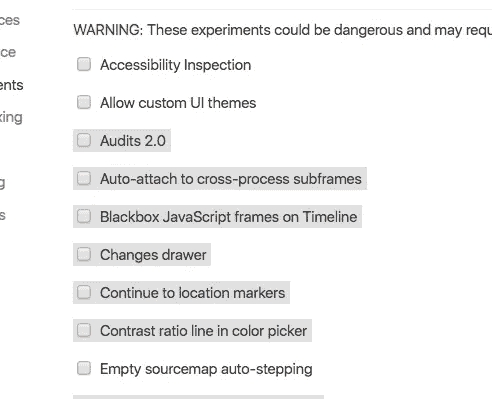
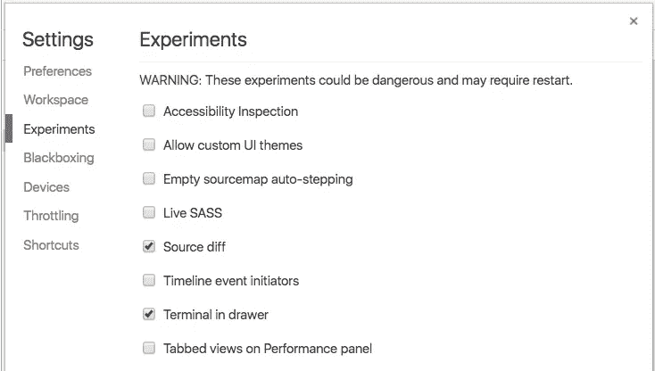
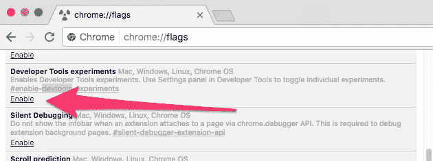
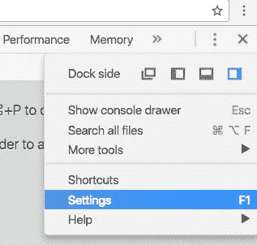
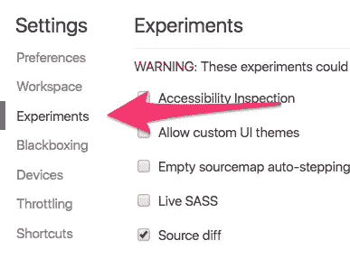
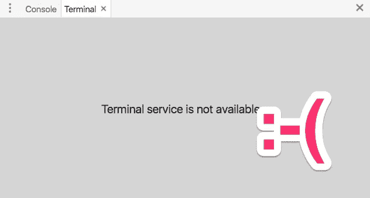

# Chrome Devtools 中隐藏的实验功能

> 原文：<https://medium.com/hackernoon/hidden-experimental-features-in-chrome-devtools-2ae93b11b628>

Super duper view!

如果你像我一样经常使用 Google Chrome Devtools，你可能知道如何看待实验性功能。但是你知道有一种方法可以启用超级“双重秘密试用期”隐藏的实验功能吗？

**TL；dr；转到 Devtools 选项中的实验面板，并点击< shift >六次。**

默认情况下，普通实验面板是不启用的，所以如果您想了解如何启用它，请继续阅读。

以下是 Chrome 实验的正常视图:

Normal View

# 启动实验

需要启用并找到实验面板吗？

进入地址栏的 chrome://flags，启用“开发者工具实验”

然后在 Devtools 下拉选项菜单，选择设置(或按 F1)。

您将看到新的实验面板:

# **超级秘密功能**

在那个面板中，点击 <shift>6 次，你会看到超级实验功能:</shift>

Shhhhhweet!!!!

我没有尝试过这些，但是我尝试过启用终端，但是没有成功！所以使用这些东西要自担风险——这些可能是主动开发中的特性。

Maybe it works on Linux!?

供你参考，我用的是 chrome 金丝雀:(版本 59.0.3064.0 金丝雀(64 位))。谁知道一旦事情败露，这些东西会不会改变。

*喜欢这个提示？通过我的课程“在 Udemy 上掌握 Chrome 开发者工具”学习整套 Devtools。* [*85 折优惠券*](https://www.udemy.com/master-google-chrome-developer-tools/?couponCode=MEDIUMDISCOUNT) *送给我的中等读者。*

> [黑客中午](http://bit.ly/Hackernoon)是黑客如何开始他们的下午。我们是 AMI 家庭的一员。我们现在[接受投稿](http://bit.ly/hackernoonsubmission)并乐意[讨论广告&赞助](mailto:partners@amipublications.com)机会。
> 
> 如果你喜欢这个故事，我们推荐你阅读我们的[最新科技故事](http://bit.ly/hackernoonlatestt)和[趋势科技故事](https://hackernoon.com/trending)。直到下一次，不要把世界的现实想当然！

