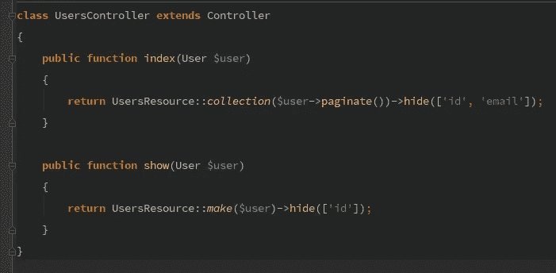

# 动态隐藏 API 字段— Laravel 5.5

> 原文：<https://medium.com/hackernoon/hiding-api-fields-dynamically-laravel-5-5-82744f1dd15a>



我最近在 Laravel Brasil 社区上看到一个[问题](https://github.com/laravelbrasil/forum/issues/140)，这个问题比看起来有趣多了。假设您有一个具有以下实现的`UsersResource`:

出于某种原因，您可能希望在另一个端点上重用该资源类，但是隐藏 email 字段。这篇文章是如何实现这一目标的方法。

如果您不知道什么是 API 资源，可以查看我以前关于这个主题的文章。

*   [对 API 资源的第一印象](https://hackernoon.com/first-impressions-on-laravel-api-resources-4869b73b7847)
*   [具有嵌套关系的 API 资源](https://hackernoon.com/reusable-api-resource-with-nested-relationship-laravel-5-5-c654c7243869)

## 1-设置项目

有趣的事情从第三节开始。

```
composer create-project --prefer-dist laravel/laravel api-fields
cd api-fields
touch database/database.sqlite
```

编辑您的`.env`文件以删除数据库设置并使用 SQLite

```
DB_CONNECTION=sqlite
```

继续设置项目

```
php artisan migrate
php artisan make:resource UsersResource
php artisan make:resource --collection UsersResourceCollection 
php artisan make:controller UsersController
php artisan tinker
factory(App\User::class)->times(20)->create();
quit
```

## 2-路线

确保在`api.php`文件中创建一条路线。

```
Route::*apiResource*('/users', 'UsersController');
```

## 3-控制器

控制器代表期望的目标。在这个例子中，我们假设在清单中我们只想要所有用户的名字，而在显示中我们只想要隐藏电子邮件地址。

为了实现这一点，我们需要我们的`UsersResourceCollection`和`UsersResource`都知道如何处理`hide`呼叫。

## 4-用户资源类

先说`show`法。`UsersResource::make`将返回一个`UsersResource`的对象。因此，我们应该公开一个方法`hide`,该方法存储需要从响应中删除的键。

搞定了。此时，我们应该能够在没有`id`字段的情况下访问`http://api.dev/api/users/1`和阿瑟响应。

```
{
 "data": {
  "name": "Mr. Frederik Morar",
  "email": "[darryl.wilkinson@example.org](mailto:darryl.wilkinson@example.org)"
 }
}
```

## UsersResourceCollection 类

对于使用`index`方法的项目集合，我们需要执行一些更改:

*   (1)确保`UsersResource::collection`返回`UsersResourceCollection`的实例
*   (2)在`UsersResourceCollection`上暴露`hide`方法
*   (3)将隐藏字段传递到`UsersResource`

对于(1)，我们只需要覆盖`UsersResource`上的`collection`方法

对于(2)和(3)，我们需要改变`UsersResourceCollection`文件。让我们公开`hide`方法并用隐藏字段处理集合。

就是这样！现在，如果我们调用`http://api.dev/api/users`，我们可以看到一个没有像指定的`UsersController`那样的`id`和`email`字段的响应。

```
{
 "data": [{
  "name": "Mr. Frederik Morar"
 }, {
  "name": "Angel Daniel"
 }, {
  "name": "Brianne Mueller"
 }],
 "links": {
  "first": "[http://lab.php71/api-fields-2/public/api/users?page=1](http://lab.php71/api-fields-2/public/api/users?page=1)",
  "last": "[http://lab.php71/api-fields-2/public/api/users?page=7](http://lab.php71/api-fields-2/public/api/users?page=7)",
  "prev": null,
  "next": "[http://lab.php71/api-fields-2/public/api/users?page=2](http://lab.php71/api-fields-2/public/api/users?page=2)"
 },
 "meta": {
  "current_page": 1,
  "from": 1,
  "last_page": 7,
  "path": "[http://api-fields.lab.php71/api/users](http://lab.php71/api-fields-2/public/api/users)",
  "per_page": 3,
  "to": 3,
  "total": 20
 }
}
```

## 6-结论

目标是通过允许隐藏另一个端点可能暴露的一些字段，使`Resource`类稍微灵活一些。这种实现的一个实际例子是不包含`avatar`属性的`/users`端点，但是当通过`/users/99`请求特定用户时，我们可能希望在响应中包含`avatar`。

我不建议过多地重用 API 资源，因为这很容易增加本应简单的层的复杂性。也就是说，考虑到实现的简单性，隐藏列表请求和特定记录之间的某些特定字段看起来确实是一个合理的请求。

## 7-接下来是什么

在下一篇文章中，我将尝试将`hide`方法提取到一个特征中，并使它在所有 API 资源中可重用。请在 Medium 上关注我，敬请关注！