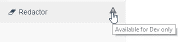

# 从生产中隐藏特征 Laravel

> 原文：<https://medium.com/hackernoon/hiding-feature-from-production-laravel-8815bcb64359>



我最近开始研究环境清理功能。目标很简单:从 **Dev** 和 **Stage** 数据库中删除数据。通常，根据客户的要求，他们的数据库的副本已经在某个地方制作完成，并且从未被移除。

我不知道这是愚蠢的幼稚恐惧还是真正的担忧，但我担心有人会打开两个标签(production 和 dev ),并在错误的标签中错误地使用该功能。[您有没有看过最近在 GitLab 发生的事件？](https://about.gitlab.com/2017/02/01/gitlab-dot-com-database-incident/)

**长话短说**:我开发了一个在生产中不会用到的功能，我就是这样做的:

## 1-路由服务提供商

在`RouteServiceProvider`的`map`中，如果我们没有生产，让我们注册一种新的路线。

```
**if** (!$this->app->environment('production'))
   $this->mapDevelopmentRoutes();
```

接下来，为这种新类型的路由定义规则，例如文件名、控制器名称空间和前缀。

```
*/**
 * Define the "development" routes for the application.
 *
 * These routes all receive "web" middleware.
 *
 ** ***@return*** *void
 */* **protected function** mapDevelopmentRoutes() {
   Route::*middleware*(['web', 'auth'])
      ->namespace($this->namespace . '\Development')
      ->as('development.')
      ->prefix('development')
      ->group(base_path('routes/development.php'));
}
```

## 2-路线/开发. php 文件

除了展示一个真实的例子，这里没什么好说的。这是我注册的。

```
**<?php

use** Illuminate\Support\Facades\Route;

// These routes should only be available for development environment. RouteServiceProvider will make sure to only register these
// in case the environment is not production.

Route::*get*('/redactor', 'RedactorController@index')->name('redactor.index');
Route::*patch*('/redactor', 'RedactorController@redact')->name('redactor.redact');
```

## 3-[可选]视图编辑器

我有一个为用户构建菜单项的`menu.blade.php`文件。我决定利用*la ravel View composer*来告诉这个组件是否显示只开发的特性。

```
**@if(isset**($development) && $development**)** <li>
        <a href="{{route('development.redactor.index')}}">
            <i class="fa fa-eraser fa-fw"></i>
            {{ __('Redactor') }}
            <span class="pull-right text-muted" title="{{ __('Available for Dev only') }}"><i class="fa fa-warning fa-fw"></i></span>
        </a>
    </li>
**@endif**
```

`DevelopmentComposer`文件只是将`development`设置为`true`

```
**<?php

namespace** App\Http\ViewComposers;

**use** Illuminate\View\View;

**class** DevelopmentComposer **extends** TenantComposer {

   **public function** compose(View $view) {
      **parent**::*compose*($view);

      $view->with(['development' => **true**]);
   }
}
```

如果环境不是生产环境，则`ComposerServiceProvider`将只注册`DevelopmentComposer`

```
**if** (!$this->app->environment('production'))
   View::*composer*('layouts.development.menu', 'App\Http\ViewComposers\DevelopmentComposer');
```

是的，这可以与路线的映射一起设置在`RouteServiceProvider`中，但是我现在才意识到这一点(在撰写本文时)=

# 结论

上周，我编辑了大约 20 个数据库，在任务进行到一半时，我突发了一场小心脏病，我在想我是在生产还是在开发。然后我想起我已经确定这永远不会是一个问题。幸福的结局。

> [黑客中午](http://bit.ly/Hackernoon)是黑客们开始他们下午的方式。我们是 [@AMI](http://bit.ly/atAMIatAMI) 家庭的一员。我们现在[接受提交](http://bit.ly/hackernoonsubmission)并很高兴[讨论广告&赞助](mailto:partners@amipublications.com)的机会。
> 
> 要了解更多信息，[请阅读我们的“关于”页面](https://goo.gl/4ofytp) , [喜欢/在脸书给我们发消息](http://bit.ly/HackernoonFB)，或者简单地，[发推文/DM @HackerNoon。](https://goo.gl/k7XYbx)
> 
> 如果你喜欢这个故事，我们推荐你阅读我们的[最新科技故事](http://bit.ly/hackernoonlatestt)和[趋势科技故事](https://hackernoon.com/trending)。直到下一次，不要把世界的现实想当然！