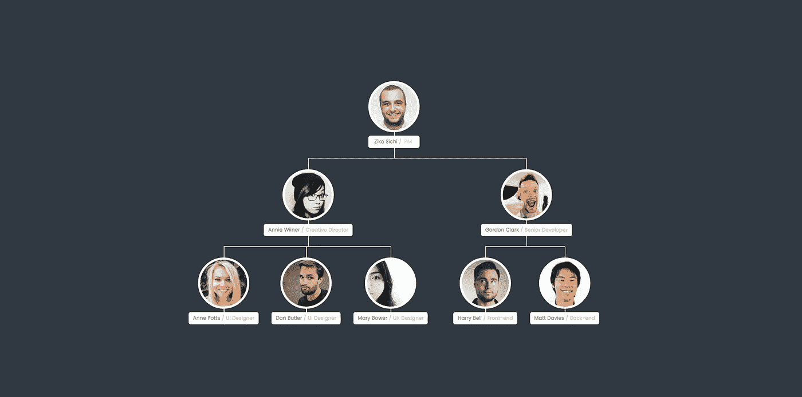
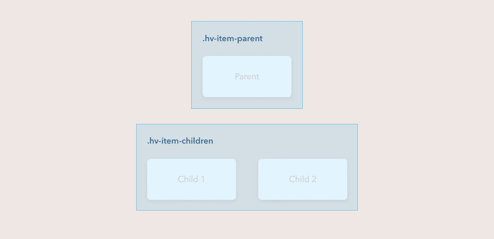
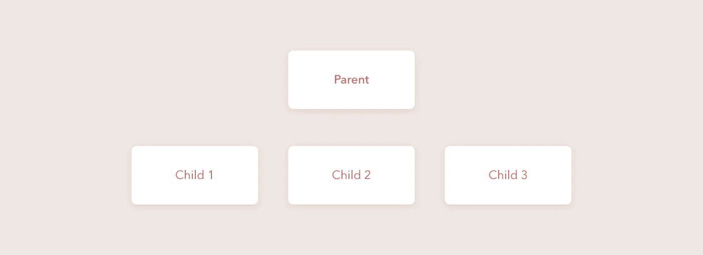
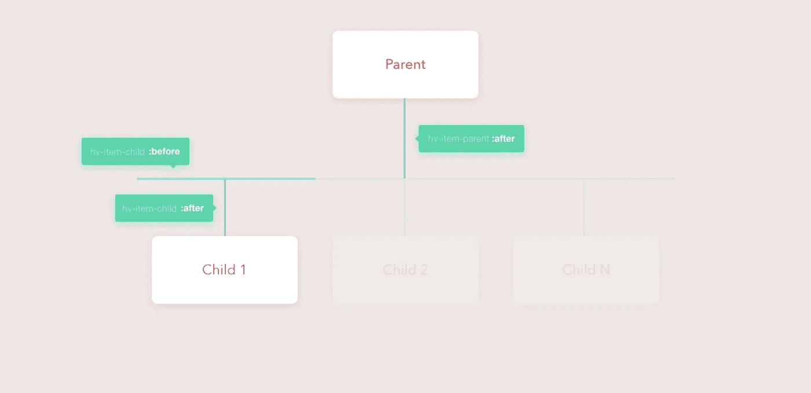

# 具有纯 CSS (SASS)的层次视图组件

> 原文：<https://medium.com/hackernoon/hierarchy-view-component-with-pure-css-sass-1ff5add5cad7>

嗨读者！

这是我有史以来的第一篇博文教程:)。我决定根据我在网页设计和开发方面的经验来写文章。

最近我在工作中接到一个任务，设计采购*订单通过工单*的流程。这听起来可能很奇怪，但我想到的组件可能对显示关系数据有用。

# 我们开始吧

最终的组件看起来很复杂，但实际上只有一个相互嵌套的关键组件。这就是我们的英雄的样子:

因此，它包含一个父元素和 N 个子元素。组件 HTML 结构由两个块组成:**。HV-项目-父项**和**。hv-item-children -** 儿童包装。

Base layout

对于造型，我们将使用 [flexbox](https://css-tricks.com/snippets/css/a-guide-to-flexbox/) (因为它非常灵活):

Layout scss

我们会得到这样的结果:

酷！其实这就是我们想要的。只有一样东西不见了。猜怎么着..

没错。——***台词，台词，台词！***

# 创建线条

为了创建线条，我们将使用 [css](https://hackernoon.com/tagged/css) 伪元素。父元素将只有底线。子元素需要两行——一行是垂直的(在它上面),一行是水平的(将子元素相互连接起来)。这是我们将要构建的插图:

父伪类:

Pseudo class for parent element line

子伪类:

Pseudo classes for child element lines

我们的组件准备好了。现在你可以替换。 **hv-item-child** 带任何东西。如果我们用整个组件替换一个子元素，我们将得到如下所示的嵌套层次视图:

下面是 [**演示**](https://zikosichi.github.io/hierarchy-view) 的组件。

这是一个 [**GitHub**](https://github.com/zikosichi/hierarchi-view) 的完整组件回购与演示。

下面是一个心形图标。如果您点按或轻按，它会变成绿色💚。不相信？**试试**😊

谢谢大家！