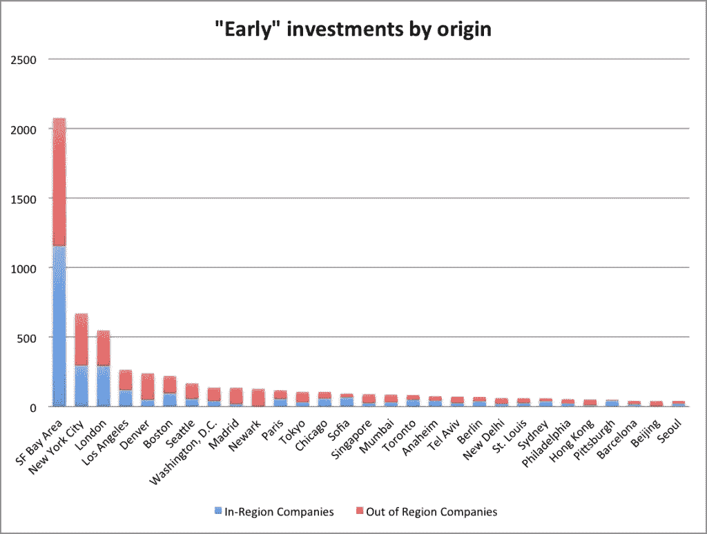
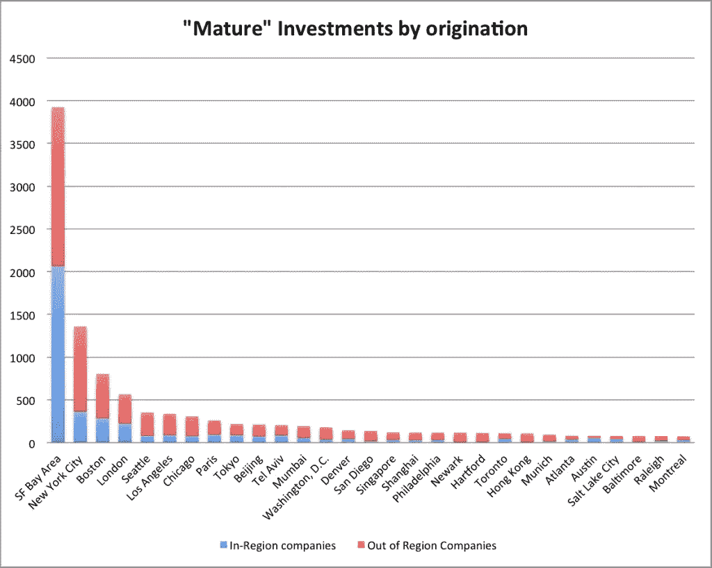

# 高科技投资并不像你想象的那样局限于本地

> 原文：<https://medium.com/hackernoon/high-tech-investment-is-not-as-local-as-you-might-think-ff3548406eb1>

Photo by Dmitry Ratushny

## 一个常见的神话是，几乎所有的硅谷投资都是在当地进行的(初创公司总部设在硅谷)。

> 作者:Stas Khirman，连续创业者，投资人，TEC.vc 合伙人

你去罗马见教皇，去硅谷见你的投资人。

一个常见的神话是，几乎所有的硅谷投资都是在当地进行的(初创公司总部设在硅谷)。我分析了数据，惊讶地发现事情相当夸张。事实是，没有必要让一家高科技初创公司去硅谷吸引高科技投资。事实上，44%的硅谷投资都投向了不在该地区的公司。

为了分析高科技投资的地理趋势，我使用了 CrunchBase 上记录的交易，这是一个卓越的关于创业生态系统的众包数据仓库。这些数据参考了“早期”阶段的投资，如天使轮和种子轮，以及“成熟”阶段的投资，如首轮融资，直至通过收购或 IPO 退出。仅在 2015 年，CrunchBase 就报告了全球 22，500 轮科技创业投资。因为只有一半的报告包含地理数据，所以我把数据下拉到 11300 轮投资。

我考虑到大多数投资轮都是由独立风险基金和个人组成的团体进行的。因此，初创公司与每个潜在投资者建立了直接关系，反之亦然:我们称之为*交易*。因此，11，300 轮投资转化为 22，700 笔交易。重申一下，由此产生的 22，700 个样本包括了初创企业和投资者的地区关联数据。

由于决策方式的本质差异，我决定分别分析早期公司和成熟公司的子集。

可能反映了创业生态系统的活力，对“早期”公司的投资按 CrunchBase 定义为种子轮、天使投资、可转换票据或赠款。尽管众筹融资也与初创公司有关，但考虑到追踪这些投资者的地区归属存在挑战，我将它们排除在了分析之外。

对“成熟”阶段初创企业的投资被视为风险资本和债务融资。

根据投资阶段分离数据后，以下数据集可用于分析:

–早期阶段公司: **8，095 笔交易组合成 4，855 轮投资**
—成熟期公司: **13，595 笔单笔交易组合成 5，690 轮投资**

# 对早期初创企业的投资

花点时间看一下图表，尤其是硅谷建立的无可匹敌的交易流领先优势:

与直觉相反的发现是，交易在投资者所在地区以外完成的程度。硅谷投资者做的交易只有 56%是本地的！**总部设在硅谷**的**投资者与总部设在其他地方的早期初创企业达成的 44%的交易中**，10%在纽约，5%在洛杉矶。位于美国以外的公司也发现硅谷的投资者更受青睐。在 14%的海外投资中，主要目的地包括印度、加拿大和英国，分别吸引了约 2%的投资。

不出所料，硅谷以外的投资者也一直在积极寻求跨境交易。事实上，在有些情况下，他们明显更喜欢区域外投资，而不是区域内交易。纽瓦克的投资者就是一个很好的例子:在 129 笔记录在案的交易中，只有 1 笔是在当地进行的。硅谷(31 项交易)和纽约(23 项交易)是纽瓦克高科技风险投资的主要目的地。丹佛的投资者提供了进一步的证据:他们 20%的交易是针对当地的，纽约(43 笔交易)、硅谷(35 笔交易)和西雅图(14 笔交易)证明是他们大部分资本的有效猎场。

在主要投资地区中，只有硅谷和伦敦略微青睐本地交易:分别为 56%和 53%。紧随其后的是纽约和洛杉矶，这两个城市对本地公司的投资比例都不到一半:分别为 44%和 45%。

在对“早期”数据集的综合分析中，**相当大一部分交易(57%)是与区域外的早期初创企业**达成的，而本地公司占交易流的其余 43%。

# 对成熟阶段初创企业的投资

作为早期趋势的延续(43%的本地交易)，“成熟”阶段的投资呈现出更有趣的画面，本地交易降至 34%。

硅谷是这一子集中的异数，超过一半的交易(53%)是在本地完成的。所有其他地区的投资者更喜欢本地区以外的交易。例如，几个主要城市的区域内交易如下:纽约——27%，波士顿——35%，伦敦——39%。

总部位于硅谷的投资者与地区外“成熟”阶段的初创企业达成的 47%的“成熟”交易中，8%是与总部位于纽约的公司达成的，4%在波士顿，3%在洛杉矶。硅谷 15%的交易流来自海外创业公司:印度吸引了 4%；中国和加拿大各 2%；而英国、以色列、新加坡、德国和巴西各占 1%。

一个关键的亮点是与中国初创企业的交易存在明显差异:虽然只有 0.2%的早期投资流向中国，但在涉及来自硅谷的“成熟”投资方面，中国的排名要高得多(2%)，仅次于印度。

# 结论

对高增长技术初创企业的投资并不像人们想象的那样存在地域偏见。我们对 2015 年 Crunchbase 数据集的一个相当大的样本量进行了分析，结果证明**相当大一部分(57%)早期交易(“种子”、天使投资等)。)是与投资公司总部所在地区以外的初创企业签订的**。这一趋势随着涉及“成熟”阶段(A、B、C 轮)投资的交易而加速，其中**近三分之二的交易流(66%)流向区域外的初创企业**。除了成熟的狩猎场，投资者还应该密切关注新兴的初创企业生态系统。

来源:[http://www . svod . org/high-tech-investment is not-as-local as you-may-think/](http://www.svod.org/high-tech-investment-is-not-as-local-as-you-might-think/)

> [黑客中午](http://bit.ly/Hackernoon)是黑客如何开始他们的下午。我们是 [@AMI](http://bit.ly/atAMIatAMI) 家庭的一员。我们现在[接受投稿](http://bit.ly/hackernoonsubmission)并乐意[讨论广告&赞助](mailto:partners@amipublications.com)机会。
> 
> 如果你喜欢这个故事，我们推荐你阅读我们的[最新科技故事](http://bit.ly/hackernoonlatestt)和[趋势科技故事](https://hackernoon.com/trending)。直到下一次，不要把世界的现实想当然！

