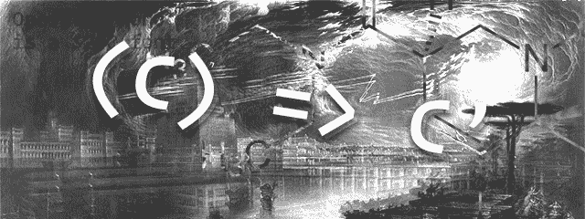

# 高阶元件(hoc ),适合初学者

> 原文：<https://medium.com/hackernoon/higher-order-components-hocs-for-beginners-25cdcf1f1713>



# 前言

> 注:这是最初发布在我的[个人网站](https://btnwtn.com/articles/higher-order-components-for-beginners)上的。

我写这篇文章是因为其他每篇文章——包括关于高阶组件的 React 官方文档——都让我这个初学者感到困惑。我明白高阶组件是一个东西，但不明白它们如何有用。本文旨在澄清一些关于高阶元件的困惑。

在我们理解 HOCs 之前，我们必须先了解一些关于 Javascript 中函数的事情。

# ES6 箭头功能简介

本文将提供仅使用 ES6 箭头函数的例子。如果你以前从未见过箭头函数，它们本质上等同于正则函数表达式。下面的代码展示了常规函数和箭头函数之间的区别。

```
function () {
  return 42
}// same as:
() => 42// same as:
() => {
  return 42
}function person(name) {
  return { name: name }
}// same as:
(name) => {
  return { name: name }
}
```

阅读 MDN 上的[箭头功能文档以获得更完整的理解。](https://developer.mozilla.org/en-US/docs/Web/JavaScript/Reference/Functions/Arrow_functions)

# 作为价值和部分应用的功能

就像数字，字符串，布尔等。，*函数是值*。这意味着您可以像传递其他数据一样传递函数。您可以将函数作为参数传递给另一个函数:

```
const execute = (someFunction) => someFunction()execute(() => alert('Executed'))
```

你可以从一个函数返回一个函数。

```
const getOne = () => () => 1getOne()()
```

我们在`getOne`后面有两个`()`的原因是函数的第一个应用返回另一个。举例说明:

```
const getOne = () => () => 1getOne
//=> () => () => 1getOne()
//=> () => 1getOne()()
//=> 1
```

从函数返回函数的好处是，我们可以编写跟踪初始输入的函数。例如，下面的函数接受一个数字作为参数，并返回一个将该参数乘以一个新参数的函数:

```
const multiply = (x) => (y) => x * ymultiply(5)(20)
```

这个例子和`getOne`的工作原理一样，每个括号向函数应用一些输入。在这种情况下，我们将`x`分配给`5`，将`y`分配给`20`。

```
const multiply = (x) => (y) => x * ymultiply
//=> (x) => (y) => x * ymultiply(5)
//=> (y) => 5 * ymultiply(5)(20)
//=> 5 * 20
```

当我们调用只有一个参数的函数`multiply`时，我们部分地应用了这个函数。当我们调用`multiply(5)`时，我们得到一个将它的输入乘以 5 的函数。如果我们调用`multiply(7)`，我们会得到一个将输入乘以 7 的函数，依此类推。我们可以使用部分应用程序创建具有预定义输入的新功能:

```
const multiply = (x) => (y) => x * yconst multiplyByFive = multiply(5)
const multiplyBy100 = multiply(100)multiplyByFive(20)
//=> 100
multiply(5)(20)
//=> 100multiplyBy100(5)
//=> 500
multiply(100)(5)
//=> 500
```

这可能一开始看起来不是超级有用。但是，您可以使用分部应用程序来编写更易于阅读和推理的代码。例如，我们可以用更简洁的东西来代替`[styled-components](https://www.styled-components.com/docs/basics#adapting-based-on-props)`复杂的函数插值语法。

```
// before
const Button = styled.button`
  background-color: ${({ theme }) => theme.bgColor}
  color: ${({ theme }) => theme.textColor}
`<Button theme={themes.primary}>Submit</Button>// after
const fromTheme = (prop) => ({ theme }) => theme[prop]const Button = styled.button`
  background-color: ${fromTheme("bgColor")}
  color: ${fromTheme("textColor")}
`<Button theme={themes.primary}>Submit</Button>
```

我们创建一个接受字符串作为参数的函数:`fromTheme("textColor")`，它返回一个接受带有`theme`属性的对象的函数:`({ theme }) => theme[prop]`，然后我们试图通过传入`"textColor"`的初始字符串来查找该对象。我们可以更进一步，编写类似于`backgroundColor`和`textColor`的函数，它们部分应用了`fromTheme`函数:

```
const fromTheme = (prop) => ({ theme }) => theme[prop]
const backgroundColor = fromTheme("bgColor")
const textColor = fromTheme("textColor")const Button = styled.button`
  background-color: ${backgroundColor}
  color: ${textColor}
`
```

# 高阶函数

高阶函数被定义为接受一个函数作为自变量的函数。如果您曾经使用过像`[map](https://developer.mozilla.org/en-US/docs/Web/JavaScript/Reference/Global_Objects/Array/map)`这样的函数，您可能已经熟悉高阶函数。如果你不熟悉`map`，它是一个循环函数，将函数应用于数组中的每个元素。例如，您可以对一组数字求平方，如下所示:

```
const square = (x) => x * x[1, 2, 3].map(square)
//=> [ 1, 4, 9 ]
```

我们可以编写自己版本的`map`来说明这个概念:

```
const map = (fn, array) => {
  const mappedArray = [] for (let i = 0; i < array.length; i++) {
    mappedArray.push(
      // apply fn with the current element of the array
      fn(array[i])
    )
  } return mappedArray
}
```

然后，我们可以使用我们的`map`来做一些事情，比如对一个数字数组求平方:

```
const square = (x) => x * xconsole.log(map(square, [1, 2, 3, 4, 5]))
//=> [ 1, 4, 9, 16, 25 ]
```

或者返回一个数组`<li>` React 元素:

```
const HeroList = ({ heroes }) => (
  <ul>
    {map((hero) => (
      <li key={hero}>{hero}</li>
    ), heroes)}
  </ul>
)<HeroList heroes=[
  "Wonder Woman",
  "Black Widow",
  "Spider Man",
  "Storm",
  "Deadpool"
]/>
/*=> (
  <ul>
    <li>Wonder Woman</li>
    <li>Black Widow</li>
    <li>Spider Man</li>
    <li>Storm</li>
    <li>Deadpool</li>
  </ul>
)*/
```

# 高阶组件

我们知道高阶函数是接受一个函数作为自变量的函数。在 React 中，任何返回`[JSX](https://facebook.github.io/react/docs/jsx-in-depth.html)`的函数都被称为无状态功能组件，或简称为功能组件。一个基本的功能组件如下所示:

```
const Title = (props) => <h1>{props.children}</h1><Title>Higher-Order Components(HOCs) for React Newbies</Title>
//=> <h1>Higher-Order Components(HOCs) for React Newbies</h1>
```

高阶组件是接受组件作为参数并返回组件的函数。如何使用传递的组件取决于您。你甚至可以完全忽略它:

```
// Technically an HOC
const ignore = (anything) => (props) => <h1>:)</h1>const IgnoreHeroList = ignore(HeroList)
<IgnoreHeroList />
//=> <h1>:)</h1>
```

您可以编写一个将其输入转换为大写的特设:

```
const yell = (PassedComponent) =>
  ({ children, ...props }) =>
    <PassedComponent {...props}>
      {children.toUpperCase()}!
    </PassedComponent>const Title = (props) => <h1>{props.children}</h1>
const AngryTitle = yell(Title)<AngryTitle>Whatever</AngryTitle>
//=> <h1>WHATEVER!</h1>
```

还可以返回有状态的组件，因为 Javascript 中的类是函数的语法糖。这允许您挂钩到像`componentDidMount`这样的 React 生命周期方法。这就是 HOCs 真正有用的地方。我们现在可以做一些事情，比如将 HTTP 请求的结果作为道具传递给功能组件。

```
const withGists = (PassedComponent) =>
  class WithGists extends React.Component {
    state = {
      gists: []
    } componentDidMount() {
      fetch("https://api.github.com/gists/public")
      .then((r) => r.json())
      .then((gists) => this.setState({
        gists: gists
      }))
    } render() {
      return (
        <PassedComponent
          {...this.props}
          gists={this.state.gists}
        />
      )
    }
  } const Gists = ({ gists }) => (
  <pre>{JSON.stringify(gists, null, 2)}</pre>
)const GistsList = withGists(Gists)<GistsList />
//=> Before api request finishes:
// <Gists gists={[]} />
// 
//=> After api request finishes:
// <Gists gists={[
//  { /* … */ },
//  { /* … */ },
//  { /* … */ }
// ]} />
```

您可以在任何组件上调用`withGists`,它将传递 gists api 调用的结果。你可以在这里看到这个[更具体的例子。](https://codesandbox.io/embed/o2YpJnpDj)

# 结论:hoc 是🔥 🔥 🔥

Redux 使用一个特设的`[connect](https://github.com/reactjs/react-redux/blob/master/docs/api.md#connectmapstatetoprops-mapdispatchtoprops-mergeprops-options)`将值从应用程序商店传递到“连接”的组件。它还进行一些错误检查和组件生命周期优化，如果手动进行，将会导致您编写大量样板代码。

如果您发现自己在不同的地方写了很多代码做同样的事情，那么您可以将这些代码重构为一个可重用的 HOC。

hoc 真的很有表现力，你可以用它们做很多很酷的东西。然而，因为它们太富于表现力了，如果你想的话，你可以过度使用它们。

尽量让你的 HOCs 保持简单，并致力于编写不需要你读一篇长文章就能理解的代码。

# 附加练习

以下是一些巩固你对 HOCs 理解的练习:

*   编写一个撤销其输入的特设
*   编写一个从 API 向其传递的组件提供数据的特设
*   写一个实现`[shouldComponentUpdate](https://facebook.github.io/react/docs/react-component.html#shouldcomponentupdate)` [的特设来避免调和](https://facebook.github.io/react/docs/optimizing-performance.html#avoid-reconciliation)。
*   编写一个使用`[React.Children.toArray](https://facebook.github.io/react/docs/react-api.html#react.children.toarray)`对传递给其传递组件的子组件进行排序的特设组件。