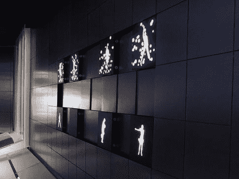
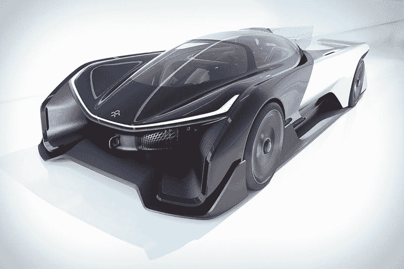
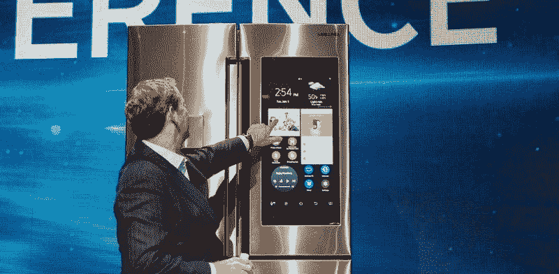
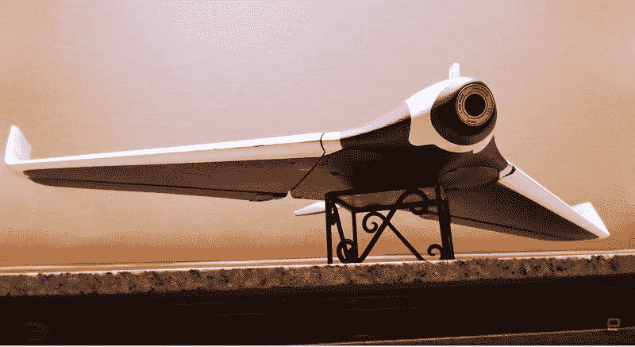
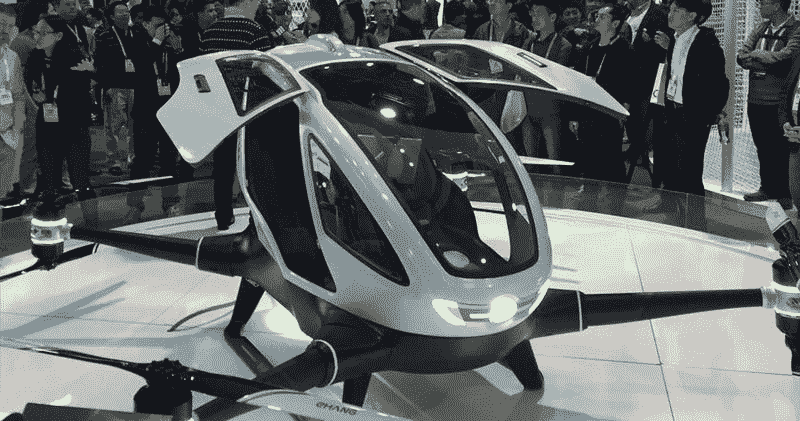

# CES 2016 的亮点

> 原文：<https://medium.com/hackernoon/highlights-of-ces-2016-5b5566435c04>

本月在拉斯维加斯举行的 2016 年消费电子展发布了数千种令人兴奋的新产品和小工具。

以下是在 2016 年国际消费电子展上吸引眼球的最佳产品列表。

[**三星的模块化电视**](http://ideas.curcle.co/modular-samsung-tv-dream-tv-future/)

三星推出了让你的电视屏幕更大的新概念。它由多个屏幕组成，可以以不同的配置组合在一起，而不会在其间留下任何边框、接缝或间隙。

[看看发布会上的视频。](http://ideas.curcle.co/modular-samsung-tv-dream-tv-future/)

[**法拉第未来汽车亮相**](http://ideas.curcle.co/faraday-unveils-electric-car-future/)

如果你想知道蝙蝠侠将与 22 世纪的设计师一起制造什么样的电动汽车，它很可能看起来就像法拉第未来在 CES 上展示的 FFZERO1 idea auto。

[查看发布会视频。](http://ideas.curcle.co/faraday-unveils-electric-car-future/)

[**三星家庭集线器冰箱**](http://ideas.curcle.co/samsung-innovates-fridge-by-allowing-you-to-check-whats-inside/)

三星在 CES 2016 上发布的 Family Hub 冰箱是三星最新的智能设备，它配备了一个巨大的 21.5 英寸，1080p 触摸屏，周围有令人震惊的洞察力。它有能力让你知道冰箱里有什么。想象自己在商店里，看看有没有足够的牛奶、果汁或鸡蛋。

[观看发布会视频。](http://ideas.curcle.co/samsung-innovates-fridge-by-allowing-you-to-check-whats-inside/)

[Parrot DISCO 一种快速、智能、超轻的无人机](http://ideas.curcle.co/parrot-disco-fast-smart-ultra-light-drone/)

Parrot DISCO 是一个有趣的项目:一种快速、智能、超轻的无人机，飞行时间约为 45 分钟。这将是第一架“准备飞行”的机翼成型无人机，也是第一架无需太多训练就能飞行的无人机。

[看看发布会上的视频](http://ideas.curcle.co/parrot-disco-fast-smart-ultra-light-drone/)

[**赛普拉斯半导体推出蓝牙控制灯泡**](http://ideas.curcle.co/cypress-semiconductor-introduces-bluetooth-controlled-light-bulbs/)

全世界数百万人遭受着同样的问题:没人的地方亮着灯，因为有人关灯而不亮的房间，离家后开着灯的厨房和客厅。有一家名为赛普拉斯半导体的公司正在致力于解决这个问题。

[看看发布会上的视频](http://ideas.curcle.co/cypress-semiconductor-introduces-bluetooth-controlled-light-bulbs/)

一架可以骑在你身上的无人机

中国企业家在年度技术大会(CES 2016)上介绍了一种由平板电脑控制的单人飞行器，装备为每小时 60 英里的飞行速度。他声称这是世界上第一架搭载人类乘客的无人机，并将其命名为 EHang 184。

[查看发布会视频](http://ideas.curcle.co/ehang-drone-can-actually-ride/)

总的来说，CES 2016 充满了智能、激动人心和史诗般的产品。了解更多 2016 年国际消费电子展详情: [CES (@CES)](https://twitter.com/CES)

> [黑客中午](http://bit.ly/Hackernoon)是黑客如何开始他们的下午。我们是 AMI 家庭的一员。我们现在[接受投稿](http://bit.ly/hackernoonsubmission)并乐意[讨论广告&赞助](mailto:partners@amipublications.com)机会。
> 
> 如果你喜欢这个故事，我们推荐你阅读我们的[最新科技故事](http://bit.ly/hackernoonlatestt)和[趋势科技故事](https://hackernoon.com/trending)。直到下一次，不要把世界的现实想当然！

