# 具有 Nexus 的 AWS 高可用性码头工人登记处

> 原文：<https://medium.com/hackernoon/highly-available-docker-registry-on-aws-with-nexus-2a4c661c8ddf>

Containers … Everywhere !

您是否想过如何构建一个高可用性和弹性的码头工人存储库来存储您的**码头工人图像**？

在本文中，我们将在**安全组**内设置一个 **EC2** 实例，并创建一条指向服务器**弹性 IP** 地址的 **A 记录**如下:

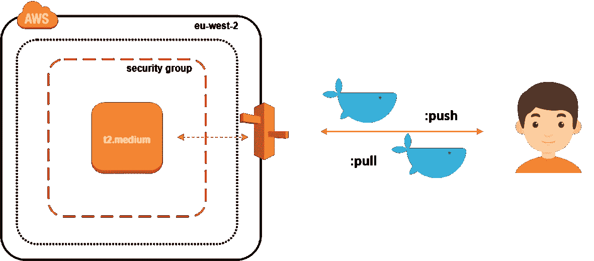

为了提供基础设施，我们将使用 **Terraform** 作为 **IaC** (基础设施作为代码)工具。使用此类工具的优势在于，能够在发生事故(**灾难恢复**)时，在不同的 **AWS 区域**(或不同的 **IaaS** 提供商)快速构建新环境。

首先克隆以下 **Github** 存储库:

> git 克隆体[https://github.com/mlabouardy/terraform-aws-labs.git](https://github.com/mlabouardy/terraform-aws-labs.git)

在 *docker-registry* 文件夹中，用您自己的 AWS 凭据更新*vars*(确保您有正确的 **IAM** 策略)。

我指定了一个 shell 脚本，在启动实例时用作 *user_data* 。它只需安装最新版本的 **Docker CE** 并将实例转换为 **Docker Swarm 模式**(以受益于 Nexus container 的复制&高可用性)

注意:当然，您可以使用**配置管理工具**如 **Ansible** 或**大厨**来配置创建后的服务器。

然后，发出以下命令来创建基础架构:

> terra form apply-var-file = variables . tfvars

一旦创建，您应该会看到您的实例的**弹性 IP** :

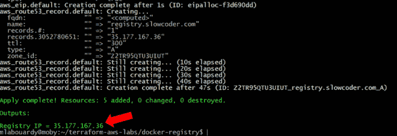

通过 SSH 连接到您的实例:

> 宋承宪 ec2-user@35.177.167.36

确认**码头工人引擎**正在**集群模式**下运行:

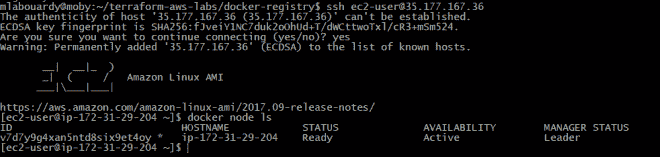

检查 **Nexus** 服务是否正在运行:

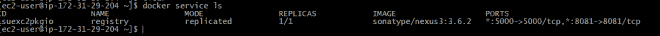

如果您回到您的 **AWS 管理控制台**。然后，导航到 **Route53 仪表盘**，您会看到一条指向实例 IP 地址的新的 A 记录已经创建。

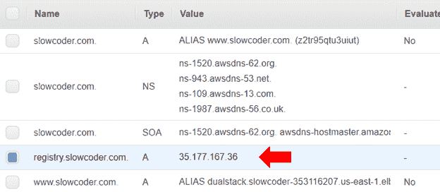

将您喜爱的浏览器指向 **Nexus 仪表盘 URL**(registry . slowcoder . com:8081)。登录并创建一个 Docker 托管的注册表，如下所示:

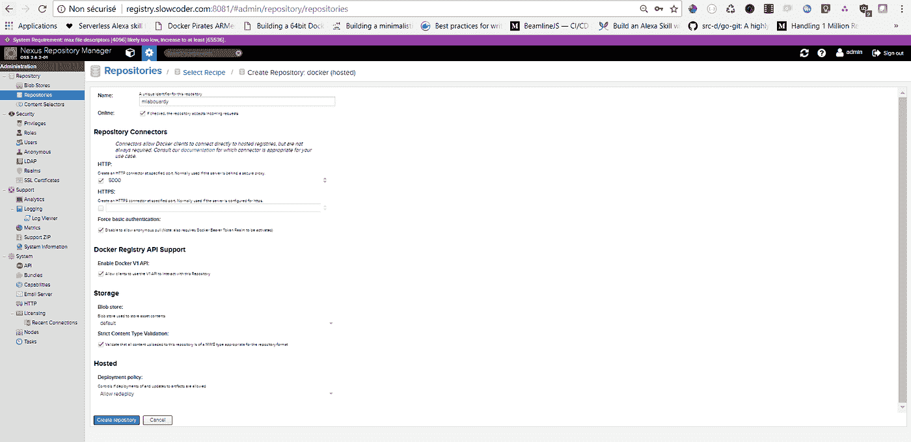

编辑*/etc/docker/daemon . JSON*文件，它应该有以下内容:

> {
> 
> "不安全-注册表":[" registry . slowcoder . com:5000 "]
> 
> }

注意:对于生产，强烈建议使用由已知 CA 颁发的 **TLS** 证书来保护您的注册表。

重新启动 Docker 以使更改生效:

> 服务 docker 重启

使用 Nexus 凭证登录您的注册中心( *admin/admin123* ):

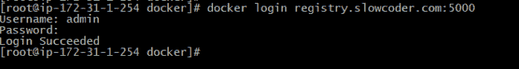

要将新映像推送到注册表:

> docker 推送 registry . slow coder . com:5000/mlabouardy/movies-API:1 . 0 . 0-beta

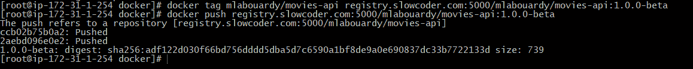

验证映像已被推送到远程存储库:

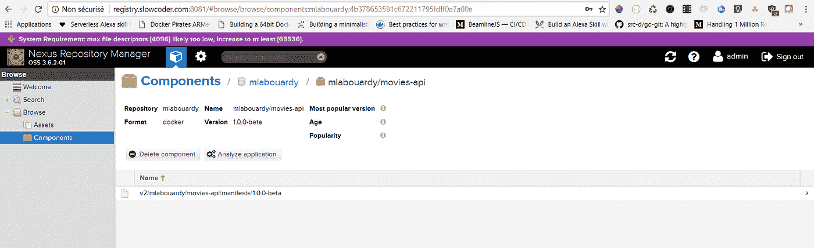

要提取 Docker 图像:

> docker pull registry . slow coder . com:5000/mlabouardy/movies-API:1 . 0 . 0-beta

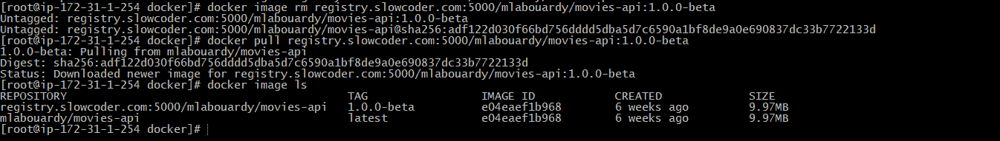

注意:有时你会得到许多未使用的悬挂图像，这些图像会很快占用大量磁盘空间:

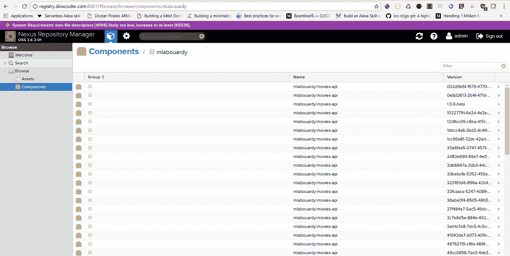

您可以使用 [Nexus CLI](https://github.com/mlabouardy/nexus-cli) 工具或创建 **Nexus 任务**来清理旧的 Docker 映像:

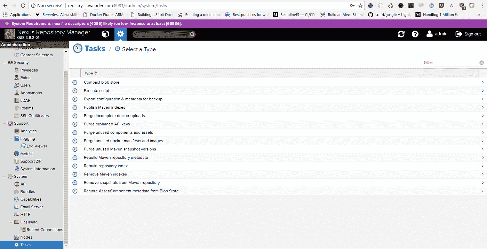

按如下方式填充表单:

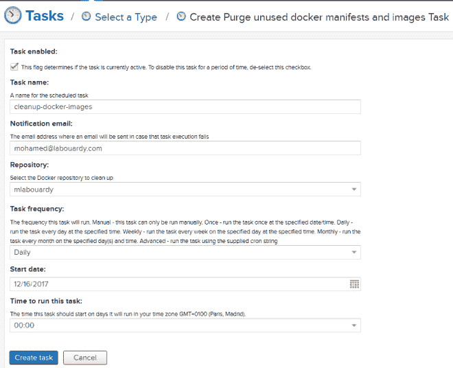

上述任务将在每天午夜运行，从“ **mlabouardy** ”注册表中清除未使用的 docker 图像。