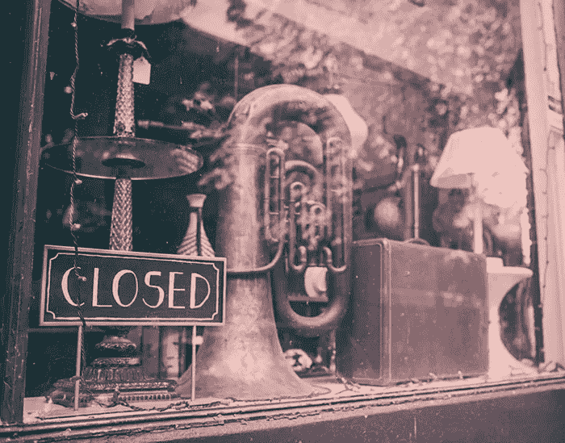

# 嗯..一个艰难的行业？？

> 原文：<https://medium.com/hackernoon/hmmm-a-tough-industry-to-be-in-4b08470ef850>

[photos by pexels.com](http://www.pexels.com)

# 不知道…..

我从哪里开始？我该如何开始？我该找谁？我该和谁谈？——这是任何有抱负的音乐家、音乐专业人士和企业在首次涉足这个行业时都会问自己的少数几个问题之一。

当你在看 Youtube 或一些传记电影时，这一切看起来很容易，但现实却完全相反。对于任何渴望进入音乐行业的人来说，这种奋斗就像自己创业一样。虽然有无穷无尽的建议和平台提供给有抱负的企业家，但没有多少能帮助那些有抱负的音乐家和音乐专业人士。

## **这是不公平的交易？**

其实不是。你可能认为你比那些最近发现的音乐家更优秀，你可能认为这都是运气使然。当我们通常读到的是知名音乐家和专业人士如何获得所有的机会，而你却什么也没有得到时，这当然没有什么帮助。努力在所有其他有抱负的音乐家中被听到或注意到。

每 10 个有抱负的音乐家和音乐专业人士中就有 3 个会放弃对音乐的追求，只是因为这太难了，而且这个数字每年都在上升。从 2012 年到 2013 年，美国音乐家和音乐专业人士的数量大幅下降——从 2012 年的 67，040 人下降到 2013 年的 62，450 人；一年下降 4500 多。这些数字仅仅是美国的，我们确信全球的数字也是一样的。

## 为什么这么难？？

有些人可能会说，这是作为一名音乐家和/或音乐专业人士开始的一部分。是的，努力工作是你职业生涯的主要部分，但它是 90%，但剩下的重要的 10%(你们许多人都忽略了)都是关于在你的音乐舞台上与正确的人联系和沟通。如果你正在寻找一个金属鼓手来组建自己的乐队，你会去找一个民谣吉他手，问他或她是否知道如何演奏技术金属鼓点吗？当然不是！这是大多数音乐家失败的原因，也不可避免地导致他们放弃这种追求。

## DIY 音乐平台..

自从推出[**【MySpace】**](http://www.myspace.com)[**iTunes**](http://www.apple.com/itunes/?cid=OAS-US-DOMAINS-itunes.com)[**Reverbnation**](http://www.reverbnation.com)和更多音乐平台以来，音乐家和音乐专业人士正在让他们自己做任何事情都变得更加容易。通过推广、分销和增加粉丝或追随者的数量，音乐家们用比以往更少的钱做了更多的事情。

尽管这些平台在特定的工具和功能方面非常出色，但音乐家和音乐专业人士仍然很难连接到他们的音乐场景。虽然 [MySpace](http://www.myspace.com) 和 [Reverbnation](http://www.reverbnation.com) 允许你推广你的音乐，但它仍然不能让你与你的音乐场景联系起来。 [iTunes](http://www.apple.com/itunes/?cid=OAS-US-DOMAINS-itunes.com) 允许你分发你的音乐，但你如何确保你的音乐能够卖给你的目标听众？除非你和你的音乐界有联系，否则音乐家和音乐专业人士仍然很难成长。

## **被连接。了解你的乐坛。**

当有抱负的音乐家和音乐专业人士决定进入这个行业时，整个过程将会简单得多。这就是 [Ampedify](http://www.ampedify.com) 的意义所在。 [Ampedify](http://www.ampedify.com) 将您与您的音乐场景连接起来，即使您不知道从哪里开始寻找。我们的平台让您与组织者、其他音乐家、音乐专业人士和企业建立联系。您将获得最新的更新，并且可以探索无限的机会。

## 最后..

那么音乐行业是一个艰难的行业吗？是的。但其他行业也是如此。这和运气无关。无论在哪个领域，努力工作都是必须的，与他人沟通也是如此。让别人帮助你的事业。利用外面的机会。开始与音乐界的其他人联系，探索无限的机会，让你在音乐生涯中走得更远。

[**接通。成为你音乐舞台的一部分。> >**](http://www.ampedify.com)

> [黑客中午](http://bit.ly/Hackernoon)是黑客如何开始他们的下午。我们是 AMI 家庭的一员。我们现在[接受投稿](http://bit.ly/hackernoonsubmission)并乐意[讨论广告&赞助](mailto:partners@amipublications.com)机会。
> 
> 如果你喜欢这个故事，我们推荐你阅读我们的[最新科技故事](http://bit.ly/hackernoonlatestt)和[趋势科技故事](https://hackernoon.com/trending)。直到下一次，不要把世界的现实想当然！

