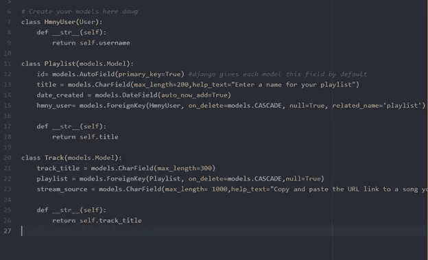
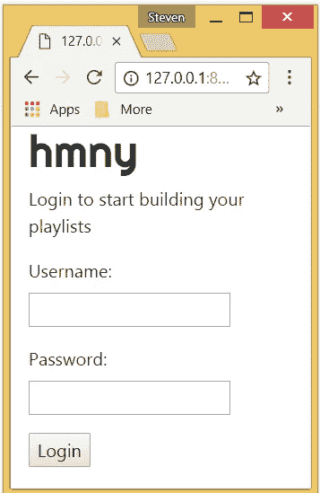

# hmny——用 Django 构建我的第一个音乐应用程序(第 2 部分)

> 原文：<https://medium.com/hackernoon/hmny-building-my-first-music-app-with-django-part-2-29f7c88b8335>

在我的第一篇博文中，我介绍了 *hmny 的概念。*我对 [ChiPy 导师计划](https://chipymentor.org/)的主要目标是创建一个功能原型，它将允许用户创建包含来自 Soundcloud、Spotify 或 Youtube 的曲目的播放列表，并在 *hmny 的*自己的定制音频播放器上播放它们。

在开始我的项目之前，我听说过用于软件/应用程序开发的模型-视图-控制器“MVC”架构，但是我完全不知道这实际上意味着什么。 *Django* 是我第一次接触这项技术，慢慢地，但肯定地，我开始了解这种开发架构所提供的力量和能力。

经过一些初始设置后，我开始浏览 Django 官方网站上的教程和文档。我最终完成了他们的 7 部分教程，但对我来说这不是一个简单的过程，我想要一些东西来进一步分解它。我决定在网上搜索一下，找到了 Djangogirls.org，这已经被证明是一个很好的学习资源。在了解了模型、视图、url dispatcher 和模板如何协同工作以创建一个正常运行的 web 应用程序之后，是时候定义 hmny 自己的定制模型了。

# **型号**

简单是现在的关键，所以我决定从三个类开始: **HmnyUser** ， **Playlist** 和 **Track** 。

The HmnyUser object, inherits from *Django’s* built in User class, imported from django.contrib.auth.models

我知道 HmnyUser 的每个实例应该可以有任意数量的播放列表，并且这些播放列表将包含曲目，但是我很难想象这些模型之间的关系。我的导师带领我神奇地发现了*实体关系图* (ERD)。

我了解到*基数*和*普通度*分别是一个实体中的实例与另一个实体中的实例相关的最大和最小次数。这绝对是我的第一个“发现了！”因为它让我能够可视化模型关系，并更好地理解 *hmny* 应用程序的主数据库结构。

A HmnyUser should have zero to many playlists, and each of these **Playlist** objects can have zero to many related **Track** objects.

# **观点**

在定义了模型之后，是时候开始处理视图函数了。视图是一个 python 函数，它接收 web 请求，并返回 web 响应。至此，我已经在登录视图上取得了最大的进步，并且成功地验证了我的测试用户“Wendall”。在 Wendall(或任何用户)登录后，他被带到播放列表视图，这将最终成为 Django 站点的主要部分。到目前为止，我已经弄明白了如何使用 *Django 内置的*模板语言来显示用户的**播放列表**对象，播放列表**轨道**对象嵌套在里面。在指导结束时， *hmny* 应该有以下视图/页面:

Login view in action

*   *Welcome* —提供应用程序主要功能的描述，并指导用户创建帐户或登录其现有帐户。
*   *登录* —你很可能已经知道这个的目的。不要与肯尼·罗根斯混淆。
*   *播放列表/音频播放器* —允许用户收听他们的曲目。
*   *编辑/创建播放列表* —你猜对了。这允许用户编辑/添加歌曲到他们创建的播放列表，或者创建新的播放列表。
*   *帐户/档案设置* —允许用户更改其档案设置，并将他们的档案连接到 Youtube 和 Spotify 服务。

# 挣扎/障碍

目前，Soundcloud 不再为他们的 API 服务提供认证密钥，所以我需要使用网络抓取库为用户添加到播放列表的每个曲目提取嵌入代码，这很可能是一个美丽的汤。网络抓取对我来说是一个全新的概念，所以这将增加 Django 开发之外的许多工作。

# 下一步是什么？

*   继续开发播放列表视图，它将显示用户创建的播放列表，以及包含播放列表相关曲目的嵌入式音频播放器。
*   将 Youtube 和 Spotify API 连接到 hmny 应用程序。
*   使用 beautiful soup 找到并拉出一个轨道的 Souncloud widget 播放器的嵌入链接。这是使用 Soundcloud 的 API 的替代品。(不再向他们的 API 提供认证密钥)。
*   创建用户帐户/设置视图，该视图将管理用户的个人信息和对第三方 API 的授权
*   设计 hmny 的音频播放器。像[这个](https://webdesign.tutsplus.com/tutorials/create-a-customized-html5-audio-player--webdesign-7081)。
*   设计将在网页的每个视图上使用的主要布局/模板。为此，我需要提高我的 HTML 和 CSS 技能。对于一些 UI 设计元素，我可能需要求助于 JavaScript，但这可能已经超出了导师的范围。我的主要目标是有一个工作原型，它不需要看起来很漂亮，所以这可能是未来的努力。

# **敬请期待**

在我的下一篇也是最后一篇博文中，我应该有了一个 *hmny* 应用的工作原型。(交叉手指)由于这是我创建的第一个 web 应用程序，我预计功能一开始会受到限制，但会讨论我对整个项目的想法，并提出未来改进整体功能和用户界面的计划。