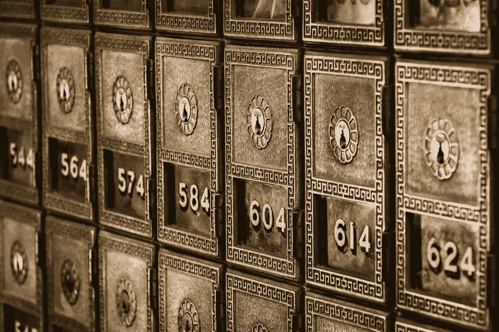
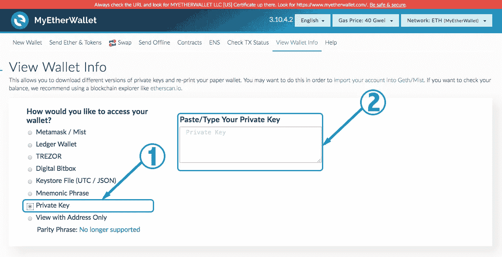
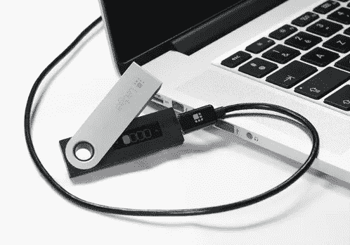
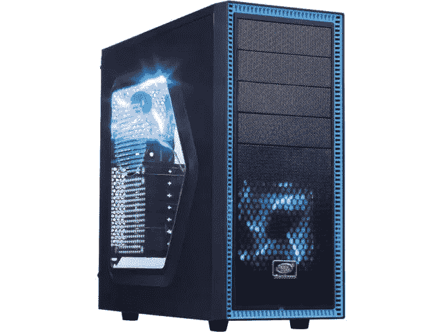
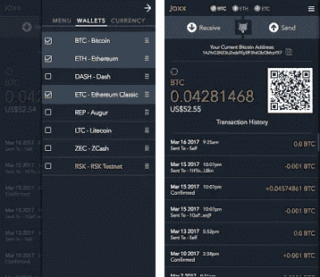
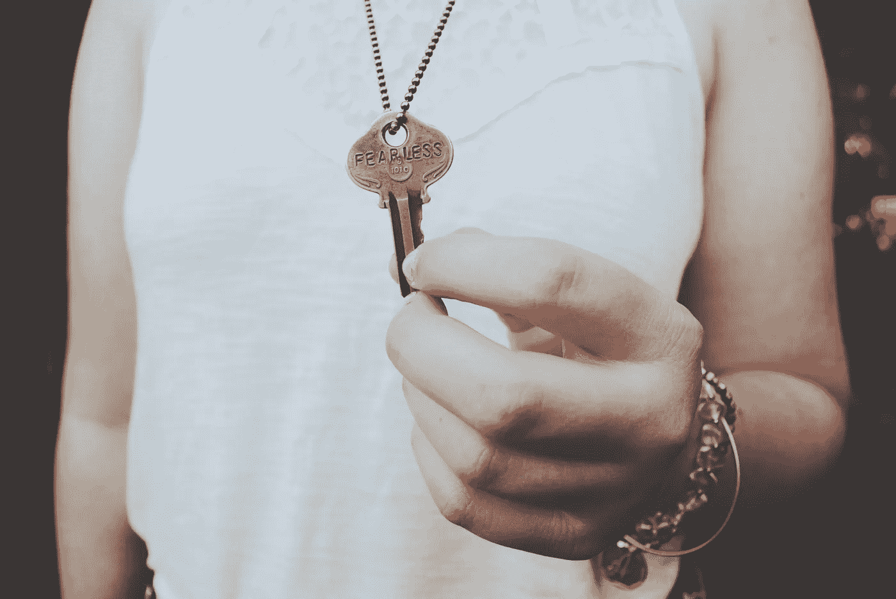

# 持有加密货币——真正的风险

> 原文：<https://medium.com/hackernoon/holding-cryptocurrency-the-real-risks-3c54ca8d73b6>

持有加密货币的可悲事实是，存在许多非常真实的风险。其中最大的风险是你可能会失去你的钱……**所有的钱！投资顾问会告诉你，永远不要投资超出你承受能力的金额，而且明确的警告传达得越强烈，投资工具的风险就越高。具有讽刺意味的是，这些说明性的词语通常是在投资没有按计划进行时提供的，也就是说，投资是不稳定的，或者在某些罕见的情况下变得毫无价值。*它很少是基于你投资的实际安全可能受到损害的基础上给出的。***

请允许我打个简单的比方。假设你在银行的保险箱里放了很多钱。我们通常认为大多数保险箱是安全的。银行往往有很厚的墙，安全系统和传感器，防火防爆的金库，以及分配给你的一个安全上锁的保险箱。现在想象一下，您可能无意中犯了一个非常简单的错误，但是所有的安全都变得毫无价值，并且被有效地破坏了。在你眨眼之间，保险箱里所有的钱都可能被偷，而且完全无法追回。这正是我在这里与你讨论的，因为在加密，这是一个非常真实的风险。深呼吸，因为如果这能稍微提高你的心率，你并不孤单。

我的目的是从保管的角度告诉你持有密码的风险，这样你就能更好地了解这个领域。加密货币安全性的最大决定因素完全取决于你选择如何持有它。对于那些没有掌握 crypto 或者不太了解 crypto 的读者来说，我可以做的最简单的类比如下。

假设你有 100 美元。您的一些保管选项包括

1.  **银行**。把钱存在你的支票账户里。
2.  **券商**。把钱存入一个经纪账户，代表你持有它，并可能用它进行交易。
3.  **自我管理**。把现金放在口袋里或床垫下。
4.  **朋友**。把钱给一个朋友帮你保管。
5.  **手机钱包**。把钱存入你的 PayPal 或 Venmo 账户。

虽然你可以用你的 100 美元做更多的事情，但选择上述用例是因为它们在加密领域都有对应的用途。让我们逐一探讨一下。

1) **银行等值**。从技术上来说，没有任何主流的加密银行为你保护你的钱，并为你提供 FDIC 级别的保险，尽管有一些正在开发中。 [BankEx](https://bankex.com/en/) 正在开发一个专注于资产证明的分散化银行系统， [OmiseGo](https://omg.omise.co/) 正在寻求为没有银行账户的人提供多样化的金融交易和结算服务平台。请注意，这两者都不是传统银行业的真正一对一替代，但它们本身对银行业具有破坏性。

2) **券商等值**。像[比特币基地](https://www.coinbase.com/)、[北海巨妖](https://www.kraken.com/)或 [Bittrex](https://bittrex.com/) 这样的加密交易所只是少数几个提供类似股票经纪账户服务的加密交易所。每个交易所都是不同的，因为它们提供各种加密到加密的交易对，在某些情况下，提供更高级的交易功能，并且还存在于各种主权管辖区中。除了这些关键的区别，将你的法定货币或加密货币存放在交易所的问题是，你 100%容易受到实体[交易对手风险](http://www.investopedia.com/terms/c/counterpartyrisk.asp)的影响。

当你在交易所持有你的密码时，交易所拥有你的钱，你不拥有。这是一个非常重要的区别。同时他们在你登录时提供你的资金。您完全依赖他们的底层基础设施、治理、安全系统和流程来确保您的资金得到保护。可以说，今天的银行代表你做着同样的事情，但是他们必须遵守更加严格的指导方针和规则来处理你的资金。

已经有两起备受瞩目的交易所黑客事件，分别是 [MtGox](https://www.mtgox.com/) *(现已资不抵债并处于破产程序中)*和 [Bitfinex](https://www.bitfinex.com/) *(已恢复并仍在运营)*。MtGox 黑客攻击导致最初损失了 850，000 BTC，Bitfinex 黑客攻击导致大约 120，000 BTC 的损失，按照今天每 BTC 大约 4，300 美元的 BTC 价值，分别价值 36.5 亿美元和 5.16 亿美元。是的，这些数字事实上是准确的。这些都不是小数目。如果有[期货](https://hackernoon.com/tagged/future)交易所黑客，而你在交易所持有你的资金，你就受到交易所执行决策的支配。他们的领导层将根据他们可用的选项和黑客攻击的严重程度来决定对他们的账户持有人造成的影响。

考虑**司法风险**也很重要。迄今为止最大的例子之一是[中国对密码的打击](https://www.theverge.com/2017/9/11/16288898/china-shutdown-rumored-bitcoin-exchanges-crackdown)，这甚至包括可能关闭中国的密码交易所。当这个声明正在被放松的过程中，让我们说你把你所有的密码放在一个中国的交易所，并且你没有跟随新闻一整年。这个消息早就传开了，你也不会把你的密码转移到别的地方。因此，当交易所被关闭时，你在中国账户上的所有密码都可能丢失。由于我们生活在一个真正不确定的时代，因为它涉及到密码监管，其他主权国家可能会采取类似的行动。

此外，您的登录凭据可能会被泄露，有人可能会访问您的帐户，就像您的在线银行帐户凭据被泄露一样。大多数交易所强烈建议使用诸如 [Google Authenticator](https://support.google.com/accounts/answer/1066447?co=GENIE.Platform%3DAndroid&hl=en) 或 [Authy](https://authy.com/) 之类的应用来实现双因素认证(2FA)。在某些情况下，短信确认也被利用，但这是不太安全的，因为有人可以移植您的电话号码，并获得您的短信验证码。

3) **自我管理等同**。自己保管密码变得更有意思了。有各种各样的钱包，你可以选择持有和管理自己的密码。重要的是要明白你的密码并不存在于任何特定的地方。相反，它是分布式数据库结构(也称为分布式分类账)上的记录，称为[区块链](https://hackernoon.com/tagged/blockchain)。我将分享的所有方法都应该被视为接口，允许您访问并与正在编译加密事务的相应区块链进行交互。最关键的一点是，为了通过这些接口访问您的密码，您通常需要您的私钥，该私钥直接与一个面向公众的地址相关联，以便对交易进行签名。让我们探索一下网络钱包、硬件钱包、纸质钱包、全客户端和瘦客户端存储方法

一)**网络钱包**。您访问一个网站，并选择查看您的钱包或发送加密的选项。以下提示将询问您的私钥。提供您的私钥后，您就可以使用您的钱包。两个最受欢迎的网站是卢森堡的比特币和以太坊的 [Blockchain.info](https://blockchain.info/wallet/#/) 和美国的 [MyEtherWallet](https://myetherwallet.com/) 。对于那些好奇这在实践中是什么样子的人。请访问以下链接 [MyEtherWallet —查看钱包](https://www.myetherwallet.com/#view-wallet-info)。然后将下面的私钥复制粘贴到如下所示的对话框中。

7 df 51 ad 6 b 5 dfaa 276 c8b 4806 b 3358 a 2539 FD 5d 6 a 8481 a 0429 f 98 daf 97 e 54 FB 19

*如果您完成了这个简短的练习，您将成功获得一个真实世界的以太坊钱包！你可以随意摆弄它。任何人都不应该向这个钱包汇款，因为互联网上的任何人现在都可以拥有这个私钥。*

虽然上述网站是 MyEtherWallet 的实际 URL，但要小心，因为有许多假 URL 看起来是真实网站的精确副本，它们再次被设计为窃取您的私钥和密码。在电子邮件、空闲频道或者只是在 URL 顶部放一个文本链接，很容易用 https://www.myetherwallct.com 的 T2 或 https://www.myethcrwallet.com 的 T4 来掩盖 https://www.myetherwallet.com 的 T1。这些骗局一直都在赚大钱！不要上他们的当。

b) **硬件钱包**。硬件钱包可以与插入计算机的安全加密狗或 [RSA SecurID 硬件令牌](https://www.cdw.com/shop/products/RSA-SecurID-SID700-hardware-token/2861919.aspx?cm_cat=GoogleBase&cm_ite=2861919&cm_pla=NA-NA-RSA_NY&cm_ven=acquirgy&ef_id=UPMO1wAAVD8J0DvP:20171006222420:s&gclid=Cj0KCQjw09zOBRCqARIsAH8XF1YJW0ebncJO0TOqsN9UdYvj5Q_y8VzLoJKmIzAmU5oWUWZZ068oriIaAocNEALw_wcB&s_kwcid=AL!4223!3!198553132239!!!g!106057338739!)相提并论。本质上，你把这个设备插入你的计算机，以便访问和签署加密交易。物理设备是必需的，没有它，你不能从这些钱包发送你的密码。最常见的两款是法国制造的莱杰纳米 S 和捷克 SatoshiLabs 制造的 Trezor。这些通常被认为是非常安全的，但也有一些骗局，人们通过二手经销商收到了专门设计来窃取你的密码的假密码。请注意，没有已知的这些公司自己分发欺诈性设备的报告。这不属于他们的业务范围。

c) **纸钱包**。您可以离线运行网站，并为您选择的加密货币生成一个私钥。您用您的私钥打印文档，并将文档安全地存储在保险库、保险箱或床垫下。注:大多数人认为这种钱包很时尚，可以随心所欲地存钱，但只能提取一次。您只能通过允许您导入私人密钥的服务来使用纸质钱包。关于如何做到这一点的快速教程，请查看来自 CoinDesk.com[和 BitcoinPaperWallet.com](https://www.coindesk.com/information/paper-wallet-tutorial/)[的文章。](https://bitcoinpaperwallet.com/wallet-tutorial-add-withdraw-funds/)

d) **全客户端**。一个不太常用的解决方案是运行区块链的完整客户端。例如，你可以在本地电脑上下载并运行比特币或以太坊区块链。为此，您必须将电脑接入互联网并与区块链同步。如果您对此感兴趣，请注意比特币区块链(包括数据库索引)约为 170 GB，以太坊超过 330 GB，并且还在增长。你还必须保管好你的私人钥匙，这些钥匙存放在你客户的钱包里。对于这个区块链大小的最新追踪，这个网站 bc.daniel.net.nz 是一个极好的来源。

e) **瘦客户端**。如果您决定在本地运行区块链，一个解决方案是瘦客户端实现。这将允许您与区块链进行交互，同时只维护所有区块链事务的标题。它需要的数据比完整客户端少得多，但仍要求您与区块链同步，并维护您的私钥，以便访问您的钱包。

4) **朋友**等同于**。**如果你选择将你的密码交给一个朋友，或者请他们代表你将你辛苦赚来的法定货币投资于 crypto，请认识到你是在委托他们保管你的钱。他们必须首先是光明正大的，并且是一个你信任的人。他们很可能会使用上述方法中的一种来存储你的密码，我认为这是他们的密码，直到它被转让给你，你接管并全面管理它。我无法告诉你我听说有多少人在走这条路，而且真的不明白把他们的密码托付给别人意味着什么！

5) **手机钱包** **等同。**虽然 PayPal 和 Venmo 被吹捧为出色的移动支付解决方案，但也有许多类似的移动钱包和网络浏览器，可以帮助您在密码中存储和交易。其中一些钱包包括 [Electrum](https://electrum.org/#home) 或 [Jaxx](https://jaxx.io/) 。虽然这些看起来很方便，但我听说过一些黑客攻击，特别是黑客获得了对你的设备的管理控制权。例如，Android 手机可以被根化，以便软件管理员更新可以在您的设备上的后台运行。有关生根的更多信息，请参见此处[链接](https://www.androidcentral.com/root)。我听说过黑客通过这种根配置进入你的移动应用程序，然后掏空钱包。如果你在一个有根的移动 Android 设备上持有加密，禁用根，或者立即从这些钱包中取出你的加密**！**

**还有一些其他*高优先级*项目需要解决。**

**a.**丢失您的私钥**。现在我们已经讨论了许多保持你的密码的保管的方法，许多人问的一个迫切的问题是*“如果我丢失了我的私钥怎么办？”*除了你已经完全失去了访问**所有**钱包里的密码的权限之外，没有什么简单的方法来说，你不再持有它的密钥。没错**完全不可恢复**。密钥长度为 64 个十六进制单位。根本不可能重新创建您丢失的特定密钥，以便您可以访问您的资金。**

****

**Photo by [Dawn Armfield](https://unsplash.com/photos/28v9cq7ytNU?utm_source=unsplash&utm_medium=referral&utm_content=creditCopyText)**

**b.**物理安全**。与此相关的是，如果您在某个物理位置存放了任何私钥材料，请考虑火灾和盗窃。如果您的计算机、外部硬盘、USB 闪存驱动器或任何包含私人密钥信息的文件在自然灾害中丢失或被盗，该怎么办？这是一个非常现实的问题。据估计，意外丢失的比特币占流通中比特币的 25%，因此没有人能够接触到它们。如果这一统计数字是真实的，那将意味着大约 180 亿美元的价值无法收回。关于一个感人的故事，某人如何用比特币丢失了 480 万美元，请看这篇 [Gizmodo 文章](https://www.gizmodo.com.au/2017/05/i-threw-away-4-8-million-in-bitcoin/)。**

****用户交易错误**。我把我的加密发送到了错误的公钥地址，或者我不小心把我的加密发送到了一个区块链合同地址。是的，再一次，你发送的加密是不可恢复的。在这个领域，交易是最终的。**

**关于共享您的公钥的简要说明。为了让你收到那个钱包里的钱，你得把你的公钥给人家。让你需要与之交易的人知道你的公钥是完全可以接受的，也是常见的做法。**

**最后，保管好你的私人钥匙，直到时间结束。**不要把你的私人密钥给任何人，除非你 100%相信这个人会代表你行事，并且他们至少足够精通技术，能够采取最佳实践。有了私钥，他们可以随心所欲地把你的钱汇往任何地方。如前所述，一旦交易被确认- **所有交易都是最终的和不可逆的**。****

****

**我的 6 条保管建议和临别赠言是**

1.  **相信少数人！**
2.  **让你的钱远离交易所。**
3.  **假设您正在使用的大多数计算单元已经或即将受到某种程度的损害。**
4.  **对存储私钥的任何文件或文件夹进行加密。**
5.  **尽可能使用硬件钱包。**

**虽然可以采取更安全的措施，但这些都是良好的开端。**

**你现在对持有加密货币的真实风险有了更坚定的理解。可以理解，这是一个很大的过程，尤其是如果你是这个领域的新手。虽然一开始持有加密货币似乎站不住脚，但让我向你保证，每天都有数十亿美元的价值在交易，全世界有数百万人在安全地进行交易。隐密体可能会令人兴奋和有趣，但它并非没有风险。你拥有的空间越多，这些风险就越真实。**