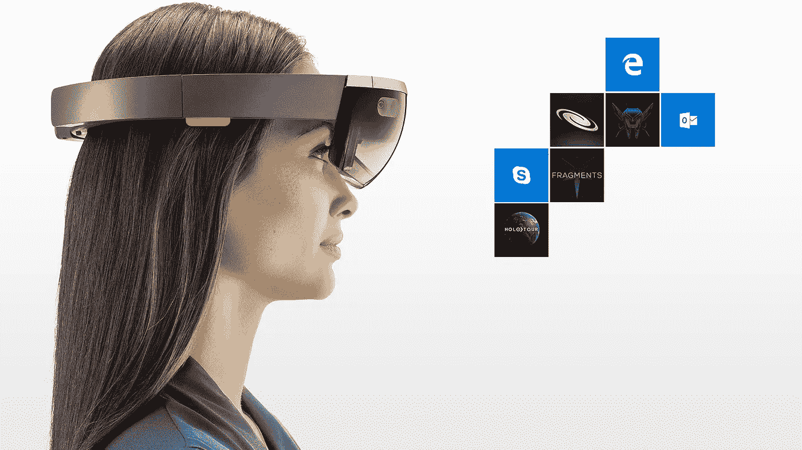
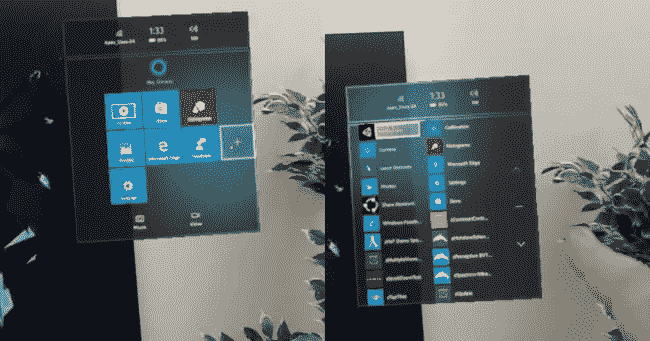
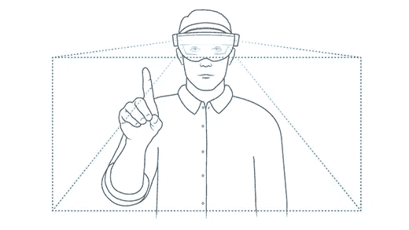
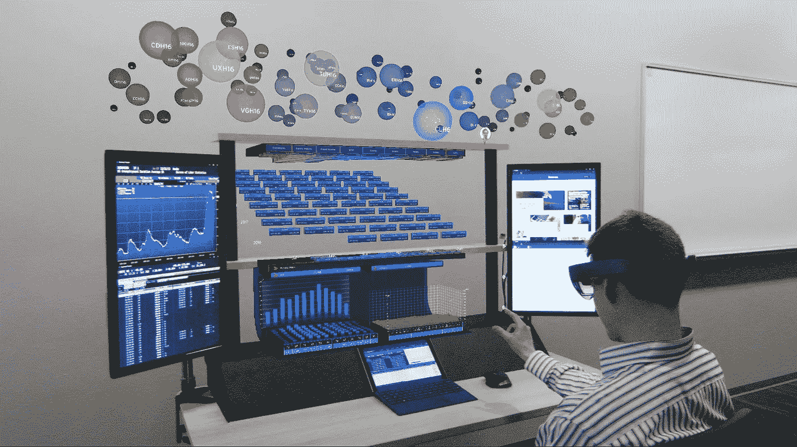

# HoloLens:但是这种“混合现实”真的对我们有用吗？

> 原文：<https://medium.com/hackernoon/hololens-but-is-this-mixed-reality-really-useful-to-us-f204318cd883>

NASA — Scott Kelly using Microsoft HoloLens at the International Space Station

微软的 HoloLens 承诺改变我们的生活。问题是，在技术领域，并不总是良好的意图转化为成功。

在本文中，我们试图了解 HoloLens 能在多大程度上改变我们的习惯。

HoloLens 是一个独立于 PC 的单元，带有一个集成的全息处理器单元(HPU)。HPU 管理由许多传感器收集的数据，减轻了 CPU 和 GPU 的负荷。

当我们开始用 Hololens 四处张望时，他们会不断地绘制环境地图。

操作系统明显是 Windows 10，所以开始菜单就是上面系统的开始菜单。

为了获得开始菜单的全息图像，我们需要执行手势“Bloom”。为了完成绽放，我们握住拳头，然后张开手(关于 HoloLens 的基本原理，请点击[此处](/@pallotta.francesco/hololens-what-the-hell-is-this-mixed-reality-77e9b21db38f))。

这是第一个困惑开始的地方。该系统并不总是识别该绽放，并且可能发生需要重复不止一次的情况。

开始菜单是少数不与环境相关的全息图之一。它跟随凝视。

相反，我们可以将应用程序窗口(如浏览器)固定在房间的墙上。您最多可以同时运行三个应用程序。把窗户固定在墙上就像在房间的不同地方有几个虚拟屏幕。

要单击开始菜单项之一，将光标移动到您的头部(“凝视”)，并执行名为“轻敲空气”的手势。

这个手势非常直观，因为它模拟了触摸屏的使用。

HoloLens 允许你将显示在桌面 PC 上的对象带到显示器之外。这样，物体漂浮在空中，你可以在真实环境中用鼠标移动它！好的是能够修改一盏灯或一辆汽车的设计元素，将它们叠加到真实的产品上，以测试其影响。

用户和全息图之间以及全息图和真实环境之间有许多互动。例如，你可以创造一个机器人，并把它推进你房间的家具中。此外，您可以创建一个可以在地板上弹跳的球。我们也可以用全息图踢足球，踢我们桌子上或地板上的球(没有打碎我们装饰品的风险！).

你可以拍摄混合现实中出现的环境。这个特性在原型开发中有很大的潜力。事实上，通过照片或视频分享正在创造的东西是非常有用的。

HoloLens 的环境映射对创建应用程序很有用。例如 3D 扫描仪应用程序。HoloLens 能够通过“看着它”来创建我们房间的 3D(不是很精确)模型。这种功能就是“空间映射”。当然，在将它视为 3D 扫描仪之前，还有一段路要走。

此外，它还能够传递语音命令，而无需经典的“Ehi Siri”或“Ok Google”寻址命令。

HoloLens 也可以作为 PC 的延伸。例如，全息工作站使用 HoloLens 创建 3D 实时金融数据全息图。

一个三级系统允许交易者在一个三维和 2D 结合的环境中与大量数据互动。用户可以与其他 HoloLens 持有者共享信息。有趣的是即使坐在 PC 上也能使用 HoloLens。这提供了与传统工具的集成。

有许多面向设计的应用程序，如 NASA Mars。美国宇航局喷气推进实验室使用 Hololens 帮助科学家进行火星项目。火星好奇号火星车和火星勘测轨道飞行器拍摄的图像显示在全息透镜上。它提供了一个混合现实视图，虚拟对象可以与真实对象一起出现，在房间中重建火星环境。在任何真正的制造之前，设计下一辆火星漫游车的设计师使用 HoloLens 按比例查看他们的 3D 计划。

将 HoloLens 用于火星车设计非常有趣。回到现实，建筑设计也有应用。例如，您可以拉伸、旋转和缩放到所需的大小。你可以用大量漂浮在空中的信息、图像和视频来丰富模型。模型可以放在房间的任何地方，你可以选择性地查看一些层。您可以要求概览，也可以查看单个环境的内部。你可以放大模型，直到你发现自己在里面。你也可以直接改变全息图。任何在 3D 领域工作过的人都知道在传统屏幕上管理一个模型是多么不舒服。

在建筑领域，我们也发现了室内设计的应用。例如，用户可以在设计阶段看到他的新厨房。此外，有可能进入新的虚拟厨房，甚至覆盖在真实的厨房。用户能够改变家具的设计、形状和颜色。用户还可以改变墙壁的颜色，添加或删除元素，并决定它们的大小。HoloLens 可以记录用户的体验。应用程序创建报告，显示用户更关注的部分和用户更喜欢的部分(“感觉”)。同样的，可以显示用户的评论词统计(体验过程中说出的)。这对于设计和营销都是一个有效的应用。

Stryker 将 HoloLens 用于手术室的设计。医生和护士可以通过 HoloLens 预览手术室的设计。它允许预先了解要进行的任何更改。通过这种方式，可以实现最高水平的效率、舒适性和操作性。还有一家公司，蒂森克虏伯，使用全息透镜为残疾人设计电梯。

这些都是坚信 HoloLens 的公司的例子。

有趣的是日本航空公司使用 HoloLens 训练机械师。

存在一个用于 PGA 巡回高尔夫锦标赛选手的表现分析的应用程序。高尔夫球场以 3D 显示，你可以要求任何比赛球员在特定球洞的统计数据。您可以显示单个镜头的轨迹，并比较不同的球员。谁没想过分析美巡赛参赛选手的表现？玩笑归玩笑，对于行业专业人士来说，这似乎是一个非常强大的工具。但我真的不知道在这种情况下，HoloLens 的使用能带来多大的附加值。

值得注意的是太阳马戏团在演出布景设计中使用了全息透镜。世界各地的人们可以在同一个虚拟舞台前一起工作。就好像他们都在同一个剧院里。一个应用是说“壮观”的情况，也可以用于其他形式的娱乐。

总之，很明显，这是一项刚刚起步的技术，但具有非常重要的潜力。它的成功在很大程度上取决于将要开发的应用程序的类型。目前的应用部分是有趣的玩具，部分是为将来重要的应用提供基础。我们希望未来的 HoloLens 应用将彻底改变当前的技术世界。

让我们看看会发生什么…

***弗朗西斯科·帕洛塔*** *是软件设计和开发方面的资深软件工程师专家。他在太空和国防领域工作，研究虚拟现实和增强现实的应用开发技术。*

你想了解更多关于虚拟现实、增强现实和混合现实的知识吗？**关注我**上[中](/@pallotta.francesco)和[推特](https://twitter.com/FranPallotta)。

你喜欢这篇文章吗？**推荐**，点击心形♡图标。