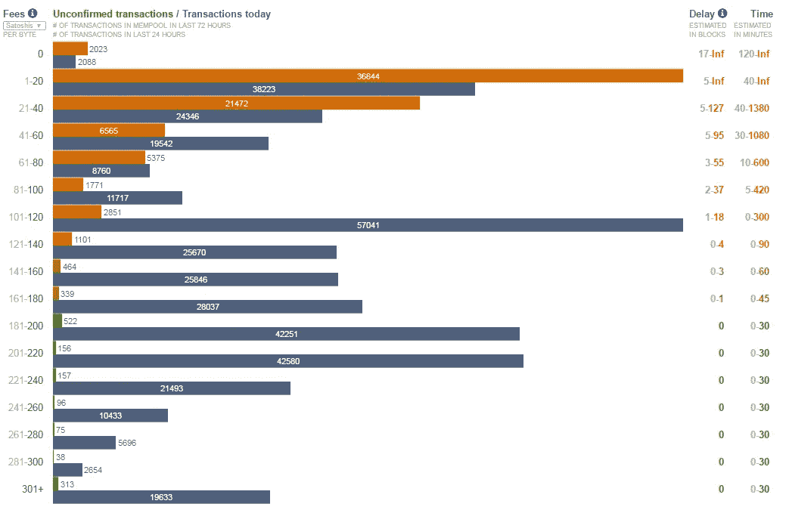
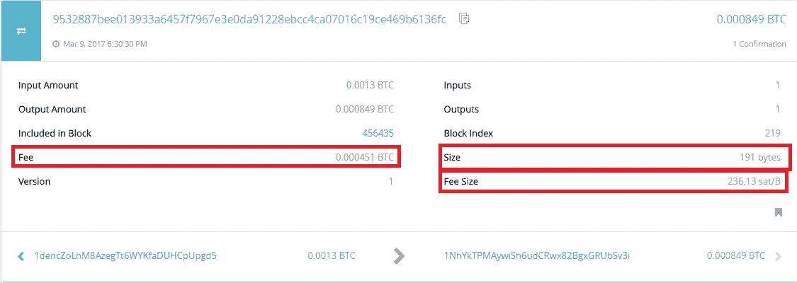
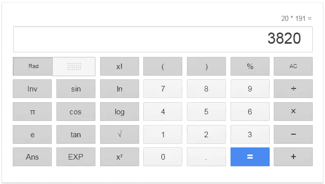
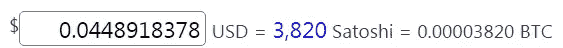
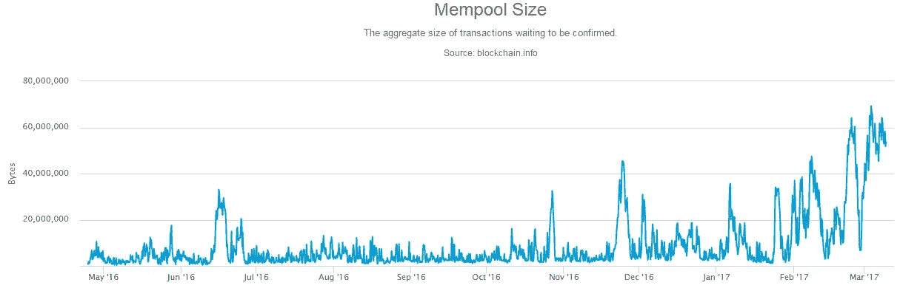
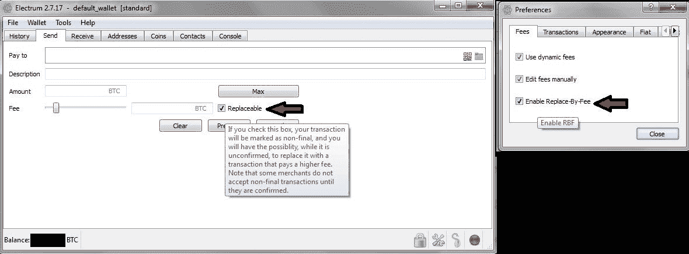

# 意外低费用交易实用指南

> 原文：<https://medium.com/hackernoon/holy-cow-i-sent-a-bitcoin-transaction-with-too-low-fees-are-my-coins-lost-forever-7a865e2e45ba>

首先:你的钱包很可能很烂，考虑换一个。第二:不要担心你的硬币是安全的。**三天内，您的交易要么得到确认，要么您的硬币“重新出现”在您的钱包中。**这是一个简短的答案，它可能在 99%的情况下都是正确的，但是让我们更深入地了解一下，如果你不想只是等待，那么就检查一下你的选择。
**更新:**正如 [/u/ismith23 所注](https://www.reddit.com/r/Bitcoin/comments/69jywp/a_practical_guide_to_accidental_low_fee/dhjfthf/?utm_content=permalink&utm_medium=front&utm_source=reddit&utm_name=Bitcoin)，从比特币 0.14“交易再现”发生 2 周后。

一个更正确的答案可能是这样的:**当你发送一个费用太低的事务时，它会留在大多数满节点的内存池中(1)直到它过期，(2)直到一个挖掘器在一个块中捡起它并确认，或者(3)直到一些魔法使(1)或(2)发生。**

很甜蜜，不是吗？让我们在本文的其余部分分解这个句子。

1.当你用**太低的费用发送一笔交易**……
好吧，但是多低呢？

[https://bitcoinfees.21.co/](https://bitcoinfees.21.co/)

根据 https://bitcoinfees.21.co/在撰写本文时的说法，太低的费用意味着每笔 20 秒以下的交易都无法确认。

[https://www.smartbit.com.au/tx/9532887bee013933a6457f7967e3e0da91228ebcc4ca07016c19ce469b6136fc](https://www.smartbit.com.au/tx/9532887bee013933a6457f7967e3e0da91228ebcc4ca07016c19ce469b6136fc)

如果您在任何块浏览器中查看您的事务，您将会看到它的大小。例如，上述事务的大小是:191 字节。这将意味着你至少需要 3820 satoshi 费用，所以你可以肯定它会确认:

[https://www.google.com](https://www.google.com)

这大约是 5 美分，或 0.00004 btc:

[http://www.btcsatoshi.com/](http://www.btcsatoshi.com/)

你也可以在上面的 blockexplorer 的截图中看到，增加的费用是:0.000451 btc，它实际上也显示了每字节的 Satoshi:236.13 sat/B，所以你可以放心地得出结论，它将确认。

2.当你发送一个费用太低的事务时，它**停留在大多数满节点的内存池中** …
什么是内存池？为什么**最多**满节点？

[https://blockchain.info/charts/mempool-size?timespan=all](https://blockchain.info/charts/mempool-size?timespan=all)

满节点将未确认的事务保存在它们的内存池中。一些资源不足的完整节点根本不维护内存池，或者只保持高于某些费用的事务，但这实际上取决于节点实现，例如:

> [【来源】](https://bitcointalk.org/index.php?topic=1714006.0)比特币核心的默认最大内存池为 300 MB，超过该值后，它将开始启动交易，并增加最低费用以获得接受。
> 
> 如果你想改变这种行为，你可以使用`-maxmempool`设置。

这有什么关系？有一个机会，你增加了这么低的费用，你的交易甚至不能通过整个网络传播。如果您想要执行双重花费攻击，这将非常方便。

3.当你发送一个费用太低的交易时，它停留在大多数满节点(1)的内存池中，直到它或者**到期** …
惊喜，甚至“到期”这个词都需要一个解释。

自比特币核心 0.12 以来，有效期为 72 小时。这就是我说的“你的硬币 3 天后会重新出现在你的钱包里”的意思。

但这并不是故事的全部。该到期时间可能因节点实现而异，甚至完全不存在。事实上，即使在 Core 中，您也可以设置`-mempoolexpiry`设置。但是，这还不是全部:任何人都可以重播那个交易，从而绕过这个有效期。我想知道当你设置一个节点并持续转播所有低费用交易直到时间结束时，攻击是否会起作用。

在更大的背景下，您的事务不太可能在 72 小时后不会过期，所以您不必处理它，但这是值得记住的事情。

4.当你用太低的费用发送一个事务时，它停留在大多数满节点的内存池中(1)直到它或者到期，(2)直到一个矿工在一个块中拾起它并确认或者 **(3)直到一些魔法使(1)或(2)发生。** 魔法？我知道你在想什么。另一个过于复杂的技术术语。让我们看看这意味着什么:

## 选择加入付费替代

> [【来源】](https://bitcoincore.org/en/faq/optin_rbf/) Opt-in Replace-by-Fee (RBF)允许交易被标记为可替换，直到它们在块中被确认。

但是，您或您的钱包必须首先将交易标记为可替换。如果你正在读这几行，很可能你已经错过了这个机会。

Opt-in RBF within Electrum wallet

在参考客户端中，将`-walletrbf`选项设置为 true。

## 孩子为父母付费

在你试图理解它之前，先试着把这个术语形象化，嗯，因为它很有趣。

> [【来源】](https://bitcoincore.org/en/faq/optin_rbf/)
> 子代父是一种通过进行依赖于第一笔交易的另一笔交易来增加交易费用的方式。
> 
> 为什么 CPFP 没有被用于 RBF？
> 孩子为父母买单(CPFP)并不能解决同样的问题。RBF 允许*花费者*增加费用；CPFP 是有用的，因为它允许*接受者*增加费用。
> 与 CPFP 相比，RBF 的优势在于它不一定需要使用任何额外的块空间，因此它的效率大约提高了 [30%到 90%](http://lists.linuxfoundation.org/pipermail/bitcoin-dev/2015-May/008232.html) 。

这听起来可能有点令人困惑，但它非常简单。只需花费你的花费者不小心把太低的费用加到较高费用的交易中，你就完成了。等等什么？可以花一笔没有确认的交易？是的，当然，但是大多数钱包不允许你这样做。

事实上，收款人必须能够以一种先进的方式使用她的/他的钱包，如果它不使 CPFP 容易默认的话。查看这篇[CPFP](https://bitcointalk.org/index.php?topic=1118563.0)讨论的完全白痴指南，探索你在具体案例中的可能性。

事实上，正如 Reddit 用户 Amichateur 指出的那样，如果你发送的交易有零钱返回给你(这种情况几乎总是存在)，你可以把这些零钱花回给自己，这样就执行了一个 CPFP 交易。因此，对 CPFP 来说，你不一定非得站在接收者一方，大多数情况下，发送者也可以这样做。

## 矿工魔法

如果你和一个矿池有交易呢？该池承诺你拿起你的交易，无论多么低的费用，以换取一些东西。

在写这篇文章的时候，ViaBTC pool [提供这项服务](https://www.viabtc.com/tools/txaccelerator/)作为交换，他们会向你灌输一些政治观点。这很容易使用，只需复制粘贴您的交易 ID，他们会去拿它。请注意，他们目前接受“每小时最多可以加速 100 条提交的 TXs。”

## 双倍消费

所有上述技术都可以归类为白魔法，但这种技术是黑魔法，我现在不打算详细介绍它，因为比特币开发者正在不断努力如何使这种黑魔法更难执行，而完全消除它可能永远不会发生，尽管双重支出游戏的规则在不断变化。

# 结论

当你发送一个费用太低的事务时，它会留在大多数满节点的内存池中(1)直到它过期，(2)直到一个挖掘器在一个块中捡起它并确认，或者(3)直到一些魔法使(1)或(2)发生。

> [黑客中午](http://bit.ly/Hackernoon)是黑客如何开始他们的下午。我们是 [@AMI](http://bit.ly/atAMIatAMI) 家庭的一员。我们现在[接受投稿](http://bit.ly/hackernoonsubmission)，并乐意[讨论广告&赞助](mailto:partners@amipublications.com)机会。
> 
> 如果你喜欢这个故事，我们推荐你阅读我们的[最新科技故事](http://bit.ly/hackernoonlatestt)和[趋势科技故事](https://hackernoon.com/trending)。直到下一次，不要把世界的现实想当然！

