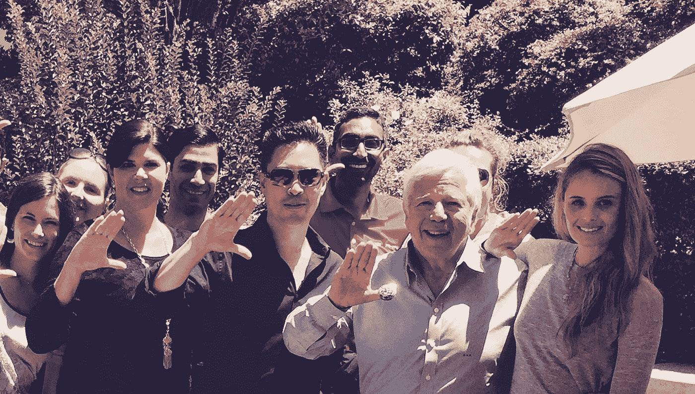
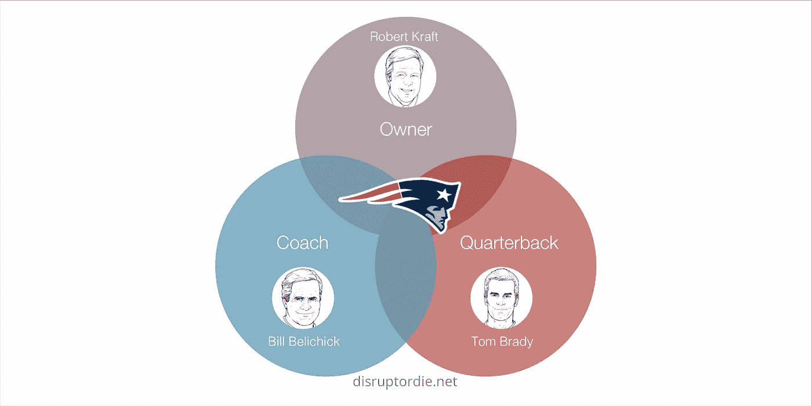
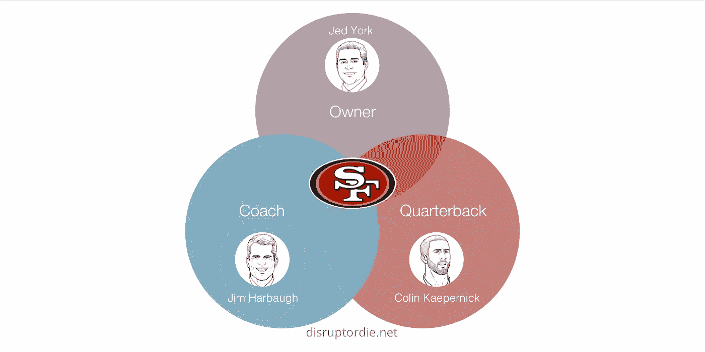
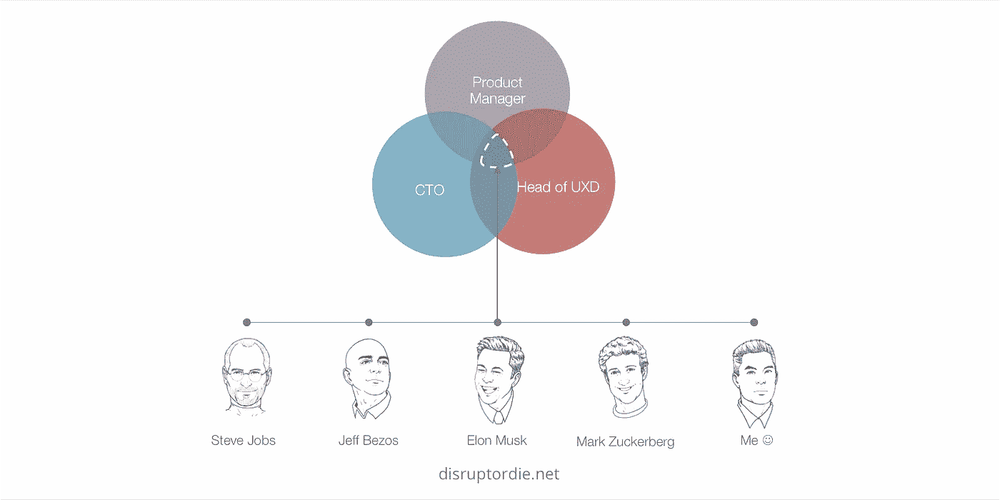

# 神圣的三一！创新者能从新英格兰爱国者身上学到什么

> 原文：<https://medium.com/hackernoon/holy-trinity-what-innovators-can-learn-from-the-new-england-patriots-5c335b2775b6>

上周末，在第四节还剩 2 分 10 秒时，新英格兰爱国者队落后 5 分，这是他们最擅长的。汤姆·布拉迪在 2017 赛季的第三场比赛中以 36 比 33 击败休斯顿德克萨斯队，赢得了他职业生涯的第 50 场胜利。

一个团队如何在低赔率和时间快到零的情况下保持镇定、专注和自信？

这可以归结为领导力的关键要素。

罗伯特·克拉夫特是新英格兰爱国者队的老板。他也是一个体贴、关心和有洞察力的人。

有一天，我们一起从纽约去波士顿，罗伯特让我搭了他的私人飞机。在旅途中，我问他爱国者在顶峰长寿的秘诀。

罗伯特告诉我，“教练、四分卫和老板保持一致很有帮助。”

在工资帽时代，新英格兰爱国者队是 NFL 中最具统治力的球队，自贝利奇克 2000 年担任主教练以来，赢得了 14 个分区冠军和过去 17 个超级碗中的 5 个。当然，他们在超级碗 51 中从 25 分的劣势中恢复过来，赢得了他们的第五个也是最近的一个冠军。

罗伯特的见解瞬间引起了我的共鸣。领导力受到无数因素的影响，但关键是理解最重要的因素。这是爱国者足球三位一体的示意图:

我也目睹了截然相反的行为。在旧金山湾区度过了过去十年后，我最近观看了旧金山 49 人队潜入 NFL 地下室的比赛。

几年来，49 人队看起来已经具备了一个潜在王朝的要素，吉姆·哈博是教练，科林·卡佩尼克是四分卫。

然而，所有者设定基调并维护基础。

当 49 人队的首席执行官杰德·约克决定支持他的总经理而不是他的教练时，他打破了基础，有效地将哈博赶出了城。在 Harbaugh 的指导下，Kaepernick 已经成为一名潜在的超级巨星，但他立即陷入了统计数据的低谷，自那以后，49 人队一直在输球。

这是它崩溃前的样子:

与爱国者形成对比。比尔·贝利奇克或许可以用他标志性的目光融化沥青，但他拥有罗伯特坚定不移的全力支持。虽然在贝利奇克的带领下，球员们可能会有些萎靡不振，但他们会振作起来，为卡夫大家庭的温暖和关怀付出更多。

罗伯特的洞察力让我想到了数字等价物，一个圣父、圣子和圣灵的数字联盟。

世界上最伟大的科技公司都由体现产品三位一体的首席执行官领导，这并非偶然。这些首席执行官通常扮演事实上的产品经理、首席技术官和用户体验设计负责人的角色。

这些领导者可能有下属向他们报告这些头衔，但他们定期积极地做这些工作——确定实际、具体的产品需求，做出技术选择和设定技术方向，以及设计用户体验的细节。

# **杂草对种子**

我想象传统公司甚至一些初创公司的首席执行官不同意地喃喃自语，“我不能置身事外。这就是为什么我会在组织中聘用优秀的领导者。”

## 杰夫·贝佐斯

杰夫·贝索斯在 2017 年成为世界首富，经营着全球市值最高的三家公司之一。另外两家公司也是科技公司。

亚马逊的前雇员史蒂夫·耶格在他的博客上咆哮道:

> 杰夫·贝索斯是一个臭名昭著的微观管理者。他微观管理亚马逊零售网站的每一个像素。他雇佣了苹果公司的首席科学家拉里·特斯勒，他可能是全世界最著名、最受尊敬的人机交互专家，然后在三年的时间里忽视了拉里说的每一句该死的话，直到拉里最终明智地离开了公司。拉里会做这些大的可用性研究，并毫无疑问地证明没人能理解那个该死的网站，但贝佐斯就是放不下那些像素，那些登陆页面上数百万语义丰富的像素。他们就像数百万他自己的宝贝孩子。所以他们都还在，而拉里不在。

贝佐斯自己说得更委婉一些。在 2017 年致股东的信中，贝佐斯分享了他对如何避免长期、缓慢地被淘汰的看法，他称之为“第二天”。

他的四个要点之一包括这个警告:“抵制代理。”

贝佐斯写道，“市场研究和客户调查可以成为客户的代理——当你发明和设计产品时，这尤其危险。”他后来解释说，“卓越的客户体验始于心灵、直觉、好奇心、游戏、勇气和品味。你在调查中找不到任何东西。”

贝佐斯显然有心脏、直觉、好奇心、游戏、胆量和品味。他愿意把自己的产品、用户体验和公司押在他认为正确的事情上。

## 史蒂夫·乔布斯、埃隆·马斯克和塞特亚·纳德拉

当然，一系列电影和书籍让史蒂夫·乔布斯对设计的纯粹和简单的痴迷变得闻名遐迩，甚至要求他的产品的*内部*看起来整洁优雅。

埃隆·马斯克曾公开表示，他个人将 80%的时间花在新产品工程和设计上。

乔布斯、马斯克和贝佐斯不会在杂草中消磨时间。伟大的设计和伟大的产品是[未来](https://hackernoon.com/tagged/future)的*种子*。

当微软的股票十年停滞不前时，公司用塞特亚·纳德拉取代了首席执行官史蒂夫·鲍尔默。我在一次晚宴活动中遇到了纳德拉，讨论 Delphix 如何加速企业应用向云的迁移，包括微软的云 Azure。

纳德拉有一个非常明显的头骨，这不仅是因为他剃光了头发，还因为从他的太阳穴巧妙地伸出的静脉，积极地喂养他高度分析的头脑。作为微软的一名长期员工，纳德拉领导了微软许多传统技术和服务从内部到云的转型。

作为首席执行官，他实施了“云优先，移动优先”的战略，克服了数十年的内部政治纷争，导致微软股价在 2017 年创下历史新高。他最近更新了战略，专注于人工智能，继续跟踪世界上的字母表和亚马逊。

当增强现实(AR)的话题出现时，他真的变得充满活力和激情，描述了他对 AR 可以提高知识工作者生产力的愿景，为每个人提供电影中描绘的神奇、动态的界面，如 *Minority Report* 。

在我的[关于云战略](https://goo.gl/Cr4TS7)的博客中，我分享了当今世界中起作用的基本等式:

> 传统产业+数字时代=数字重构产业

**如果你把最关键的领导角色扼杀在无止境的层层官僚体制之下，你就无法在数字时代生存。**

如果世界上最大的公司的首席执行官们能够在产品需求、技术决策和用户体验上花费时间，那么世界上其他公司的首席执行官们能够不花时间吗？

如果你正在经营一家初创公司，或者你是一家大公司的高管，你需要体现产品三位一体，或者有一个直接向你汇报的高层团队。

你不能把决定公司未来的关键领导因素委派出去。

## 感谢阅读！

## 如果你喜欢这篇文章，请按住下面的按钮👏帮助其他人找到它。你拿的时间越长，你给的掌声就越多！

## 关于我

我花了 20 年时间解码创新，收集驱动当今许多最成功的技术企业家的隐藏框架。我亲自实施了这些框架，在 Delphix 和 Avamar 发明了软件产品，销售额超过 40 亿美元。我在我的第一本书 [*Disrupt or Die*](https://disruptordie.net) 中分享了这些框架(2017 年 10 月出版)。