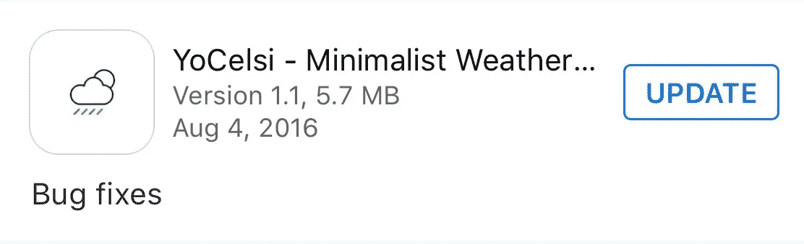
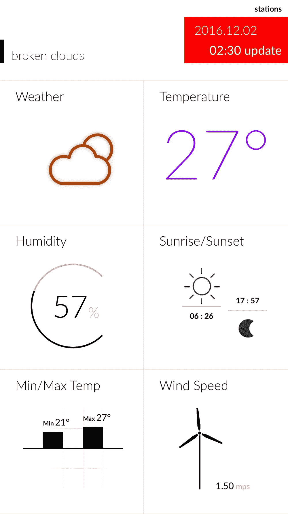
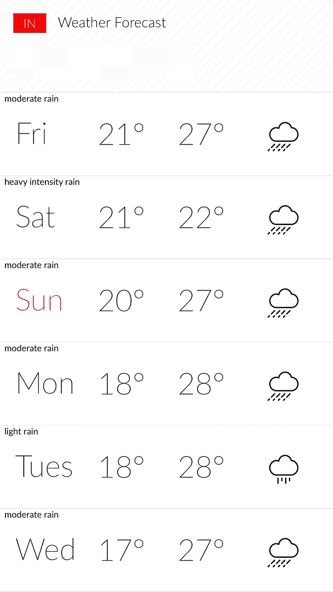
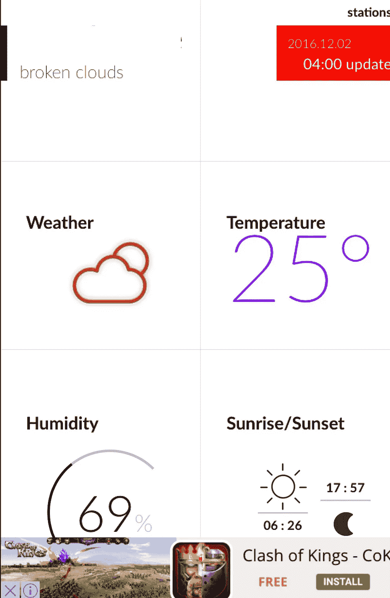
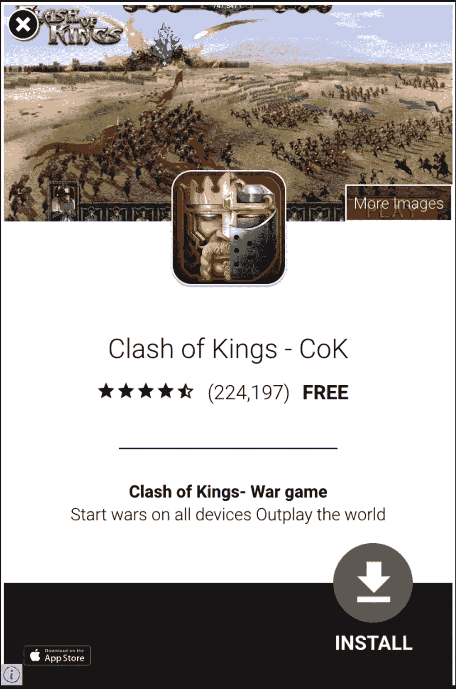

# 诚实在应用商店里没有回报

> 原文：<https://medium.com/hackernoon/honesty-doesnt-pay-in-the-app-store-6bc51e65d385>

The bug fix that wasn’t

几个月前，我下载了这个名为 YoCelsi 的免费天气应用程序，它干净简单的布局吸引了我。我居住的印度全年都是湿热的天气。因此，我从天气应用程序中唯一需要的就是降雨预报，这个应用程序做得很好。最棒的是这款应用没有广告来彰显其简单性。

一段时间后，该应用程序显示了一个错误修复的更新。我尽职尽责地更新了它，接下来我知道的是，这个应用程序已经从一个干净的应用程序变成了一个广告泛滥的应用程序，底部有一个分散注意力的 gif 横幅，它断断续续地变成了全屏弹出窗口。似乎开发商耍了一个花招。通过承诺修复漏洞，他让用户将免费应用更新为广告驱动的模式。

别误会我的意思。我知道开发者需要赚钱，不能一直免费赠送他们的应用。我不同意的是他处理整件事的不光明正大的方式。吸引我使用这款应用的简洁外观不见了。而且没有付费清除广告的选项。所以我删除了这个应用程序，并在我的 Mac 上恢复了之前的无广告版本，以恢复其极简的简单性。

问题是，如果开发者提到这个更新会把这个应用变成一个闪烁、弹出的怪物，我不会更新它。所以说实话对开发商来说会适得其反。简而言之，目前应用商店的更新模式迫使开发者不诚实，这不是一件好事。

我想从苹果公司得到的是一个选项，可以恢复到应用程序的前一个版本，以防更新以某种方式搞乱它。在这种情况下，就是这个样子。这样的话，开发者会友好地给我一个付费删除广告的选项，而不是强迫我忍受讨厌的弹出窗口。很多时候，更新也有功能缺陷，恢复选项会很有帮助。现在有一个变通办法。只需在你电脑上的 iTunes 中下载你喜欢的每一个应用程序的副本。并在更新失败时恢复该版本。在这种情况下，我就是这么做的，但这不是最佳解决方案。

对苹果的期望过高吗？

Before the bug fix

After the bug fix

> [黑客中午](http://bit.ly/Hackernoon)是黑客如何开始他们的下午。我们是 [@AMI](http://bit.ly/atAMIatAMI) 家庭的一员。我们现在[接受投稿](http://bit.ly/hackernoonsubmission)，并乐意[讨论广告&赞助](mailto:partners@amipublications.com)机会。
> 
> 如果你喜欢这个故事，我们推荐你阅读我们的[最新科技故事](http://bit.ly/hackernoonlatestt)和[趋势科技故事](https://hackernoon.com/trending)。直到下一次，不要把世界的现实想当然！

