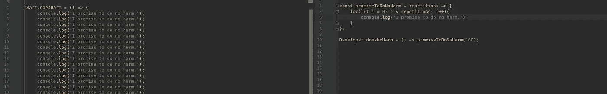

# 尊重字节

> 原文：<https://medium.com/hackernoon/honor-the-byte-dbd314b3d506>



## 或者:无害，编写可维护的代码

*我目前有一项光荣的任务，就是将一个遗留的 react/jquery/material ecss 代码库移植到 react/material-ui。*

*很痛，而且很痛。当我几周前开始做这件事时，我并没有真正意识到我正在做什么——现在我比以前更清楚了，但我仍然觉得完成这件事需要一段时间。
几天前，下班后，一位同事问我为什么要创建一个* `*Button*` *组件，这是这个故事的灵感来源。*

## 模块化

在大学里，针对代码质量的讲座都提倡尽可能实践模块化。我可以看到这种方法的好处，但是我从来没有完全意识到如果你开始为忽略这种基本的编码实践寻找借口会发生什么。编写小型的自包含组件/函数比编写整体的“全部完成”有很大的优势，我想在下面的文章中强调这一点。

我正在开发的应用程序到处都有代码重复巨大的 React 组件，它们在字符串模板中只有几个字的不同。100 多行函数，只有一个数组选择器不同。最终我会夸大其词，但你会明白的:

> 我应该帮忙解决这个问题还是逃跑？

显然我不能责怪之前的开发者— **我过去也做过类似的事情**。项目发展迅速，变得比我们一开始想的还要复杂，仓促的设计决策有时会让我们焦头烂额。我们突然不得不抓住潜在投资者的最后期限，或者不得不随着需求的急剧变化而改变。在巨大的压力下，我们倾向于背叛自己的理想，并开始做(不仅仅是)像代码复制这样的事情，因为我们说服自己这样更快，我们可以在以后重构——即使我们知道得更好。

这是一个遗留的 meteor 应用程序，所以 1.3 之前的测试甚至从一开始就是一团糟。突然之间，节点环境变得非常快——变得更好——但是像这样的大型项目很难赶上作用域模块/es6/lodash/app-state/un maintained-packages 和其他日常工作。

我们都知道历史上的成长项目，*它们几乎必须是混乱的。*另一方面，我们可以将它视为一种挑战——遗留代码通常包含一些有趣的解决方案，用于那些没有人首先注意到的特殊情况。

# 为什么代码复制不好

我不知道有谁会认为代码复制通常是件好事。尽管如此，我认为研究我们不一定意识到的代码复制的含义是很有趣的。

## 易测性

由于没有中心定义，测试基本上变得不可能。当查看测试金字塔时，你基本上必须跳过所有的底层，直接开始集成测试。使用快照这样简单的 UI 测试工具是不可想象的。

## 易用性

在大多数情况下，你不会有一个简单的按钮，它总是有完全相同的类和属性。例如，在我们的代码库中，一些按钮在内联使用时包含一些额外的类，一些按钮包含用于遗留的 jquery 选择器的额外的类。

css 类的问题是，你必须记住它们——尤其是当你不遵循任何像 BEM 或 SMACSS 这样的准则时。这不是一个简单的任务，你不需要记住它们，而是在代码中寻找其他地方使用的类。这显然会减慢开发过程，而且对开发人员来说也不是一个好的体验。对于特定的元素，存在哪些类是不透明的。

当使用组件时，您可以简单地定义可能的属性并将属性名映射到类。没那么难。

## 易于改变

当你可以一直进行简单的修改而不破坏东西时，代码是可维护的。让我们假设我想改变按钮的一些东西…例如，处理一些 onClick ripple 问题，或者“切换底层 css 框架”——你现在必须**找到**并改变所有实现某种按钮的地方——你很可能会错过至少一个。有了适当的组件结构，它将是一个简单的程序。

## 改变的勇气

问题是，特别是对于大的、重复的功能和组件，不仅是它们是 ***大的*** 和 ***重复的*** *。最大的问题是，没有人有勇气去改变事情。不是因为他们不想，而是因为他们害怕打破某些东西，而没有注意到——每个人总是只触摸他/她真正需要触摸的代码。所以 mess 变得更乱，上面提到的点变得越来越差。一旦进入，就很难逃脱这个螺旋，因为你必须说服你的老板停下火车，让你做不一定影响产品可见价值的工作。清理工作没有直接的投资回报，所以你必须争取时间和资源。*

## 代码大小

特别是在 web 开发中，代码大小是一个主要关注点。实际上，包的大小是 200 还是 400kb 很重要。所以有几次

```
React.createElement(Button, { onClick: handleClick })
```

相对

```
React.createElement('button', { className: 'a lot of different classes', onClick: handleClick })
```

实际上会对代码大小产生影响。当然，这是一个不考虑缩小和 gzipping 的超级简单的例子，但是随着组件和功能越来越复杂，优势就越来越明显。

**Gzip:** 现在的大部分 web 服务器都支持 Gzip，基本上是去掉重复的字符串([深度解释](http://www.infinitepartitions.com/art001.html))。这不会使论点无效，但在很多情况下会减少问题。

Prepack:Facebook 开发了一个非常酷的工具叫做 Prepack，它也可以帮助优化功能。尽管如此，你不应该使用代码优化器作为编写糟糕代码的借口，而是应该使用它们来优化良好的代码。

## 编译/传输时间

Javascipt 是解释的，所以我不需要编译对吗？不。实际上你需要为不同的目标编译/传输它。不仅如此，对于面向 web 的应用程序来说尤其如此。你通常不能只写现代代码，然后在浏览器中运行它。你最有可能使用某种编译系统，它将一些语言特性翻译到一个较低的级别，使其可以被所有/旧的浏览器执行。拥有非模块化的重复代码很可能会增加构建时间并降低 DX。

# 结论

> 第一次做一件事，你就去做。当你第二次做类似的事情时，你会因为重复而退缩，但是你还是做了重复的事情。第三次你做类似的事情，你重构。
> 
> [*马丁·福勒等人*](https://www.amazon.com/dp/0201485672/)

不要等到上述声明无效。一旦发现缺陷，就重构你的代码。没有什么比保持代码整洁、可维护和可测试更重要的了。每次你推迟重构，你都在积极地创造工作，降低产品质量和开发者体验。

> 当程序员失去了对清洁的恐惧，他们就去清洁！而且干净的代码更容易理解，更容易修改，更容易扩展。因为代码变得更简单，缺陷变得更不可能。代码库稳步改进，而不是我们的行业已经习惯的正常腐烂。
> 
> 哪个职业程序员会允许这种腐烂继续下去？
> 
> [*《干净的编码者》，罗伯特·马丁*](https://www.amazon.de/Clean-Coder-Conduct-Professional-Programmers/dp/0137081073)