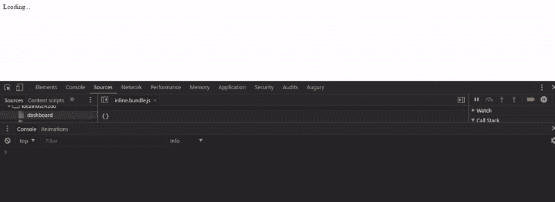

# 钩入 Angular 的初始化过程

> 原文：<https://medium.com/hackernoon/hook-into-angular-initialization-process-add41a6b7e>

***本*条** ***原本出现在***[***dormoshe . io***](https://dormoshe.io/articles/hook-into-angular-initialization-process-8)

有时，您需要挂钩内部流程。有时，您需要在加载应用程序之前运行代码。有时，您需要在呈现页面之前配置应用程序的某些部分。有时，您希望暂停初始化，直到完成某些限制。在 Angular v4 中，你可以用 *APP_INITIALIZER* 令牌来完成这个任务。

Live example

在本文中，我们将了解什么是注入令牌，什么是 *APP_INITIALIZER* 以及如何使用它来挂钩初始化过程。此外，我们将看到运行该功能的核心模块的源代码，并且我们将介绍该功能的三种不同用法。

让我们开始…

# 注入令牌

InjectionToken 是 Angular v2 OpaqueToken 的改进版本([v4](https://hackernoon.com/top-8-resources-to-explore-angular-4-ff2c1b42020a)的变化之一)。它允许我们创建基于字符串的令牌，而不会在依赖注入机制中遇到任何冲突。[创建一个注入令牌很容易](https://hackernoon.com/angular-v4-practical-countries-application-f866b567ead1)。

# APP_INITIALIZER 令牌

APP_INITIALIZER 是 Angular 的注入令牌之一。这个令牌仍然是实验性的。使用 *APP_INITIALIZER 时，*Angular*会在 APP 初始化时执行提供的功能。如果函数返回一个承诺，Angular 将延迟初始化，直到承诺解决。这意味着应用程序可以在没有太多延迟的情况下初始化，并且您还可以使用现有的服务和框架功能。*

# 一个例子

这个例子是基于英雄之旅项目编写的。
*ng module . providers*数组的定义如下:

APP_INITIALIZER module providers

所以在初始化过程中调用了两个函数——*onappinit 1，onAppInit2* 。下面是这些函数的实现:

APP_INITIALIZER providers factory functions

如您所见，每个函数都返回一个承诺。角度初始化过程将继续，直到所有初始化承诺都将被解决。这是作为英雄之旅项目一部分的跑步视频:

Tour of heroes — run

Angular 同时运行初始化程序，加载被延迟到最后一次解析。因此，您可以将您的业务逻辑放在提供者中。它可以是远程资源的一些配置或加载以及角度服务中响应的设置。

# 内部构件

Angular 声明了 *APP_INITIALIZER* 令牌，并在服务 ApplicationInitStatus 中运行所提供的函数。以下是部分代码:

App-initializer file source code

在第一行中，标记被声明。服务构造函数获取提供的函数(如果有的话),运行它们并将返回的承诺推送到一个数组。

Application-init-status service — part I

然后 angular 通过 *Promise.all* 并发运行所有承诺。 *_done* 属性将保持 *false* ，直到所有的承诺都被解决。

Application-init-status service — part II

源代码可以在[这里](https://github.com/angular/angular/blob/bebedfed24d6fbfa492e97f071e1d1b41e411280/packages/core/src/application_init.ts)找到。

# Angular 如何使用 APP_INITIALIZER？

Angular 使用 *APP_INITIALIZER* 令牌在应用程序初始化时初始化它的一些实现。这里有三种用法。

## ng .探针

有了 DOM 元素的引用，您就能够检查它所在的组件的状态。您可以通过使用 *ng.probe* 并将 DOM 元素作为一个类似`ng.probe($0)`的参数来实现。

Angular 在应用程序初始化之前使用 *APP_INITIALIZER* 令牌来配置和初始化 ng.prob，因此`ng.prob`将按需可用。

源代码可以在这里找到[。](https://github.com/angular/angular/blob/5293794316cc1b0f57d5d88b3fefdf6ae29d0d97/packages/platform-browser/src/dom/debug/ng_probe.ts#L37)

## 网络工作者

Web Workers 为 Web 内容提供了一种在后台线程中运行脚本的简单方法。工作线程可以在不干扰用户界面的情况下执行任务。Angular 通过一个更高级的 API 与 DOM 分离，所以我们可以使用 web worker 的概念。

Angular 使用 *APP_INITIALIZER* 是为了在使用它之前设置 DOM 适配器，所以 DOM API 调用不会在真正的浏览器 DOM 上完成。这个适配器需要使用传统的 js *控制台*对象来记录错误消息。浏览器 DOM API 的其他方法都抛出异常，因为在 web worker 上下文中不能直接访问 DOM。

源代码可以在[这里](https://github.com/angular/angular/blob/bebedfed24d6fbfa492e97f071e1d1b41e411280/packages/platform-webworker/src/worker_app.ts#L50)找到。

## 按指定路线发送

为了正确初始化路由器，Angular 需要执行两个主要步骤:

*   启动 *APP_INITIALIZER* 中的导航，如果解析器或保护异步执行，则阻止引导。
*   在 *BOOTSTRAP_LISTENER* 中运行激活。为此，Angular 利用路由器提供的*预激活后*挂钩。

路由器导航开始到达预激活完成时的点，然后暂停。它等待钩子被解决。然后在引导监听器中解析它。

源代码可以在[这里](https://github.com/angular/angular/blob/5293794316cc1b0f57d5d88b3fefdf6ae29d0d97/packages/router/src/router_module.ts#L327)找到。

# 结论

标记在 Angular 中广泛用于注入值。您可以根据需要使用它们，比如配置。Angular 提供了一种方便的方法来挂钩到应用程序的初始化过程中。当您选择适合这个过程时，请在考虑之后再做，因为它会暂停应用程序的加载。

***您可以关注我关于***[***dormo she . io***](https://www.dormoshe.io)***或***[***Twitter***](https://twitter.com/DorMoshe)***阅读更多关于 Angular、JavaScript 和 web 开发的内容。***