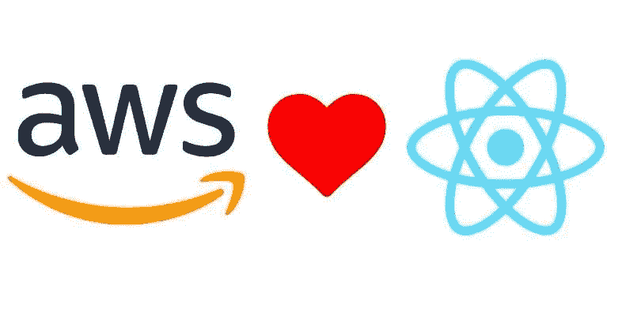
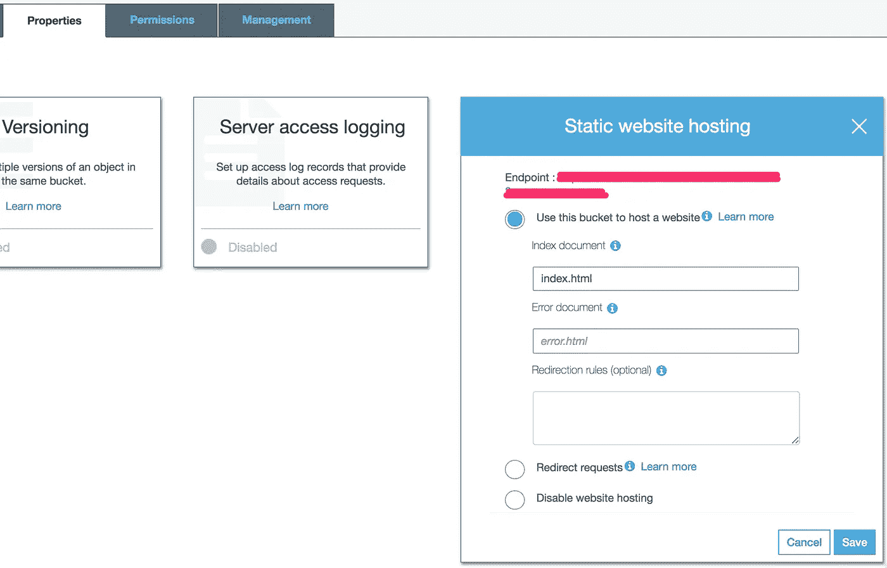
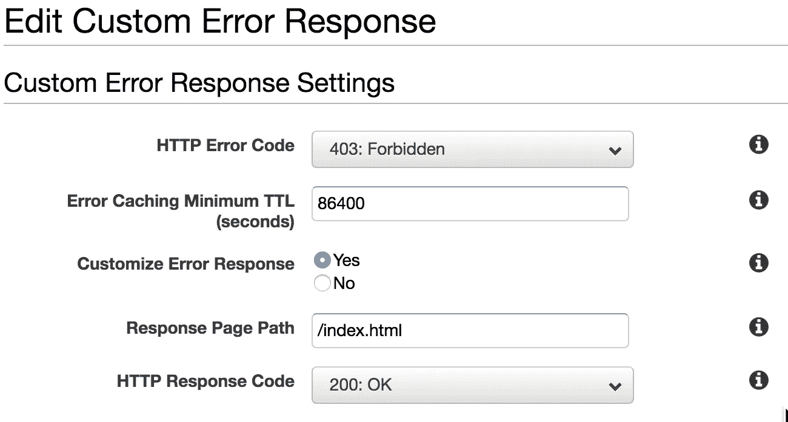
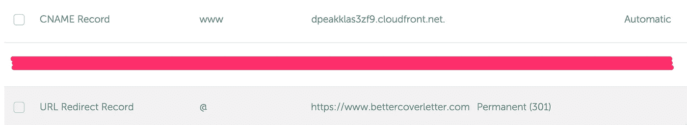
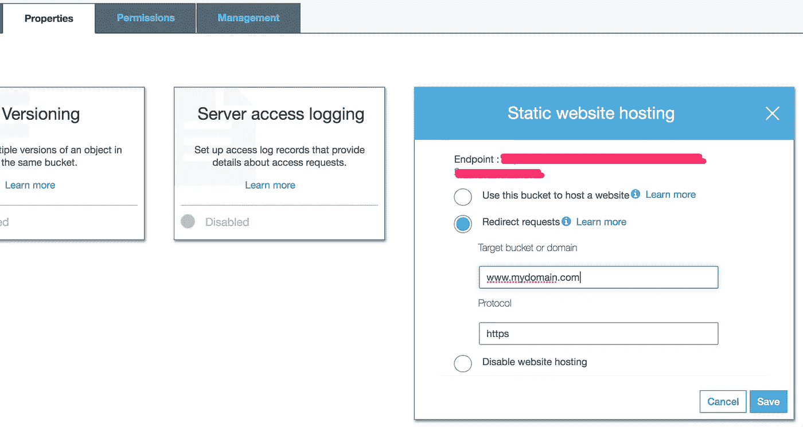
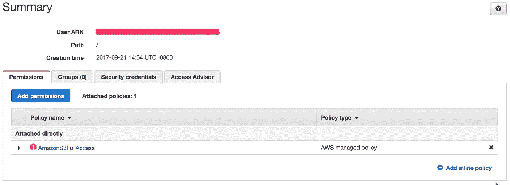

# 使用 SSL 在 AWS S3 (& CloudFront)上托管静态 React 网站

> 原文：<https://medium.com/hackernoon/hosting-static-react-websites-on-aws-s3-cloudfront-with-ssl-924e5c134455>

AWS S3 `Static Website Hosting`。它是廉价的、可扩展的和“高性能的”。尤其是当它用 CloudFront 标记团队时。

这是一个文档，以我的这个[宠物项目](https://www.bettercoverletter.com)为例，说明如何在 AWS S3 上使用 SSL over CloudFront 托管一个单页面应用程序(对于本例为 React)。



# 1)项目

一个简单的静态网站，所以没有使用 redux 这个设置也适用于 redux。因此，它将主要是反应和反应路由器。具体情况如下:

*   反应:^15.6.1
*   反应路由器:^4.1.2

我用的捆扎机是`webpack: ^3.5.5`。

# 2) AWS S3

除了存储，S3 还可以托管静态网站。

**请注意**每个存储桶仅适用于 1 个网站，也就是说，您不能拥有一个名为`my-static-websites`的存储桶，并让每个目录托管 1 个网站。不。这将是每个网站每个桶。

为存储桶设置静态网站托管配置。记下`Endpoint`。



这个装置在说:

*   当用户访问我的网站的根路径时，向他们显示文件`index.html`。
*   当用户访问一个不存在的页面时，在他们的浏览器上显示默认的 S3 错误信息。

因此，当我们将 react 项目上传到 bucket 中时:

*   在根路径上，用户可以看到网站正常运行！！！
*   用户还可以导航到不同的路径！！！
*   **但是**当路径是`/something`而不是`/`时点击刷新会显示一个空白屏幕，或者`error.html`页面(如果已经设置好的话:((((

发生了什么事？嗯,`/something`路径正在 S3 桶中寻找文件`something.html`,但是没有找到。由于这是一个单页应用，所以只有 1 个 html 文件，1 个神 html 文件。

这就是挑战。

> 我们需要将所有的路径映射到`index.html`文件。

由于这是一个 react 项目，我们不需要像一个典型的网站那样将每个路径映射到一个特定的其他 html 页面；`index.html` 将加载 javascript 包，react router 将开始工作，根据路径向用户显示正确的页面。

**卫生页**

不确定这是否是用于`sitemap.xml`和`robots.txt`文件的正确术语，但是是的，你将需要这些文件用于 [SEO](https://yoast.com/ultimate-guide-robots-txt/) 。这些文件作为`index.html`文件的兄弟文件放在您的 bucket 的根目录中。最终，它们的 url 分别是`https://www.yourdomain.com/robots.txt`和`https://www.yourdomain.com/sitemap.xml`。

# 3a)自动气象站云锋—分布

CloudFront 是 AWS 的 CDN，除了缓存站点之外，它还可以处理路由映射。

首先创建一个 **web** 发行版。我想提到的关键配置是:

*   Origin Domain Name —关注此字段后，将出现一个下拉列表，列出您的 AWS S3 中的所有存储桶。**不**使用该列表中的任何选项。相反，输入前面提到的*静态网站托管使能的* S3 桶的`Endpoint`的域。
*   查看器协议策略—选择`Redirect HTTP to HTTPS`以确保您的网站始终通过 HTTPS 被查看，并且没有公众可访问的 HTTP 协议下的重复实例。
*   基于所选请求头的缓存—选择`Whitelist`并添加到`Origin`头中。这是为了避免任何与 CORS 相关的错误。
*   备用域名(CNAMEs) —在此输入非 www 和 www 域名，或您可能想要的任何其他子域，用换行符或逗号分隔。
*   ssl 证书—选择`Custom SSL Certificate`并通过`Amazon Certificate Manager`上传您自己的 SSL 证书以及私钥和 CA 包。
*   自动压缩对象—选择`Yes`。CloudFront 会自动压缩来自 S3 的未压缩文件，并根据谷歌标准提高页面速度。只需一个单选按钮就可以交换所有的深度 apache/nginx/IIS 设置——这就像[用一个重量换一条龙](https://twitter.com/NoahElMas/status/899453545115734017/photo/1?ref_src=twsrc%5Etfw&ref_url=http%3A%2F%2Fmashable.com%2F2017%2F08%2F20%2Fgame-of-thrones-season-7-viserion-dragon-drama%2F)。

创建 CloudFront 发行版，并等待它被部署。记下分布的`Domain Name` **。**

# 3b) AWS CloudFront —错误页面

创建 CloudFront 发行版后，当它的状态是`In Progress`时，进入`Error Pages`选项卡。用`Customize Error Response`处理响应代码 404 和 403。



[Google recommends](https://developers.google.com/speed/docs/insights/LeverageBrowserCaching) 1 week or 604800 seconds of caching.

我们在这里所做的是设置 CloudFront 来处理缺失的 html 页面，这通常发生在用户输入无效路径时，尤其是当他们刷新根路径以外的路径时。

当这种情况发生时:

1.  CloudFront 将寻找 S3 桶中不存在的文件；这个桶中只有一个 html 文件，这是像这个项目示例这样的单页面应用程序的`index.html`
2.  将返回一个 404 响应，我们的自定义错误响应设置将劫持它。我们将返回 200 响应代码和`index.html`页面。
3.  React router 将与 index.html 文件一起加载，它将查看 url 并呈现正确的页面，而不是根路径。在 TTL 期间，该页面将被缓存，以用于对所查询路径的所有请求。

为什么我们也需要处理 403？这是因为亚马逊 S3 为不存在的资产返回了这个响应代码，而不是 404。例如，`https://yourdomain.com/somewhere`的 url 将寻找一个不存在的名为`somewhere`(没有扩展名)的文件。

*PS。以前是回 404，现在好像是回 403；无论哪种方式，最好处理两个响应代码)。*

# 4)域名系统

[我打算使用 www 版本的域名。](http://www.yes-www.org/why-use-www/)

转到 DNS 区域文件并按此进行设置。



该设置表明:

1.  `domain.com`将被重定向到`www.domain.com`
2.  如果有效，请求将被重写，从`http`到`https`

我使用[namecheap.com](https://www.namecheap.com)作为我的 DNS 服务提供商，他们提供了在 DNS 级别将`https`或`http` `non-www`重定向到`https` `www`的选项。

**然而。**

如果您的 DNS 服务提供商不提供此功能，您可以使用 AWS S3 来执行重定向。用这些设置创建另一个桶。



将根域的值 DNS A 记录设置为这个 bucket 的端点。

将实现的是所有的`non-www`请求将被定向到这个桶。这个桶又将请求重定向到`www`域，该域指向文件所在的桶。是的，这将是一个 [301 重定向](http://docs.aws.amazon.com/AmazonS3/latest/dev/how-to-page-redirect.html)。如果你想知道，[这就是 301 重定向的意义](https://moz.com/learn/seo/redirection)。

从`http`到`https`的转换将由之前设置的 CloudFront 配置(查看器协议策略)来处理。

此时，您应该能够像正常网站一样访问您的网站。在根路径以外的路径刷新也应该可以。

所有非 https 请求将在 https 协议下被重定向。

所有非 www 请求也将在 https 协议下被重定向到 www 域。

机器人和爬虫应该可以像往常一样访问你的`robots.txt`和`sitemap.xml`文件。

# 5)结论

**优点**

*   财务友好。你基本上只为你使用的东西付费，所以你不会浪费一分钱在每月付费模式带来的未被充分利用的资源上。最重要的是，这种 CloudFront 和 S3 的结合也为你节省了一些钱，因为通过 Cloudfront 向互联网传输数据要比 S3 便宜得多。更不用说 CDN 更好的性能了。
*   可扩展性友好。如果你的网站变得非常受欢迎，也不会因为流量激增而出现可伸缩性问题，因为 AWS CloudFront 会帮你解决这个问题。没有必要与其他托管公司升级任何计划。
*   性能友好。由于整个网站位于 CDN 之上，网站和资产的交付将会非常快。
*   DDoS 不友好。由于该网站位于 AWS CloudFront 之后，针对 DDoS 的[攻击再次由 CloudFront 处理。亚马逊自己的技术可以防范 DDoS 攻击，相比其他托管公司，我更看好他们的网络安全技术和可靠性。](https://aws.amazon.com/answers/networking/aws-ddos-attack-mitigation/)
*   安全友好——由于 CloudFront 现在正在处理 SSL 配置，您将看到您的域的 SSL 测试在 [SSLLabs](https://www.ssllabs.com/ssltest/) 上是 A 级。

**缺点**

*   这只适用于静态网站。即使大幅降低一个静态网站的速度，也需要巨大的流量。典型应用程序中的大多数瓶颈是当它与涉及逻辑计算和数据库查询的后端交互时。
*   由于网站缓存在 CDN 上，任何更改都不会立即看到，必须等到缓存过期。这是任何缓存机制都会有的。我们可以通过使缓存无效来减轻这一问题(这将产生费用)。如果您的 javascript 文件名是散列的，那么您可以忽略 javascript 文件，只需要使`index.html`文件无效。或者，您可以只给*和`index.html`文件*一个较短的缓存周期。
*   每一个页面应用程序的缺陷都是服务器端渲染的需求。除了 *Googlebot* 之外，机器人和爬虫无法获取网站的元数据，因为它们不允许 javascript 执行。因此，如果你的网站只关注谷歌搜索引擎优化，这个设置是好的。但是如果你依赖于其他搜索引擎，或者你通过像脸书这样的社交媒体营销网站，这就不理想了。(TODO 使用 API 网关和 Lambda 提供 html 页面)
*   由于所有 404 和 403 响应都被劫持为返回 200，如果您在谷歌搜索控制台(GSC)上索引了您的网站，您可能不会收到任何 404 错误。这些由 GSC 提供的 404 报告可以告诉你哪些页面有错误，并通知你。没有它们，你就不知道哪些页面关闭了，或者是否有链接到网站其他部分的断开的链接。

# 支线任务

在本文的这一节中，我将介绍如何在这样的设置中仅从命令行自动完成这样一个站点的部署过程。

# 1) AWS IAM

首先，您需要创建一个 IAM 用户，并授予其必要的 S3 权限。



请注意`access key id`和`secret access key`，以及`User ARN`。

IAM 用户是您的 AWS 帐户中的访问控制配置，主要是回答谁可以在您的帐户下对哪些服务做什么的问题。

我们姑且称这个用户为`iam_user`。

# **2) AWS S3**

更改存储桶策略以允许此`iam_user`对存储桶进行更改。

```
{
    "Version": "2012-10-17",
    "Id": "someID",
    "Statement": [
        {
            "Effect": "Allow",
            "Principal": {
                "AWS": "arn:aws:iam::123456789:user/iam_user"
            },
            "Action": "s3:*",
            "Resource": "arn:aws:s3:::bucket-name"
        }
    ]
}
```

# 3)部署

由于这是一个简单的、大部分是静态的网站，因此没有为部署过程设置测试脚本或任何 CI 服务器。使用 [AWS CLI](http://docs.aws.amazon.com/cli/latest/userguide/cli-install-macos.html#awscli-install-osx-path) 将新文件上传到 S3 的正确存储桶将是一项简单的任务。

**清理**

但是在上传之前，请确保清理了为生产环境构建文件的分发文件夹。由于我使用 [webpack](https://webpack.js.org/) 作为我的捆绑器，我利用 [clean-webpack-plugin](https://github.com/johnagan/clean-webpack-plugin) 来帮助我在建立新文件之前处理旧文件。这是为了防止将相同的旧资产再次上传到存储桶。

```
# webpack.configconst CleanWebpackPlugin = require('clean-webpack-plugin')
const HtmlWebpackPlugin = require('html-webpack-plugin')
const pathsToClean = ["dist"]
const cleanOptions = {}...output: {
  path: path.resolve(__dirname, "dist", "assets"), // all files are bundled into the dist/assets sub-directory
  publicPath: '/assets/',
  filename: 'bundle.js'
},...plugins: [
  ...,
  new CleanWebpackPlugin(pathsToClean, cleanOptions), // cleanup the whole "dist" folder
  new HtmlWebpackPlugin({
    template: "./src/index.production.html",
    filename: "../index.html" // all files are bundled into the dist/assets sub-directory, but index.html will be placed 1 directory up in the dist directory itself
  }), ...
]
```

**上传**

现在把文件上传到 S3。

为了防止任何汤姆迪克和哈利能够这样做，认证是必需的。这就是我的所有工作发挥作用的地方。

我们将使用一个脚本来完成上传，并使用自定义配置来验证请求。

在实际上传之前，您可以使用`--dryrun`标志来测试您的脚本。这是我剧本的最终版本。

```
aws s3 cp ./dist s3://better-cover-letter  --recursive --exclude "*.DS_Store" --acl public-read --cache-control public,max-age=604800 --dryrun --profile iam_user
```

`--exclude`标志是为了防止在 macOS 中上传恼人的、一直存在的`.DS_Store`文件。

`--acl`标志将设置文件的访问控制级别。让它对公众可读，这样人们就可以访问你的网站，否则他们会被一条`403 Forbidden`消息扇耳光。

当 Cloudfront 调用 S3 对象时,`--cache-control`标志将缓存控制头添加到这些对象中。这些缓存控制头将被传递给浏览器，以便[利用浏览器缓存](https://developers.google.com/speed/docs/insights/LeverageBrowserCaching)，从而提高页面速度。604800 是以秒为单位的 1 周，所以这个`max-age`值将缓存这些资产一周。

> [Google]建议静态资产或不经常改变的资产的最小缓存时间为一周，最好是一年

`--profile`标志用于设置特定的 IAM 用户凭证来验证该操作。由于我在工作和个人项目中使用同一台 macbook pro，我有多个 AWS 帐户要处理，因此需要此标志来区分不同的 I am 用户。查看 [AWS CLI 命名配置文件](http://docs.aws.amazon.com/cli/latest/userguide/cli-multiple-profiles.html)了解更多信息。这些是我的配置和凭证文件，供您参考。

```
# ~/.aws/config
[default]
region=us-west-2
output=text# ~/.aws/credentials
[iam_user]
aws_access_key_id=something
aws_secret_access_key=something[company_user]
aws_access_key_id=something_else
aws_secret_access_key=something_else
```

`aws_access_key_id`和`aws_secret_access_key`是特定于被创建的`iam_user`的。

一旦您准备好了，您就可以移除`--dryrun`标志并进行测试运行，以确保您的文件确实上传到了正确的 bucket。是的，一个**测试**运行。这不是部署步骤的结束。我们可以更进一步，使整个过程完全自动化。

**注意** : AWS S3 不对桶内的数据传输收费，只对桶外的数据传输收费。所以请随意部署垃圾邮件。(事实上，S3 不向 Cloudfront 收取数据传输费用。)

**合并步骤**

现在，我们必须首先使用`webpack -p — config webpack.config.js`生成文件来构建我们的站点，然后使用`aws s3 cp`命令上传文件。

为了让我们的生活更美好，我们可以创建一个新的脚本命令来一个接一个地运行这些命令，而不需要我们在那里等待第一个命令完成，然后手动执行另一个命令。

```
# package.json...
"scripts": {
  ...
  "deploy": "webpack -p --config webpack.config.prod.js && aws s3 cp ./dist s3://better-cover-letter  --recursive --exclude "*.DS_Store" --cache-control public,max-age=604800 --dryrun --profile iam_user"
  ...
}
```

所以只要运行`npm run deploy`这些就会按时间顺序发生。

*   旧的生产文件由 clean-webpack-plugin 清理
*   新的生产文件被编译到`dist`文件夹中(基于我的 webpack 配置文件)
*   生产文件然后被上传到 S3，一旦 AWS Cloudfront CDN 中的缓存过期，就可以随时访问。

这就是上传静态网站的全自动流程。

# 更多内务管理(可选)

如果你像我一样用一个散列捆绑你的 javascript 文件，你会发现你的 S3 桶与旧的 js 文件累积在一起，而不是被新的 js 文件取代，因为它们是不同的文件，因为它们的文件名中有散列，例如`bundle-0af19d01880334b789.js`。如果你只是上传`bundle.js`，它将替换桶中的任何`bundle.js`，就没有那么多了。

由于在 S3 存储文件不是免费的，尽管也不是很贵，所以删除你永远不会再使用的文件仍然是明智的。

因此，我们可以在上传之前再次使用 AWS CLI 删除这些旧的 js 文件(注意:我保留 bucket 根目录中的文件不变，只是清理了`assets`文件夹)。

```
aws s3 rm s3://better-cover-letter/assets --recursive --profile iam_user --dryrun
```

同样，在部署脚本中组合它们。