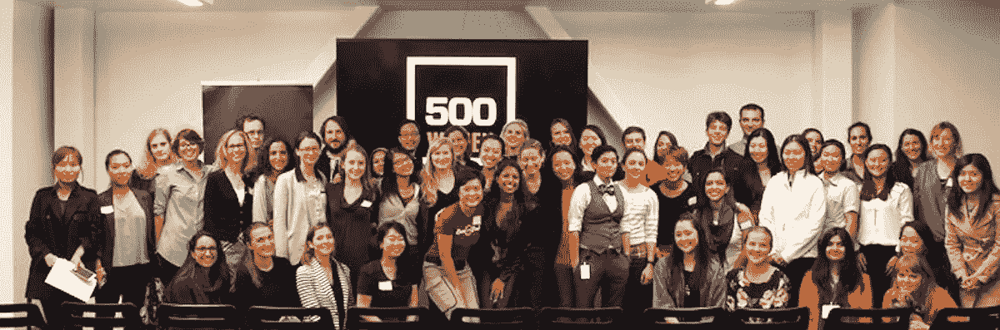

# 500 家创业公司如何在艰难时期支持我

> 原文：<https://medium.com/hackernoon/how-500-startups-stood-by-me-through-the-tough-times-c3e1f2584f43>

#500Women Event (photo credit: Women 2.0)

过去几周，听到那些勇敢的女性站出来分享她们被当权者性骚扰的故事，特别是在硅谷，真是令人心碎。

过去几周我一直保持沉默，因为我很愤怒、受伤和失望，尤其是当媒体提到的大多数当事人(被告、原告、告密者等)都是我的朋友时。由[克里斯汀·蔡](https://500.co/team/)和戴夫·麦克卢尔领导的 500 家初创公司是我的第一批投资者，从六年前我和我的公司成立以来，他们一直信任我和我的公司。我一直是 500 家创业公司的大力支持者，直到最近的事件，我都是 500 家创业公司的忠实支持者。最近的事件让我有了片刻的停顿，我犹豫是否要骄傲。

我现在平静多了，有机会消化过去几周的纷乱事件。我仍然是[# 500 骄傲的](https://twitter.com/search?f=tweets&q=%23500proud&src=typd)，为成为[# 500 家庭](https://twitter.com/search?f=tweets&vertical=default&q=%23500family&src=typd)的一员而骄傲，任何人都不应该在危机来临时抛弃他们的家庭。

创业 500 人不仅仅是一个人。500 Startups 是一个由充满激情的导师、投资者和创始人组成的地球村，他们聚集在一起试图改变世界。我所说的改变世界，也意味着支持少数族裔创始人、女性创始人、多元化包容以及在全球范围内扩大科技生态系统。

大约六年前，我创办了 [Love With Food](https://lovewithfood.com/) ，目标是为消费者和包装消费品(CPG)公司创建一个平台，消费者可以在这个平台上轻松发现更健康的零食，包装消费品公司可以接触到这些早期采用者，收集见解。我是一个独立创始人，我在 Ruby on Rails 上创建了这个网站，自己建立了这个品牌，六年前，没有人愿意资助我。超过 75 位投资者拒绝了我，一位女性风投甚至告诉我，我不是常春藤盟校毕业的，因此我永远不会得到资助。这是有人对我说过的最有歧视性的话。就在我快要放弃的时候，500 家初创公司给我开出了第一张支票，并在 2011 年末接受我(这位独立创始人)加入他们的加速器项目。

迄今为止，我已经筹集了近 500 万美元，但最让我自豪的是，我把对食物的爱带到了超过 25 个国家，并拥有像好时、雀巢、露娜酒吧等大型 CPG 公司作为我们的客户。没有 500 家创业公司，我不可能取得这样的成就。500 Startups 一直鼓励我，即使他们一直告诉我，我将很难筹集资金，因为我是女性，我是一个单独创始人，我是一个移民，我不是白人，我没有在美国受教育(我有一个来自新加坡的计算机科学学士学位)，等等等等。….我基本上检查了所有投资者倾向于回避的框！生活糟透了，从来都不公平。如果我必须比其他人更努力，那就来吧！对我来说，**每一个障碍都是机会**！

500 家创业公司在一开始给了我动力，多年来一直支持我，但最关键的是，即使在艰难时期，他们也继续给予**不懈的支持**。我遇到过我跌到谷底的时候，我遇到过我无法筹集资金的时候，我遇到过我没有选择的时候，500 家创业公司也在那里倾听、鼓励甚至领导融资轮，因为他们仍然对我有信心。像 500 Startups 和 [Kapor Capital](http://www.kaporcapital.com/) 这样的投资者愿意在情况变得艰难时卷起自己。

总之，我们不能让一个人的错误冲淡 500 Startup 的意义。如果你是一个正在阅读这篇文章的创始人，我真诚地希望你有像 500 家初创公司一样强大的投资者在极其艰难的时期支持你。如果不是 500 Startups 和 Christine Tsai 在那些艰难时期的不断支持，爱与食物不会在今天继续存在。当我跌到谷底的时候，500 家初创公司站在我身边，现在是时候在这些艰难的时刻，我对袖手旁观他们做同样的事情了。

为了改变硅谷，我们需要更多勇敢的女性站出来说话，幸运的是，许多人已经开始这样做了。然而，硅谷更迫切地需要像 500 Startups 这样的投资者，他们投资有才华的女性和具有不同背景的人。我们需要不受性别、种族和教育偏见蒙蔽的投资者，性别、种族和教育偏见阻碍了许多有才华的(女性)企业家，并剥夺了我们所有人在许多方面都将更加丰富的世界。

*图片来源:女性 2.0—*[*3 种方式 500 正在改变桌子的两边*](https://women2.com/stories/2015/02/13/500-changing-both-sides-table)