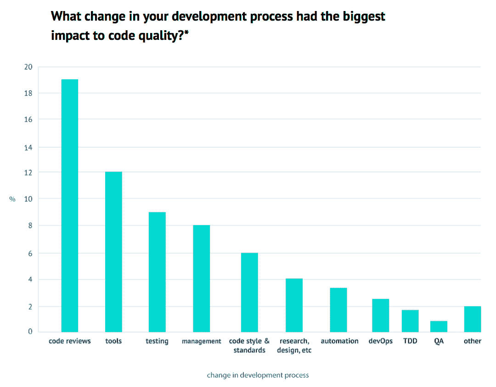
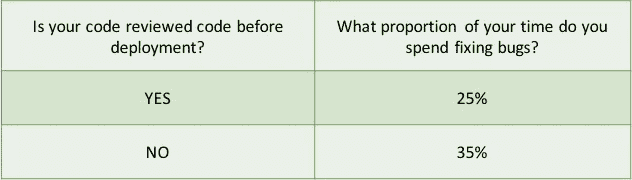
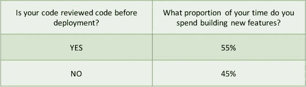
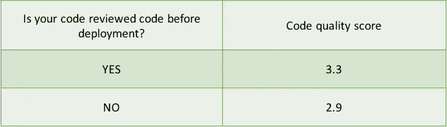
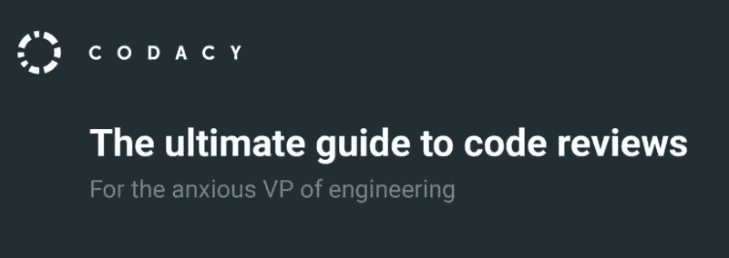

# 680 开发者如何说我们可以提高代码质量

> 原文：<https://medium.com/hackernoon/how-680-developers-say-we-can-increase-code-quality-339908809d19>

## **TL；博士**:我们最近调查了 680 多名开发人员，并在这里发布了第一套见解[。今天我们讨论一个特定的方面:对开发人员生产力的影响。我们发现代码评审在几个方面提高了代码质量和开发人员的生产率。](https://goo.gl/qLuLud)

> 披露: [**Codacy**](https://goo.gl/SvwMy7) ，自动化代码评审平台，之前赞助过黑客正午。对于《黑客正午》的读者来说，他们使用这个代码 [**提供 15%的折扣:HACKERNOON**](https://goo.gl/SvwMy7) **。**

# 第一步。确定提高代码质量的最重要的实践

人们普遍认为代码审查有许多好处。随便浏览一下涵盖代码审查主题的文献，就会发现它们有如下好处:

*   提高代码质量；
*   促进团队协作；
*   统一代码标准和代码风格；
*   在开发过程的早期识别 bugs
*   吸收新的开发人员，并在组织内传播最佳实践和知识。

然而，我们想将直觉与硬而冷的数字进行对比。

第一步是问一个开放性的问题:他们开发过程的什么变化对代码质量有最大的影响？开发者可以自由地提供他们想要的答案。然后，答案被贴上标签并分类，如下图所示。

***问题 1:你开发过程中的什么变化对代码质量影响最大？***

***结果:五分之一的回答者认为代码评审是提高代码质量的最重要的活动。***

在开发人员提供的所有答案中，代码评审是最普遍的答案，近五分之一(特别是 19%)的人认为代码评审是提高代码质量的最重要的活动。

# 第二步。衡量代码评审对开发人员生产力的影响

在审查代码所花费的时间和编写新特性所花费的时间之间有一个明显的平衡。所以我们问开发人员他们花在修复 bug 上的时间比例。

***问题 2:你花在修复 bug 上的时间占你时间的比例是多少？***

***结果:***

上表非常简单明了。如果你假设一周有 40 个小时，在部署前系统地审查代码的公司工作的开发人员每周花在修复 bug 上的时间会少 4 个小时。

但事情会变得更好。

因为硬币的另一面是修复 bug 节省的时间是否真正转化为更有趣、更有成效的东西——也就是说，构建新功能。所以我们问了以下问题:

***问题 3:你花在构建新功能上的时间比例是多少？***

***结果:***

事实证明，审查代码的人每周花 4.4 个小时来开发新功能(同样，假设每周 40 个小时)。

# 第三步。衡量代码评审对代码质量的影响

已经确定的是，对代码进行审查的开发人员最终会在构建新功能上多花 10%的时间，而在修复 bug 上少花 10%的时间，下一组问题与代码质量有关:代码审查有助于多大程度的改进？

为了找到答案，我们问了两个问题，从…

***问题 4:你如何评价你项目中的代码质量？***

在这里，我们直截了当地询问开发人员，他们如何评价他们项目的质量，从 1(非常差)到 5(非常好)。平均分数显示在下表中。

那些没有进行代码评审的人的平均分数低于中位数(即 3)，而那些进行了代码评审的人的平均质量分数高于中位数 3。这个代码质量分数显然是高度主观的，所以我们问了另一个问题:

***问题 5:维护代码需要更多的时间吗？***

这里的开发人员询问他们是否需要更多的时间来维护代码，并且只有可能的选项:是或否。结果如下:

无论代码是否被评审，一般来说，人们感觉需要更多的时间来评审代码(事实上，时间压力是开发人员报告的主要抱怨之一)。但同样，进行代码评审的人和不进行代码评审的人之间的差异是明显的:超过四分之三没有进行代码评审的开发人员认为他们需要更多的时间来维护代码，相比之下，进行了代码评审的开发人员中有 59%的人这样认为。

# 最后的想法

我们的研究证实了大多数开发者的直觉。它还补充了来自各种案例研究的见解，这些案例研究首先由麦康奈尔的“代码完成”书[报道。我们将从书中引用几段话来结束这篇博文:](https://hackernoon.com/tagged/book)

> “…软件测试本身的有效性有限——单元测试的平均缺陷检测率仅为 25 %,功能测试为 35 %,集成测试为 45%。相比之下，设计和代码检查的平均效率分别是 55%和 60%。审查结果的案例研究令人印象深刻:
> 
> *在一个软件维护组织中，在引入代码评审之前，55%的单行维护变更是错误的。在引入评论后，只有 2%的变化是错误的。当所有的改变都被考虑时，95%的人在引入评论后第一次是正确的。在引入评论之前，不到 20%的人第一次是正确的。
> 
> *在同一组人开发的 11 个程序中，前 5 个程序是在没有评审的情况下开发的。剩下的 6 个是带评论的。在所有的程序发布到产品中后，前 5 个程序平均每 100 行代码有 4.5 个错误。被检查的 6 个平均每 100 个中只有 0.82 个错误。评论减少了 80%以上的错误。
> 
> Aetna 保险公司通过检查发现了程序中 82%的错误，并减少了 20%的开发资源。
> 
> * IBM 的 500，000 line Orbit 项目使用了 11 级检查。它很早就交付了，只有正常预期的 1%的错误。
> 
> *对美国电话电报公司一个拥有 200 多人的组织的研究报告称，在该组织引入评审后，生产率提高了 14 %,缺陷减少了 90%。
> 
> * Jet Propulsion Laboratories 估计，通过在早期阶段发现并修复缺陷，每次检查可节省约 25，000 美元。"

# 进一步阅读

*   关于同行评议的七个事实(卡尔·e·威格斯)。[链接](http://www.processimpact.com/articles/seven_truths.html)。
*   代码完成。史蒂夫·麦康奈尔。[链接](https://www.amazon.co.uk/Code-Complete-Practical-Handbook-Construction/dp/0735619670)。
*   代码评审:只管去做。链接。编码恐怖。[链接](https://blog.codinghorror.com/code-reviews-just-do-it/)。

## 感谢阅读！如果你喜欢，点击下面的心形按钮:)

## 你也可以在我们关于代码评审的电子书中读到更多关于这一点和其他伟大的知识:

Click to get the ebook

这个故事最初发表在 Codacy 博客上:软件构建者的洞察力。