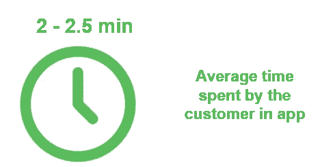
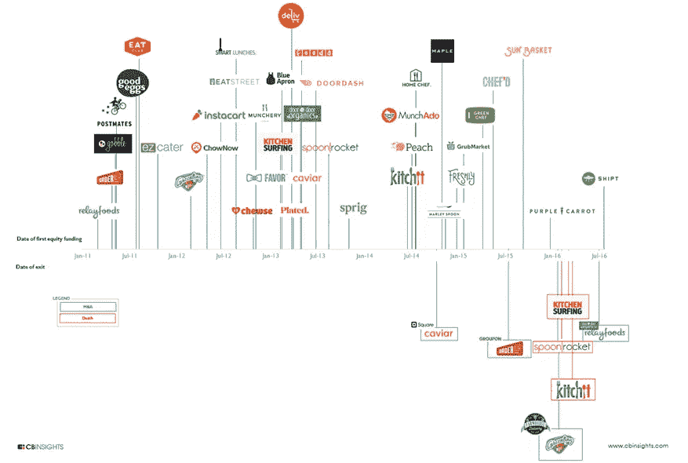

# 一个单一的功能如何最终把你吸引到 UberEats 和 Postmates 上

> 原文：<https://medium.com/hackernoon/how-a-single-feature-could-finally-hook-you-on-ubereats-and-postmates-d31244e0073e>

## 为什么即时团购是快乐顾客的解决方案

在过去的 5 年里，有超过 1800 份外卖送到了我的家门口，我意识到优步化的送餐行业缺少了一些东西。

我的炸薯条不仅仅是缺少蛋黄酱。

在这篇文章中，我将试着带你踏上一段超越这个行业的旅程。这是一个更令人兴奋的旅程，它是关于我们人类的，也是大量科技应用程序的意外目标。

为了表达我的观点，我在这篇文章中特别提到了我们很多人都知道的两个案例——Uber eats 和 Postmates。对于这个世界上的开门人、送货员和挑剔的人来说:同样有可能是你。

剧透提示:如果你太懒(像我一样)，跳到底部的结论。

我们生活在一个即时满足的世界里

打开应用程序，选择，确认，等待。咚咚，食物来了。

在这敲门声的背后，很可能是一个容易点燃的约会，你的洗衣店，或者如果你进入了一个危险的[商业](https://hackernoon.com/tagged/business)，海森堡。

结果是一样的:一个快乐的用户。

**我们因效率而繁荣……**

坐回去。有了科技，你现在有更多的时间。用它来工作或放松。

UberEats、Postmates、Deliveroo、Doordash、Caviar 和许多其他产品都是为了提供尽可能实用的体验。效率、最小化努力和速度。

**…但是还有更多:我们被可变的奖励所吸引**

人们喜欢惊喜。人们喜欢得到比他们期望的更多的东西——记住[→发起者创建团体订单后，对折扣的估计(其余。Disct + Deliv。Disct)来指示每个潜在的附加邻居。加盟邻居也能看到这些估计。](https://medium.com/u/295258f6269d#司机/订单)，解决高峰时间问题(高效交付)

<p id=)

[这里](https://medium.com/u/914088e570e#.m6889u68k)！

喜欢这本书吗？点击下面的❤推荐给其他感兴趣的读者！