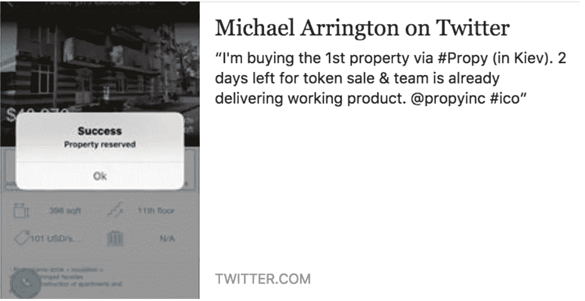
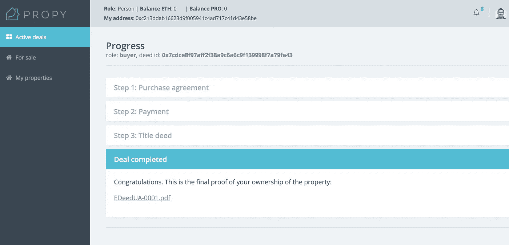
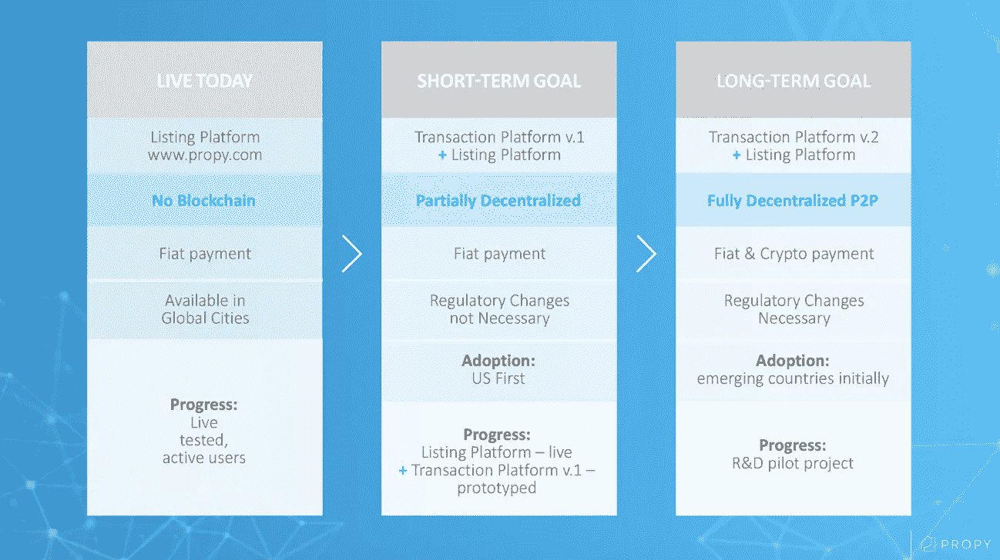
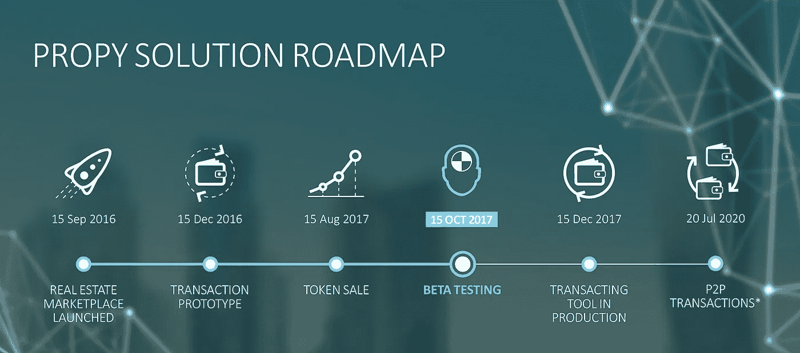

# 智能合同如何在一笔 6 万美元的交易中取代托管公司

> 原文：<https://medium.com/hackernoon/how-a-smart-contract-replaced-an-escrow-company-in-a-60k-deal-551ff7839044>

**乌克兰的家:区块链的第一笔房地产交易**

Propy 宣布完成了区块链[的第一笔房地产交易。这个家是乌克兰基辅的一套公寓，被美国人、TechCrunch 创始人迈克尔·阿灵顿买下。你可以在](https://hackernoon.com/tagged/blockchain)[华尔街日报](https://www.wsj.com/articles/an-entire-real-estate-deal-takes-place-online-using-cryptocurrency-technology-1506462545)、[、](https://www.newscientist.com/article/mg23631474-500-a-house-has-been-bought-on-the-blockchain-for-the-first-time/)新科学家[和](http://www.newsweek.com/blockchain-sell-real-estate-first-time-ethereum-682982)新闻周刊的文章中读到。

这是在我们的团队完成 PRO token 销售仅两周之后。虽然可以从二级市场[购买职业代币，但交易现已结束。](https://liqui.io/#/exchange/PRO_ETH)

Propy 的目标是自动化房地产交易的购买过程，这是不必要的复杂和不同的司法管辖区。区块链是产权等价值转移的完美技术。

第一笔交易是远程购买。今年早些时候，该团队开发了一个带有智能合同的[交易](https://hackernoon.com/tagged/transaction)平台，以执行在线购买，这里是[视频演示](https://www.youtube.com/watch?v=spmqS0FlRi8)。

在 8 月 10 日与他们的司法部签署了一份谅解备忘录后，该团队进一步开发了该产品，并迅速为乌克兰市场定制了该产品，从而帮助买方和卖方完成了该平台上的第一笔交易。你也可以在[新闻电讯](https://cointelegraph.com/news/ukraine-set-to-offer-blockchain-real-estate-to-foreign-investors)的文章中读到它。该房产的付款是通过智能合同支付的，也不是通过财产、公证、托管账户或卖方支付的。这可以在 EtherScan.io 上验证。一旦满足某些条件，即所有权在区块链上转移，然后在乌克兰土地注册处记录，资金就会分配给卖方。

以下是买方和卖方完成交易的详细步骤(买方一直在美国，卖方住在乌克兰，但在交易期间正在旅行):

1.  买家通过房源平台的[手机应用](https://itunes.apple.com/us/app/propy-buy-and-rent-properties-overseas-and-home/id1017369540?mt=8)搜索并预订了一处房产。

2.买方向一名乌克兰律师签署了一份委托书(POW ),代表他进行交易(这只是必要的，因为买方从未进入乌克兰；乌克兰表示，他们希望未来买家不再需要亲临乌克兰。

3.然后，买方和卖方使用其私钥*登录 Propy 交易平台(网站应用)和智能合约的数字钱包。需要这些密钥来签署发送到智能合同的每个步骤的交易。智能契约通过其身份服务验证密钥，以了解交易来自谁。如果密钥在交易平台上未被授权，则交易将不会被记录(交易是:如下所述的签署的协议、支付、公证批准)。

4.买方和卖方签署了一份购买协议，其中详细说明了财产和价格。智能合同中记录的交易，带有已签署购买协议的 PDF 散列。

5.买方收到智能合同的地址，将 212.5 ETH(销售时为 6 万美元)和 100 PROs 发送到该地址。

6.乌克兰的 POW 人员带着[智能合同地址](https://etherscan.io/address/0x7cdce8f97aff2f38a9c6a6c9f139998f7a79fa43)前往公证处，并在那里签署最终文件。乌克兰政府希望简化或取消这一步骤。

7.公证人使用其交易私钥登录系统(包括智能合同的数字钱包的交易平台),并标记交易已执行。交易细节连同智能合同地址[*https://ethers can . io/Address/0x 7 cdce 8 f 97 aff 2 f 38 a 9 c 6 a 6 c 9 f 139998 f 7 a 79 fa 43*](https://etherscan.io/address/0x7cdce8f97aff2f38a9c6a6c9f139998f7a79fa43)正在被立即发送到国家财产登记处。交易完成了。

第 5 步是该过程中非常重要的概念阶段，因为它允许智能合同扮演托管代理人的角色(而不是产权公司或公证人或经纪人或 Propy Inc .)。一旦交易条件被执行，资金被转移到卖方。智能合约的托管功能是区块链的基本特征，它能够解决“双重支出”问题:两个人不可能同时购买房产(这在现实世界中是可能的，但存在争议)。

卖家是加密爱好者马克·金斯伯格(Mark Ginsburg)，他是乌克兰知名的房地产开发商。找到一个愿意接受加密支付并通过 Propy 的智能合同处理购买的开发商是一件非常具有挑战性的事情。

智能契约是在满足条件的情况下执行特定操作的代码(作为一种普通的编程语言)。此外，从交易平台的每个步骤接收的元数据分布在区块链网络上。

现在所有的细节都存储在不可变的区块链和 Propy 的服务器上，如果发生任何索赔，这些链接到实际散列文件的记录将被视为法律证据。[地契](https://blog.propy.com/technical-overview-the-first-real-estate-deal-on-the-blockchain-18a34979403)以及如何从区块链提取交易数据在此描述:[https://blog . propy . com/technical-overview-The-first-real-estate-deal-on-The-The-区块链-18a34979403](https://blog.propy.com/technical-overview-the-first-real-estate-deal-on-the-blockchain-18a34979403)

乌克兰和其他国家现行立法范围内的第一批交易的目标之一是为政府确定建议，以便从立法和技术角度改进这一进程。这给这些国家带来了创新，也让房地产吸引了更多的外国房地产投资。一个全新的房地产投资者阶层正从秘密百万富翁中脱颖而出。Propy 的交易平台将是一个非常方便的平台，可以以美元和加密支付(BTC 和 ETH)等国家货币出售房产。卖家、经纪人和开发商现在可以在手机应用程序或网站上免费列出他们的房产。很快，在 PRO 中列出一处房产并向登记处记录房源数据将需要一笔费用。

根据酒店所在国家的现行法律(反洗钱政策)，酒店需要资金证明。根据财产估价/评估支付税款(这是未来智能合同中包含的一个步骤)。

该事务是开发短期目标内产品测试的一部分(见下图)。我们成功地比预期的更快地完成了支付。在北美和欧洲的几个司法管辖区，fiat 和 crypto 都计划进行下一次支付。我们正在集中寻找即将完成或愿意很快完成交易的现金/密码买家和卖家。

实现了属性路线图的第一个里程碑。Beta 测试提前在真实购买过程中执行(计划于 10 月 15 日)，随后将在乌克兰和美国进行更多测试和真实交易。部分去中心化的房产交易平台在现阶段对消费者、经纪人和政府都是非常有价值的。它对各方负责，为消费者节省时间和金钱，为政府标记交易时间。智能合同扮演了资金临时持有者的角色，不需要公证人或托管公司来做这件事，这为买方节省了资金。

虽然当前的解决方案是可扩展的，并且具有足够的价值主张，但我们作为区块链倡导者和工程师的团队，相信分散治理和 P2P 金融系统的不断发展的经济。这就是为什么我们将当前的解决方案视为实现实物资产 P2P 交易的第一步。这些财产将通过智能合同进行 P2P 交易，无需政府批准(在政府批准定制智能合同框架并接受 Propy 的分散所有权登记标准之后)。政府将不再需要信任公证人或有执照的托管公司和产权公司来持有和分配房地产交易的资金。政府将不再依赖脆弱的传统所有权记录数据库。政府将能够接收并保存交易数据，并将能够从智能合同中自动征收财产税，而不是从公证人或托管公司那里。一些发展中国家和全新的国家已经在积极地讨论这种方法。

* *买方和卖方需要两把私人钥匙(钱包)才能使用 Propy 交易平台:*

*1)交易密钥(钱包)，用于与契约智能合约交易，该私钥预先注册在属性身份服务中。此密钥是在登录操作期间导入到物业交易平台中的，使用大量以太网操作被认为不安全。*

*2)资产转移键(钱包)。此密钥已在智能契约中用交易密钥注册。契约智能合同仅从买方的资产钱包接受以太网，仅向卖方的资产钱包释放以太网。资产钱包私钥仍然是私有的，不为任何人所知。*