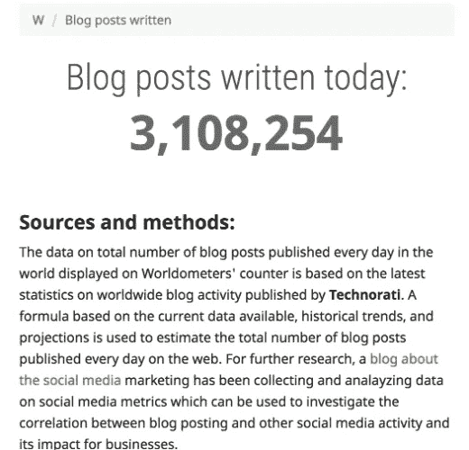
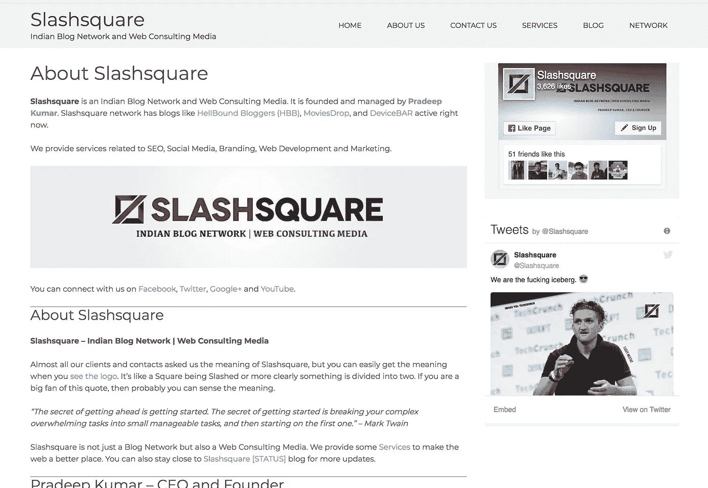
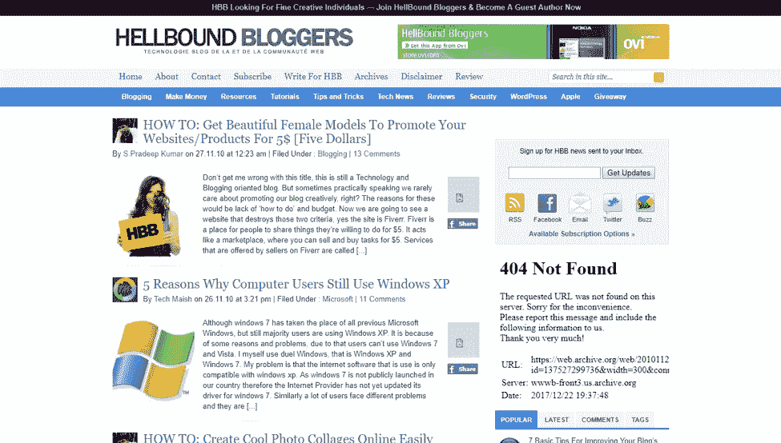
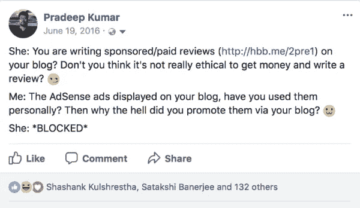
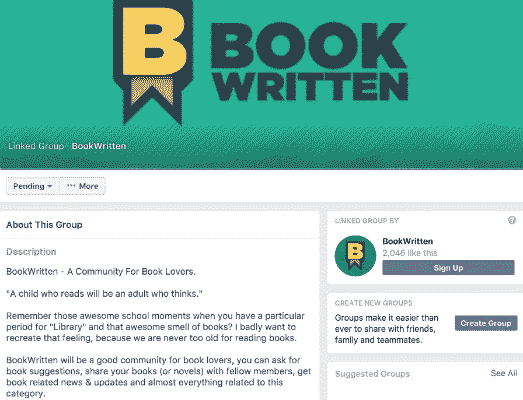
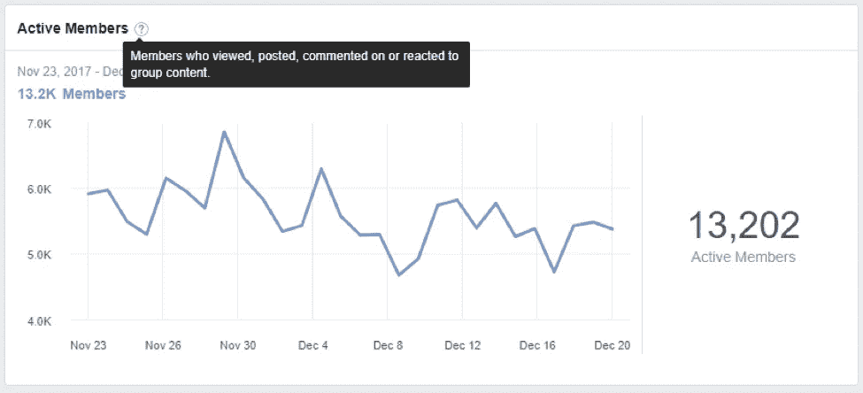

# 一个单枪匹马的创始人如何利用社交媒体建立一个成功的博客网络

> 原文：<https://medium.com/hackernoon/how-a-solo-founder-used-social-media-to-build-a-successful-blog-business-560bdd571e2>

## [推送面试](https://www.facebook.com/groups/Pushstarter) 06:

## 一个独立的创始人，[帕拉德普](https://pradeepkumars.com/)，如何利用社交媒体建立一个成功的博客网络， [Slashsquare](https://slashsquare.org/)

[https://unsplash.com](https://unsplash.com)

每天有超过 200 万个博客在 [**上被创建，更不用说整个互联网了。**](https://wordpress.com/activity/)

据 [**Worldometers**](http://www.worldometers.info/) 统计，这篇博文发表时这个数字是 300 多万。令人震惊，不是吗？

[http://www.worldometers.info/blogs/](http://www.worldometers.info/blogs/)

**你认为他们中有多少人成功创造了业务？**

在我们生活的这个时代，每两个人中就有一个是博客作者，区分和建立一个成功的博客网络变得很困难。

## **通读这篇采访就知道:**

> 帕拉德普如何在这个拥挤的博客圈中脱颖而出，并利用社交媒体建立一个成功的博客网络。

这是“[**push interview**](https://www.facebook.com/groups/Pushstarter/)**:帮你的面试**[**push start**](https://www.facebook.com/groups/Pushstarter/)**”**系列的第六期面试由 [**Pushstart**](https://www.facebook.com/groups/Pushstarter/) 提供动力。

如果你碰巧错过了我们之前关于“ [**我如何建立印度最活跃的创业社区之一**](https://hackernoon.com/how-i-built-the-most-active-startup-community-of-india-dfd83e8fe687) ”的采访，请查看一下。

 [## 我如何建立印度最活跃的创业社区之一

### 我从零到一建立创业社区的旅程

hackernoon.com](https://hackernoon.com/how-i-built-the-most-active-startup-community-of-india-dfd83e8fe687) 

# 你是🕴Who 吗？

嘿 [**Pushstarters**](https://www.facebook.com/groups/Pushstarter/) ！我是[帕拉德普·库马尔](https://pradeepkumars.com/)，一个来自钦奈的博客作者和网络营销者。我在 2012 年获得了计算机科学学士学位。

**Hey** [**Pushstarters**](https://www.facebook.com/groups/Pushstarter/) **!** [**Pradeep**](https://pradeepkumars.com/) **here**

学生时代开始写博客，大学毕业后以 [**Slashsquare**](https://slashsquare.org/) 为职业。

[**Slashsquare**](https://slashsquare.org/) 是一家网络咨询媒体和印度博客网。

# 🤔 [**Slashsquare**](https://slashsquare.org/) 是怎么回事？

> Slashsquare 是我大学时代的一个博客。

**The current version of** [**Slashsquare**](https://slashsquare.org/)

后来在旅途中，我把它注册为**[**Slashsquare**](https://slashsquare.org/)**Media Private Limited**，开始提供网络开发、电子商务设置、[社交媒体](https://hackernoon.com/tagged/social-media) [营销](https://hackernoon.com/tagged/marketing)和 SEO 等在线服务。**

## **目前，我们博客网络上有三个博客:**

## **[地狱般的博客(HBB)](https://hellboundbloggers.com/) :**

**我们在这里谈论博客、网络营销、社交媒体和其他相关话题。**

## **[电影掉落](https://moviesdrop.com/):**

**这是我们电影爱好者的门户网站，我们在这里讨论电影、电视剧和纪录片。**

## **[设备栏](https://devicebar.com/):**

**作为一个小工具迷，我创建了这个平台来联系那些喜欢谈论手机、电脑和电子产品的志同道合的人。**

**我们即将发布的博客包括 [**FoodGravy**](https://www.facebook.com/FoodGravy/) 和 [**BookWritten**](https://www.facebook.com/BookWritten/) 。我们将很快在 2018 年推出它们。敬请关注。**

# **💯是什么激励你开始 [Slashsquare](https://slashsquare.org/) ？**

**我在学生时代开始了我的第一个博客；我想是在第 11 或第 12 标准。**

**那时候我对博客一点概念都没有**。我刚刚在 Blogger.com 的****上注册，以为我的博客已经准备好了。********

****但是在这段时间里，我学到了很多关于博客的知识。我开始**写**和我的网友分享我的文章。慢慢地，我开始对写博客产生兴趣。****

> ****博客是分享你想法的媒介，但同时，它也是扭曲人类思想的武器。****

****[**HBB**](https://hellboundbloggers.com/) 是我的第一个官方博客。我决定写关于博客的东西，这样我就可以跟踪我正在学习的东西，也可以分享我的学习，以帮助其他类似的人开始写博客。****

****在旅程的后期，我意识到我不能把我的想法控制在一个单独的博客上，我需要扩大我想写博客的主题列表。****

****那时我想我应该创建一个名为 [**Slashsquare**](https://slashsquare.org/) 的**博客网络**，在一个共同的旗帜下推出不同类别的博客。****

> ****Slashsquare 就像一座连接所有博客的桥梁。****

# ****🛠:构建最初的产品都花了些什么？****

****我们的第一个产品是我们的博客— [**【地狱博客(HBB)**](https://hellboundbloggers.com/) 。****

****HBB 并不是真正的 HBB，当我创建第一个博客的时候，那应该是在 2007 年。我创建了“ **helpwithpcs** ”和“ **mailexpress** ”并在[**Blogger.com**](https://www.blogger.com)平台托管。****

****我记得我刚开始的时候这里有复制粘贴的东西。但是随着时间的推移，我学到了很多关于博客的东西。跟随[**shout cloud**](https://www.shoutmeloud.com/)和 [**百万线索**](https://millionclues.com/) 帮了我很多。从我的网上朋友那里收集反馈并与其他博客作者互动也是一种恩惠。****

****我开始适当地投稿。我决定用一个自定义域名，搬到****。**那时我把博客的名字改成了**[**hellboundbloggers.blogspot.com**](https://hellboundbloggers.com/)**。**********

************

********The initial version of** [**HellBound Bloggers (HBB)**](https://hellboundbloggers.com/)******

******我们从一个免费的虚拟主机服务开始了我们的旅程，因为我没有从我的博客中赚到任何钱。确切地说，我是在投资 [**浏览中心**](https://en.wikipedia.org/wiki/Internet_caf%C3%A9) 和 [**域名**](https://en.wikipedia.org/wiki/Domain_name) 。******

****最终，我得到了一个评论一个产品的机会，我也了解了赞助商的帖子。我慢慢明白了如何将我的博客货币化。****

****将近 10 年后，我们终于来了，3 个博客已经上线，2 个即将推出。我们现在的博客由 [**7Span**](https://7span.com/) 设计，托管在 [**Basezap**](https://www.basezap.com/) 上。****

# ****🤝你是怎么获得你的初始用户的？****

## ****我的 HBB 建设之旅:****

> ****开始 [HBB](https://hellboundbloggers.com/) 对我来说很容易，但是升级却很难。我不得不考虑所有可能的方法来在这个拥挤的博客世界中生存。****

## ******品牌:******

****[HBB](https://hellboundbloggers.com/) 只是博客圈中的另一个博客。它并不独特，也不突出。****

> ****因此，为了接触更多的人，最重要的是，让他们记住我们的博客，我们制作了我们的 **USP** 品牌。****

****你可以在任何地方使用品牌，从你博客的标志到网址。我们用了一个缩短的网址 [**hbb.me**](http://hbb.me) 。****

> ****你只需要让他们记住你一次，这就足够了。****

## ****社交媒体:****

****这是最容易接触到你的目标受众的渠道。利用**脸书页面&群组。******

> ****创建一个页面来推广你的品牌，创建一个小组来建立你的品牌。****

****感谢我们的脸书小组，我能够更好地了解脸书。****

****此外，尽量让内容更适合社交媒体。**“增加博客流量的 10 大技巧”不错，但“你现在可以做的 10 件事让你的流量翻倍”呢**？我这里说的不是 clickbait，只是合理的标题来证明内容。****

****如果你是 [**Twitter**](https://twitter.com) 的活跃用户，试着用 **#HBBTalk 或#HBBChat** 、**一个带有你品牌名称的标签**开始 Twitter 聊天。这是展示你的品牌和增加你的追随者基数的好方法。****

## ****搜索引擎优化:****

> ****关于 SEO 有一个根本性的误解:****
> 
> ****是的，你需要为搜索引擎优化你的文章，但在此之前，你需要为自己写作，然后为你的读者写作，然后为在线寻求解决方案的人写作，最后，为谷歌写作。****

****只有按照这个特定的顺序去做，才能分析出其他的关键因素，才能获得更多的有机流量。****

## ****投资:****

> ****如果你想每月赚 1000 美元，你需要每月至少投资 100 美元。没有投资，你得不到任何实质性的回报。****

****让他们成为 [**WordPress 插件**](https://hellboundbloggers.com/must-have-wp-plugins/4902/) 或者**在线工具**。确保你买了它们并正确使用它们。****

## ****公共关系(PR):****

> ****如果你有博客，那么你就是你博客的公关代理。努力打造你的个人品牌来影响你的博客表现。****

****无论你在社交媒体上发布什么，都会直接影响你的受众对你品牌的认知。所以，确保你在社交媒体上恰当地展示了你的品牌。****

********

******This is how I roll on Social Media******

## ****与其他博客作者交流:****

****在整个旅程中，我们与几位博客作者进行了交流。现在他们经常在文章中引用我们的话。这有助于产生**推荐流量**和增加 [**域名权限**](https://moz.com/learn/seo/domain-authority) **。******

## ****建立我们博客的读者群:****

> ****开始前找到你的听众:****
> 
> ****我们有这样的习惯，在发布博客之前，先创建我们的社交媒体档案。我们在社交媒体上建立我们的受众，分析他们的需求，然后启动我们的博客。****

****我们已经推出了一个**脸书组和页面**为我们即将到来的博客 [**写书**](https://www.facebook.com/BookWritten/) **。******

********

******Facebook Group and Page for our upcoming blog** [**BookWritten**](https://www.facebook.com/BookWritten/)****

****这样，找到他们的需求和喜欢的东西就变得容易多了。这就是我们如何策划我们的博客文章，慢慢地，一篇接一篇。****

> ****[Slashsquare](https://slashsquare.org/) 的博客网是他们喜欢的+我喜欢的组合。****

# ****💰你的商业模式是什么？****

> ****我开博客没有赚钱的意图。但是，当我决定这是我的全职职业时，我认真考虑了货币化，并准备了各种策略。****

****当我们开始的时候，没有合适的内容或流量，我们真的不想赚钱。****

> ****没有适当的内容或流量，用广告和评论轰炸你的博客是没有意义的。****

****所以，我们决定先围绕我们的博客建立一个权威和读者群，然后启用 [**谷歌站长**](https://en.wikipedia.org/wiki/AdSense) 。****

> ****Google AdSense 就是那些访问你的博客、浏览广告并点击它们的人。但是请记住，访问者的来源在这里起着重要的作用。****

****Google AdSense 帮助我们赚了不少钱。最终，我转向付费托管，开始雇人。****

****我们还试验了 [**亚马逊联盟**](https://affiliate-program.amazon.in/) 和其他 [**联盟项目**](https://www.shoutmeloud.com/what-is-affiliate-marketing.html) 如[**ShareASale**](https://www.shareasale.com/)**并把它们整合到我们的博客中。******

> ******我喜欢它的工作方式，整个推荐的事情。我以前一直有这样的想法:******
> 
> ******如果我通常免费做的事情得到了报酬怎么办？ [联盟营销](https://www.shoutmeloud.com/what-is-affiliate-marketing.html)就是这个问题的答案。******

******我们开始保留横幅和链接，并对它们进行优化，以获得良好的有机流量。最近在网络星期一的黑色星期五期间，我们确实有不错的转化率。******

******我们也为受欢迎的品牌做评论，并因传播消息而获得报酬。******

## ********我们的收入来源:********

## ******[Slashsquare](https://slashsquare.org/) (印度博客网):******

*   ********赞助/付费内容:**当其他品牌想要宣传他们的产品/服务时，他们会向我们寻求独家评论或封面故事。******
*   ****Google AdSense: 这不是一个很好的收入来源，但是当我们的文章被广泛传播时，我们可以期待一笔可观的收入。****
*   ****[**联盟营销**](https://www.shoutmeloud.com/what-is-affiliate-marketing.html) **:** 我们通过联盟营销推广我们的产品/服务，并获得报酬。****

## ****[**Slashsquare**](https://slashsquare.org/)**(网络咨询媒体):******

*   ******咨询:**当一个主要处于线下的品牌想要进军网络世界时，我们会在这个过程中为他们提供指导。无论是网站开发还是网络营销。****
*   ******电子商务:**我们帮助品牌建立电子商务门户。****

# ****💪作为一个 Solo 创始人，你是如何让自己保持动力的？****

> ****很难找到一个人对一件特定的事情有同样的想法和热情。****

****作为 solo 创始人，我尊重大家的意见和建议，但行政决定权和权利属于我；我只是做我认为完美的事情。当然，我在开始做事之前会做研究和分析，但这对我来说已经足够了。****

****我不会很快失去动力；我对解决方案很坚定。****

> ****从来都不是输赢的问题；无论如何都要做你自己。如果你每天都在进步和学习，那就没有必要泄气。****

# ****🏁你未来的目标是什么，你打算如何实现它们？****

****我们未来的目标是扩大 Slashsquare，让更多有着相似兴趣和激情的人受益。****

## ****这些是我们现在关注的事情:****

*   ******扩大我们的在线社区:**现在，我们的博客网络上有活跃的脸书小组和独立的博客论坛。我们将使它们更具互动性和知识性；我们计划吸纳各领域的专家，进行 ama，进行深入的案例研究，让整个空间更有吸引力。****
*   ******进军移动领域:**我们已经有了一个用于 [MoviesDrop](https://moviesdrop.com/) 的 **Android 应用**，我们正计划为 [BookWritten](https://www.facebook.com/BookWritten/) 和 [FoodGravy](https://www.facebook.com/FoodGravy/) 做同样的事情。很快我们也将推出 iOS 版本。我们的目标是让这款应用更加***有用*** ，这样无论如何它都会留在用户的手机上。我们正在全网进行调查，以使我们的应用程序尽可能有针对性。****
*   ******跳转到 YouTube:** 这是我们还没有正确实现的东西。尽管我有一个 YouTube 频道，并在 2009 年上传了我的第一个视频，但我没有继续下去。看到视频让我们的生活变得更加轻松，我们决定尽快抓住这个机会，并充分利用它。我们将很快推出我们的频道。与传统的博客不同，视频创作需要时间和耐心，但这个过程是值得的。****

# ****🌋到目前为止，你面临的最大挑战是什么？****

****到目前为止，我面临的最大挑战是建立一个活跃的在线社区。我们已经做了很多实验，但最终都不令人满意。****

****我们对脸书小组和博客论坛的运行方式很满意，但这就足够了吗？****

## ****是什么让一个社区成功？****

> ****一个繁荣的社区不应该需要任何形式的节制。不管怎样，它都会照顾好自己的。****
> 
> ****如果出了问题，其他成员应该处理违规行为，并防止将来再次发生。****

****有一个 [**TED 演讲**](https://www.ted.com/talks) 题目是 [**“群体如何做出好的决策？”**](https://www.ted.com/talks/mariano_sigman_and_dan_ariely_how_can_groups_make_good_decisions) ，我请求大家看到这个视频，了解一个社区的好处和美好。****

****现在，在我们的 [**地狱般的博客(HBB)脸书群**](https://www.facebook.com/groups/HellBoundBloggers.HBB/) 中，我们有大约 **17k 名成员**，这些是我们过去 28 天的统计数据:****

********

******Engagement stats from the past 28 days******

****虽然这是一个不错的数字，但我们正在尝试以下方法来进一步扩大其规模:****

*   ******多问:**这是一个心理学上已经证明的方法，因为，**“？”**引发人们思考。如果他们能想到一些东西，并想分享，他们中的大多数人可能会这样做。****
*   ******发放赠品:**我们已经列出了想要关注的事情。这不是为了让他们更积极，更像是为了回报社区的努力。****

# ****🗒，你对起跑有什么建议？****

> ****你的创业公司就像一个刚出生的婴儿；你不能把头发梳好，穿上校服，让他/她学习，然后期望宝宝在 100 分中得 100 分。****

****慢慢来，不要因为想快点尝到成功的滋味而加快这个过程，把它当成一个学习或分享的过程，我相信你很快就会到达你的终点。****

# ****✉️:我们怎样才能和你联系上？****

****可以联系我**@**[**Linkedin**](https://www.linkedin.com/in/spradeepkr/)**，** [**脸书**](https://www.facebook.com/SPradeepKr) **，**[**Twitter**](https://twitter.com/spradeepkr)**或者**[**insta gram**](https://instagram.com/spradeepkr)**。******

****我也定期写博客@ [**帕拉德普·库马尔**](https://pradeepkumars.com/) **。******

## ****非常感谢你的阅读！如果你喜欢，请鼓掌支持👏🏻还有分享帖子。请随意发表评论💬下面。****

## ****想成为印度最活跃的创业社区的一员吗？****

*****发送请求上* [***推送开始***](https://www.pushstart.in/join-network-community) *成为我们不断壮大的大家庭的一部分。*****

*****嘿！Neeraj 这里，* [***的创始人，Pushstart***](http://pushstart.in/feed) *，印度最活跃的企业家群体。我每周都会发布对成功企业家的采访。**[***脸书***](https://www.facebook.com/jneeraj0807)***|***[***Linkedin***](https://www.linkedin.com/in/jneeraj0807)***| neeraj . Joshi @ pushstart . in |***[***Twitter***](https://twitter.com/jneeraj0807)【*****