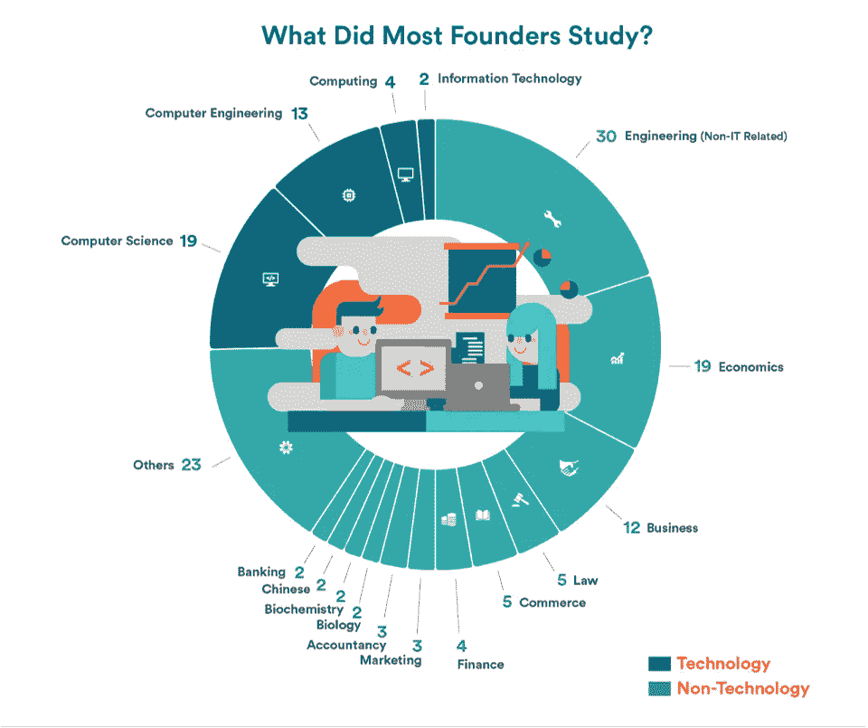
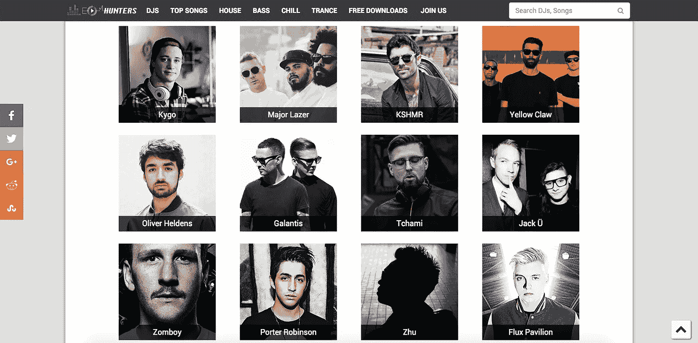
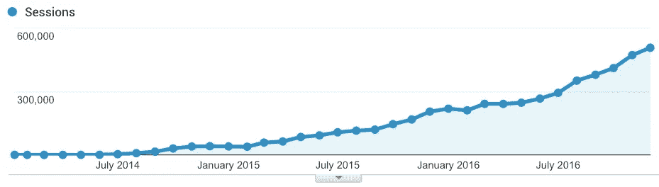

# 一个单枪匹马的非技术型创始人如何学习编码并建立一个成功的科技创业公司

> 原文：<https://medium.com/hackernoon/how-a-solo-non-technical-founder-learned-to-code-and-built-a-successful-tech-startup-657a1a3332e2>

## [推送面试](https://www.facebook.com/groups/Pushstarter) 05:

## 一个单干的非技术型创始人如何学习编码和构建的旅程 [EDM Hunters](https://www.edmhunters.com/)

[https://unsplash.com](https://unsplash.com)

在我们生活的 21 世纪，每当我们谈论一家科技[初创公司](https://hackernoon.com/tagged/startup)，首先想到的往往是“编码”。那么，一个非技术出身的创始人有可能建立一个成功的科技创业公司吗？

***如果你是非技术型创始人，不要灰心。历史说，是的，当然！***

Credits: iPrice

[布莱恩·切斯基](https://medium.com/u/bb249e5e0d1b?source=post_page-----657a1a3332e2--------------------------------)(AirBnB 的创始人)[瑞安·胡佛](https://medium.com/u/c2146664c8e4?source=post_page-----657a1a3332e2--------------------------------)([Product Hunt](https://medium.com/u/b8b4445269d0?source=post_page-----657a1a3332e2--------------------------------)的创始人)和肖恩·拉德 [Tinder](https://medium.com/u/48636050d182?source=post_page-----657a1a3332e2--------------------------------) 的创始人)都是非技术型的创始人，他们创建了一些最成功的科技创业公司。

但是他们是如何成功的呢？通读这篇采访就知道:

> “一个单枪匹马的非技术型创始人[贾斯卡兰](https://www.linkedin.com/in/jaskaranrana/)是如何学习编码并建立一个成功的科技创业公司的”

这是“[**push interview**](https://www.facebook.com/groups/Pushstarter/)**:帮你的面试**[**push start**](https://www.facebook.com/groups/Pushstarter/)**”**系列的第五期面试。

如果你碰巧错过了我们之前关于“ [**我如何建立印度最活跃的创业社区之一**](https://hackernoon.com/how-i-built-the-most-active-startup-community-of-india-dfd83e8fe687) ”的采访，请查看一下。

 [## 我如何建立印度最活跃的创业社区之一

### 我从零到一建立创业社区的旅程

hackernoon.com](https://hackernoon.com/how-i-built-the-most-active-startup-community-of-india-dfd83e8fe687) 

# 你是🕴Who 吗？

**I am the one wearing the black t-shirt**

嗨 [**Pushstarters**](https://www.facebook.com/groups/Pushstarter/) ！我是[贾斯卡兰·拉纳](https://www.linkedin.com/in/jaskaranrana/)，一个 25 岁的[音乐爱好者](https://hackernoon.com/tagged/music)，一个来自印度的非技术出身的程序员。我于 2014 年毕业于马尼拉理工学院。

我在大学最后一年独自创建了一家电子音乐探索公司 [**EDM Hunters**](https://www.edmhunters.com/) 。

大学毕业后，我在 [**BuyingIQ**](https://www.buyingiq.com/) 和 [**CollegeDekho**](https://www.collegedekho.com/) 工作了大约 3 年，最终在 2017 年 2 月辞职，全职从事 [EDM Hunters](https://www.edmhunters.com/) 的工作。

与这些初创公司一起工作极大地帮助我磨练了我的技术技能，并获得了从零开始建立一家科技初创公司背后的关键洞察力。

# 🤔**[电火花猎人](https://www.edmhunters.com/) **怎么回事？****

> **EDM Hunters 是出于我对电子音乐的热爱而诞生的一个激情项目。**

****

****The current version of** [**EDM Hunters**](https://www.edmhunters.com/)**

**[EDM Hunters](https://www.edmhunters.com/) 是为像我这样的[舞曲](https://en.wikipedia.org/wiki/Electronic_dance_music)爱好者打造的，以获取电子音乐的日常修复。 [EDM Hunters](https://www.edmhunters.com/) 目前由我单独开发运行。**

**我对电子舞曲充满热情，早在 2014 年的大学时代，我就开始制作 [EDM Hunters](https://www.edmhunters.com/) 。**

**它开始的目的是帮助新老听众发现最好的和最新的电子音乐歌曲。**

> **我相信，在支持新的和未被发现的人才时，社区会战胜算法和专家。**

**这就是为什么在 [EDM Hunters](https://www.edmhunters.com/) 上，是社区决定了顶级歌曲。**

**您可以浏览各种音乐排行榜，根据艺术家、流派、DJ、月份和年份来发现热门歌曲，所有这些都是根据喜欢、播放次数和下载量编制的。**

# **💯是什么激励你开始 [EDM Hunters](https://www.edmhunters.com/) ？**

> **我构建 [EDM Hunters](https://www.edmhunters.com/) 的动机是将我所有的“如何编码”的学习整合到一个真实的项目中，同时构建一个我个人喜欢使用的产品。**

**回到大学，我开始听电子音乐，并立即迷上了。**

**[EDM](https://en.wikipedia.org/wiki/Electronic_dance_music) 当时刚刚开始走红，进入主流乐坛。作为一个狂热的电子音乐迷，我对缺乏可以发现自己喜欢的电子音乐的媒介感到不满。**

**没有一站式的解决方案来帮助我在一个地方发现这种音乐。**

**于是， [EDM 猎人](https://www.edmhunters.com/)就为解决这个问题而诞生了。**

# **🛠:构建最初的产品都花了些什么？**

**给你一点背景知识，在我的大学里，我在学术上不是一个聪明的学生。**

**虽然我的专业是计算机科学，但直到最后一年我才知道如何编程。我的平均绩点是 5.0，勉强通过考试。出现这种情况的主要原因是这门课的教学方式。**

> **印度的教育体系更注重死记硬背，而不是实践学习。过了一点，注意力就变得很难集中了。**

**为了学习编码，我决定尝试一下在线课程。 [**Codecademy**](https://www.codecademy.com/) 在初期给了我很大的帮助。**

**我在 6 个月的时间里学会了[**Python**](https://www.codecademy.com/learn/learn-python)[**JavaScript**](https://www.codecademy.com/learn/introduction-to-javascript)[**jQuery**](https://www.codecademy.com/learn/learn-jquery)[**HTML/CSS**](https://www.codecademy.com/en/tracks/web)。接下来，我决定学习基于 [**Python**](https://www.codecademy.com/learn/learn-python) 的 web 框架 [**Django**](https://www.djangoproject.com/) 。**

**我在大学的最后一年开始制作 EDM Hunters。我过去常常在课后和周末从事这项工作。**

**我在 3 个月内完成了基本原型，并在 2014 年 1 月推出了初始版本。**

## **这就是 [**电火花猎人**](https://www.edmhunters.com/) **看着初始阶段:****

****

****The initial version of** [**EDM Hunters**](https://www.edmhunters.com/)**

**发布后，我继续迭代网站的设计和功能。启动这个网站并没有花很多钱。首先，唯一的相关成本是托管它。**

**既然我决定用一个 [**VPS**](https://en.wikipedia.org/wiki/Virtual_private_server) ，那原来是蛮便宜的。**

## **我经常被问到这个问题:你的歌曲是怎么来的？**

**我用 3 个不同的来源来创作歌曲。我的主要来源是 [**Beatport**](https://www.beatport.com/) ，这是一家电子音乐商店。我用他们的 [**API**](https://www.youtube.com/watch?v=s7wmiS2mSXY) 获取某个特定艺人的所有歌曲。他们还为我提供了每首歌曲的 2 分钟试听。**

**另一个来源是 [**SoundCloud**](https://soundcloud.com/) ，艺术家上传自己的歌曲。我用他们的 [API](https://www.youtube.com/watch?v=s7wmiS2mSXY) 来播放歌曲。我使用 [**YouTube API**](https://en.wikipedia.org/wiki/YouTube_API) 来播放视频。**

> **请记住，我学习编码是因为我非常热衷于解决问题。**

# **🤝你是怎么获得你的初始用户的？**

**流量的增长相当惊人。说实话，刚推出 [EDM Hunters](https://www.edmhunters.com/) 的时候，没想到会长到现在这么大。**

***在最初的 6 个月里，流量几乎不存在，每月只有不到 1000 名访客。***

**然而，在我得到第一份工作后，我开始每天学习新的东西。每当我学到一些相关的新东西，并可以整合到我自己的网站，我就在当天晚上这样做。**

**我也开始大量研究 [**SEO**](https://searchengineland.com/guide/what-is-seo) 。**

> **与许多人认为的相反，SEO 没有秘方。这只是建立一个具有良好用户体验的网站，同时使其易于被机器人索引和搜索。**

## ****一些**[**SEO**](https://searchengineland.com/guide/what-is-seo)**的招数，帮了我:****

*   **尽量从其他相关高质量的网站获取反向链接。**
*   **确保更快的加载时间。**
*   **确保你的网站是手机友好的，并对此进行彻底的测试。**
*   **保持网站内容的独特性和相关性。**
*   **给每一页起一个相关且独特的标题。在描述目的的每个页面中添加一个元描述。**
*   **使用[**schema.org**](http://schema.org/)标记你的网站，如果可以的话，显示丰富的片段。**
*   **为你的网站建立一个网站地图，并使用谷歌网站管理员工具[**提交。**](https://blog.kissmetrics.com/beginners-guide-to-google-webmaster-tools/)**
*   **正确使用 HTML**(**[**)标签，标题，图片上的 alt 属性**](https://yoast.com/image-seo-alt-tag-and-title-tag-optimization/) **)** 。**
*   **尽量在 URL 中使用相关关键词。**

****

**Growth in traffic from 2014 to 2016**

***目前，该网站每月的访问量超过 50 万次，85%的流量是有机流量，并且每月以 20%的速度增长。***

> **SEO 一直是 [**EDM 猎人**](https://www.edmhunters.com/) 成长背后的主要驱动力。对我来说，更多的是确定有足够流量的正确关键词，并围绕它们开发产品。**

**如果我不得不归因于增长的另一个原因，那将是良好的媒体报道。我试图让各种博客报道这个消息，试图让这个消息传出去。**

**我很幸运地出现在一些著名的博客中，如 [**【你的故事】**](https://yourstory.com/2015/03/jaskaran-edm-hunters/)**[**indiechakers**](https://www.indiehackers.com/businesses/edm-hunters)**[**国产**](https://homegrown.co.in/article/43913/stories-of-12-young-indians-who-are-leading-double-lives-duality-vol-iii/) **和**[**my venture**](https://myventure.in/discover-the-top-edm-songs-of-the-town-through-this-music-based-startup/)。最近，它还出现在了 [**代码学院**](https://vimeo.com/238951154) 的宣传视频中。******

> ******到目前为止，增长一直是有机的，SEO 贡献了其中的大部分。******

# ******💰你的商业模式是什么？******

> ******我并没有带着“商业模式”的想法开始 EDM Hunters。我开始它是因为我对电子音乐的热情和热爱。******

******目前，主要的收入来源是广告。我是从 [**谷歌站长**](https://en.wikipedia.org/wiki/AdSense)**起家的，最著名的广告网络之一。********

> ********使用了一段时间后，我意识到它没有潜力提供可观的收入，因为广告与我的用户并不真正相关。********

********我决定整合一些主要关注音乐的利基广告网络。我目前正在我的网站上使用 [**Wavo Boost 广告网**](https://wavo.me/) 和 [**Feature.fm**](http://www.feature.fm/home/) 。这些为用户提供了更好的价值，现在是我广告收入的主要部分。********

## ********这些广告网络的当前平均收入:********

*********左右 Rs。8 万卢比。每月 100k*********

******收益和流量成正比。所以流量增加导致收入增加。******

******我也开始在我的网站上使用赞助列表来推广未来的艺术家和唱片公司。有各种计划可供选择，从 10 美元到 300 美元不等。******

## ********从这些区间赚到的钱在:********

*********Rs。15k 到 Rs。每月 50k*********

******在未来的时间里，我将致力于建立一个更加稳定和具体的赞助商列表网络。******

# ******💪作为一名 Solo 创始人，你如何让自己保持动力？******

******做一个独立的创始人绝对不是一件容易的事情。很容易失去动力，继续拖延。******

******但我想真正激励我的是原因。因为我对我正在开发的产品充满热情，所以我想用最好的方式来开发它。******

> ******从正确的角度来看，痴迷可以成为一种很好的动力。******

## ******不过，单飞创业者还可以尝试很多其他事情:******

******试着和其他企业家、程序员或设计师在一起。******

******你也可以尝试在一个共同工作的空间里工作，在那里你可以找到志同道合的人，尤其是那些可以和你交流想法的人。******

# ******🏁你未来的目标是什么，你打算如何实现它们？******

******我刚刚为 [EDM Hunters](https://www.edmhunters.com/) 发布了一个改进的 UI。为 EDM 猎人创建一个移动应用程序已经在我的脑海里有一段时间了。我一直在学习 [**React Native**](https://facebook.github.io/react-native/docs/tutorial.html) ，并将使用它来构建适用于 [iOS](https://en.wikipedia.org/wiki/IOS) 和 [Android](https://en.wikipedia.org/wiki/Android_(operating_system)) 的应用。******

******我计划建立一个具体的赞助列表网络，这将有助于崭露头角的艺术家与主流艺术家一起获得知名度。******

******此外，我将专注于建立一个强大的社会存在以及稳定的有机增长。******

******我还有一大堆其他的计划要做。我将建立一个针对音乐制作人和创作者的产品。我还计划在印度推出一个关于现场演出的项目。******

******我想未来会有一些激动人心的时刻，保持警惕，伙计们！******

# ******🌋到目前为止，你面临的最大挑战是什么？******

******像任何其他非技术型创始人一样，我开始学习编码的最初阶段对我来说是最艰难的。******

******决定自己建立一个完整的网站，从前端到后端，并能够想象所有的东西如何连接和作为一个整体一起工作，这在一开始是相当具有挑战性的。******

******我得到了几个程序员朋友的帮助，这是一个很大的优势。对于其他任何事情，我总是有互联网在我的支配下。******

> ******你所需要的是完全的奉献。如果你准备好付出努力，最终一定会有收获。******

# ******🗒，你对创业有什么建议？******

> ******事情一开始可能看起来很复杂，但不要被吓倒。每个人都从同一个地方出发。******

*   ********特别是对于非技术型的创业者:**从小项目开始，试着弄清楚你的基础知识。******
*   ******这有时会令人生畏，但关键是不要放弃。没有什么比看着你想要的东西变成现实更令人满意的了。******
*   ******试着在刚起步的公司找一份实习/工作。创业公司总是在寻找有相关技能的热心人。这是获得一些现场经验的最好方法。******
*   ******准备好失败。并不是所有的创业想法都会成为下一件大事。为了事业成功，你必须做好失败的准备。******

> ******关键在于你有多大的热情去解决问题，而不是知道“如何编码”。******

# ******✉️:我们怎样才能和你联系上？******

******可以在**[**Linkedin**](https://www.linkedin.com/in/jaskaranrana/)**，** [**脸书**](https://www.facebook.com/jaskaran.rana) **或者**[**info@edmhunters.com**](mailto:info@edmhunters.com)**上联系我**。************

## ****非常感谢你的阅读！如果你喜欢，请鼓掌支持👏🏻还有分享帖子。请随意发表评论💬下面。****

## ****想成为印度最活跃的创业社区的一员吗？****

*****在* [***上发送请求 Pushstart***](https://www.pushstart.in/join-network-community) *并成为我们不断壮大的大家庭的一员。*****

*****嘿！这里的 Neeraj 是*[***Pushstart***](http://pushstart.in/feed)*的创始人，印度最活跃的企业家社区。我每周都会发布对成功企业家的采访。* ***随时联系我*** [***脸书***](https://www.facebook.com/jneeraj0807)***|***[***Linkedin***](https://www.linkedin.com/in/jneeraj0807)***| neeraj . Joshi @ pushstart . in |***[***Twitter***](https://twitter.com/jneeraj0807)****