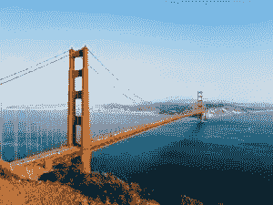

# 一个学生如何在优步工作、宿舍基金和他自己的企业中加速学习

> 原文：<https://medium.com/hackernoon/how-a-student-accelerated-his-learning-working-at-uber-dorm-room-fund-and-his-own-venture-eab128772b23>

## 采访大卫·昂乔科

学会学习是一项非常有价值的技能，每个人掌握它的方式都不一样。我们中的一些人在教室里“学会学习”，研究复杂的数学方程。其他人在身体挑战中表现最佳，获得克服逆境所需的精神韧性。

对大卫的采访说明了这样一个观点，你可以在任何地方，从任何人那里学习，只要你愿意努力工作，并有乐观的态度。

# 嘿大卫！感谢您花时间分享。

# 介绍一下自己！告诉我们你在哪里上学，在哪里工作，现在在做什么。

我是 [**大卫·昂乔科**](http://www.davidongchoco.com/) ，宾夕法尼亚大学**的大四学生，学习认知科学&计算机科学。在来美国上大学之前，我在菲律宾出生并长大。此前，我曾在菲律宾的一家股票经纪公司、新加坡的一家创业加速器、 [**优步菲律宾**](https://www.uber.com/) 、各种媒体出版物工作，并在一家名为 [**宿舍基金**](http://dormroomfund.com/) 的学生管理的风险投资公司工作。在过去的三年里，我还花了很多时间在一个我在菲律宾创办的非营利组织上工作，这个组织叫做 [**YouthHack**](http://youthhack.net/) 。自从 YouthHack 成立以来，我们已经将组织扩展到 8 个国家。**

**今天，我专注于确保 YouthHack 成为一个可持续发展的组织，通过宿舍基金帮助学生创始人，最后，通过我的新创业公司在美国和菲律宾之间架起桥梁。**

# **你来自菲律宾。向美国的转变如何？你从这里的文化中学到了什么让你吃惊的东西，你认为你独特的视角如何帮助你看待事物？**

**出人意料的是，向美国的转变并没有那么困难。虽然在我大一的时候，试图弄清楚我想用我的时间做什么最初有点挑战，但我个人很喜欢美国大学给学生的自由。虽然我最初对非常开放和直接的文化感到惊讶，但我已经习惯了，并学会了如何在必要时直言不讳。**

****

**我真正喜欢美国的一点是，很多人不害怕大胆梦想，而且有一种鼓舞人心的乐观情绪，尤其是在旧金山这样的地方。来自菲律宾给了我一个独特的视角，让我对美国的进步有了更好的理解。我还能够从更全球化的角度思考，看看美国的潜在解决方案如何能被带到菲律宾，反之亦然。**

# **你在学校学什么？有没有在现实世界中有帮助的课？如果不是，你从哪里学到了在工作中最有帮助的东西？**

**我学习认知科学和计算机科学，但我也涉猎过 20 个不同系的课程。接触各种题材和思维方式确实在现实世界中帮助了我。例如，有一个学期我上了 3 门美术课，这 3 门美术课真的教会了我很多关于设计、留白和 photoshop 的知识。另一个例子是我上的心理学课，它真的帮助我更好地理解了是什么激励了人们，是什么让人们进步。最后，我认为所有更难的技术计算机科学课程都教会了我如何思考，以及如何从各种角度处理问题。**

> **我所学到的对工作最有帮助的大部分东西都来自于做各种兼职项目**

**说了这么多，我学到的在工作中最有帮助的大部分东西都来自于做各种兼职项目和从零开始打造 YouthHack。通过与来自世界各地的各种团队成员一起工作，我学到了很多东西。我非常相信和比你聪明的人在一起，然后向他们学习。**

> **我非常相信与比你聪明的人在一起，然后向他们学习。**

## **阅读我们的⭐️ [冷邮件指南](http://bit.ly/studenthustleguide)**

# **关于去常春藤盟校最大的误解是什么？去宾大有什么坏处？**

**我对去常春藤盟校的最大误解是，这些课程并不能真正让一所学校变得伟大。课还是课，我认识的大多数聪明人之所以聪明，不是因为课的质量，而是因为他们内心的驱动力和好奇心。我意识到常春藤盟校的独特之处在于你周围的人。我个人从同龄人身上学到的东西比我在宾夕法尼亚大学上过的任何一门课都要多。**

> **有一种很强的压力去追随其他人在做什么，并在这个过程中迷失自己。**

**就去宾夕法尼亚大学的缺点而言，我会说有时会有一种很强的压力去追随其他人在做什么，并在这个过程中迷失自己。**

# **你在学校时是如何涉足风险投资的？体验如何，你会推荐给其他人吗？到目前为止你学到了什么？**

**在来宾夕法尼亚大学之前，我读了很多关于创业场景的书，并偶然发现了宿舍基金。我记得在我大一之前去宾夕法尼亚大学的时候，我联系了他们资助的第一批创始人之一，和他一起喝咖啡。从那以后，我在大学一年级就投身于创业领域，最终申请了宿舍基金，并幸运地在大二的春季学期被录取。**

****

**成为宿舍基金的一员绝对是我在宾大最有收获的经历之一。我个人喜欢和创业者一起工作，帮助他们将愿景变成现实。我强烈推荐给那些想帮助学生创业者的学生，以及那些想更多地了解风险投资意味着什么的学生。**

**就经验而言，我从看到我们年长的 MBA 团队成员如何评估初创公司中学到了很多，同时，我也学到了视角的重要性，以及为什么多元化的团队对做出好的投资很重要。最后，我明白了风险投资的价值不仅在于我们提供的资金，还在于成为这些试图颠覆庞大产业的学生创业者的最大支持者。**

# **在优步工作的感觉如何？与美国的创业生活相比如何？**

**作为一名分析实习生在优步马尼拉工作是一次非常棒的学习经历。我真的很喜欢解决难题，利用数据推动决策，与真正鼓舞人心的同事和实习生一起工作(你可以在这里 阅读更多我学到的经验 [**)。我强烈建议学生在优化成长和学习时考虑加入像优步这样的火箭飞船。**](http://www.huffingtonpost.com/david-ongchoco/lessons-from-my-internshi_b_11756604.html)**

**我认为优步马尼拉是非常独特的，因为我们在菲律宾有一个 15 人的城市团队(当我在那里实习的时候),他们有一个价值 10 亿美元的技术公司的支持和资源。这给了我两个世界最好的东西，让我在快速前进的同时仍然得到了很多支持，所以很难将它与我在美国迄今为止的任何经历相比较。**

# **谈论建立你的个人品牌。从哪里开始？**

**我认为建立你的个人品牌有三件重要的事情:首先是选择一个你想经营并出名的利基市场。其次是保持一致，因为建立个人品牌需要很长时间。第三是坚持不懈地追求每一个机会，尤其是在早期。**

> **在你感兴趣的领域开一个博客是建立你个人品牌的好方法。**

**就具体的行动步骤而言，通过在你感兴趣的特定领域开设博客来建立你的在线形象，是开始建立你的个人品牌的一个很好的方式。**

# **你以前也写了很多东西。你能分享一下你是如何开始的吗，你从这个过程中学到了什么，为什么你不再经常写信了？**

**在我的前交叉韧带撕裂，突然不能打篮球，因此有很多空闲时间后，我开始回到高中。我从一个个人 WordPress 博客开始，最终演变成我为各种媒体出版物撰稿，撰写关于创业、技术和企业家精神的文章。**

> **每个人都有一个独特的故事，你只需要问正确的问题就能得到答案。**

**我学到了讲一个好故事的重要性，以及每个人都有一个独特的故事，你只需要问正确的问题就可以从故事中得到答案。**

**我不再频繁地写作了，因为我选择了专注于确保 YouthHack 在我毕业后是可持续的，并专注于我正在努力的新的创业想法，我们的目标是从菲律宾开始将美国与世界其他地方联系起来。**

****——****

# **人们在哪里可以找到你，你在寻找什么机会？(Twitter、linkedin、个人网站、媒体等)。**

**你可以在 [**Twitter**](https://twitter.com/DOitChoco) ， [**Linkedin**](http://www.linkedin.com/in/davidongchoco) ， [**个人网站**](http://www.davidongchoco.com/) 或者 [**中型**](/@DOitChoco) 找到我**

**如果你有兴趣了解更多关于 YouthHack 的事情，参与其中或者谈论你的创业想法，请随时给我发信息:大卫·youthhack.net**

## **最初发表于[学生喧嚣](http://studenthustle.co/founding-youthhack-uber-phillipines/)**

## **阅读我们的⭐️ [冷邮件指南](http://bit.ly/studenthustleguide)**