# 如何利用数据和技术实现增长

> 原文：<https://medium.com/hackernoon/how-a-vc-turned-entrepreneur-used-data-and-technology-to-hack-growth-30e1c38c0418>

## [推送面试](https://www.facebook.com/groups/Pushstarter/) 04:

## 一个风险投资家如何变成企业家的旅程，[维卡斯](https://www.linkedin.com/in/jhavikas/)，使用数据和技术成长[普拉斯](http://plash.media/)。

**Credits:** [**https://unsplash.com/**](https://unsplash.com/)

截至 2017 年 3 月， [**Google Play 商店**](https://www.statista.com/statistics/266210/number-of-available-applications-in-the-google-play-store/) **中有超过**280 万个 app**。**其中只有 **10k 应用**被下载**超过一百万次。**

**这 280 万 app 你用了几个？**

根据 [**App Annie**](https://www.appannie.com/en/) 的数据，普通智能手机用户在他/她的手机上有 60 个应用程序，每月使用 30 个应用程序。

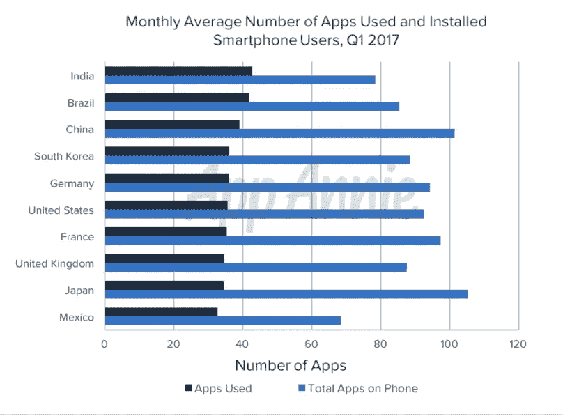

**Monthly Average Number of Apps Used**

让 100 万人下载你的应用程序，并让其中 30 万人每月实际使用它，这看起来是一个棘手的问题，不是吗？

**通读这篇采访就知道:**

> “ [Vikas](https://www.linkedin.com/in/jhavikas/) 如何利用数据和技术，让他的新闻应用从零增长到 100 万次下载，并在他的内容网站上获得 1800 万次观看。”

这是“ **PushInterview:帮助你的面试**[**Pushstart**](https://www.facebook.com/groups/Pushstarter/)**”**系列的第四次面试。

如果你碰巧错过了我们之前关于“ [**我如何建立印度最活跃的创业社区之一**](https://hackernoon.com/how-i-built-the-most-active-startup-community-of-india-dfd83e8fe687) ”的采访，请查看一下。

 [## 我如何建立印度最活跃的创业社区之一

### 我从零到一建立创业社区的旅程

hackernoon.com](https://hackernoon.com/how-i-built-the-most-active-startup-community-of-india-dfd83e8fe687) 

# 你是🕴Who 吗？

嘿 [Pushstarters](https://www.facebook.com/groups/Pushstarter/) ！我是 [Vikas Jha](https://www.linkedin.com/in/jhavikas/) ，一名前商船队队员，在荷兰伊拉斯谟大学鹿特丹管理学院攻读 MBA 后成为一名风投。

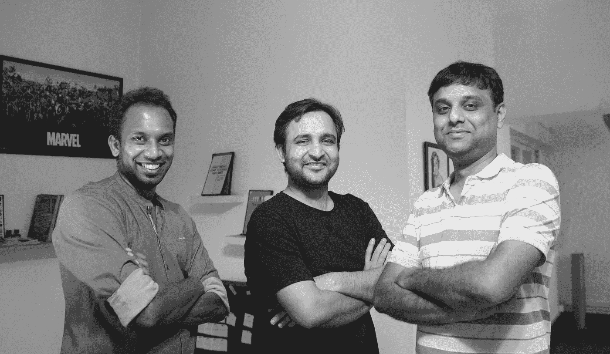

**I am the one in the middle :P**

我花了 15 笔交易和 2 次退出才意识到，我喜欢创造产品，而不仅仅是用资金和指导帮助公司成长。你可以说我的企业家精神占据了上风。

我一直认为，印度比其他任何发达国家都有更多的发展机会。所以，我在 2013 年把我的基地搬到了班加罗尔。

**在做出这个奇怪的决定之前，我脑子里有几件事。我想:**

1.体验并为印度[初创企业](https://hackernoon.com/tagged/startup)生态系统做出贡献。

2.实践我作为 VC 所宣扬的，成为更好版本的自己。

# 🤔[泼溅](http://plash.media/)是怎么回事？

> [Plash](http://plash.media/) 是艺术和技术力量的结合，引导我们的营销活动和技术产品的创造。

> 我们相信利用他们的联合能量。它让我们创作出速度快、有同理心、互动性更强的作品。

**普拉斯传媒有两个业务部门:**

**1。******:****

**[Limitless](https://belimitless.media) 是一家创意数码机构。过去，我们曾与 [**福特**](https://en.wikipedia.org/wiki/Ford_Motor_Company) 和 [**W for Women**](https://wforwoman.com/) 等品牌合作，创建并执行他们的数字战略。**

****我们工作的几个例子:****

**[**Ford Mustang Launch video**](https://www.youtube.com/watch?v=NJhB0rch2NY&index=14&list=PLyO4HcxK6VwopVWzqkuyRigVbgSpp7GlU)**

*   **[**福特野马发布视频**](https://www.youtube.com/watch?v=NJhB0rch2NY&index=14&list=PLyO4HcxK6VwopVWzqkuyRigVbgSpp7GlU) **，** [**W forWomen 寻常系列**](https://www.youtube.com/watch?v=88Er-AtLqGQ) **，UI/ UX 策略为 eKart。****
*   **我们的社交媒体活动 [**#BrokenIndia**](https://www.facebook.com/pg/limitlessML/photos/?tab=album&album_id=1603818176505536) **、**和[**# maketimeforlife**](https://www.facebook.com/limitlessML/photos/a.1618778491676171.1073741875.1567170260170328/1619066451647375/?type=3&theater)**帮助我们登上了超过 36 种不同的国际出版物，如[**bored panda**](https://www.boredpanda.com/broken-india-instagram-cropped-limitless/)**、**[**design taxi**](http://designtaxi.com/news/380139/Thought-Provoking-Photo-Series-Shows-How-Cropping-Can-Hide-The-Big-Picture/)**、**[**Buzzfeed**](https://www.buzzfeed.com/?utm_term=.yaK9xYkKN#.eaNKWByEo)****
*   ******我们的活动 **#maketimeforlife** 仅用 2 万卢比的预算就覆盖了近 2 亿人。******

> ****“我们非常注重艺术和技术的融合。了解如何利用技术接触更多受众，让我们比传统机构更有优势。”****

******2。技术臂:******

****在过去的 4 年里，我们推出了 3 款产品，取得了一定的成功。****

****在为[无限](https://belimitless.media)做 BD 的时候，我曾经尝试过不同的 [CRM](https://www.webopedia.com/TERM/C/crm_software.html) ，但不幸的是，没有一个能够满足我的需求。****

****我越了解我的需求，我就越觉得有内在的动力自己想出一个 CRM。****

****随着时间的推移，这个想法逐渐变得更大，创造了一个由人工智能驱动的 SaaS 工具。****

****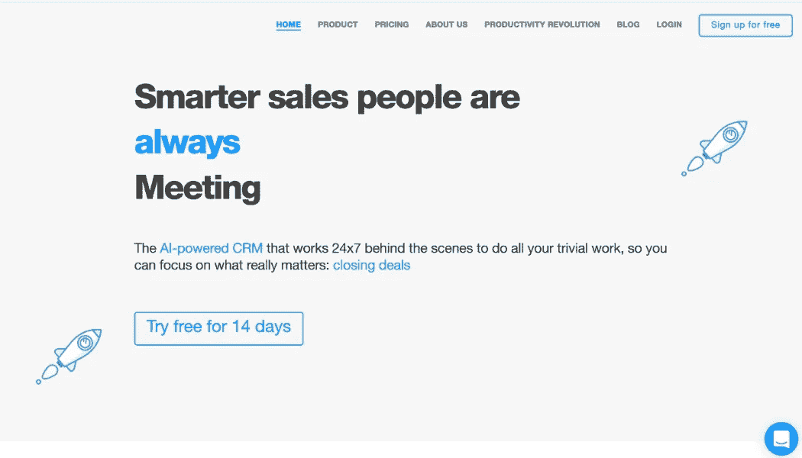****

****[**Alore CRM**](https://crm.alore.io/)****

****[Alore](https://crm.alore.io) ，是一个人工智能驱动的综合 [CRM](https://www.webopedia.com/TERM/C/crm_software.html) 和入境[营销](https://hackernoon.com/tagged/marketing)平台。****

****它拥有先进的 [CRM](https://www.webopedia.com/TERM/C/crm_software.html) 功能，内置的电子邮件查找器，个性化的滴滴电子邮件活动创建器，时事通讯策展人，以及让你自己的人工智能虚拟助理捕捉线索和安排会议的选项。****

****让我们改天再看《盗梦空间》的故事。****

# ****💯是什么促使你开始[泼斯](http://plash.media/)？****

****我一直相信知识的力量。****

> ****“随着互联网和社交媒体的兴起，每个人都成为了发布者。很难区分信号和噪音。”****

****[**泼拉什**](http://plash.media/) **最初的想法是将知识从信息中分离出来，将信号从噪音中分离出来。******

# ****🛠:构建最初的产品都花了些什么？****

> ****“非常多。就是在这个时候，我意识到做一名风投和做一名创始人是不可想象的不同，要自己面对创业的压力和紧张。”****

> ****当然，拥有强大的关系网是一个巨大的优势，但其中的艰辛是不可避免的。****

******我们的第一款产品—** [**激溅**](http://plash.media/) **新闻 App******

******[**Plash**](http://plash.media/)**的第一个版本是一个人工智能的新闻聚合应用**，它可以理解你的历史数据，给你提供与你的阅读习惯相关的建议。******

******环境:******

****我们在 2013 年 4 月筹集了天使轮资金，并在 2013 年 11 月推出了 [Plash](http://plash.media/) 新闻应用。****

****当时，移动应用生态系统正处于萌芽阶段。App Store 贡献了大部分下载量，付费营销渠道相对更便宜。****

******我们的策略:******

****对于我们来说，在我们的细分市场(新闻和杂志)中，在新的和即将推出的应用类别中保持较高的排名，并获得客户和影响者的好评，以在应用商店中获得用户的注意，这一点非常重要。****

******为此:******

*   ****我们最初在付费营销上花费了大约 6 万印度卢比。 **(** [**)谷歌广告**](https://www.google.com/intl/en_in/ads/) **，** [**FB 广告**](https://www.facebook.com/business/products/ads) **，以及奖励式 app 下载。)******
*   ****我们监控了大量数据，并玩弄广告来获得最大的下载量。****
*   ******FB 最适合我们**(我们过去常常在周四和周六以低至 50 便士的价格下载一个应用。)****
*   ****一个月之内，我们在[**Play Store**](https://play.google.com/store?hl=en)**上获得了**5000 次下载和大约 107 条应用评论。********

****

*****Screenshot of the*** [**Plash**](http://plash.media/) ***News app*****

*   **我们详细分析了用户的阅读行为，并确保应用内通知得到充分利用。基于我们的分析，我们推出了产品，如**睡前阅读**(每天 21:00 发送一篇好的长篇阅读)**，周末阅读**(周日 09:00 发送一周的 7 篇好文章)。**
*   ****宝莱坞和板球**是阅读量最大的类别，我们尽最大努力确保我们是第一个发送任何相关通知的人。**
*   **所有这些确保了我们在 Android 和 Windows 上的新的和即将推出的应用类别中保持第 **#1，**的评分为 4.7。******
*   **良好的评论帮助我们接触到记者和有影响力的人，我们在 [**WP Central**](https://www.windowscentral.com/plash-windows-phone-fantastic-news-reader-app-thats-distinctly-indian) 和[**Android Authority**](https://www.androidauthority.com/)**上得到了特写。****

**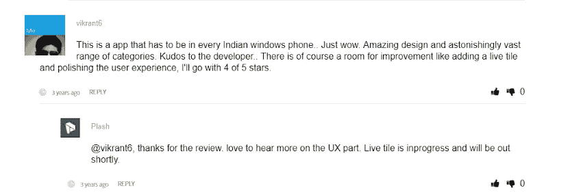**

****Reviews for** [**Plash**](http://plash.media/) **News App****

*   **我们还使用 **Incent 下载**来保持势头(我们设法以 4 卢比/下载的价格与 Incent 下载平台达成协议，总共花费了 40 万卢比。)**
*   **在 9 个月内，我们在 Android 和 Windows 平台上的下载量接近 100 万次。**

****挑战:****

**虽然我们在 MAU 为 30%的情况下成功获得了 100 万次下载，但我们的应用很难赚钱。**

****2013 年，移动广告库存的供应量为:****

*   **品质低劣的**
*   **品种少**

**即使每月有 200 万的页面浏览量，点击率还是很低(因为广告质量差)。**再加上低点击费，每分钟大约 0.05 美元**，因此我们的收入数字令人沮丧**(每月大约 100 美元)**。**

**到 2014 年 8 月，我们意识到，虽然有一个**产品-市场-分销契合度**，但我们无法在商业模式上取得成功。**

**我们的天使投资正在枯竭，我们还有两个月就要关门了。**

****这是我们回到绘图板并注意到以下事项的时候:****

*   **我们成功地从零增加到每月 200 万的页面浏览量。我们相信我们可以扩大规模。**
*   **手机的每分钟转数(每 1000 次页面浏览的收入)是 0.05 美元，而在印度是 0.70 美元左右，在美国是 2.0 美元左右。**
*   **我们还意识到，由于我们不拥有内容，我们受到了出版商的排挤。大多数时候，都是和他们有一些可怕的一边倒的收入分成协议。**

****一线希望—开始无限，我们的内容网站:****

> **我有一个核心信念——“让数据成为你的北极星”。**

****在大量数据和用户行为分析的支持下，我们决定重点实施以下内容:****

*   **开始拥有内容，而不是分发他人。**
*   **从移动到网络。**
*   **利用我们在分销方面的专业知识进行激烈的分销。**
*   **试试看我们能否打入美国市场。**

**我们做出了缩减后端和前端团队的艰难决定，并开始了建立**read . plash . in(**[**WP**](https://wordpress.org/)**托管自有内容网站)的旅程。****

**这一次，我们首先确定了我们的收入目标——4000 美元(相当于每月 400 万的页面浏览量)。**

**我们确实活了下来。**

**我们的第一篇文章，**一个真正漂亮女孩的 14 个标志，**在几天内就获得了近 15 万的浏览量。它证实了我们的假设，即对此类商品有需求。**

**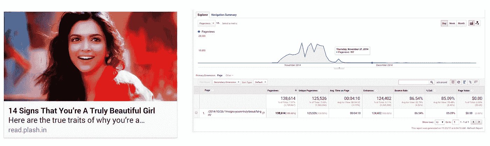**

****14 Signs of a Truly Beautiful Girl****

**从 2014 年 12 月开始，我们开始更努力地鞭策自己。我们过去每天发表 20 篇文章。两个人写，一个分发，一个分析结果，计划和实验。**

**不到一个月，我们开始达到每月 200 万页面浏览量的月运行率。**

**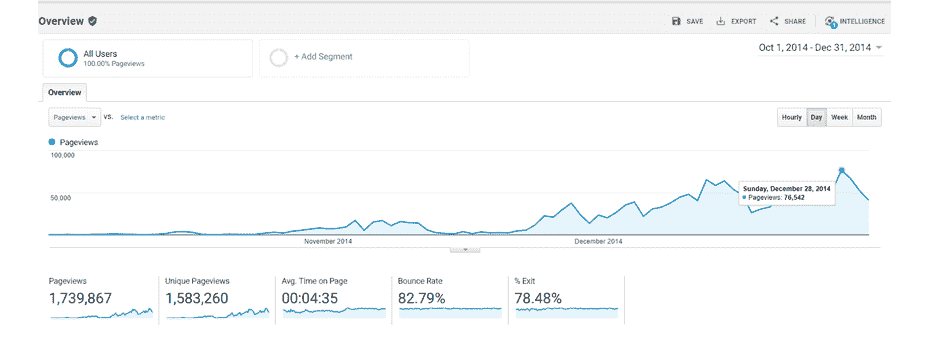**

****Screenshot depicting our page views****

**令人惊讶的是，80%的页面点击量来自美国(几乎是印度的三倍)。**

**然而，到一月份的第一周，我们的日常增长开始停滞。这时我们意识到这是运用一些**成长技巧的最佳时机。****

****狂飙突进的黑客成长:****

> **社交媒体平台根据人们喜欢、分享和评论的速度来推广新鲜内容。**

**我们在每个平台上创建了大约 30 个虚拟账户。花了几天时间让它们看起来像真的。然后，我们在一个简单的 [**Visual Basic 脚本**](https://en.wikipedia.org/wiki/VBScript) 的帮助下自动化了一切。**

**只要我们在网站上发布一篇文章，它就会被发布到所有平台上。然后 [**VB 脚本**](https://en.wikipedia.org/wiki/VBScript) 将接管 30 个虚拟账户的赞、分享和评论。**

****黑客不仅帮助我们获得了关注，我们还学到了很多关于这些平台上用户行为的东西。其中几个是:****

*   **标题中对点击率影响最大的关键词。**
*   **发布一篇文章的时间，使其在流量最大的时段成为趋势。**
*   **我们应该在每个类别张贴的文章数量，这样我们就不会拆我们自己的文章。**

**所有这些都给了我们巨大的帮助，到第 3 个月，我们一个月就有 600 万的页面浏览量。**

**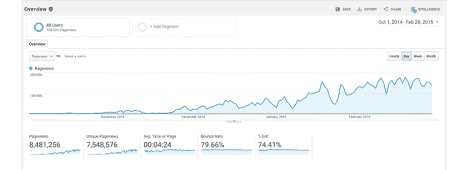**

*****Google analytics report: Dec 2014 to Feb 2015*****

**由于我们的流量大部分来自美国，我们的收入数字非常令人满意。**

**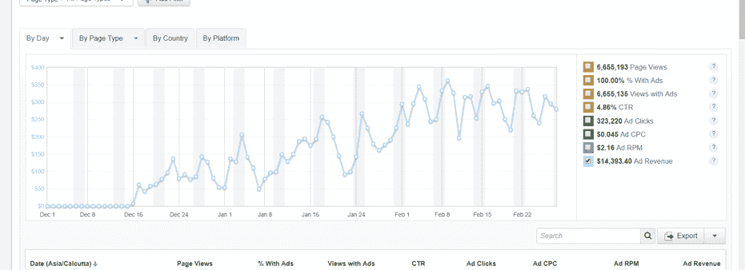**

*****Taboola Payment Report: Dec 2014 to Feb 2015*****

**既然我们已经有了**产品-市场-分销**和**商业模式来适应**，我们在 2015 年 4 月修改并重新推出了名为 **Limitless 的内容网站。****

**到 2015 年 7 月底，我们每月有 1800 万的页面浏览量。**

# **🤝你是如何获得最初的客户的？**

**到 2015 年 11 月底，许多品牌开始接触我们，在我们的网站上做原生广告**(**[scoop hook](https://www.scoopwhoop.com/)和 [Storypick](http://www.storypick.com/) 让 listicles 和原生广告大受欢迎。)**

> **在我与一家时尚零售连锁店的品牌负责人的一次会面中，我提到了新时代的营销人员如何不理解技术，而技术最终会影响他们品牌的覆盖范围和增长。**

**一件事接着一件事，最后我向他推荐了 5 个简单的技巧，可以让他的社交媒体频道的表现翻倍。**

**它的业绩翻了四倍多，我们被邀请成为该品牌的数字代理。**

**我们偶然成为了一家数字机构，但我们为它的成功而努力工作。让我简单分享一下哪些有效，哪些无效:**

*   **陌生来电——我们的一大败笔。**
*   ****通过社交媒体** (LinkedIn、脸书等)——最初奏效，但速度非常慢。**
*   ****付费营销** —收购成本非常高，我们也拒绝了这种方式。**
*   ****电子邮件营销** —我们的巨大成功。**

****我们如何通过电子邮件营销获得初始客户:****

****错误:****

*   ****第一个错误是将勘探外包给第三方** —导致不相关的勘探。**
*   ****只发送一封电子邮件** —我们找到并向各行业的 54，000 名高管和首席执行官发送了邮件，然后等待他们回复。**

**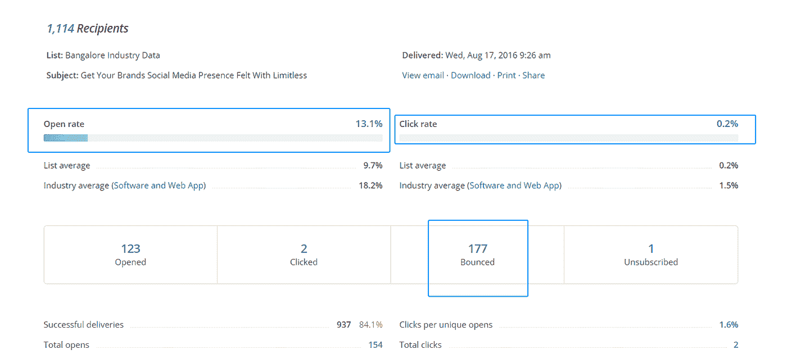**

****Stats of our first set of emails****

**从我们的错误中吸取教训，从 [**亚伦·罗斯**](https://www.linkedin.com/in/aaronross/) (可预测收入的创始人)那里获得灵感，我们决定做以下事情:**

*   ****在内部团队的帮助下，开发潜在客户**。**
*   **尝试使用**主题行和邮件发送时间。****
*   **开始 [**点滴活动**](https://zapier.com/learn/email-marketing/drip-marketing-campaign/) (平均需要 5 个接触点才能将用户转化为潜在客户。)**

**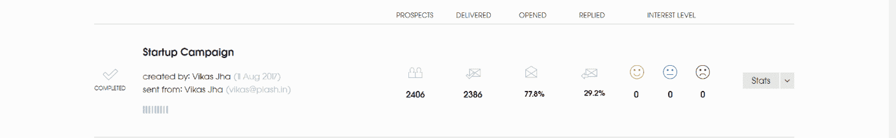**

****Stats after we employed the Drip campaign****

**最初，我们使用[**any mail finder**](https://anymailfinder.com/)和 [**Linkedin**](https://www.linkedin.com/feed/) 来获取电子邮件地址，使用 [**啄木鸟**](https://woodpecker.co/) 来发送 [**点滴活动**](https://zapier.com/learn/email-marketing/drip-marketing-campaign/) 。**

**渐渐地我们的内部工具 [**Alore CRM**](https://crm.alore.io/) 接管了[**any mail finder**](https://anymailfinder.com/)和 [**啄木鸟**](https://woodpecker.co/) 的工作，为**滴滴战役**。**

> **回复率的提高对我们来说显而易见。从那以后，我们通过“滴流”活动获得了所有的客户。**

# **👬你是如何着手组建你的团队的？**

**我已经通过[**【Linkedin】**](https://www.linkedin.com/feed/)**[**AngelList**](https://angel.co/)**和推荐**完成了我的招聘。****

****我们在招聘上犯了很多错误。我在这里整理了一份所有错误的清单。****

# ****💰你的商业模式是什么？****

****在代理方面，我们有**聘用合同和项目模型。******

****在预聘模式中，我们签订了固定月费的年度协议。在项目模型中，我们同意以固定价格交付项目。****

****在产品方面，我们有一个**基于订阅的模式。******

********

****[**Alore CRM**](https://crm.alore.io/) **pricing plans******

****[**Alore CRM**](https://crm.alore.io/) 是一款 SaaS 工具，采用**月度和年度订阅模式**，我们对每个用户收取固定的费用。我们对年度订阅提供折扣。****

# ****🏁你未来的目标是什么，你打算如何实现它们？****

****我们在未来几年的重点是**建造人工智能工具**，以指数方式提高人类生产力，为人类的成就带来全新的未知可能性。****

****这一系列产品中的第一款是我们的**人工智能 CRM 工具**[**Alore CRM**](https://crm.alore.io/)**。******

****[**Alore CRM**](https://crm.alore.io/) 帮助销售人员完成他们琐碎的任务，这样他们就可以专注于重要的事情，从而提高他们的生产力。****

****目前，工作效率是一个无形的概念。未来 5 年，我们的重点是首先量化生产率，然后慢慢提高到原来的 10 倍。****

# ****🌋到目前为止，你面临的最大挑战是什么？****

****作为一个初创公司的创始人，雇佣和留住顶尖人才是我面临的最大挑战之一。****

****在创业初期，我做出了许多错误的招聘决定。我们一度迅速扩大到 40 名员工，但慢慢地与愿景不匹配的员工分道扬镳。****

****从错误中吸取教训后，我们有意识地决定放慢脚步。****

> ****我们清楚地定义了我们的文化和愿景，并确保每个员工都与之保持一致。然后，我们为包括招聘、监控和评估在内的所有事情建立一个流程。****

## ****班加罗尔团队@ [普拉斯](http://Plash):****

****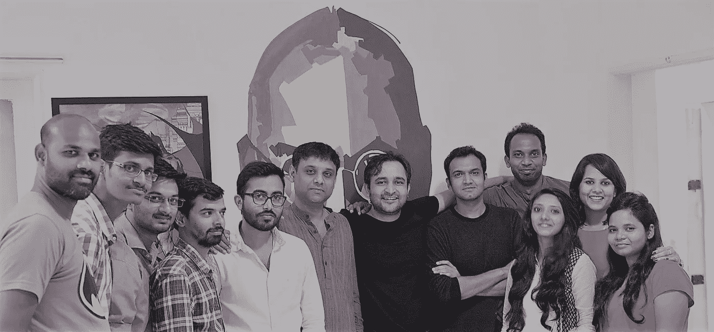****

******Team @** [**Plash**](http://Plash)****

# ****🗒，你对刚起步的人有什么建议？****

****作为一个前 VC 和活跃的天使投资人，我总是对我遇到和投资过的创始人说以下这些话:****

*   ******从大处着眼，从小处着手，快速扩展，永不放弃。******
*   ****如果你的创业想法/产品不起作用，就将其扼杀，继续前进(如果你在今天的战斗中幸存下来，你可能会赢得明天的战争。)****
*   ******关注数据和流程** —作为一名初创公司创始人，你的工作就是以极快的速度不断发现新的瓶颈。设置流程、提取数据并找出瓶颈。****
*   ****扼杀创业的最好方法是停止尝试。****
*   ****你不会因为推出了一个失败的产品而失败。****
*   ****照顾好你的身心健康。如果你在创业生活中曾经抑郁过，欢迎联系我@[**vikas @ plash . in**](mailto:vikas@plash.in)**。******

> ****如果你对自己的创业不开心、不兴奋，那就辞职吧。****

****经营一家初创公司是一件紧张的事情。我用一段话总结一下:****

****您需要修复一些 bugs 大概还剩几个月的跑道；流程需要改进；父母对你的所作所为毫无头绪；联合创始人已经退出；朋友说你永远没有时间；你需要做一个新的资金筹集；客户不付款；你体重增加了，因为你没有时间锻炼；你负担不起周年纪念的假期，因为你有产品发布。****

> ****所有这些都是真实的，但最终，没有什么比你的理智和幸福更重要。****

# ****✉️:我们怎样才能和你联系上？****

****可以联系我[**Linkedin**](https://www.linkedin.com/in/jhavikas/)**[**Twitter**](https://twitter.com/get2vikasjha)**[**脸书**](https://www.facebook.com/jha.vikas) **或者**[**vikas @ plash . in**](mailto:vikas@plash.in)**。**********

## ****非常感谢你的阅读！如果你喜欢，请鼓掌支持👏🏻还有分享帖子。请随意发表评论💬下面。****

## ****想成为印度最活跃的创业社区的一员吗？****

*****在* [***上发送请求 Pushstart***](https://www.pushstart.in/join-network-community) *并成为我们不断壮大的大家庭的一员。*****

*****嘿！这里的 Neeraj 是*[***Pushstart***](http://pushstart.in/feed)*的创始人，印度最活跃的企业家社区。我每周都会发布对成功企业家的采访。* ***随时联系我*** [***脸书***](https://www.facebook.com/jneeraj0807)***|***[***Linkedin***](https://www.linkedin.com/in/jneeraj0807)***| neeraj . Joshi @ pushstart . in |***[***Twitter***](https://twitter.com/jneeraj0807)****