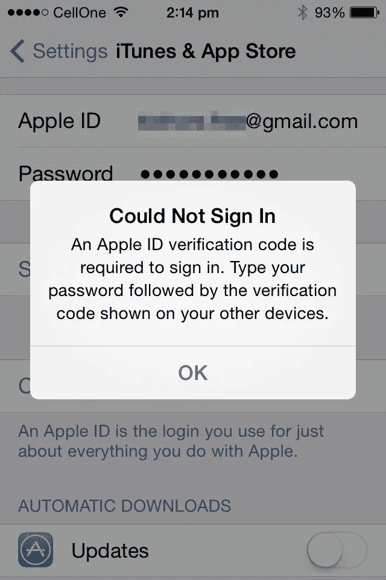
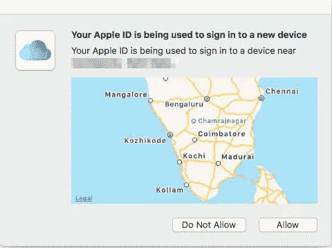
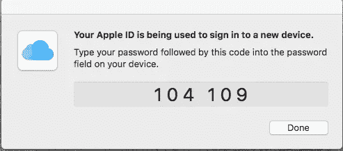
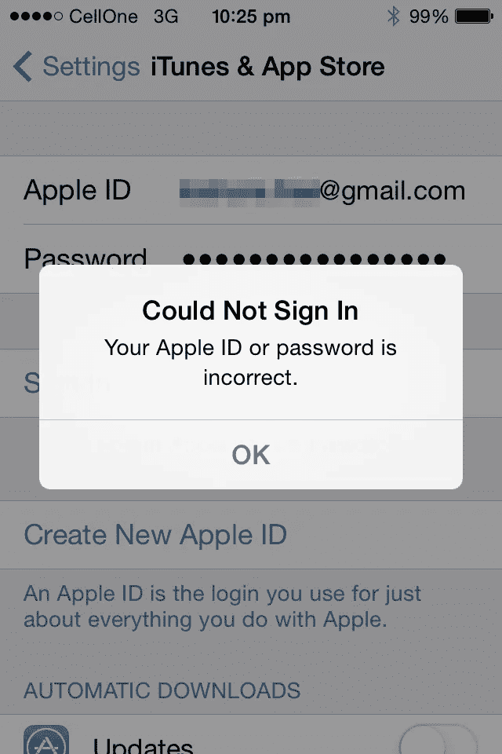
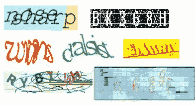

# 后密码时代如何？

> 原文：<https://medium.com/hackernoon/how-about-a-post-password-era-fa6a9744e27d>

Security systems should stress out data thieves, not data owners.

几天前，当我试图通过我的旧 iPhone 登录时，我的 Apple ID 被锁定了。现在我知道安全是至关重要的，因为黑客访问我的 ID 和窃取我的信息，包括我的信用卡号码的危险。但是，如果为防止黑客入侵而设计的安全性也阻止我访问我的 ID，也许我们需要考虑替代解决方案。

我在旧 iPhone 上尝试做的只是下载我之前购买的一个应用程序。所以我输入了我的 22 个字符的苹果 ID，然后是我的 11 个字符的密码。就在那时，事情开始变得荒唐可笑。它以下面的消息开始。

所以我检查了我的“其他设备”,也就是我的 Mac。果然，有一个弹出窗口说我的 Apple ID 正在一个新设备上使用，并问我是否希望允许它。我点击了“允许”,一个新的窗口弹出来，上面有一个代码，一个输入我的密码的指令，然后是一个要输入到我的新设备的密码字段中的代码。

这是一个新的！似乎代码必须附加到我的密码，实际上是创建一个新的密码。还是另有所指？我有一种不安的预感，这件事会有糟糕的结局。这两个数字之间的空格是怎么回事，我输入的时候也应该这样做吗？

没有答案，试错是唯一的前进道路。所以我再次输入了 33 个字符的用户名和密码，没有空格。没用。然后我试着没有空间。但我得到的只是一条消息，说我的苹果 ID 或密码不正确。

嗯，我是人，也许我错了。因此，我启动了我的密码应用程序 1-Password，仔细检查了我的苹果 ID 和密码，然后小心翼翼地再次输入了所有 33 个字符。运气不好。接下来呢？

也许我可以尝试在我现在的手机上用同一个苹果 ID 登录和退出，以检查 ID 和密码是否正确。我继续，退出，然后在我的 iPhone 6S 上重新登录。到这个时候，我已经厌倦了重复输入 33 个字符。谢天谢地，Keychain 填写了我的 Apple ID，我只需键入 11 个字母的密码。

iPhone 6S 让我成功登录。这意味着问题不在于我的苹果用户 ID 或密码，而是附加在我密码后面的代码。我回到 iPhone 4，再次尝试，再次输入所有 33 个字符。它还是无法登录。

还有另一个角度。我是个喜欢啄东西的人。因此，重复输入这 33 个字符是一件费力的事情，因为大写锁定和特殊字符和数字是当今密码所坚持的。过一会儿，所有的打字工作都会变得乏味。雪上加霜的是，我做这个痛苦练习的唯一原因是因为一个愚蠢的安全系统出了大问题。

我休息了一会儿，几个小时后又试了一次。这次消息说验证码发多了，要我以后再试试。看起来苹果觉得我在试图窃取自己的 ID。从事情的发展来看，这个故事不太可能有一个美好的结局。

我试着用谷歌搜索这个问题。但是似乎没有其他人有这个问题，或者更有可能还没有开始抱怨。我只能耐心等待，不断检查，直到找到解决方案。

幸运的是，这一交易并不重要，我使用另一个 Apple ID 下载了我试图下载的付费应用程序的广告支持版本，从而解决了这个问题。

但是，如果密码错误发生在一次重要的交易中，该怎么办呢？比如说，当我不得不紧急预订最后一张机票时，无法访问我的支付应用程序。那将意味着一次旅行的取消和一大笔钱的浪费。这是一场即将发生的灾难。

让我陷入密码地狱的不仅仅是 Apple ID。我在许多其他应用程序和网站上都有过类似的糟糕经历。事实上，在迪拜之旅中，我的优步应用程序出现了密码故障。我在迪拜的印度 SIM 卡不能用。所以我在优步逗留期间使用了当地的 SIM 卡。当我一回到印度的机场，我就试图把我的优步应用程序链接回我的印度 SIM 卡，这样我就可以预订一趟旅程。但是优步不相信这些，拒绝承认我就是我自称的那个人，并且不停地给我发电子邮件确认。带着孩子长途旅行后，我对这些垃圾没有耐心了。幸运的是，优步在印度的竞争对手奥拉(Ola)运行良好，我得以预定了回家的旅程。

指向注释。从那以后，我再也没有用过优步，而是坚持使用 Ola。不必要的复杂安全措施会适得其反，不仅对客户，对公司也是如此。

无论如何，很明显现有的密码系统对所有相关人员来说都是一场灾难。我有无数不同应用程序和网站的用户 id 和密码。没有密码管理器是不可能管理它们的。但即使是密码管理器也可能没有帮助，因为一些网站/应用程序是偏执的，并定期强迫我更改密码。有时他们想让我在密码中加入特殊字符和大写字母。

至于验证码，我认为是机器人为机器人设计的。看看这个我从网上挖来的例子。我不确定我是否正确地理解了一半验证码想要表达的意思。

那么有解决办法吗？

具有讽刺意味的是，备受诟病的机场安全系统为我们指明了前进的道路。

我最近去过迪拜，在机场的护照检查柜台前通常会排起令人厌烦的长队。但是这次，那位阿拉伯官员出人意料地把我叫到另一个柜台。过了一会儿，我盯着柜台上一个扫描我眼睛的微型照相机。一旦它验证了我的身份，电子门就神奇地打开了。整个过程在五分钟内就结束了，而通常排队要花一个多小时。当我收拾行李时，我不禁想知道为什么我们的手机不能以这种方式验证我的身份，尽管它们都有内置摄像头。为什么手机不能用我的眼睛快速扫描解锁？登录 Apple ID 或优步或任何其他需要验证的应用程序也是如此。是的，我知道已经有手机在这么做了。但是为什么这个行业不关注这项重要的技术，修复它的缺点并尽快使其成为主流呢？

我认为这可能是因为存在一种危险，即如果黑客破解了眼球扫描技术，他可能会导致全球金融崩溃。因此，把所有的安全鸡蛋放在一个眼睛扫描篮子里可能风险太大。我相信专家们可以找到解决办法，如果他们是认真的话。

我可能是错的，但在我的业余爱好者看来，银行和类似的高风险应用程序可能需要两个因素的验证。OTP(一次性密码)发送到手机或电子邮件的第二个因素可能不起作用，因为如果黑客破解了眼球扫描，他就可以访问我的电子邮件。如果他偷了我的手机，可能我的手机也会被偷。事实上，如果他有我的数据，他甚至可以为我的手机发行一个复制的 SIM 卡。

奇怪的是，这两个因素还得追溯到密码。就像一个复杂的记忆密码，必须和眼睛扫描一起使用。我可以忍受不得不记住几个复杂的密码。但不像现在这样需要记录数百个密码。我绝对不喜欢被锁在我的账户之外，因为一些复杂的安全系统认为我试图窃取我自己的 ID！

接着，我阅读了关于下一代 iPhone 的谣言。其中一个人说，苹果正在考虑彻底抛弃触控 id。这可能表明，苹果公司可能会全力以赴通过眼睛扫描进行身份验证。这是苹果的一个传言，我热切希望它成真。

等一下！

我了解苹果，我敢肯定，如果他们开发出一个包括眼睛扫描的新安全系统，它将需要一种只会在他们最新 iPhone 的花哨新摄像头上工作的新技术。

这意味着我可以选择保留我的 iPhone 6s+并被困在密码的泥潭中。或者花 1000 多美元购买最新的 iPhone，成为后密码时代的特权会员。

所有这些都是猜测，但听起来完全像苹果会做的事情。

我不知道该笑还是该哭。