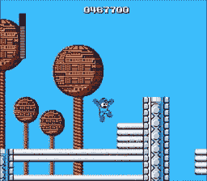
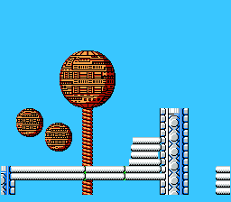

# 人工智能如何被用来复制游戏引擎

> 原文：<https://medium.com/hackernoon/how-ai-can-be-used-to-replicate-a-game-engine-6160d000b1e3>

*这是研究论文* [*游戏引擎学习视频*](https://www.google.co.in/url?sa=t&rct=j&q=&esrc=s&source=web&cd=1&cad=rja&uact=8&ved=0ahUKEwjiv8Ks_KfWAhULKY8KHbBeAjoQFggnMAA&url=https%3A%2F%2Fwww.cc.gatech.edu%2F~riedl%2Fpubs%2Fijcai17.pdf&usg=AFQjCNF3lLPanlsi1MVVhKUt0ql-q4gftQ) *的衍生作品。这要归功于佐治亚理工学院的马修·古兹迪尔、李博阳、马克·o·里德尔。*

在下面的视频中，马里奥由一个人工智能代理扮演，它使用神经进化的过程来像大师级玩家一样玩游戏。

这很棒，然而佐治亚理工学院的研究人员已经采取了下一步措施。他们没有学习如何玩游戏，而是学习了游戏引擎机制。他们的算法通过扫描游戏视频并反复即兴创作假设的引擎来实现这一点。



Original Mega Man game play video on the left. Cloned game engine on the right. Image from Georgia Tech

# 概观

该系统扫描每一帧，找出其中存在的对象列表，然后在相邻帧之间运行一种算法，以查看对象在帧之间如何变化。最后，当检测到的变化大于设定的阈值时，运行引擎搜索算法。

# 解析帧

该系统需要两个输入，一个精灵托盘(游戏中的一组角色和对象)和一个游戏视频。使用这些输入和 OpenCV(计算机视觉库),我们可以理解精灵的数量和它们在各自帧中的空间位置。

给定精灵的帧序列和它们的位置。运行算法以在下一帧中将每个精灵与其最近的邻居匹配。如果精灵的数量不匹配，则创建一个空白精灵来匹配剩余的精灵。这发生在某些情况下，例如:当马里奥跳过一个敌人并摧毁它。

最后，当这些 sprite 表示被转换成事实列表时，解析就完成了。这些事实类型都需要一个预先编写的函数来从给定的输入帧中导出它。以下是事实类型的列表。

## 动画

这是所有精灵图像的集合，根据它们的原始文件名，宽度和高度。例如:如果在位置 0，0 找到高度大小为[26，26]的图像“mario1.png ”,动画事实将是{mario1，26，26}

## ***空间***

这是框架中带有 x，y 坐标的精灵的文件名。

## ***关系 X***

这是 x 维度中一对精灵之间的关系。例如:(mario1，mario1 离管道 1 最近的边，3px，管道 1，管道 1 离 mario1 最近的边)。这使得系统能够学习碰撞规则，例如当马里奥撞到管道时，其速度变为 0)

## ***关系关系***

上面提到的 y 维中的相同事实就像马里奥撞上砖块一样。

*这记录了精灵在 x 维度的速度，它比较了前一帧和下一帧。例如:如果马里奥在第 1 帧的位置是[0，0],在第 2 帧的位置是[10，0],那么事实就是速度 x:{马里奥，10}*

## ****速度性****

*上面提到的 y 维中的相同事实。*

## ****CameraX****

*这存储了摄像机在一个关卡中能走多远。*

# *发动机学习*

*引擎学习方法试图制作一个游戏引擎，它可以预测在解析的帧中观察到的变化。游戏引擎是一组规则，每个规则都有 IF 和 THEN。如果马里奥撞上了一根管子，那么把速度 x 改为 0。该方法由帧扫描算法和引擎搜索算法组成。帧扫描算法扫描经过解析的帧，并开始搜索证明预测帧和实际帧之间的差异的规则。如果发现一个游戏引擎将差异减少到一定程度，则进行另一次扫描以确保新的引擎能够准确预测先前的帧。*

## *帧扫描算法*

```
*engine = new Engine()
currentFrame = frames [0]while i=1 to frameSize do

   # Check if this engine predicts within the threshold

   frameDist = Distance(engine, currentFrame, i + 1)
   if frameDist < threshold then
     currentFrame = Predict(engine, currentFrame, i + 1)
     continue # Update engine and start parse over engine = EngineSearch(engine, currentFrame, i + 1)
   i=1
   currentFrame = frames[0]*
```

*帧扫描算法将一组解析的帧和阈值作为输入，并输出游戏引擎。距离函数逐个像素地给出实际帧和预测帧之间的距离。如果距离小于设定的阈值，预测函数将返回与实际帧最接近的帧。*

## *引擎扫描算法*

```
*closed = []
open = PriorityQueue()
open.push(1,engine)while open is not empty do

   node = open.pop()

   if node[0]<threshold then
      return node [1]

   engine = node
   closed.add(engine)

   for Neighbor n of engine do
       if n in closed then 
          continue
   distance = Distance(engine, currentFrame, goalFrame)
   open.push(distance + engine.rules.length, n)*
```

*引擎扫描算法进行搜索以找到在实际帧的某个阈值内创建预测帧的一组规则。这是通过为给定引擎生成邻居来实现的。*

**邻居通过以下方式生成**

## *添加规则*

*这需要选取一对同类事实，一个来自当前帧，另一个来自目标帧。例如:当前帧的 velocityX 事实为{mario1，5}，目标帧的事实为{mario1，0}。这些对事实代表规则处理的变化。这里马里奥的速度下降了。当前框架中的其他事实构成了该规则的初始条件。尽管这些将包含发生变化所不需要的条件。例如:马里奥的速度下降是因为他在管道之间的空间距离太近。这也可能包括他头顶上有云的情况。通过修改规则的条件事实，这些初始条件集被最小化。*

## *修改规则的条件事实*

*通过采用现有规则的条件和当前条件集之间的公共条件，给定规则的条件集被最小化。如果这个邻居减少了预测的和目标帧的像素距离，那么这个比另一个添加新规则的邻居更可能被选择。这导致了对更小和通用发动机的偏好。*

## *修改规则以覆盖附加的子画面*

*这就像上面的一个期望它可以做的变化可以扩展。例如:当马里奥跳到一个敌人身上时，它就消失了，或者从技术上来说，它从有价值的动画事实变成了没有价值的动画事实。所以一条规则可以处理多种情况。*

## *将规则修改为控制规则*

*这将规则从正常处理更改为控制规则。这些是玩家做出决定的规则，例如控制角色的输入(左、右、跳)。*

*这是一个学习游戏引擎输出的例子。*

> *关注 Hackernoon 和我( [Febin John James](https://medium.com/u/75a616711f4e?source=post_page-----6160d000b1e3--------------------------------) )了解更多故事。我还在写一本书，以提高对蓝鲸挑战的认识，蓝鲸挑战已经夺去了几个国家许多青少年的生命。它旨在帮助父母了解黑暗网络的威胁，并采取行动确保他们孩子的安全。《T2 与蓝鲸战斗》这本书可以在亚马逊上预购。该书将于本月 20 日发行。*