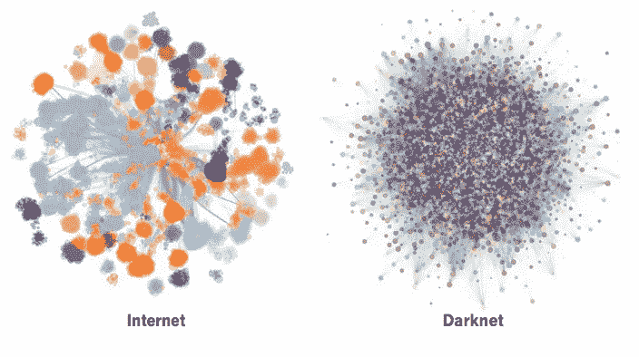

# 🔮人工智能将如何改变企业和机器人的友谊++ #104

> 原文：<https://medium.com/hackernoon/how-ai-will-change-the-enterprise-and-robot-friendships-104-aaa8350d9c5c>

## 🚀这是指数视图的第 104 期。在此注册订阅时事通讯。

Darknet is more decentralised than Internet

🙊[解释来自*WSJ*；更多](https://medium.com/u/78c5166b8328#98 </a>中暗示过这一点)。简单的<a class=)[详细解说来自*自然*。](http://www.nature.com/news/the-quest-to-crystallize-time-1.21595)

*   🔬磁共振成像先驱[彼得·曼斯菲尔德讣告](http://www.nature.com/nature/journal/v543/n7644/full/543180a.html)

# 在晚宴上显得聪明的小点心

我们在看更多的视频，而不是更多的电视

T2 与 Wintel 的联姻正在破裂，微软正在以英特尔为代价转向新的芯片架构。

Handy [区块链简史](https://hbr.org/2017/02/a-brief-history-of-blockchain)

特斯拉认为它可以在 100 天内解决南澳大利亚的能源问题。

🇨🇳中国将在 3 年内拥有超过 2 . 5 亿的 60 岁以上人口

区块链如何改善食品(以及更广泛的)贸易

你的名字可能会影响你的外貌。(机器学习遇上心理学有了惊人的结果。)

模糊性是不是比波动性更好的市场不确定性的晴雨表？

随着煤炭使用的减少，英国碳排放量下降 6%

一半的挪威新车是电动或混合动力的

🌍布莱恩·惠特克:[阿拉伯无神论的兴起](https://newhumanist.org.uk/4898/the-rise-of-arab-atheism)

Tinder Select 是一个[的新版本，只对高评级会员开放。](https://techcrunch.com/2017/03/07/tinder-select-is-a-secret-members-only-version-of-the-app/)

👨🏽‍🔬一个神经科学家向五个不同的人(包括一个五岁的孩子)解释连接体的精彩视频。

> [黑客中午](http://bit.ly/Hackernoon)是黑客如何开始他们的下午。我们是 [@AMI](http://bit.ly/atAMIatAMI) 家庭的一员。我们现在[接受投稿](http://bit.ly/hackernoonsubmission)，并乐意[讨论广告&赞助](mailto:partners@amipublications.com)机会。
> 
> 如果你喜欢这个故事，我们推荐你阅读我们的[最新科技故事](http://bit.ly/hackernoonlatestt)和[趋势科技故事](https://hackernoon.com/trending)。直到下一次，不要把世界的现实想当然！

