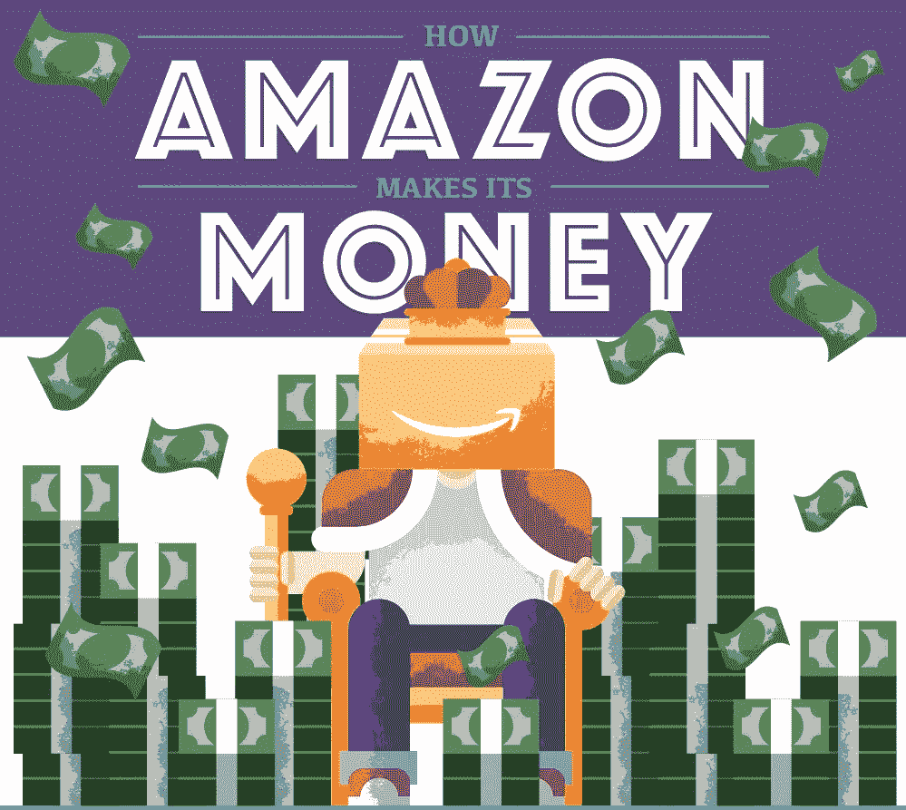
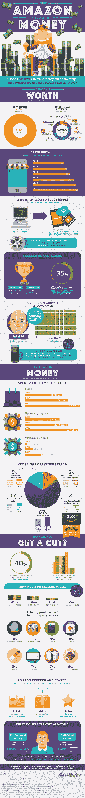

# 亚马逊是如何赚钱的

> 原文：<https://medium.com/hackernoon/how-amazon-actually-makes-its-money-30f9cabd8627>

你很难找到不是亚马逊用户的人。事实上，大多数家庭都有一个活跃的亚马逊 Prime 账户，可以访问电子书、电影、2 日送达和无穷无尽的零售商品。从最初的在线书商到价值近 4300 亿美元的公司，亚马逊走过了很多路才走到今天。那么，它是如何赚钱的呢？

这个答案不仅仅是“从所有的东西中”尽管零售部分占亚马逊收入的 67%,但实际上还有更多。

亚马逊不仅是一个零售巨头，它还是一个非常成功的电影工作室。亚马逊自己的视频制作预算是 4.5 美元。10 亿美元，是 HBO 预算的两倍多，他们的流媒体服务竞争对手是网飞和 Hulu 等流媒体巨头。

亚马逊上的独立卖家也可以成功；亚马逊市场上 40%的产品销售来自第三方卖家。无论你每月销售 40 件商品还是 400 件商品，亚马逊都可以为你存储、包装和运输商品，同时只保留每笔交易的 10-15%。

好奇亚马逊是如何成为这样一个零售超级大国的，你如何能从中分一杯羹？这张信息图包含了你需要了解的关于亚马逊生活的所有信息，以及一些关于其未来的想法。

