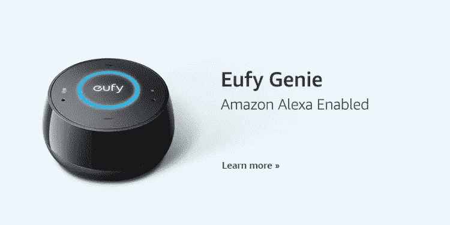
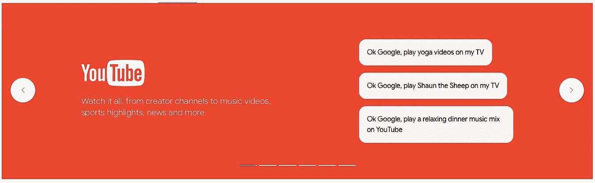
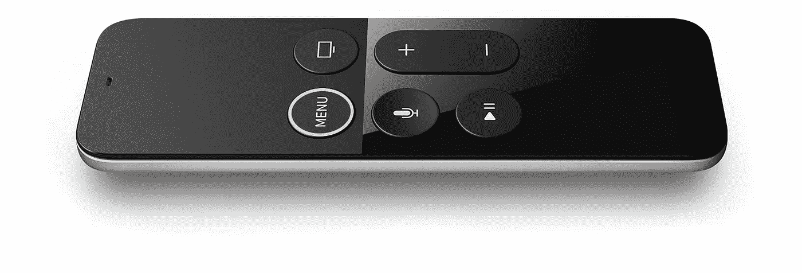

# 亚马逊如何赢得家庭操作系统之战

> 原文：<https://medium.com/hackernoon/how-amazon-is-winning-the-battle-for-the-home-operating-system-d794ab48fb82>

## 亚马逊、谷歌和苹果都在试图成为与你家互动的根本机制，但亚马逊优势显著。

[亚马逊](https://hackernoon.com/tagged/amazon)刚刚宣布[大量新的 Alexa 设备(总共 6 个)](https://www.cnet.com/pictures/just-look-at-all-of-amazons-new-alexa-devices/)，而谷歌预计将推出[新的更便宜的 Google Home](http://www.droid-life.com/2017/09/19/google-home-mini-exclusive/) 和[可能很快会推出高端型号](https://www.theverge.com/circuitbreaker/2017/9/27/16374668/google-home-max-speaker-stereo-rumor)，而[苹果将在 12 月](/@jorge.serna/wwdc-2017-social-comms-5-homepod-and-social-communications-475839fdf457)推出 HomePod。

所有这些重头戏不仅仅是销售硬件，而是改变我们在家做事的方式以及我们与计算机的交互方式。语音交互是关键要素，亚马逊的 Alexa、谷歌的助手和苹果的 Siri 是最重要的。**这些公司都希望创建家庭娱乐、家庭通信和家庭自动化发展的标准。家用操作系统。**

亚马逊目前占据了该市场 70%的份额，所以让我们来看看他们是如何赢得成为每个类别标准的战斗的。

# 家庭娱乐前沿—音乐

Echo line、Google Home 和即将推出的 HomePod 作为“智能音箱”的推出，为作为价值主张一部分的音乐产品增加了不少分量。这里的区别已经很明显了:

*   苹果公司将苹果音乐的优势作为其产品的一部分，这也是目前 HomePod 促销活动的核心特征。
*   亚马逊和谷歌都在走一条不同的路，在他们的设备中实现自己的音乐服务(分别是亚马逊音乐和谷歌音乐)，但也对 Spotify 和 Pandora 等其他服务开放。

目前，支持 Spotify 的市场覆盖范围大大超过了 Apple Music:

将 HomePod 与 Apple Music 捆绑在一起可能会对当前的 Apple Music 订户有吸引力，但另一方面，不能在其上使用其他音乐服务意味着 Apple Music 订阅每年需要额外投资 120 美元。这可能太贵了，尤其是对于已经支付了那么多钱订阅 Spotify 的用户来说。

虽然这仍然是一个相当开放的战场，苹果对音乐市场的深入了解可能会为 HomePod 创造一些优势，但我认为通过 Spotify 解决更大的用户群是关键，在苹果开放 HomePod 支持第三方音乐服务之前，它将处于劣势。

**亚马逊和谷歌之间，优势目前在亚马逊上**:

*   首先是价格，新款 Echo 的价格为 99 美元。
*   然后是[多房间支持](https://www.theverge.com/circuitbreaker/2017/8/29/16219876/amazon-multi-room-speaker-playback-echo)，考虑到[三个回声包](https://www.amazon.com/b?node=16706585011)的 50 美元折扣，这变得更加有趣。
*   最后是其他制造商的扬声器对 Alexa 及其音乐服务的现有[支持](https://www.amazon.com/b/ref=EchoCP_avs_tile_text?node=15443147011)，而[谷歌助手已经宣布了这一点，但仍然没有](http://www.businessinsider.com/google-assistant-new-speakers-home-devices-third-party-ifa-2017-8)。

**也许这将会改变，随着新的谷歌家庭设备的出现，以及其他制造商如 Sonos 支持助手** **而不是 Alexa，但目前亚马逊领先。**

# 家庭娱乐前沿—电视

但如果目标是成为家庭操作系统，音乐是不够的，因为电视是目前客厅娱乐体验的中心设备。

这就是为什么这些公司也在那里推出他们的声控助手:

*   谷歌及其 Chromecast，它与谷歌主页集成在一起。

*   亚马逊，与新宣布的支持 Alexa 交互的 Fire TV。[并且可以通过回声来控制。](https://www.amazon.com/gp/help/customer/display.html?nodeId=202174250)
*   苹果电视，[支持使用遥控器](https://support.apple.com/en-us/HT205305)通过 Siri 进行互动。

它们都没有引领联网电视市场，[那个地方属于 Roku](http://variety.com/2017/digital/news/roku-apple-tv-chromecast-amazon-fire-tv-market-share-2017-1202506850/) ，但亚马逊和谷歌都很接近。【Alexa 和谷歌助手都可以用来控制 Roku ，这要归功于第三方为各自的生态系统提供技能/动作的能力。

苹果远远落在后面，分析师对最新苹果电视 4K 的回应是[的价值不足以证明溢价定价](https://daringfireball.net/2017/09/thoughts_on_apple_tv_4k)，这是 [Chromecast Ultra](https://store.google.com/product/chromecast_ultra) 或[新 Fire TV 4K](https://www.theverge.com/2017/9/27/16375134/new-amazon-fire-tv-announced-4k-hdr-price-date-2017) 巩固其地位的又一次机会。

但亚马逊在这方面还有另一个优势，他们的 Echo Show 设备，因为虽然不是为了取代电视，但它可以用来消费视频内容。这也可能是谷歌目前阻止 Echo Show 访问 YouTube 的部分原因。

# 通信战线

沟通是亚马逊和谷歌最初在各自连接的扬声器中遗漏的一项功能。但是他们已经意识到[包括一些真正不寻常的](https://chatbotslife.com/what-was-missing-from-amazon-echo-9f39778fc910#NogK4_rZCEq4)！！

Not sure if Alexa here is really a good idea…

这使得(最初的)苹果方法落后了，这将不得不加快他们向开发者开放 HomePod 的计划。

谷歌明白这一点至关重要，这就是为什么他们试图让开发者接受为他们的助手创建动作的[。但是，作为聊天机器人的助手与作为“与智能说话者对话”的助手相比，这种方法的复杂性使其比专注于 Alexa 技能的方法更复杂。](https://developers.google.com/actions/)

让我们不要忘记这也是一场竞争，因为仅仅开放并不能驱动开发者:他们需要看到平台难度、提供的价值和达到的用户数量的正确比例。**因此亚马逊提供的附加价值(如通知)和目前更大的市场份额创造了一个** [**潜在的良性循环**](https://hackernoon.com/the-lte-apple-watch-virtuous-cycle-for-a-new-ecosystem-a9211c608f54) **来吸引更多的开发者，这反过来将不断增加 Alexa 平台的价值。**

# 国际化前沿

有趣的是，家庭操作系统的竞争仍然集中在非常有限的几个市场:

*   亚马逊 Echo 仅在美国、[英国和德国](https://developer.amazon.com/blogs/post/Tx347QDN551BBTM/Alexa-and-Amazon-Echo-Now-Available-in-the-UK-and-Germany)有售。
*   [Google Home 的支持范围略广，在澳大利亚、加拿大、法国、德国、英国和美国都有设备。](https://support.google.com/store/answer/2462844?hl=en)
*   [HomePod 已宣布今年仅在英国、美国和澳大利亚上市](https://9to5mac.com/2017/06/05/apple-siri-speaker-wwdc-announcement/)。

这可能是亚马逊处于劣势的地方，因为智能助理需要大量的内部化努力才能说并理解其他语言和口音。Alexa 目前只支持英语(并非所有版本)和德语。

在这一领域，谷歌助手和 Siri 处于更有利的位置，因为它们已经覆盖了更多的语言和地理区域，因此——在不放弃美国市场的情况下，这一直是这些公司的主要野心— **如果苹果或谷歌将其设备打入亚马逊尚未涉足的市场，这可能会给他们带来更多的机会。**

# 生活操作系统

但是这些玩家的野心并不局限于成为你家中的操作系统。他们想成为你生活的操作系统。

*   这就是为什么 Alexa 在智能手机、[智能手表](http://bgr.com/2017/05/04/alexa-smartwatch-on-iphone-android-mvoice/)、[甚至汽车](https://www.theverge.com/2017/9/27/16372566/bmw-alexa-integration-2018)中也有[！！而且还有亚马逊推出 Alexa 驱动眼镜的](https://techcrunch.com/2017/03/22/huawei-alexa/)[传闻](https://www.theverge.com/2017/9/20/16337854/amazon-alexa-glasses-security-camera-rumor)。
*   这就是谷歌在最新的 Bose 耳机中获得[助手的原因。还有](https://www.theverge.com/2017/9/21/16341742/bose-headphones-qc-35-ii-google-assistant-announced)[家电](http://www.techradar.com/news/google-assistant-can-now-control-a-gaggle-of-ge-appliances)和[汽车](http://www.techradar.com/news/google-is-moving-beyond-android-auto-in-future-volvo-and-audi-cars)也快到了。
*   这就是为什么苹果将 Siri 从手机扩展到桌面、家庭扬声器……以及你的手表。虽然苹果还没有向第三方设备开放 Siri。

**人机关系的预期革命是，智能助理将成为与服务、内容和物理世界交互的主要方式。如今，这种事情时有发生:你向谷歌助手问路，向 Alexa 要首歌，用 Siri 关灯。但是大玩家认为它可能会成为未来做任何事情的自然方式，** [**特别是随着越来越多的人连接上**](https://www.wsj.com/articles/the-end-of-typing-the-internets-next-billion-users-will-use-video-and-voice-1502116070) **，这就是为什么，虽然亚马逊目前正在领导家庭操作系统之战，但生活操作系统之战将会有更多的行动。**