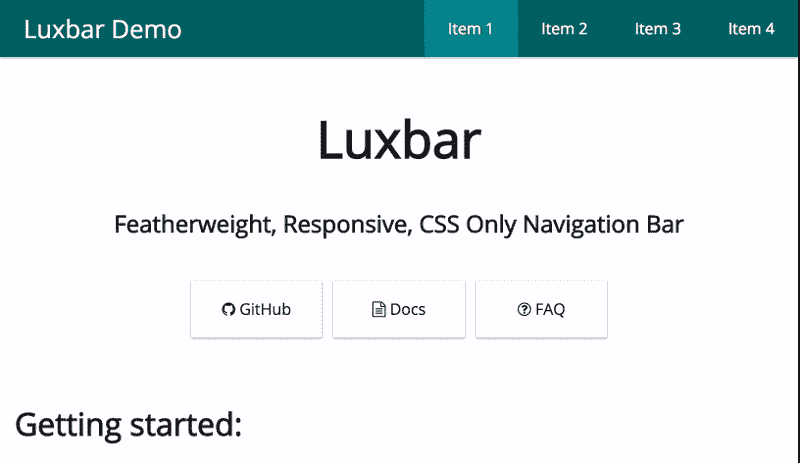
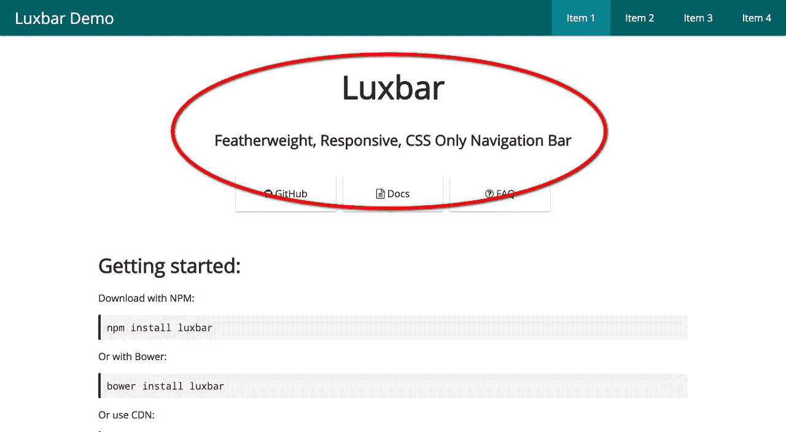
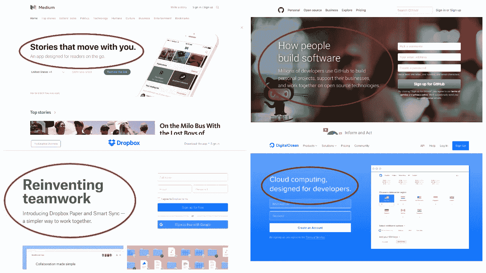
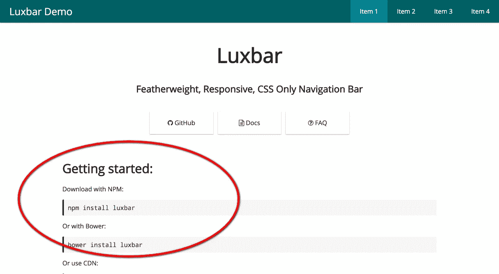
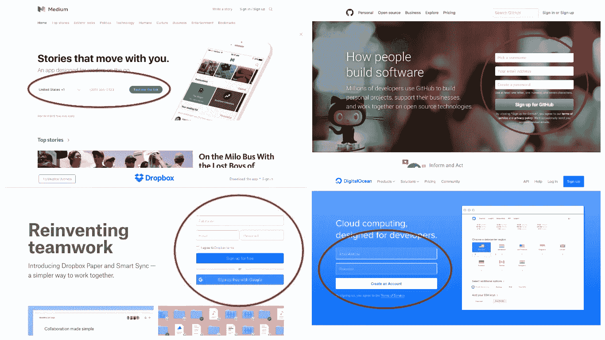
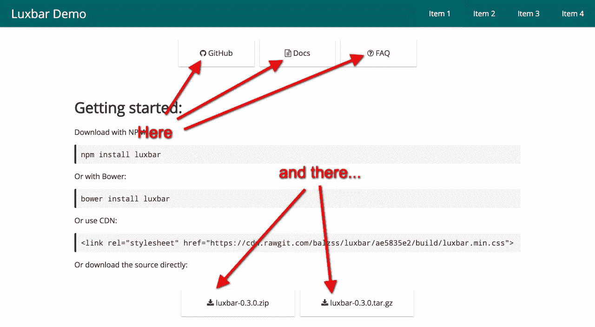
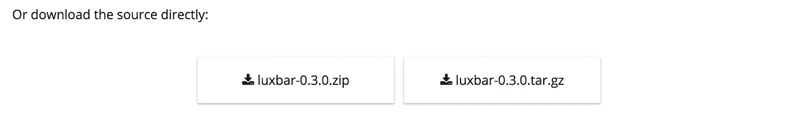
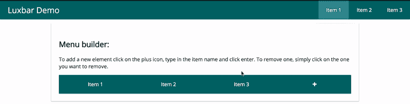
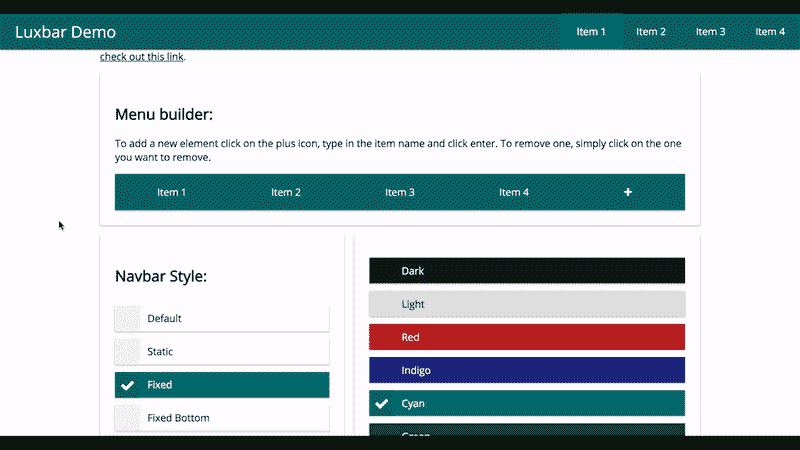
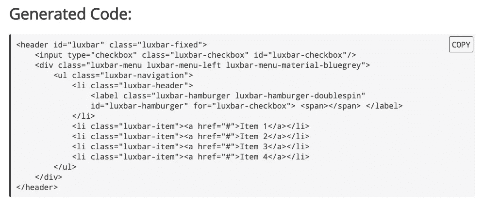

# 一个交互式文档如何帮助我在 Github repo 上获得 450 多颗星

> 原文：<https://medium.com/hackernoon/how-an-interactive-documentation-helped-me-get-450-stars-on-my-github-repo-f14816b95fdd>

# 简要介绍:

几个月前，我制作了一个 [CSS 库](https://github.com/balzss/luxbar)来使创建导航条变得更加容易，因为大多数时候你需要从导航条中得到同样的东西:

*   看起来不错
*   变轻
*   反应灵敏

所以我把一个 navbar 可以拥有的最通用的特性打包到一个 CSS 库中，放在 Github 上。但是后来我意识到阅读关于 web 组件用法的文档不会改进任何人的开发过程。我的解决方案是设计一个简单易用的**交互文档**，从打开项目主页到拥有工作代码的时间不到几分钟。在这篇文章中，我将回顾我在 UX 做出的所有决定，让每个用户都能动态体验我的库。[这是页面](https://balzss.github.io/luxbar/)，如果你想提前查看，我会附上截图。

and here is how it looks

# 那个导航条看起来奇怪吗？这是故意伪造的

如果你仔细看看导航栏上的菜单项，你可能会发现它们有点奇怪。他们都被称为“项目”，然后是一个像现代的[燕谭泰斯拉](https://www.wikiwand.com/en/Yan_tan_tethera)的数字。这是故意的:我想让它看起来像假的。这就是我展示产品的方式:把它放在它应该放的地方，并实时显示所有的定制(稍后会详细介绍)。然而，因为导航栏是页面的一部分，所以它不会被“主页”或“关于”这样的标签所注意，所以这就是项目名称背后的原因。

# 马上进入正题

你有没有在一个网站上看到一个办公室的全屏图片，上面有一些神秘的引用，比如:

> 行动是所有成功的关键。

如果我想要不到三分钟的体验，我真的不能浪费我的访问者的时间，强迫他们从我的激励性欢迎信息中找到出路，以获得一些关于图书馆的实际信息。我认为我的“在你面前”足以让人接受。

notice how I moved the actual navigation menu below the slogan

以下是一些其他(更大的)网站如何做到这一点的例子:

Medium (upper left), GitHub (upper right), Dropbox(bottom left), DigitalOcean(bottom right)

# “什么”后面的“如何”

好了，我们已经完成了*什么*部分，我们可以继续进行*如何*了。这是页面上的两个主要内容，所以我确保它们在折叠线上方。这不是完整的入门指南，但足以吸引你。

你也可以在其他网站看到这一点:

same sites as before

# 文本和图像:图标

如果一张图片抵得上一千个单词，那么一个图标就相当于三四百个单词。虽然在页面尺寸上很轻，但它也比图片更不引人注意，这一点非常重要，因为内容是文本形式的，我不想用一些股票办公室的图片分散访问者的注意力。所以我小心翼翼地在这里和那里放了一些图标。

I used [font awesome](http://fontawesome.io/) btw

# 复制获胜按钮

选择文本是乏味的。按快捷键不那么单调乏味，但仍然不够。按下按钮？当然，我想这么做！所以我在代码区旁边添加了复制按钮，将代码复制到你的剪贴板上，但是它们使页面更加繁忙，这意味着潜在的速度下降(UX 明智)。解决方案:复制按钮是隐藏的，只有当您将鼠标悬停在文本区域上时才会出现(这意味着您想要复制其内容，因此指示了揭开复制按钮的正确时间)。我还添加了一个工具提示，当你点击它们时作为反馈，让用户知道代码确实被复制了(这就像一个伪触觉反馈)。

strangely the recording software doesn’t show the cursor as a pointer on the button, but trust me it is a pointer

# 那些下载按钮真的是下载按钮

我认为很多页面对下载按钮的处理都很糟糕。有时你希望马上得到文件，但却得到了一个额外的页面，上面有真正的下载按钮。其他时候，您希望看到某种下载页面，其中包含您想要的文件的更多信息，但是下载会在没有任何警告的情况下立即开始。为了避免这种情况，我把文件扩展名放在按钮的标签上，以表明按钮将开始下载，而不仅仅是打开一个页面。

I think the icons also help

# 互动部分

正如我在文章开头所说，导航条只有一个目的:在一个“自然”的地方向你展示所有可能的选项。

## 菜单生成器

在 menubuilder 中，你可以“填充”你的菜单名，这样以后你就不必在文档中寻找正确的位置了。加号对于添加元素来说非常明显，点击它们会让它们消失。用户如何知道这一点？首先，在元素的正上方有一个信息框，其次，如果鼠标悬停在项目上，在项目上打一个 X。

## 选项选择器

每个可能的选项都有一个单选按钮。为了更清楚，我预先选择了所有默认选项。点击它们会立即改变导航条，这样用户就可以尝试所有的选项。

## 编码发生器

如果我就此打住，一切都是徒劳，所以我加入了一个“生成代码”面板，它以 HTML 格式显示导航栏的当前状态，并即时更改(还有复制按钮)。

# 最后的想法

演示页面仍在进行中，有改进的地方，但我希望我可以给你一些我所做的决定的想法。如果你对这篇文章有任何反馈，请在这里告诉我，或者如果你对图书馆本身有任何反馈，你可以留在这里或发电子邮件给我，地址是 balazs.saros@gmail.com 的 T2。

**感谢阅读！:)**