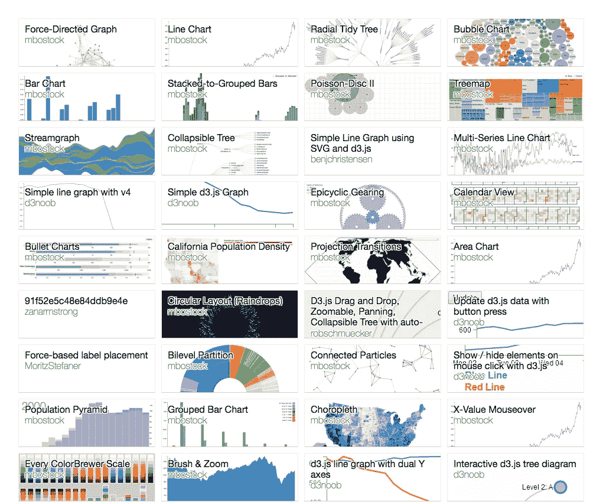
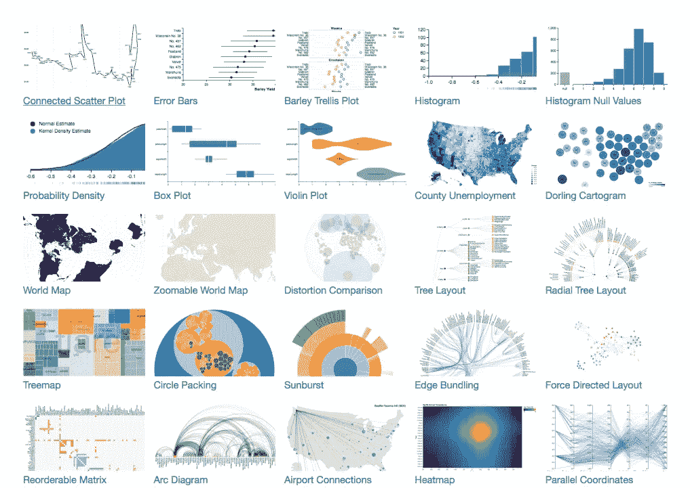
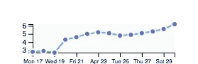
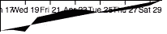
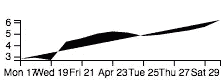
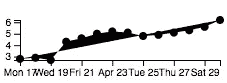

# 如何(以及为什么)在 React 中使用 D3

> 原文：<https://medium.com/hackernoon/how-and-why-to-use-d3-with-react-d239eb1ea274>

如果您计划构建一个包含多个简单数据可视化的 React 应用程序，您可能会希望选择一种方法:

*   有良好的文档记录，经过验证，并且正在积极开发中
*   有一个相对富于表现力的界面——这意味着它可以让你用足够的冗长来编写自定义的数据图形，以表达你想要的东西
*   与 React 配合得很好——也就是说，它不需要直接改变 DOM
*   给你足够的自由来定制它，以适应你的应用程序的需求和视觉风格

根据上述标准，这些是我认为的最佳选项(排名不分先后):

*   [https://github.com/d3/d3](https://github.com/d3/d3)
*   https://github.com/vega/vega
*   【https://github.com/FormidableLabs/victory 
*   [https://github.com/recharts/recharts](https://github.com/recharts/recharts)

> 注意:有一些项目，像 [react-chartjs](https://github.com/reactjs/react-chartjs) 、 [react-d3-components](https://github.com/codesuki/react-d3-components) ，以及其他一些似乎没有被积极维护的项目，提供了高级 react 图表组件。如果这些适合你的应用程序，那么你当然可以使用它们！

# 比较选项

## D3

首先，我认为 [D3](https://hackernoon.com/tagged/d3) 是 web 上数据可视化的标准库。这是 Github 上“数据可视化”最受欢迎的结果，领先 50k 颗星。要了解它的能力，只需查看一下迈克·博斯托克的 bl.ocks。

[https://bl.ocks.org/mbostock](https://bl.ocks.org/mbostock)

## 低湿平原

看起来 Vega 和 D3 的表现力不相上下(毕竟，它是 D3 的包装器)。Vega 最棒的一点是，它让您可以用声明性语法编写很多可以在 D3 中编写的内容。

[Some Vega examples](https://vega.github.io/vega/examples/)

需要注意的是，使用 Vega 的传统方式似乎是让它改变 DOM。这类似于使用 D3 的约定，但是很快我们将看到如何使用 D3 的库来缩放数据，将其映射到 SVG 路径数据，然后返回一个元素树，就像在任何普通的 [React](https://hackernoon.com/tagged/react) 组件中一样。我不知道你和维嘉会怎么做。

## 胜利和欢呼

Victory 和 Recharts 都公开了高级图表组件，以及一些低级图表“部件”，如轴、工具提示等。虽然这些肯定与 React 配合得很好，但为了定制和表达，我更喜欢 D3 的[“图形理论”](/@mbostock/introducing-d3-scale-61980c51545f#---451-526)方法。我认为，当你控制缩放数据和渲染时，相对于受更高级组件接口的支配，你可以做更多的事情。

可能我只是受到了大量使用 D3 制作的令人惊叹的图形的影响，使用 Victory 和 Recharts 也有可能制作出同样出色的图形。然而不幸的是，如果我被困住了，我不认为我会有像使用 D3 那样多的资源来获得帮助。

# 使用 D3 的库做所有的事情 ***除了*** 渲染 DOM 节点

D3 由 30 个库组成。我浏览了每一个的源代码，找出哪些在某种程度上依赖于 DOM，哪些完全独立于 DOM。

大多数(22/30)的 D3 APIs 没有任何与 DOM 直接联系的函数！

*   `[d3-array](https://github.com/d3/d3-array)`
*   `[d3-chord](https://github.com/d3/d3-chord)`
*   `[d3-collection](https://github.com/d3/d3-collection)`
*   `[d3-color](https://github.com/d3/d3-color)`
*   `[d3-dispatch](https://github.com/d3/d3-dispatch)`
*   `[d3-dsv](https://github.com/d3/d3-dsv)`
*   `[d3-ease](https://github.com/d3/d3-ease)`
*   `[d3-force](https://github.com/d3/d3-force)`
*   `[d3-format](https://github.com/d3/d3-format)`
*   `[d3-hierarchy](https://github.com/d3/d3-hierarchy)`
*   `[d3-interpolate](https://github.com/d3/d3-interpolate)`
*   `[d3-path](https://github.com/d3/d3-path)`
*   `[d3-polygon](https://github.com/d3/d3-polygon)`
*   `[d3-quadtree](https://github.com/d3/d3-quadtree)`
*   `[d3-queue](https://github.com/d3/d3-queue)`
*   `[d3-random](https://github.com/d3/d3-random)`
*   `[d3-request](https://github.com/d3/d3-request)`
*   `[d3-scale](https://github.com/d3/d3-scale)`
*   `[d3-time](https://github.com/d3/d3-time)`
*   `[d3-time-format](https://github.com/d3/d3-time-format)`
*   `[d3-timer](https://github.com/d3/d3-timer)`
*   `[d3-voronoi](https://github.com/d3/d3-voronoi)`

上述 API 可用于将数据转换成可映射到 React 元素的形式，这些元素将用于构建图形。

在我们举例之前，我们将列出*访问或改变 DOM 的(8/30)D3 API。这些*中的一些*可以与 React 一起使用，但有一些限制(例如，绕过一两个函数，或者小心地使用 refs 来选择节点，并允许 D3 对它们进行变异)。*

*   `[d3-axis](https://github.com/d3/d3-axis)`
*   `[d3-brush](https://github.com/d3/d3-brush)`
*   `[d3-drag](https://github.com/d3/d3-drag)`
*   `[d3-geo](https://github.com/d3/d3-geo)`
*   `[d3-selection](https://github.com/d3/d3-selection)`
*   `[d3-shape](https://github.com/d3/d3-shape)`
*   `[d3-transition](https://github.com/d3/d3-transition)`
*   `[d3-zoom](https://github.com/d3/d3-zoom)`

# 示例:编写复合火花线/散点图组件

例如，让我们做一个简单的时间序列可视化，它是一个带有笛卡尔轴和一些样式的火花线和散点图的组合。

Let’s make this with React and D3!

> 以下是 github 回购协议，以防你想直接进入来源:[https://github.com/AnalyticalFlavorSystems/d3ReactExample](https://github.com/AnalyticalFlavorSystems/d3ReactExample)。

我为 Analytical Flavor Systems 的一个应用程序制作的这个示例图表绘制了过去 14 天产品的感知质量(0-7)。数据如下:

## 设计组件接口

我们的`TimeSeriesSparkLineScatterPlot`组件应该是可重用的，所以我们应该把它设计成接受任何类型对象的数组。为了支持这一点，我们将给予它道具`data`、`selectX`和`selectY`。既然它渲染了一个 SVG，我们也应该给它维度属性`width`和`height`。它的界面现在看起来像这样:

## 编写组件

让我们开始吧…我们将从编写一个组件开始，该组件从我们提出的接口中获取道具。

看起来不错！现在让我们为火花线生成一个 SVG 路径，然后为火花线渲染一个组和路径。

That’s a start :)

那有点丑，但是看起来很准。我们会等到最后再添加样式。让我们添加一些轴。现在，记住`d3-axis`在“确实改变了 DOM”列表中…让我们看看如何在我们的组件中使用它:

> **警告**:如果我们的数据更新了，我们的轴不会被重新渲染，因为我们使用 D3 在它们挂载时直接渲染到它们的组节点中。一个解决方法可能是**为每个轴组添加一个** `**key**` **，当数据更新时**该轴组发生变化。这将导致它们的节点被卸载，新的节点被装载，然后轴将被再次渲染。也许这是个坏主意...我将感谢反馈！

Hmm….

好的，看起来我们的 y 轴正在渲染，但是它的内容超出了我们的 SVG 的范围。还有，我们的 x 轴在上面？！

`[d3-axis](https://github.com/d3/d3-axis#api-reference)` [自述](https://github.com/d3/d3-axis#api-reference)中说*“不管方向如何，轴总是在原点渲染。”*D3 惯例是在内容周围手动添加一个边距，并将 y 轴向下平移到底部。

添加页边空白并没有真正有趣到可以浏览的程度。我编写了一个组件来处理在 SVG 内容周围添加空白，称为`[SVGWithMargin](https://github.com/AnalyticalFlavorSystems/d3ReactExample/blob/master/src/components/SVGWithMargin/index.js)`。

太好了！让我们在内容周围添加一个边距，并将 x 轴移动到内容的底部:

Much better.

太棒了，现在让我们添加散点图。我们将获得数据的缩放点，并在每个点上绘制一个圆:

Nice!

就是这样！现在，如果我们添加一些类名(看一看[完成的组件文件](https://github.com/AnalyticalFlavorSystems/d3ReactExample/blob/master/src/components/TimeSeriesSparkLineScatterPlot/index.js))以及一些 CSS:

我们得到这个:

That was easy!

# 结论

大多数 D3 库不依赖于 DOM。这意味着你可以把它们和 React、React Native 或者其他完全不同的东西一起使用。

我希望这个条目是令人愉快的和信息性的。如果这种事情是你的拿手好戏，我们正在[分析风味系统](https://www.gastrograph.com/)发展我们的团队，我们很乐意进行对话；)

我们仍然处于探索 D3 和 React 的可能性的早期阶段。我非常想听听其他在 React 中进行数据可视化的人的经历——请随意发表评论，链接到你写的相关帖子，或者在 Twitter 上 ping 我[@ dans can](https://twitter.com/danscan)。

# 灵感

感谢 [Joel Burget](https://twitter.com/dino_joel) 在他的 [*D4* 示例报告](https://github.com/joelburget/d4)中展示了将 D3 的一些 API 与 React 一起使用的可能性。

> [黑客中午](http://bit.ly/Hackernoon)是黑客如何开始他们的下午。我们是 [@AMI](http://bit.ly/atAMIatAMI) 家庭的一员。我们现在[接受投稿](http://bit.ly/hackernoonsubmission)，并乐意[讨论广告&赞助](mailto:partners@amipublications.com)机会。
> 
> 如果你喜欢这个故事，我们推荐你阅读我们的[最新科技故事](http://bit.ly/hackernoonlatestt)和[趋势科技故事](https://hackernoon.com/trending)。直到下一次，不要把世界的现实想当然！

