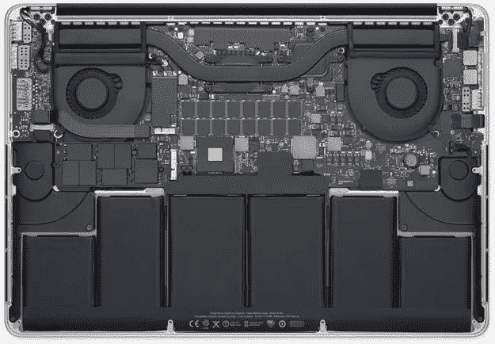

# 如何以及为什么你应该清理你的电脑

> 原文：<https://medium.com/hackernoon/how-and-why-you-should-clean-your-computer-e26d4281fc93>

清理我的[电脑](https://hackernoon.com/tagged/computer)？你是说擦拭屏幕，擦掉按键上的奇多污渍，对吗？

玩笑归玩笑，这是一个严肃的公共服务公告…

# **清理你的电脑！**

当我看到一台电脑的按键在你打字时被粘住，一层薄薄的油脂和灰尘覆盖着屏幕的每一寸时，我总是很难过。

# 为什么？

清理你的电脑不仅仅是在别人用你的键盘打字时不让他们呕吐，这是对电子设备的尊重。对我们大多数人来说，我们的电脑是我们个人的延伸。我们一天中的大部分时间都在使用它，然而我们中的许多人却不敢打开它来好好清洁一下。

我用一台 [Macbook](https://hackernoon.com/tagged/macbook) Pro 工作，一天中的大部分时间我都在这台电脑前。我记得我第一次打开它，看到了 Macbook 的内部结构。这让我对机器有了全新的认识。太美了。说真的，如果你没有看过 Macbook 的内部，我强烈建议你看一看。我想我认为这相当于一个汽车爱好者在引擎盖下看到了一台漂亮的发动机。

需要另一个理由吗？

# 表演

你有没有注意到你的电脑用的时间越长，它似乎越慢？这有许多原因，其中之一是内部灰尘堆积。

清除这些灰尘将有助于您的计算机更好地管理热量。你的电脑温度越低，运行越好。如果你曾经打开过一台非常旧的电脑，看到过可能堆积的灰尘，你就会知道我在说什么。相信我。不好看。大约每个月清理一次电脑上的灰尘，可以大大提高电脑的性能，使其保持最佳状态。

# 怎么会？

开始清理电脑之前，请先关机！

# 简单的东西

电脑上最容易清理的就是屏幕和键盘。抓起一块超细纤维布([我在亚马逊上的最爱](https://www.amazon.com/gp/product/B008FPTID2/ref=as_li_tl?ie=UTF8&camp=1789&creative=9325&creativeASIN=B008FPTID2&linkCode=as2&tag=casualmaste00-20&linkId=52c5764606aabfb73b46c3f133659721))，稍微沾湿。用那块布擦拭你的屏幕和键盘。尽最大努力不让水进入任何一个洞。

*需要注意的是，您应该只将水放在布上，而绝不要直接放在您的电脑上！！！*

你不需要任何花哨的屏幕清洁剂，只需用水和一块好布就能让你的屏幕看起来像新的一样。

# 深入挖掘

好吧，那很简单。现在来看更重要的东西。

至少我会建议你打开电脑的后面板，用压缩空气罐清除风扇和散热片上的灰尘。

我建议买一套好的工具和一包好的压缩空气。你可以在亚马逊这里找到我用的:[螺丝刀](https://www.amazon.com/gp/product/B009MKGRQA/ref=as_li_tl?ie=UTF8&camp=1789&creative=9325&creativeASIN=B009MKGRQA&linkCode=as2&tag=casualmaste00-20&linkId=f749420441141caa000816047c57498f)和[压缩空气](https://www.amazon.com/gp/product/B00DZYEXPQ/ref=as_li_tl?ie=UTF8&camp=1789&creative=9325&creativeASIN=B00DZYEXPQ&linkCode=as2&tag=casualmaste00-20&linkId=af1d30f162ade82bfd42cef446b92b1c)。

如果你对打开电脑感到紧张，我强烈推荐你在 Youtube 上看一些 iFixit 视频，熟悉一些基本技能。这真的很简单，对于我的 Macbook 来说，它是 10 个螺钉，2 分钟的吹灰时间，我就完成了。

就这样，这就是给你的电脑做一次例行清理所需要的一切。如果你有任何你认为你现在可以解决的其他修复或修理，这将是一个很好的时间来解决这些问题。再次，我推荐任何与 Mac 相关的 [iFixit](https://www.ifixit.com/) 教程。

# 该不该清理软件？

对于苹果电脑，你不需要任何软件清理程序。虽然，给它一个好的组织是有益的。在我的整个工作周中，可以看到我的桌面上慢慢堆积着不同的文件，我只是为了方便才把它们拖到那里。周末清理和整理我的电脑有助于我重新整理我的工作空间，也让我每周都有一个新的开始。

你可以很容易地把你的电脑带到 Genius Bar 或某个地方，让专业人员清洗它，如果你真的不想自己动手，我鼓励你这样做。话虽如此，我还是要挑战你自己去做。

延伸阅读:

*   [肮脏 Mac 的神话](http://www.thesafemac.com/the-myth-of-the-dirty-mac/)
*   [苹果官方清洁建议](https://support.apple.com/en-us/HT204172)

推荐工具:

*   [螺丝刀](https://www.amazon.com/gp/product/B009MKGRQA/ref=as_li_tl?ie=UTF8&camp=1789&creative=9325&creativeASIN=B009MKGRQA&linkCode=as2&tag=casualmaste00-20&linkId=f749420441141caa000816047c57498f)
*   [压缩空气](https://www.amazon.com/gp/product/B00DZYEXPQ/ref=as_li_tl?ie=UTF8&camp=1789&creative=9325&creativeASIN=B00DZYEXPQ&linkCode=as2&tag=casualmaste00-20&linkId=af1d30f162ade82bfd42cef446b92b1c)
*   [超细纤维布](https://www.amazon.com/gp/product/B008FPTID2/ref=as_li_tl?ie=UTF8&camp=1789&creative=9325&creativeASIN=B008FPTID2&linkCode=as2&tag=casualmaste00-20&linkId=52c5764606aabfb73b46c3f133659721)

*原载于 2016 年 11 月 19 日*[*blog.seankilgarriff.com*](https://blog.seankilgarriff.com/how-and-why-you-should-clean-your-computer/)*。*

[*提交修正*](https://github.com/Skilgarriff/Blog-Posts) *。*

> [黑客中午](http://bit.ly/Hackernoon)是黑客如何开始他们的下午。我们是 T21 家庭的一员。我们现在[接受投稿](http://bit.ly/hackernoonsubmission)并乐意[讨论广告&赞助](mailto:partners@amipublications.com)机会。
> 
> 如果你喜欢这个故事，我们推荐你阅读我们的[最新科技故事](http://bit.ly/hackernoonlatestt)和[趋势科技故事](https://hackernoon.com/trending)。直到下一次，不要把世界的现实想当然！

