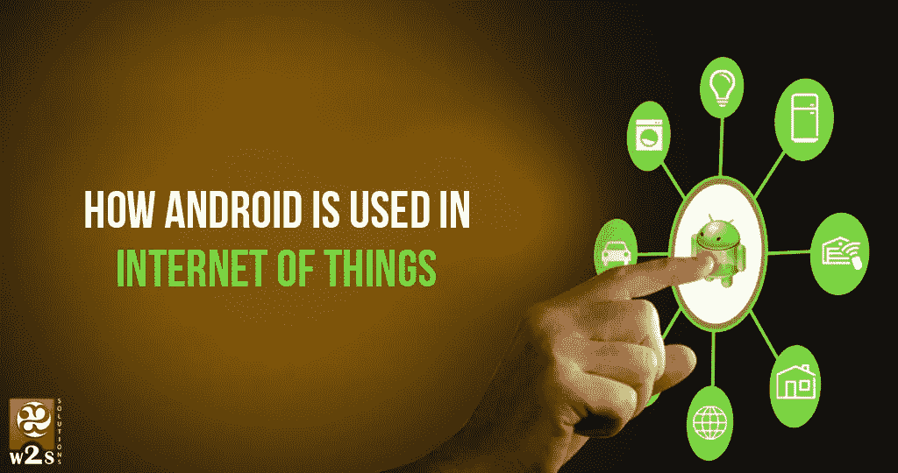

# Android 在 IOT 的使用情况

> 原文：<https://medium.com/hackernoon/how-android-is-used-in-iot-85c3e560d369>

这曾被认为是科幻小说的素材。但“物联网”(IOT)已经在这里，并在快速增长。简单地说，IOT 指的是互联网上不同智能设备的互联性越来越强。这些设备具有传感器和互联网连接，允许它们接收、收集和传输信息。

各种各样的设备已经上市，随着开发者致力于增加家庭和办公室中电子设备的连接性，将会有更多的设备发布。今天，你可以通过智能手机轻松控制你的冰箱、跑步机、智能电视或烤面包机。

然而，只有当这些设备能够在一个平台上运行时，IOT 才成为可能。进入安卓。

***安卓为何成为 IOT*的主要驱动力**

快速浏览一下市场就会发现，大多数智能设备都运行谷歌的操作系统，Android。熟悉智能手机的人也熟悉操作系统。它是目前世界领先的移动设备操作系统，逐渐取代了 iOS。截至 2013 年，安卓智能手机的销量是苹果 iPhones 的 4 倍。

然而，战争并没有随着智能手机而停止。对互联设备的需求不断扩大，推动了这一争夺战，而 Android 正在冲锋陷阵。IOT 的世界是为安卓创造和管理的。

**安卓走在前列有各种原因:**

**1。Android 是一个通用的前端，开发者可以在这里工作**

Android 作为一个软件平台迅速崛起，主要是因为谷歌(其背后的公司)选择将它交给开发者和设备制造商。基于 Linux 的软件是开源的，因此几乎任何人都可以使用它的源代码，并对其进行定制，以用于他们能想到的任何小工具。

如今，依赖 Android 作为操作系统的设备数量众多。如此大量的设备运行在 Android 上，很容易看出 Android 是如何作为 IOT 的前端的。为 IOT 开发设备既容易又便宜，让消费者买得起。

**2。应用驱动 IOT**

小玩意就是小玩意。然而，有了合适的应用程序和软件来帮助它运行和执行不同的任务，它会变得更加强大。应用程序使得使用 IOT 设备成为可能。Android 是目前全球最大的应用平台。据报道，截至 2016 年 12 月，谷歌 Playstore 托管了超过 260 万个应用。Android 推动了 IOT 运动，这并不奇怪。

**3。IOT 正在 Java 上构建**

许多 IOT 设备都是基于 Java 构建的。因此，Android 正在推动 IOT 市场是有道理的。Android 允许以一种有意义的方式应用 JAVA，而不是使用需要专用设备的嵌入式 Java。

***安卓 IOT 生态系统***

要了解 Android 在 IOT 的应用，你必须了解 IOT 的生态系统以及 Android 在其中的作用。

**传感器**

传感器检测温度等物理属性，并生成数字信号。许多硬件厂商依赖于特定的领域，如 Linux、Android 和 Windows。Android 的流行和可用性使其在这一领域轻而易举地胜出。Android 是开源的，可以在任何设备上使用，这使得它成为设备制造商的热门选择。

**数据传输**

必须有一个支持传感器数据传输的组件。对此可用的两个最简单的选项是 MQTT 和 XMPP。Android 支持这两种开源实现。这些库可以在 Windows、Linux 和 Android 上使用。

**装置**

必须有一种设备或处理器，其操作系统支持 IOT 生态系统的组件。这应该是一个小而便携的设备，不会消耗太多的能量，但可以提供连续的连接。在许多情况下，廉价的 Android 设备被选择用于此。Android 设备满足支持多种传感器的要求。还有各种教程可以帮助开发人员。

**程序**

必须有一个程序接收数据并存储它。这可以采用标准 Linux 服务器的形式。该服务器接收数据，解码并处理数据。这些数据可用于后续分析。

毫无疑问，Android 是 IOT 设备背后的主要驱动力。如果你打算开发 IOT 应用，请联系安卓应用开发者。

> [黑客中午](http://bit.ly/Hackernoon)是黑客如何开始他们的下午。我们是阿妹家庭的一员。我们现在[接受投稿](http://bit.ly/hackernoonsubmission)并乐意[讨论广告&赞助](mailto:partners@amipublications.com)的机会。
> 
> 如果你喜欢这个故事，我们推荐你阅读我们的[最新科技故事](http://bit.ly/hackernoonlatestt)和[趋势科技故事](https://hackernoon.com/trending)。直到下一次，不要把世界的现实想当然！

