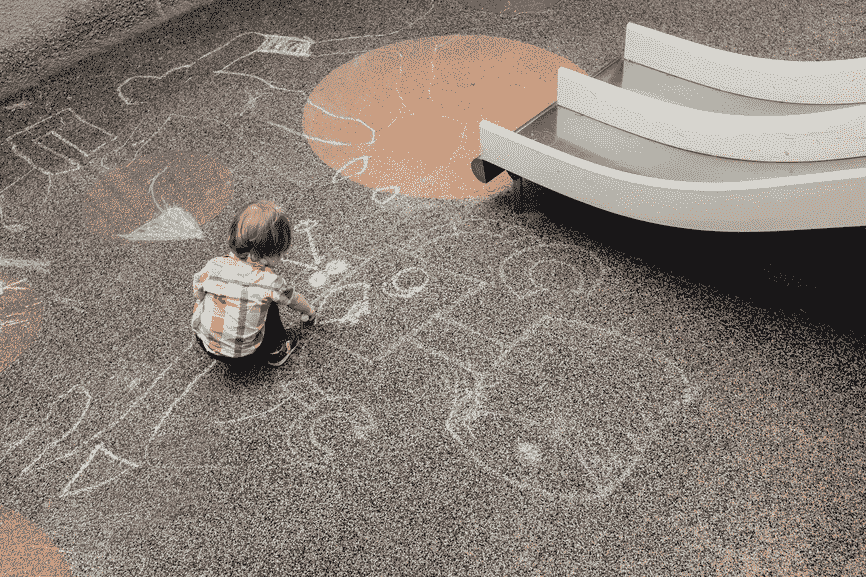

# 展示任何人都可以做出好得惊人的幻灯片

> 原文：<https://medium.com/hackernoon/how-anyone-can-make-insanely-better-slides-2398b5c3731c>

[*原文发表于此*](http://www.sean-johnson.com/anyone-can-make-insanely-better-slides/) 。

我妻子[给我看她最近参加的一个会议的幻灯片。我确信这些材料很棒，但我并没有通过阅读来发现。这些幻灯片真的让我的眼睛流血了。](https://hackernoon.com/tagged/showing)

在我作为一家早期风险投资基金的合伙人和一家数字咨询公司的合伙人之间，我实际上生活在主题演讲中。创建提案、阅读宣传资料、进行演示。

## 制作好的幻灯片是一项需要培养的巨大技能。这会让你的内部陈述更有说服力。这将帮助你赢得更多业务或完成那轮融资。它会加速你的职业生涯。

毫无疑问，你在会议和其他活动中见过华丽的演示，但不知道如何制作。

但是你不需要知道如何为你的日常工作做这样的陈述。你需要的是一些简单的技巧来擦亮你的甲板。使副本更具可读性。让表格和图表更有用。讲述你想要讲述的故事。

这副牌是我试图帮助你的。

我很想听听你的想法——如果你有其他改进幻灯片的想法，请告诉我。如果你觉得这个有用，请推荐！

> [黑客中午](http://bit.ly/Hackernoon)是黑客如何开始他们的下午。我们是阿妹家庭的一员。我们现在[接受投稿](http://bit.ly/hackernoonsubmission)并乐意[讨论广告&赞助](mailto:partners@amipublications.com)的机会。
> 
> 如果你喜欢这个故事，我们推荐你阅读我们的[最新科技故事](http://bit.ly/hackernoonlatestt)和[趋势科技故事](https://hackernoon.com/trending)。直到下一次，不要把世界的现实想当然！

