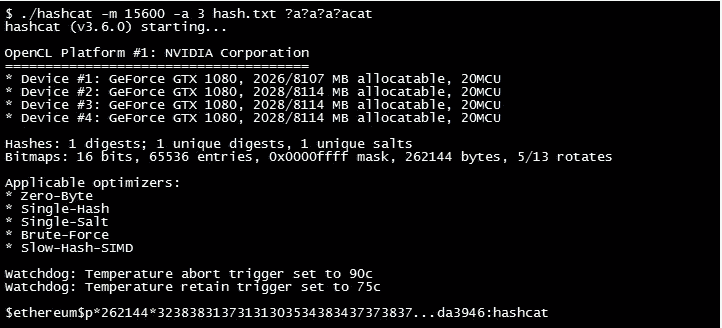
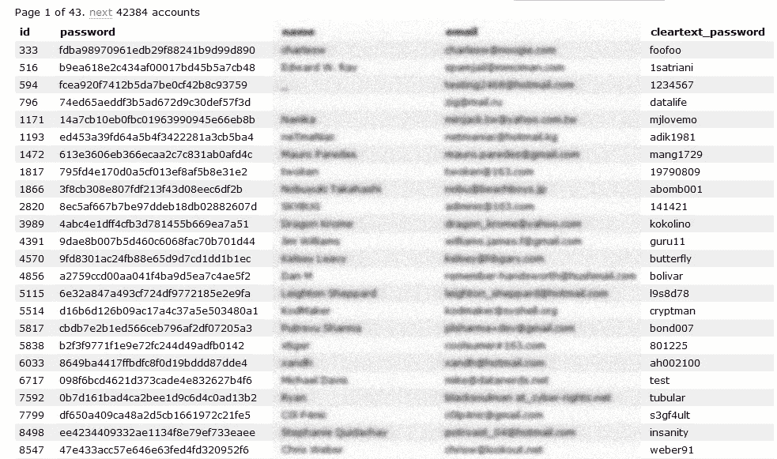

# 人工智能如何用于密码猜测

> 原文：<https://medium.com/hackernoon/how-artificial-intelligence-can-be-used-for-password-guessing-cf4fd4184a46>

密码猜测有效是因为…

> 人类是可预测的

如果你让马克设置密码。他会简单地称之为“马克”。现在系统告诉他，他的密码必须包含数字。他称之为“马克 123”。尽管你很聪明，不会设置如此不安全的密码，但还是有很多人和马克一样。

Leaked passwords from Rootkit

你可以看到泄露密码的模式。其中大多数可能是一个或多个名、姓、出生日期或喜爱的实体(汽车、自行车、男演员、女演员等的名称)的组合。

HashCat 或 John the Ripper 等密码猜测工具通常使用字典攻击和密码生成规则来猜测密码。字典攻击就是将字典中的单词作为密码输入，一个接一个地尝试，看看哪一个有效。

使用密码生成规则的字典攻击是通过手动检查泄露的密码列表并制定密码生成规则来完成的。例如:如果发现泄露的密码是实体和 123 的组合，就说“ford123”。那么将 123 连接到词典单词就是生成规则。

在密码猜测工具中，这些是手动定义的，或者换句话说，它们是人类定义的规则。这些规则的问题在于，人类的行为和兴趣会随着时间而变化。所以这些规则必须经常更新(因为会发生更多的泄漏)。此外，当泄漏密码的列表很大时，手动查找模式将是一个困难的过程。有些模式很有可能被忽视。

这就是人工智能的作用所在。最近，很少有研究人员用泄露密码的数据集训练神经网络，并能够生成比 HashCat 和 John the Ripper 等流行工具更好的密码。

如果你不理解神经网络这个术语，就把它想象成可以复制人类学习方式的计算机程序。人类通过建模和观察来学习。如果我给你看一个人的四张照片，告诉他他是‘马克’。下次你会很容易认出他。神经网络帮助计算机复制同样的东西。

研究人员使用生成对抗性神经网络(GANs)来实现这一点。GANs 由两个神经网络组成。一个神经网络用于生成，另一个提供反馈。就当是师徒吧。一个学生尝试做一些事情，然后老师给出反馈，说“*你需要再尝试一下*”或者“*你快成功了*”等等。这些神经网络运行多次迭代，直到得到满意的结果。

这使得该过程完全自动化。研究人员还观察到，尽管在某些情况下神经网络无法匹配准确的密码，但生成的密码看起来像给定的密码。例如:如果密码是“AEF@123”，生成的密码是“A3F@123”。

从好的方面来看，我们可以通过识别弱密码或可预测的密码来使基于密码的系统更加安全。如果你想了解技术细节，这里有一篇研究论文[密码猜测的深度学习方法](https://arxiv.org/abs/1709.00440)。

> 关注哈克农和我([费宾·约翰·詹姆士](https://medium.com/u/75a616711f4e?source=post_page-----cf4fd4184a46--------------------------------))了解更多故事。我还在写一本书，以提高对蓝鲸挑战的认识，蓝鲸挑战已经夺去了几个国家许多青少年的生命。它旨在帮助父母了解黑暗网络的威胁，并采取行动确保他们孩子的安全。《T4 与蓝鲸战斗》这本书可以在亚马逊上预购。书名将于本月 25 日发布。