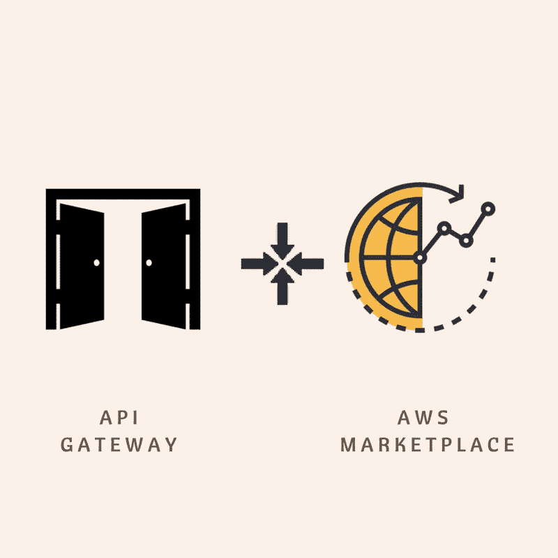

# AWS SaaS 创业公司如何从 API 网关和 AWS 市场整合中获益

> 原文：<https://medium.com/hackernoon/how-aws-saas-startups-can-benefit-from-api-gateway-and-aws-marketplace-integration-f4095e8d92ff>

亚马逊网络服务在上个月宣布整合 AWS 市场和 API 网关。

现在让我们来看看这将如何帮助 AWS SaaS 的创业公司

AWS 市场有超过 3500 个软件上市和超过 10 万用户的活跃客户群。现在，您可以直接访问 AWS 客户群。一个接触客户的新渠道。其次，AWS 已经承担了管理计费的重任。这降低了你在市场营销和维护方面的努力。

你可以从这些简单的步骤开始。我认为你已经有了建立在 [API 网关](https://aws.amazon.com/api-gateway/)上的 API。

1.  确定要在 AWS 市场上销售的 API
2.  将 API 打包到使用计划中(例如，在白银计划中，您可以提供 1000 个 API 调用，黄金计划提供 10，000 个 API 调用等)
3.  为用户提供开发人员门户以访问他们的 API。AWS 在这里[已经为你做了一个参考实现](https://github.com/awslabs/aws-api-gateway-developer-portal)。[以下是生成开发人员门户的分步过程](https://aws.amazon.com/blogs/compute/generate-your-own-api-gateway-developer-portal/)。
4.  在 [AWS 市场](https://aws.amazon.com/marketplace/)注册为卖家。
5.  提交产品装载表。如果你已经完成了上述步骤，你已经有了一切需要的 API 描述，使用计划，开发者门户链接等。
6.  我们将为您提供 AWS 产品代码。现在登录到 API 网关，使用相关的产品代码订阅 API 并进行测试。
7.  确认一切是否正常。提交以供审批。

> [黑客午间](http://bit.ly/Hackernoon)黑客们就是这样开始下午生活的。我们是 [@AMI](http://bit.ly/atAMIatAMI) 家族的一员。我们现在[接受提交](http://bit.ly/hackernoonsubmission)并乐于[讨论广告&赞助](mailto:partners@amipublications.com)机会。
> 
> 如果你喜欢这个故事，我们推荐你阅读我们的[最新科技故事](http://bit.ly/hackernoonlatestt)和[趋势科技故事](https://hackernoon.com/trending)。直到下一次，不要把世界的现实想当然！

