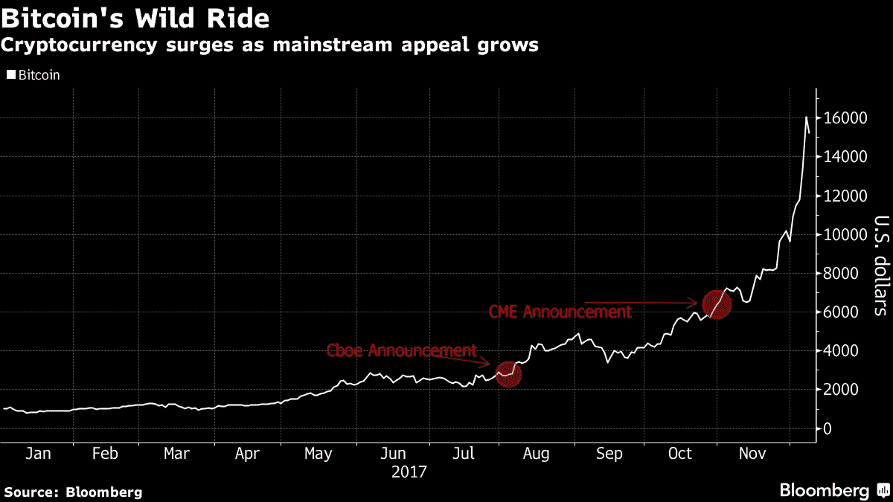

# 比特币期货将如何影响 BTC 的价格

> 原文：<https://medium.com/hackernoon/how-bitcoin-futures-will-affect-btcs-price-bcf296887d89>

Image courtesy of Pexels

强制性免责声明:修改蒂姆·费里斯(Tim Ferris)的一句话，“我不是财务顾问，在没有咨询合格的专业人士之前，任何建议都不应该采纳。此外，我的成绩[很可能]完全是因为运气和零技能。”

明天晚上，比特币期货将可以在 Cboe 上进行投资，我们所知道的加密世界将不再相同。

对于密码领域的长期爱好者来说，比特币的最终老板是华尔街和传统银行系统已经不是什么秘密了。这是一场旷日持久的战斗，投资界既恐惧又无比兴奋地期待事情会如何发展。一些人认为华尔街的唯一目标是做空比特币，看着他们的竞争对手化为灰烬。但我不这么认为。

我相信你听过所有将比特币比作网络泡沫或郁金香丑闻的类比。大多数人都没有意识到这些比较有多荒谬。

此外，大多数人对比特币隐含的经济学几乎一无所知。供应有限，需求呈指数增长([剑桥大学最近的一项研究表明，到 2024 年](https://www.cryptocoinsnews.com/exponential-growth-number-bitcoin-users-reach-200-million-2024/)用户将达到 2 亿，美元的价值和安全性远超其想象。

是的，媒体将华尔街人士描述为自吹自擂者，他们计划做空比特币，看着加密世界崩溃。虽然这些交易员可能会在短期内从做空中获得可观的利润，但更有可能的是，他们将成为受害者。

比特币期货即将推出的消息本身就与 BTC 价格的大幅上涨相关联，[正如《彭博》最近的一篇文章](https://www.bloomberg.com/news/articles/2017-12-09/bitcoin-futures-trading-brings-crypto-into-mainstream-finance)所示:

To see the full article: [https://www.bloomberg.com/news/articles/2017-12-09/bitcoin-futures-trading-brings-crypto-into-mainstream-finance](https://www.bloomberg.com/news/articles/2017-12-09/bitcoin-futures-trading-brings-crypto-into-mainstream-finance)

但是，如果这些声明并不像媒体倾向于相信的那样，实际上是价格飙升的原因呢？如果比特币真的成为主流，足以独立生存，那会怎样？如果是这样的话，华尔街及其传统银行家将很快意识到，做空比特币是愚蠢的。他们会意识到支持比特币会带来难以置信的利润。

我相信我们会看到事情像这样展开:

1.  华尔街周日晚上开始做空比特币
2.  乔叔叔和玛莎阿姨将他们的旧股票转移到比特币期货，因为侄子蒂米比他们更富有，因为他早期的比特币投资。他们在几天内获得了疯狂的利润，导致他们向朋友和邻居宣传比特币
3.  #2 在全国范围内重复，导致 BTC 上升到荒谬的水平([一些人预测到今年年底稳定的 2 万美元](https://twitter.com/CarpeNoctom/status/939414350267404288)；其他甚至更高)
4.  华尔街获得大量 FOMO，开始投资 BTC，而不是做空

我认为，我们更有可能在未来一两周内看到人们对比特币的兴趣激增——这与金融业之前经历的任何事情都不一样。如果发生这种情况，你真的认为华尔街会长期做空比特币吗？

我想让你进入比特币。整个社区也是如此。金融业的下一次变革即将到来；我们对此很兴奋，希望你能和我们一起旅行。我只要求一件事:做一个知情的投资者。做好调研。了解你的个人风险水平。实践良好的安全性。有了全面发展的投资者，比特币只会继续繁荣。

*如果你还没有投资比特币，而你想加入这场运动，最简单的方法就是从比特币基地开始。* ***当您*** [***使用此链接***](https://www.coinbase.com/join/589a032d2c1f1600ed8731e2)*——这是我的推荐链接——并立即开始！*

*如果你想开始使用交易所而不是比特币基地，* [***币安是一个很好的起点。在这里报名***](https://www.binance.com/?ref=10273605) *！*