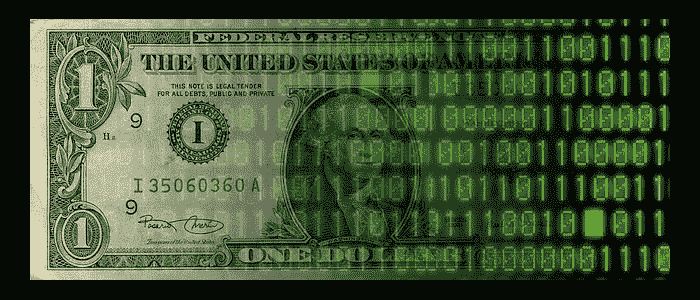

# 比特币将如何保护我们免受政府干预的后果

> 原文：<https://medium.com/hackernoon/how-bitcoin-will-shelter-us-from-the-consequences-of-government-meddling-d8ca1c62bfb>

我都不记得上次摸钱是什么时候了。

我们不再需要，这似乎意义重大。我们把更多的钱存在银行里，却得到比以往更少的回报，这似乎很愚蠢。

利率更糟糕。实际上，把钱留在银行里，我们会因为通货膨胀而赔钱。我们的钱是安全的，至少在一定数量内是安全的，但我们付出的代价是变得更穷。这就是现代银行体系的机会成本。

至少千禧一代是这么看的。

这是我们为流动性付出的代价——即时获得现金的能力。

但不一定要这样。

让我们的钱为我们服务是获得更多财富的关键。获取复利是一个人能做出的最明智的决定。

> “复利是世界第八大奇迹。懂的人赚，不懂的人赔。”
> 
> ― [**阿尔伯特·爱因斯坦**](http://www.goodreads.com/author/show/9810.Albert_Einstein)

但是利用它的人太少，而付出代价的人太多。像 Robinhood 这样的东西提供了进入市场的机会，就像银行为我们的现金提供的流动性一样。亏损的风险显然更高，但潜在回报也更高。能否发展出一个类似的系统，为你的现金提供同样的流动性，但又在一个更稳定的金融模式(如 ETF)的范围内？

然后就是比特币、以太坊和其他所有的‘币’。

金钱不再需要实际存在才有价值。量化宽松是另一种形式的现金，它实际上并不存在，但完全不同。

“硬币”不必与任何有实际价值的东西挂钩。当美元的价值脱离金本位时，法定货币达到了同样的效果。

这就是它们有价值的原因。

但这也是因为它们是匿名的，可以进行不可追踪的交易。这就是它们的价值所在。

因为加密货币是规避资本管制的一种方式——你购买比特币，把它们放在一个离岸“钱包”里，然后以外币的形式卖给另一个国家的买家——只要他们是希望自己的钱离开一个国家或希望自己的财富保持“匿名”的人，他们就永远有价值。

政府很难追查到这件事。要参与交易，你必须确定交易的另一端会有人购买价值数百万美元的比特币。这只有在巨大的网络效应下才能得到保证——这就是“比特币”和以太坊如此值钱的原因。

事实上，更高的估值只会让大量资金的转移更加高效。

比特币等。已经是偷税漏税的高效手段。我读过企业家为了避免资本收益而用比特币出售公司的故事。这是一场革命。

这就是加密货币能够成为的。

我们不再需要依赖政府来管理我们的货币。

这确实是一个激进的发展——而且很有意义。你能把你的收入和储蓄托付给你所居住的国家的长期成功吗？你应该吗？

越来越多的人认为国家不应该控制我们的钱。这就是加密货币和代币所允许的。他们剥夺了国家的权力，把它交给了人民。只要人们意识到这些新货币形式的价值，它们就能在政府控制之外为你的财富提供有效的储存手段。这并不是说他们不能影响价格。

> 除非它是一个金字塔，所有的东西都会倒塌

从好的方面来看，我们的钱不会因为我们国家决定通过量化宽松“印刷”更多现金而在一夜之间贬值。

我在手机上有多个银行账户，从传统银行(苏格兰皇家银行，富国银行等)的一切。)，现代银行(Revolut)，通过钱包为我的“硬币”。

我不记得我去过的最后一家不收卡的商店了。预见比特币，或者说‘代币’的接受程度，并不是很大的一步。这实际上是顾客奖励卡已经做到的。

这只是开始。这是一场革命。这就是未来。

我只知道我不再需要现金了。

我喜欢这样。