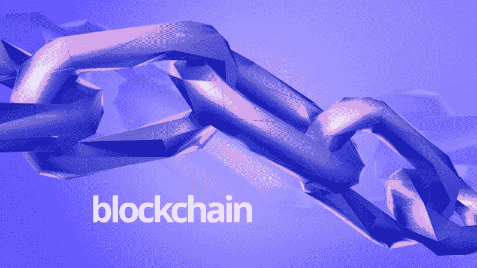
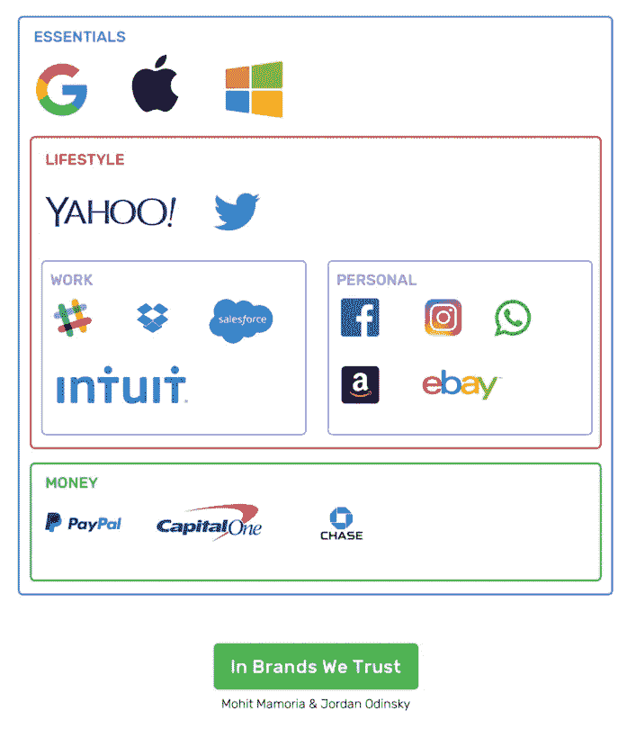

# 区块链与社区相遇的地方

> 原文：<https://medium.com/hackernoon/how-blockchain-can-build-communities-completely-free-of-hierarchy-7c727a71dda8>

*本帖由* [*乔丹·奥丁斯基*](https://twitter.com/jordanodinsky) *和* [*莫希特·马莫里亚*](https://twitter.com/mohitmamoria) *共同撰写。*

在过去的几个月里，区块链科技已经爆炸了。一年前，区块链还是一个默默无闻的比特币的代名词，如今，已经有数十种应用进入了主流媒体。

对许多人来说，区块链是一个为计算机科学爱好者保留的外国概念，与普通父母无关，但许多人没有意识到的是，区块链类似于每个人生活中熟悉的支柱:社区。

有时候，我们很难理解“区块链是一项新技术”这种说法。从某种意义上说是的，因为它允许我们在它的基础上构建有用的应用程序，但实际上，它只是一组遵循某种规则的个人，这些规则允许他们相互信任。任何人都可以玩这个游戏，只要他们遵守规则，就像在一个社区里一样。

同样，区块链是一个由全球参与者组成的社区，他们团结在一个共同的目标周围:为世界提供透明度、信任和权力下放。随着社区和区块链的发展，越来越多的参与者将时间、资源和资本投入到网络中，使得每一个加入的用户都更有价值。

换句话说，区块链就像一个部落。部落里的每个人都知道其他人的一切。这个简单的事实使得成员们可以信任部落中的任何人。但你可能会问，“部落一起吃，一起睡，一起生活，一起打猎。更容易信任自己部落的成员。我怎么能相信区块链上我不认识的人呢？”

# 在区块链我们相信

这是一个绝妙的问题。一群陌生人如何能给我们信任？听起来很矛盾，不是吗？简单的答案是“数学”

信任是一个可以写一整本书的概念。作为一个物种，我们信任谁？为什么我们信任家人、朋友或商业伙伴？如果仔细分析，你会发现我们信任那些不止一次用行动证明自己诚实的人，他们没有背叛我们。一旦有人背后捅刀子，他们过去一千次诚实的行为就停止计数。

最简单地说，区块链社区的唯一规则是——“无论何时你做了重要的事情，大声喊出来，让所有人都知道。”如果区块链被用来推动一种货币(如比特币)，那么值得宣布的重要行动将是向另一个人汇款的行为。一旦你发表声明，其他人都会记录下来，因此永远不允许你反悔。

让成千上万的陌生人记录下某样东西的行为提供了信任。这些语句使用 math 锁定，没有人可以修改它。用来锁定这些陈述的数学已经在过去无数次地证明了它的真实性，至今还没有让我们失望过。由于区块链的运作方式，即使一个人试图不诚实，数学也不允许他/她这样做。

# 我们信任的品牌

事实是，对我们大多数人来说，我们不仅信任我们的朋友、家人和业务联系人，我们还信任我们的品牌。我们信任谷歌的数据，信任脸书的思想，信任摩根大通的资金，最终信任我们生活的钥匙。几十年来，企业一直在利用我们的数据为可信的分散社区提供动力，推动他们的客户获取和品牌战略。

这些品牌社区的关键是，它是为社区服务的，由社区决定的。虽然公司没有正式与这些分散的社区联系在一起，但中心主题仍然是公司将志同道合的个人聚集在一起，朝着共同的目标前进。

宝马已经建立了一个强大的品牌，成为豪华的代名词。宝马车主将自己视为全球部落的一部分，当他们行驶在高速公路上时，流露出自豪和地位。对他们来说，如果你不开宝马，你根本就不是在开车。这些司机聚集在一个共同的不成文的信条周围，即他们确实不同于所有其他车主。

宝马的分散社区被称为宝马国际车手协会。该社区拥有超过 35，000 名成员，完全独立于公司运营，基于分享经验、想法和概念的理念。IBMWR 由公众提名的民选官员管理。

大多数公司享受分散社区的一些好处。通过在流行的社区平台 Meetup 上进行快速搜索，你会发现苹果 Meetup 社区有近 10 万名参与者。虽然苹果不管理、监督甚至不参与这些活动，但他们肯定会从这些社区活动中受益匪浅，因为这些社区活动提高了他们的底线。

# 将社区转移到区块链

区块链显示了为一种全新的组织提供动力的早期但充满希望的迹象，这种组织被称为去中心化的自治组织。顾名思义，这些组织将是去中心化的(即不受少数人控制)和自治的(即自身自给自足)。这在实践中意味着什么？

这意味着没有等级，甚至没有暗示的组织将成为可能。这些组织将允许品牌和企业正式支持(而不是运营)其品牌周围的全球社区。企业将只负责定义社区的构成并将其放入代码中。超出了宪法，品牌就没有作用可发挥了；成员们完全掌握着社区的权力。

社区中的重要决策不是由金字塔的顶端做出的(记住，没有金字塔那样的等级制度)，而是由每个人做出的。每个提案都以智能合同的形式提交，每个人都可以投票。如果达到了《宪法》中规定的门槛，该提案将在社区内生效。这种合同可以帮助社区组织聚会、活动和聚会。

甚至将某些责任一致分配给个人的合同也是可能的。成员投票给一个人分配一个角色，但是如果这个人没有很好地完成他/她的工作(或者表现得像一个十足的混蛋)，投票可以被撤回，使角色被取消。

> 在权力不集中在少数人手中的环境中，社区和组织会蓬勃发展。

区块链允许品牌支持一个社区，而不需要在当前支持一个社区所需的努力。这些分散的自治社区将帮助组织做那些无法规模化的事情。

# 对未来的预测

信任的杠杆作用是一个企业可以拥有的最大杠杆作用。只有信任才能让我们把家人的照片放在脸书上，把我们的钱放在 PayPal 的手里，并与我们的朋友争论为什么我们不再需要手机上的耳机插孔。信任是数十亿美元生意的基石。

未来的商业不仅仅是通过产品或服务提供价值；他们还将通过社区提供价值。未来十年最大的企业也将有一个强大的部落来宣传它。产品将被出售，不仅是因为它们提供的价值，还因为一旦被购买，它们将提供接触的群体。除了他们的产品和服务，由区块链驱动的社区将成为未来十年商业的新规范。

这最终会以几种不同的方式形成。摩根大通不再使用有限的员工手动验证电汇，而是能够通过社区验证交易，从而节省时间和金钱。Zillow 将成为区块链房地产交易的发电站，淘汰代理商、律师、银行和其他中介。

Reddit、脸书、Twitter 和其他社交网络将成为假新闻无法长期存在的目的地，因为社区使用公共区块链追捕每一条此类新闻。SolarCity 将有一个地区社区，每个地区都将自己划分为生产者和消费者的角色，并交易使用区块链产生的太阳能。

总之，社区和区块链的未来是非常光明的，我们很高兴看到它如何展现。

[*本帖原载于下期网。*](https://thenextweb.com/contributors/2017/08/13/blockchain-can-build-communities-completely-free-hierarchy/#.tnw_N3in3bEB)

## 接下来你应该读什么:

 [## 推介辅助办公时间

### 我很高兴为*种子前期和种子期创业公司*推出我的个人推介辅助办公时间。我非常相信…

hackernoon.com](https://hackernoon.com/pitch-assist-office-hours-ab29b21d0027)  [## 以太坊市场地图—2017 年 6 月

### 对建立在以太坊基础上的创业公司和机会的深入观察

medium.com](/@jordanodinsky/ethereum-market-map-june-2017-d13928e4319e)  [## WTF 是以太坊？

### 理解以太坊为何不仅仅是另一种加密货币的终极指南。

hackernoon.com](https://hackernoon.com/wtf-is-ethereum-c65e0d67ac09) 

*嗨！我叫乔丹，在以色列的一家全球风投公司工作。风险投资/创业领域发生了很多事情，我想我应该在这里发表我的观察。所有观点都是我自己的。* ***随时关注并在 Twitter 上取得联系:***[***@ jordanodinsky***](https://twitter.com/jordanodinsky)***。***