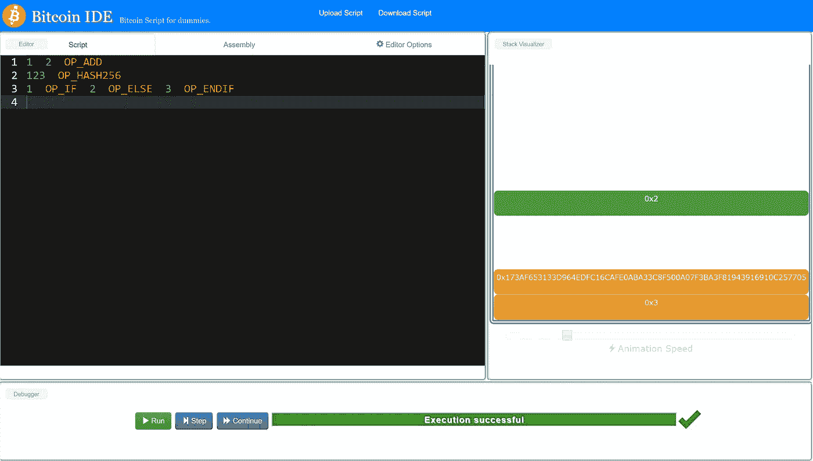
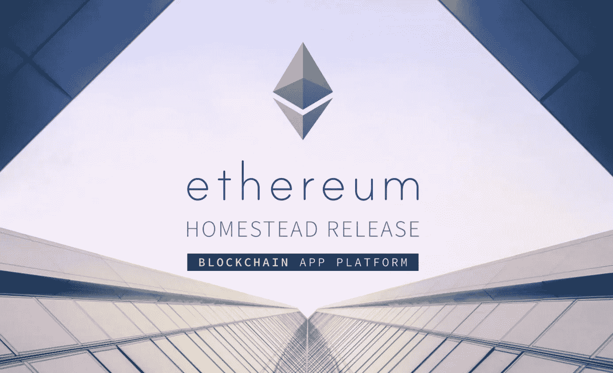
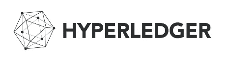

# 区块链如何成为云中的执行层

> 原文：<https://medium.com/hackernoon/how-blockchain-is-an-execution-layer-in-the-cloud-79c91ce38018>

区块链通常被描述为一种存储数据的*新颖方式。*数据存储通常被解释为分布式总账*。我认为这种对分类账的强调是误导，隐藏了它的潜力。在分类账中，重点是会计和簿记(参见[这个定义](http://www.dictionary.com/browse/ledger?r=75&src=ref&ch=dic))。在下文中，我将概述区块链如何做得更多，特别是存储*程序状态*，这是程序、智能契约或链代码的分布式执行的关键组件，并指出这一思想的当前实现。给定一系列指令(想象一下:一个食谱)，程序状态就是我们执行的当前指令，以及所有先前执行的指令的结果(想象一下:在烹饪食谱期间拍摄快照)。*

即使在以记录分类账为中心的用例中，如比特币或其他加密货币(或任何其他可转让所有权的情况，如在瑞典测试的房地产)，加密货币的交易也不仅仅是保持一个简单的转账列表(如“从账户 A 给账户 B 5 个比特币”):比特币每笔交易的一个关键组成部分是一段**程序代码**，称为脚本，需要执行它才能使交易有效。脚本包含在事务消息中，并在网络的计算机(节点)上运行。脚本执行，即运行程序的最终结果，有助于确保交易的正确性，即硬币由发送者所有(即“从账户 A 给账户 B 5 个比特币”和“这是我拥有比特币的证明；使用以下说明对证据进行数学验证”)。每个节点独立执行脚本，所有节点都必须同意脚本的输出。只有这样，交易(以及程序输出)才成为区块链数据共识的一部分。

比特币用于程序的语言叫做“脚本”。支持比特币的脚本语言只有有限的指令集:不可能在其中编写任何任意程序，例如从 REST APIs 中检索数据，或在其中实现任意算法。打个比方:想象一个只有加减运算，没有乘法运算的计算器。你可以从中得出乘法，但得到对数或平方根是不太可能的。
*如果你有兴趣，可以* [*在这里了解一下脚本*](http://davidederosa.com/basic-blockchain-programming/bitcoin-script-language-part-one/) *并使用 BitcoinIDE 来探究一下(也如图 1 所示)。*

Figure 1: Learn more about Bitcoin’s script [using the Bitcoin IDE](https://github.com/siminchen/bitcoinIDE). The left side shows a sample program with some instructions, the right side shows a machine model during the execution of the script (for computer scientists: it is a stack-based language).

脚本的局限性并不令人惊讶:比特币被设计为一种货币，这种语言是为这一特定目的量身定制的。然而，它的一小组指令在多重签名或[哈希锁交易](https://en.bitcoin.it/wiki/Hashlock)中发挥了关键作用，这些交易将比特币的能力[扩展到直接一对一交易](https://en.bitcoin.it/wiki/Contract)之外，并在[闪电网络](http://lightning.network/how-it-works/)等协议中大量使用(就像在简单的计算器模型中从重复加法中推导乘法一样)。此外，还有空间在未来为语言添加新的指令。

# 跨网络执行

为什么剧本令人兴奋？“区块链上的程序”的全部潜力是什么(本质上，比特币的脚本已经是区块链上的小程序)？它们从区块链读取输入，并在构成区块链(点对点网络的单个节点)的计算机上运行。执行脚本的输出反过来成为区块链的一部分。

令人兴奋的原因如下:因为每个节点都运行并验证计算，所以在程序执行期间出错或恶意作弊的可能性基本上被消除了。要将数据包含在区块链中，网络需要在网络的共识查找过程中就其达成一致，因此每个人也需要就程序的输出达成一致，这样它才能成为区块链数据的一部分。

反过来，程序可以自动执行各种任务，例如，一旦满足预定义的条件，就进行定时和预定的资金和所有权转移，或者管理市场和拍卖行。一旦两方或多方就合同达成一致(归结起来就是:就一系列事件和条件达成一致)，就可以通过对其进行编码并将其存储在区块链上以供执行来保证合同的正确执行。甚至可以用区块链上的程序处理托管付款。与传统的做生意方式形成对比，传统的做生意方式需要公证人、银行或律师进行托管等。区块链的“合同项目”不依赖中间人。这些小程序通常被称为**智能合约。**他们不仅存储条款和条件，还包括并自动执行条款和条件。

由于计算机科学中的计算机模型和编程语言的理论，我们确切地知道脚本或编程语言需要哪些组件来实现期望水平的表达能力/计算能力。

在下文中，我将概述区块链对“区块链计划”的一些实施，并尝试对比不同团体为实现“智能合同”而采取的不同方法。

# 以太坊

以太坊于 2013 年提出，并于 2015 年投入使用，据我所知，它是第一台运行在区块链上的完全工作的“分布式计算机”。代替交易，最初计算机程序的代码存储在区块链上。然后程序由以太网上的每台计算机执行，执行的结果又被存储在区块链上。

(更严格地说:它运行一个*虚拟机，*一个抽象的计算模型:一组精心选择的指令，可以与“机器模型”一起模拟所需的操作。举个例子，把算盘想象成一个计算器的机器模型，把算盘的使用说明想象成一套指令。区块链上的节点通过从用户处获取程序代码并推进机器状态来模拟该机器的操作，即模拟程序的计算。)

以太坊程序可以用 [Solidity](http://solidity.readthedocs.io/en/latest/) 和 go 编程语言编写，Solidity 是一种提供高度抽象的编程语言(对程序员隐藏虚拟机的细节)。运行在以太坊上的程序是*沙箱化的*，这意味着它们不能从区块链之外读取数据。可以使用“特殊账户”将数据手动写入区块链。这提供了运行在以太坊系统上的程序(也称为智能合约)与真实外部世界(例如互联网上的其他数据)之间的接口。

为了防止有缺陷或恶意的程序耗尽所有资源，程序的执行和内存的使用是有代价的。它消费代币，一种也包含在区块链以太坊中的货币。矿工，即通过执行区块链上的程序来操作虚拟机并参与共识发现的人，也因他们的工作而被奖励代币。

Ehtereum logo taken from [ethereum.org](http://ethereum.org)

以太坊最著名的用户大概就是[去中心化自治组织(DAO)](https://forum.daohub.org/) 。它是一种分布式投资工具(类似于对冲基金)，拥有超过 10，000 名股东对投资决策进行投票。DOA 持有(取决于汇率)高达 1 . 5 亿美元的资产。DAO 已经展示了可能的“契约”的复杂性:它不仅仅是简单的所有权转移或租赁契约。它可以包括投票系统、(法律)实体的法规或任何其他类型的确定性协议。

你可以在媒体上找到更多关于以太坊的信息，[比如这里](/@lstephanian/from-what-is-blockchain-to-building-a-blockchain-within-an-hour-4e738efc819d)。

# 嫩薄荷

[Tendermint](https://github.com/tendermint/) 是一个比以太坊上的虚拟机更抽象的区块链平台。它不是通过提供一个机器模型来规定一种特定的计算方式，而是希望只提供分布式共识发现组件:任何程序都应该能够在其上运行，并且 Tendermint 验证该程序在网络上所有计算机上的正确执行。它通过为程序提供一种方式来实现这一点，程序通过一个名为[应用程序区块链接口(ABCI)](https://tendermint.com/blog/abci-the-application-blockchain-interface) 的接口与 Tendermint 区块链进行通信。

The Tendermint logo as it appears on their twitter account.

Tendermint 使用的是 [BFT 共识算法](https://tendermint.com/intro/consensus-overview)(参见我的[旧帖](/@chrshmmmr/consensus-in-blockchain-systems-in-short-691fc7d1fefe))。它与以太坊的不同之处还在于区块链的设置方式:以太坊在一个大型分布式网络中运行一台虚拟机。多亏了 BFT 算法，才有可能委托规模更小、更独立的区块链招标公司，让更多的参与者参与进来，而不是运行一个对所有人开放的公共系统。

# 超级分类帐

Taken from the hyperledger project website.

由众多公司支持的开源项目 Hyperledger project 也符合这一背景:它旨在提供一个“全栈”区块链基础设施。它不想规定在其上运行什么应用程序，如何存档共识，或者节点如何通信，等等..所有这些核心功能都可以互换。这种方法的核心优势是每个人都可以定制自己的区块链系统。【Hyperledger 中有多个子项目，每个子项目提供不同的模块实现。在 Hyperledger Fabric 子项目中，可以使用*链码*与区块链数据/分类账进行交互，链码是用 go 或 java 编写的短程序。

虽然 Hyperledger 项目得到了行业的大力支持，但它似乎是目前只针对开发人员和 alpha 测试人员的最具实验性的解决方案。与 Tendermint 类似，它要求每个人都建立自己的系统，而不是拥有一个对每个人开放的中央、单一的区块链。

# “区块链计划”的理念将走向何方？

总结一下:现在可以编写读写区块链的程序，并在分布在区块链网络上的许多节点上执行。程序的执行又由网络的一致性发现算法来保护，确保程序指令都被正确执行。任何可以用程序形式编写的任务都可以自动化，不需要任何中间人，不需要信任特定的个人，也不依赖于潜在的单点故障。

仍然存在一些挑战:程序需要确定性，即每次执行都必须给出相同的输出。这种限制是由于网络上节点的分布式性质:由于每个节点都必须同意程序的输出，程序的每次运行都必须返回相同的结果——否则节点将永远无法就程序的输出达成一致。想象一个程序，抛硬币并输出结果:大约一半的节点会看到头，另一半会看到尾。不可能在产量上达成一致。有一些方法通过依赖区块链上的(未来)数据来引入随机性:因为每个人都从相同的区块链读取，所以每个人都将看到相同的值(例如，下一个块的散列值的属性)。

在更传统的意义上，云计算通常强调计算能力和内存资源(例如 AWS 或 Azure)或终端设备独立访问(例如大多数软件即服务产品)。在区块链的情况下，当前的重点是不同的:它提供了一个独立的，信任，保证是正确的后台执行。但是当前的发展趋向于更快、更有效的协议，因此在区块链上运行更强大的自主程序。

如果你喜欢我的文章，一定要推荐它，分享它，并在 Medium 上关注我。
如果您或您的组织需要支持以投入到区块链游戏中，[请查看我们在 alatus sigma consulting](https://digitaled.alatus.tech) 的网络研讨会和咨询服务。如果您有任何未解决的问题、发现的错误或对特定主题有任何要求，请发表评论或联系我。

> [黑客中午](http://bit.ly/Hackernoon)是黑客如何开始他们的下午。我们是 [@AMI](http://bit.ly/atAMIatAMI) 家庭的一员。我们现在[接受投稿](http://bit.ly/hackernoonsubmission)并乐意[讨论广告&赞助](mailto:partners@amipublications.com)机会。
> 
> 如果你喜欢这个故事，我们推荐你阅读我们的[最新科技故事](http://bit.ly/hackernoonlatestt)和[趋势科技故事](https://hackernoon.com/trending)。直到下一次，不要把世界的现实想当然！

