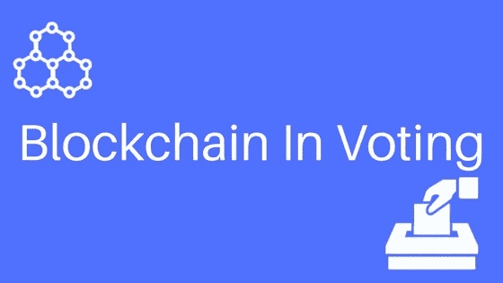

# 区块链如何改变选举

> 原文：<https://medium.com/hackernoon/how-blockchain-is-set-to-revolutionize-elections-7ebcd2209c69>

## 改变过去一个世纪最不变的东西

嘿伙计。

我想让你先问自己一个问题。15 年来，你身边有多少事情发生了改变？

旅行？优步在那里。是啊。

银行业？在线支付让生活比以往任何时候都更容易。是啊。

购物？亚马逊。当然了。(你昨天才在亚马逊买了东西。对吗？😛)

但是，

# 选举投票？绝对不会。

为什么？

为什么你认为世界上的一切都可以在网上获得，但即使是现在，我们也不得不去投票中心排队等待 3-4 个小时来投票？

很奇怪。不是吗？

现在，想象一下:

> 不要再从你的日常日程中抽出时间去投票中心只是为了站在长长的队伍中。或者，你可以拿出你的手机，在喝咖啡休息的时候投票。听起来很酷，不是吗？

不，不是的。

互联网上的攻击机会要大得多。

> 似乎很奇怪，没有人能够设计出一种方法来保证网络投票的安全。

但是，想想选举时的后果:敌对国家可以很容易地劫持一个国家的网络投票机制，导致整个选举非法。我们都知道，来自不同国家的黑客可以轻易地渗透到任何互联网安全机制中。那么，在如此关键的事件中，他们会阻止他们做这样的事情吗？答案是什么都没有。

毕竟，

> 黑客喜欢混乱

这里的问题是安全。在如此高风险的情况下，我们的系统保护得足够好以保证我们的充分证明安全吗？答案是一个大大的**不**。

但是如果[区块链](https://hackernoon.com/tagged/blockchain)能够从根本上改变这种情况会怎么样呢？

我们都知道区块链是世界上有史以来最安全的范式。那么，为什么不在表决程序中实施呢？

它的工作方式是，每个选民将被分配一张选票，作为一个智能合同，只在选举日有效。由于每一张选票都将作为一笔交易记录在公开的账本上，因此出现任何差异的几率将为零。投票者可以使用他/她用于他们的加密货币钱包的私钥来行使他的投票权。

一旦选举结束，由于区块链[科技](https://hackernoon.com/tagged/technology)使得选举记录比以往任何时候都更加安全，公共账本上不允许有任何改动。如果任何矿工试图将任何非法交易添加到区块链中，剩余的组将在交易验证过程中驳回该交易，从而使这些记录比以往任何时候都更加安全。

## 天啊。

岂不是很神奇？

但正如他们所说，任何事物都有它的缺点。

在这种情况下，这是匿名的问题。虽然，人们确实会谈论他们将投票给哪个政党，或者他们已经投票给了哪个政党，但匿名选民应该存在，以防止选举后投票给特定政党的选民发生任何不幸事件。

解决这个问题的方法之一是用只有投票人才能访问的代码来屏蔽每个投票人的公钥。

这听起来不错，但是实现起来很有挑战性。

另一个缺点是安全性，即使有区块链系统被黑客攻击的情况，但鉴于参加选举的人数几乎抵消了 51%的攻击机会，这种机会将非常少。对于那些不知道的人来说，51%的攻击是当系统中超过一半的人反对系统时，由于太多的人参与到挖掘过程中，系统变得一文不值。在这么短的时间内黑掉这么多电脑几乎是不可能的。

然而，我们还有很长的路要走，才能说我们可以实现区块链来选举我们的总统。

我并不是说不会有 51%的矿工反对某个系统的极端情况，但我们需要在试运行时忽略这些情况，并希望有一个更好的未来。毕竟，

> 我们不能指望一次都不失败就能扰乱世界。

让我们只希望这一天快点到来。:)

# 感谢阅读:)如果你喜欢它，就按下那个按钮多少次？不。打它 50 次，简单:)

*同样，让我们连接上* [*推特*](http://twitter.com/ankitkr0) *进一步讨论区块链*:)