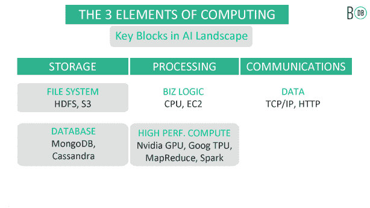
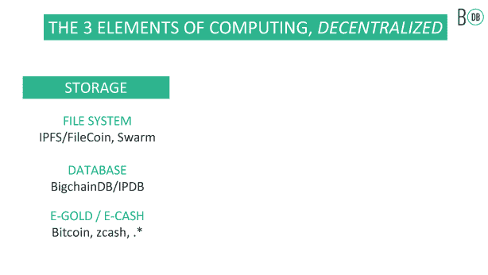

# 区块链将如何颠覆传统计算

> 原文：<https://medium.com/hackernoon/how-blockchain-will-disrupt-traditional-computing-a2f8e808d762>

[基于区块链的技术](https://techbeacon.com/tags/blockchain)已经不再仅仅支持加密货币。IT 运营的一个热门领域是智能合约，它让您可以在区块链上存储、验证和执行代码。目前正在进行的多个项目承诺用这种方法取代计算堆栈的传统元素，从处理到存储再到通信。

# 区块链已经在改变 IT 运营

区块链技术已经对计算基础设施的三个核心构建模块产生了影响:

*这些项目将改变计算的三个核心要素:存储、处理和通信。*

# 处理

加工是区块链首先破坏的领域之一，拥有最成熟的生态系统。在传统计算中，CPU 和图形处理单元(GPU)与高性能处理算法、模型和工具(如 MapReduce、Spark 和 TensorFlow)协作处理处理逻辑(包括现代的基于云的分布式处理)。

## 以太坊和超级账本

[以太坊](https://www.ethereum.org/)彻底改变了区块链，它允许用户在区块链上运行除金融交易之外的其他交易形式，并且它支持下文描述的许多其他选项。

以太坊将智能合约的概念引入了区块链，开启了一个充满机遇的世界。今天，许多基于区块链的项目使用以太坊或基于以太坊的东西来处理逻辑处理和验证。

[Hyperledger](https://www.hyperledger.org/) 由八个工具和项目组成。决定在哪里使用哪个具有挑战性，但您应该从 [Hyperledger Fabric](https://www.hyperledger.org/projects/fabric) 开始，它为身份、隐私和处理提供了基础，并在其上构建组件。好消息是整个 Hyperledger 项目是为企业用户设计的，工具反映了这一点。

例如，以太坊作为公共或私有区块链运行，但是 Hyperledger 结构是私有的。它为智能合约提供了企业友好编程语言的选择，而以太坊使用自己的类似 JavaScript 的语言。它让你定义自己对“共识”和“货币”的理解这听起来可能与区块链纯粹主义者提出的原则相反，但它对于广泛采用是必不可少的。

欲了解以太坊、Hyperledger 和 [Corda](https://github.com/corda/corda) (针对金融行业)之间差异的更多细节，请阅读 [Philipp Sander 的博文](/@philippsandner/comparison-of-ethereum-hyperledger-fabric-and-corda-21c1bb9442f6)。

[Monax](https://monax.io/) 为金融、保险和物流行业提供 SDK。Monax 与以太坊和 Hyperledger 出现在同一时间框架内，虽然它已经被那些项目所掩盖，但它仍然对上游项目做出了巨大贡献，项目社区努力确保该技术与其他技术很好地合作。比如[它把核心开放软件搬到了 Hyperledger](https://monax.io/blog/2017/02/28/why-were-joining-hyperledger/) ，项目是[企业以太坊联盟](https://monax.io/2017/03/01/why-were-joining-the-enterprise-ethereum-alliance/)的成员。

以太坊的替代品正在出现。[实体](https://www.aeternity.com/technology)通过关注金融应用和从区块链中移除状态来简化事情。[这篇 Reddit 帖子](https://www.reddit.com/r/ethereum/comments/5px7in/thoughts_on_aeternity_blockchain_project_vs/)挖掘细节。

## 高性能计算

区块链的分散性质应该使它成为大规模处理系统的理想选择，但它的设计目前限制了规模。雄心勃勃的项目，如假人和 iEx.ec，都渴望创建分散的超级计算机或不受供应商限制的云计算，这些雄心勃勃的项目仍处于早期阶段。

TrueBit 项目试图通过将共识卸载到网络中的特定计算机来解决这个问题。该项目的网站上没有太多细节，但它发布了一份 [TrueBit 白皮书](https://people.cs.uchicago.edu/~teutsch/papers/truebit.pdf)，详细介绍了它可能如何工作。

区块链的计算潜力取决于这些项目或类似项目的生产成功。这些社区表示，他们有信心在明年实现这一目标。

# 储存；储备

存储是区块链中断的主要领域。有几个为大规模存储提供了一个可行的选择，尽管它们也存在上述的一些区块链问题。

传统计算存储分为两大阵营:文件和数据库存储。这两个阵营都有无数的选择，从个人台式机项目到大规模存储项目，如 HDFS、S3、MongoDB 和 Cassandra。

正在进行的一些关键项目包括:

**注:这只是一个总结；还有几十个其他现金和资产项目正在进行中。*

## 文件存储器

[星际文件系统](https://ipfs.io/) (IPFS)项目横跨存储和通信。作为以新的方式看待区块链的早期应用之一，IPFS 相当成熟，拥有发达的生态系统。

HTTP 协议一次从一台机器上下载一个文件，而 IPFS 同时从多台分散的机器上下载文件的片段。从某些方面来说，它就像是 torrenting，[，但是也加入了其他的想法，比如 Git。考虑到方便的文件命名和可靠的用例，这是一项很有前途的技术。可以找到](https://discuss.ipfs.io/t/ipfs-vs-webtorrent-what-the-value-of-using-ipfs-instead-of-torrent-files/64/2) [JavaScript](https://github.com/ipfs/js-ipfs-api) 、 [Python](https://github.com/ipfs/py-ipfs-api) 、 [Swift](https://github.com/ipfs/swift-ipfs-api) 、 [C++](https://vasild.github.io/cpp-ipfs-api/) 等语言的客户端库。项目组正努力使 IPFS 的使用尽可能无缝。

Swarm 是一个以太坊组件，其工作方式类似于 IPFS，但处理通信和文件存储。它没有提供这样一个无缝的入门方式，但是如果你已经在研究以太坊的其他组件，那么[阅读文档以获得更多细节](http://swarm-guide.readthedocs.io/en/latest/introduction.html)。

Filecoin 采取了一种不同的方法，相反，它提供了一种机制来跟踪数据中心和互联网周围的备用存储块之间的交易。它允许你使用传统存储，但通过一个区块链层，让用户竞标你提供的空间，并跟踪他们的使用情况。

## 数据库

BigchainDB 采用了一种更有趣的方法，让现有的数据库( [MongoDB](https://www.mongodb.com/) 和 [RethinkDB](http://rethinkdb.com/) )和区块链层专注于他们各自擅长的领域。这为您提供了可证明的大规模存储，具有长期的跟踪记录，但具有区块链提供的责任和交易支持。该项目已经开发了一段时间[，但并没有声称已经准备好生产](https://docs.bigchaindb.com/en/latest/production-ready.html)。

因为 IPFS 可以读写文件，而数据库可以写文件，所以有人会想到将 IPFS 用作数据库是有道理的。OrbitDB 就是这么做的。这个小型的开源项目在过去的几个月里没有太多的活动，但是它非常适合需要简单存储的 web 项目。

# 沟通

两个古老的协议，TCP/IP 和 HTTP，支撑着大部分的在线通信，而其他协议和模型在它们之上工作。尽管区块链不会取代任何一种协议，但一些项目正试图为基于区块链的应用程序之间的通信建立标准。

这对于创建自己的应用程序的竞争组织尤其有用。但是社区的一些成员认为这使他们偏离了技术的初衷，并渴望有标准的方法让区块链知道彼此。

以下是与区块链相关的主要通信协议和项目:

## 内部分类协议

支付解决方案 [Ripple](http://ripple.com/) 发布的 [Interledger](https://interledger.org/) 协议(ILP)旨在连接不同的加密货币，但不是更通用的区块链。它抽象了个人钱包、支付网关和银行，并允许开发者在它们之间编码连接器。

## 宇宙

对于更广阔的区块链来说， [Cosmos](https://cosmos.network/) 的目标是创建一个“区块链互联网”这是一项艰巨的任务，团队[通过首次发行硬币(](https://fundraiser.cosmos.network/) [ICO](https://en.wikipedia.org/wiki/Initial_coin_offering) )的方式在半小时内筹集了 1700 万美元。

至于这将如何工作，还没有太多的细节出现，但根据该项目的白皮书和博客文章[的说法，这种方法将引入一个中间令牌(atom ),类似于来自其他区块链的令牌之间的交易机制。这将通过枢纽(第一个将是宇宙枢纽)发生，而原子允许系统为自己提供资金。在某些方面，这就像传统的交换和翻译机制，你向中间人支付他们的时间。](/@cryptojudgement/cosmos-discovering-interoperability-of-blockchains-5f284d7867b7)

## 波尔卡多特

在去年的一篇论文中， [Polkadot](https://polkadot.io/) 介绍了副链的[概念。Cosmos 侧重于令牌交换，而 Polkadot 的方法侧重于事务的终结。可以把它想象成在分布式应用程序中维护状态。](http://github.com/polkadot-io/polkadotpaper/raw/master/PolkaDotPaper.pdf)

副链有助于区块链之间的沟通，但无权完成交易。Polkadot 还处于早期阶段，但是你可以通过阅读白皮书或者这篇博客文章获得更多的细节。

## 星际数据库(IPDB)

[IPDB](https://ipdb.foundation/) 建立在 BigchainDB 之上，提供某种“数据库网络”认识到区块链项目正变得越来越集中，它希望鼓励其用户将数据存储在没有单一所有者或看管者的治理模型中。这是一个大胆的声明，但技术实现还有待定义，私人数据持有者的热情也是如此。

# 其他可能影响 IT 运营的区块链项目

还有一些其他项目，比如以太坊，属于不止一个类别。以下是此类项目的简短列表。

*   Bletchly 项目，结合 Azure 的[区块链即服务](https://azure.microsoft.com/en-us/blog/ethereum-blockchain-as-a-service-now-on-azure/)，是微软为区块链提供的网络、共识、数据库和虚拟机。
*   [scatter bot](http://scuttlebot.io/)是一个点对点的日志存储，你可以用它来发送消息或作为一个简单的数据库。它不是一个明确的区块链应用程序，但在概念上是相似的。
*   一些企业已经创建了他们自己的分支项目，并提供了他们需要的特性。例如来自摩根大通的 [Quorum](https://github.com/jpmorganchase/quorum) ，是一个以太坊分支，增加了隐私和其他共识机制。
*   [Plasma](https://plasma.io/plasma.pdf) 是一项新提议，试图用可扩展性和速度来解决区块链的核心问题。你可以把它想象成一个简单的波尔卡多特版本，但是它连接着国家的链条。

# 你准备好去区块链了吗？

简而言之，这就是区块链的风景。所有这些是否意味着 IT 将很快用基于区块链的技术取代和管理今天的计算、存储和通信技术？可能不会马上。

尽管一些社区成员推动标准和协作，区块链技术的最大问题之一是许多项目竞相解决同样的问题。为了使这些技术变得可行，每一种技术都需要专注于解决阻碍主流采用该技术的问题。

也就是说，IT 运营专家应该仔细观察这个领域。一旦这些问题得到解决，您可能会发现自己正在考虑用区块链的方案来替换您企业中的计算、存储或通信技术。

*这篇文章的灵感来自区块链远见者*[*Trent McConaghy*](http://trent.st/)*[*的创始人之一*](https://www.ascribe.io/)*[*BigchainDB*](https://www.bigchaindb.com/)*，以及* [*IPDB 基金会*](https://ipdb.foundation/) *。***

***最初发表于*[*【techbeacon.com】*](https://techbeacon.com/how-blockchain-will-disrupt-traditional-computing)*。***