# 机器人和电子人如何传播错误信息:一名数据科学家在 72，000，000+条与特朗普、俄罗斯和美国国家橄榄球联盟相关的推文中发现了 5，000+个机器人

> 原文：<https://medium.com/hackernoon/how-bots-and-cyborgs-spread-misinformation-a-data-scientist-finds-72-000-000-tweets-by-5-000-fa6f28ba0649>

> 史蒂夫·克莱默博士。[原载](https://www.oreilly.com/ideas/identifying-viral-bots-and-cyborgs-in-social-media)于[OReilly.com](https://goo.gl/r8hpBU)。

特别是在过去几年中，科学学科领域的研究人员研究了社交媒体网络的动态，以了解随着网络的发展，信息是如何传播的。Twitter 和脸书等社交媒体平台不仅包括真实的人类用户，还包括机器人或自动化程序，它们可以显著改变某些信息的传播方式。虽然一些信息收集机器人是有益的，或者至少是良性的，但 2016 年美国总统选举和 2017 年法国选举表明，机器人和傀儡账户(即由一个人控制的众多社交账户)在影响政治信息和在 Twitter 和脸书上传播错误信息方面是有效的。因此，对社交机器人进行识别和分类，以打击错误信息的传播，尤其是敌对国家和暴力极端组织的宣传，是至关重要的。这篇文章是我最近的机器人检测研究的简要总结。它描述了我应用的技术，以及识别试图在网上改变观点的病毒机器人和电子人战斗团体的结果。

在这项研究中，我应用了复杂性理论的技术，特别是信息熵，以及网络图分析和社区检测算法，来识别病毒机器人和电子人(使用软件自动化和放大其社交帖子的人类用户)的集群，这些集群不同于 Twitter 和脸书上的典型人类用户。我在下面简要地解释了这些方法，所以不需要这些领域的高深知识。除了专注于促进点击流量的商业机器人，我还发现了支持特朗普和反对特朗普的政治机器人和电子人的竞争大军。在 2017 年 8 月期间，我发现反特朗普机器人在传播信息方面比亲特朗普机器人更成功。相比之下，在 2017 年 9 月的 NFL 抗议辩论中，反 NFL(和亲特朗普)的机器人和电子人比亲 NFL 的机器人取得了更大的成功和病毒式传播。

## 获取 Twitter 源数据

我的 Twitter 机器人检测研究的数据集包括大约 6000 万条提到“特朗普”、“俄罗斯”、“联邦调查局”或“科米”等术语的推文；这些推文是通过免费的 Twitter 公共 API 在 2017 年 5 月至 2017 年 9 月之间的不同时期收集的。我已经在 data.world 上发布的一个数据项目中提供了源推文 id 以及我们的许多分析结果文件。希望在 data . world 上就这个项目进行合作的研究人员应该向 datapartners@paragonscience.com 的[发送请求电子邮件。](mailto:datapartners@paragonscience.com)

# 利用信息熵检测僵尸工具

[信息熵](https://en.wikipedia.org/wiki/Entropy_(information_theory)被定义为“一个概率随机数据源产生的平均信息量”因此，这是量化数据集中随机性的一种有效方法。因为人们可以合理地推测真实的人类比自动化程序更复杂，所以当人们试图识别机器人时，熵可以是一个有用的信号，正如许多先前的研究人员所做的那样。在最近的社交机器人检测研究中，特别值得注意的是来自加利福尼亚大学和印第安纳大学的研究人员小组的出色工作。他们的“botornot”系统使用随机森林机器学习模型，该模型融合了 1150 个特征，这些特征来自用户账户元数据、朋友/关注者数据、网络特征、时间特征、内容和语言特征以及情感分析。

对于我们目前的工作，我选择采用一种大大简化的方法来检测社交机器人，使用两种类型的信息熵分数——一种基于连续帖子之间的时滞分布，另一种基于帖子中单词的顺序。以统一的时间间隔发送消息或带有异常静态或相似文本上下文的消息的帐户可能是机器人或电子人。

接下来，我计算了时间熵和文本熵的 Z 值。在这里呈现的结果中，我设置了一个用户 10 个社交帖子的最小阈值，以便分析所述用户的帖子，然后我对任一熵度量的 Z 分数(即，原始分数等于或高于平均值 2.5 个标准偏差)应用了 2.5 的保守阈值，以便标记可能的机器人。当然，通过降低门槛，我会检测到更多的机器人，但有可能会误报，无意中将实际的人类用户标记为机器人。在未来，我希望为我的双熵方法计算 ROC 曲线，以表征假阳性和假阴性之间的权衡。

# 使用 k-core 分解测量机器人的病毒率

图的 k-核是一个极大子图，其中每个顶点至少度为 k。如果一个顶点属于 k-核但不属于(k+1)-核，则它的核是 k。k-核心分解是通过递归地移除度数小于 k 的所有顶点(以及它们各自的边)来执行的。[先前的研究](https://www.nature.com/articles/nphys1746)已经表明，网络的 k-核心分解可以非常有效地识别网络内最适合传播或共享信息的个体。我在 2016 年使用 k-core 分解分析了超过 1.2 亿条与 2016 年美国总统选举相关的推文，以确定最具影响力的用户。对于这项机器人检测研究，我对 2017 年 5 月至 9 月期间收集样本的每一天的异构用户/hashtag/URL Twitter 网络进行了 k-core 分解。

通过将我们的熵值与相应的核心度值相结合，我能够识别出哪些机器人或半机器人(即使用专门软件来自动化其社交媒体帖子的人)在促使其他用户(其中一些也是机器人)分享或回应他们的帖子方面最成功，从而获得了更接近日常 Twitter 网络中心的位置。(这种 k 核心分解方法被[贝西和费拉拉](https://papers.ssrn.com/sol3/papers.cfm?abstract_id=2982233)以类似的方式用于测量社交机器人的嵌入性。)

图 1 中的三维散点图清楚地显示，绝大多数已识别的社交机器人是不成功的，仍然处于具有低核心值的网络的外部领域，因为没有或很少有其他用户与它们交互。成功的机器人获得了更高的核心值，因为其他用户转发或回复了他们的帖子。正常的人类用户(未示出)将在原点附近，并且很容易辨别出任一熵度量的 Z 分数越高，机器人变得越不成功。这很可能是因为人类用户很容易识别机器人的异常帖子，因此不倾向于分享这些机器人的帖子。总之，机器人的行为越像人类，实际用户就越有可能分享机器人的帖子。

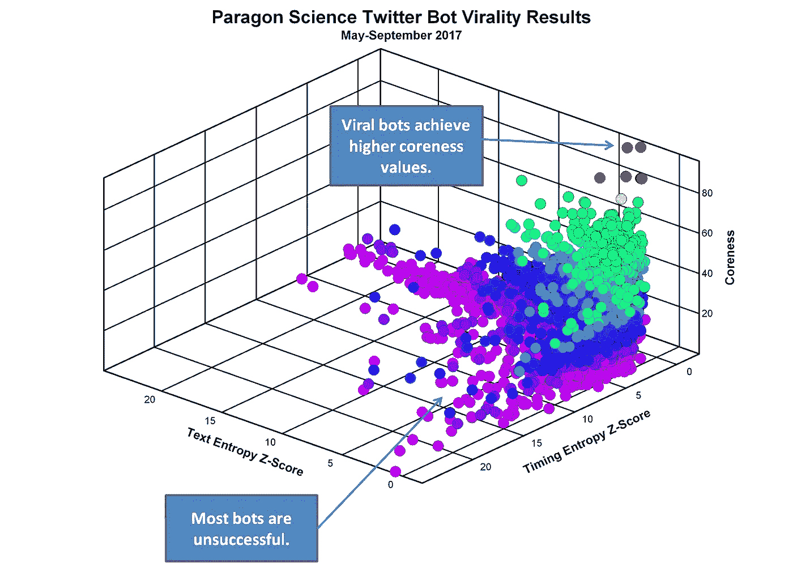

Figure 1\. 3-D scatter plot showing the majority of identified social bots are unsuccessful. Courtesy of Steve Kramer.

# 不成功的机器人

Twitter 用户@says_k_to_trump 的文本熵 Z 得分(在情节边界之外)的最大值是 143(原始文本熵为 1.0)。下面显示了一些示例推文。注意，每条推文都是回复@realDonaldTrump 每条推文的单个字母“k”。熵 Z 值反映了这样一个事实，即这个用户的推文内容是完全确定的，没有不确定性。可以理解的是，没有其他用户与@says_k_to_trump 进行过交互，所以 bot 一直保持在网络最外围，核心度为 1。

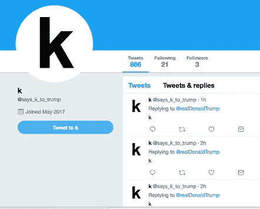

Figure 2\. Screenshot courtesy of Steve Kramer.

Twitter 用户@trade_debate 的时间熵 Z 得分的最大值为 122.7。请注意，在表 1 中，该用户的 tweets 具有非常统一的定时模式。从第二条推文开始，该用户以两秒的恒定间隔发推文。

## **表 1:最极端的时间熵示例**

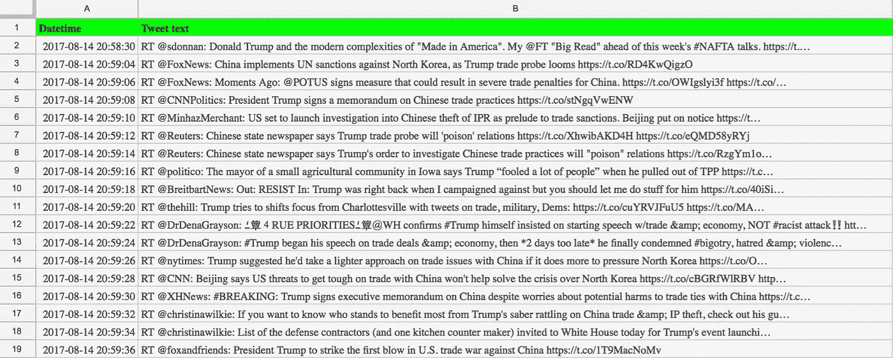

## 成功的机器人

相比之下，最成功的机器人之一是@Bhola021，它在 2017 年 8 月 12 日获得了 96 的核心值。下面的表 2 显示了几个样本 tweets。这主要是一个数字营销机器人，而不是政治或宣传机器人。请特别注意转发其他用户帐户的行为，这些帐户具有相似的名称和非常相似的推文文本。

## **表 2:来自一个成功营销机器人的推文**

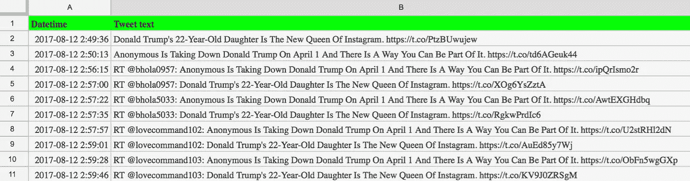

通过上述方法，人们可以识别潜在的机器人，并测量它们在不断发展的社交网络中的成功程度或嵌入程度。正如我们接下来将看到的，这些结果可以通过社区检测算法得到显著增强。

# 识别病毒机器人和电子人社区

为了更清楚地了解最成功的病毒机器人和电子人如何在 Twitter 网络中运行，我基于这些机器人发送的推文创建了一个子网，从回复和转发中提取用户提及和 URL。在这个例子中，我使用 2017 年 8 月 7 日至 19 日前 20 个 bot 帐户发送的 16，057 条推文生成了一个网络。生成的网络由 2949 个节点中的 73569 条链路组成。这个网络的 k-核心分解导致最大核心为 20。然后，我应用[Louvain 社区检测算法](http://perso.crans.org/aynaud/communities/)为所有核心度≥ 10 的节点识别网络中心内的相关组。在图 3 所示的 [Polinode 互动网络](https://www.polinode.com/networks/explore/59c887a352ac750011a53bb9/59d5a868acb9370011e25dc1)中，每种颜色代表网络中的一个不同社区。在排名前 20 的机器人中，有一个高度互联的名字相似的机器人网络(porantext，porantexts_，lovedemand101，lovecommand102 等。)转发和分享彼此的帖子。这些僵尸网络显然是商业机器人，试图将点击流量导向带有挑衅性标题的网页，如“唐纳德·特朗普将单向赶出了他的酒店，原因如下”和“我们将无情地蹂躏美国军队，朝鲜在太阳节警告唐纳德·特朗普”作为前两个文章标题。

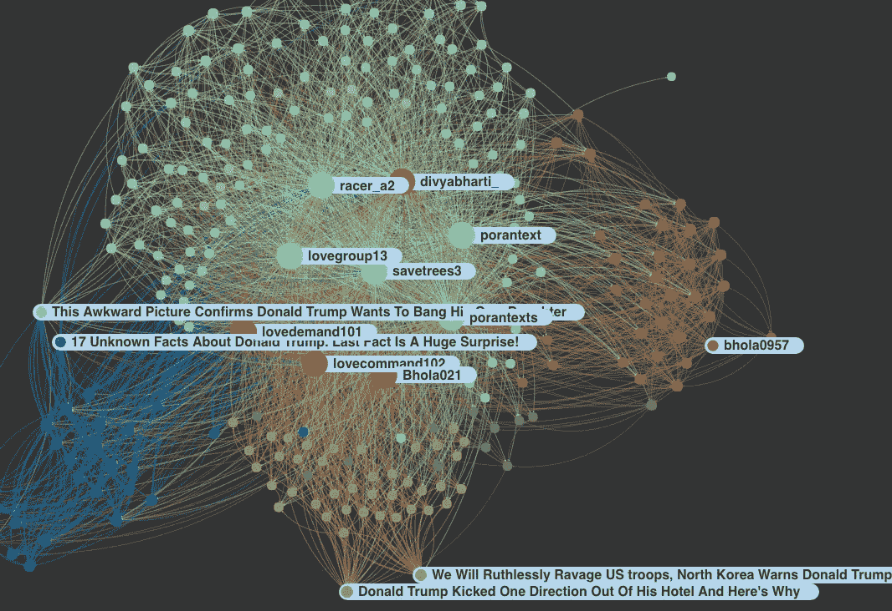

Figure 3\. Network of top Trump viral bots and cyborgs in August 2017\. Courtesy of Steve Kramer.

因为我对社交机器人在传播信息和影响政治舆论方面的作用特别感兴趣，所以我过滤了源推文，只包括那些在推文文本中包含“俄罗斯”一词的推文。当我在与俄罗斯相关的 Twitter 网络上进行 k-core 分解和熵计算时，2017 年 8 月 7 日至 19 日期间出现了一组不同的有影响力的机器人和电子人。

图 4 中所示的 [Polinode 网络](https://www.polinode.com/networks/explore/59d634da2e80fc001104aabe/59d634e9acb9370011e25dcd)显示了网络中由前 20 名与俄罗斯相关的机器人和电子人创建的 17 个不同的子群体。

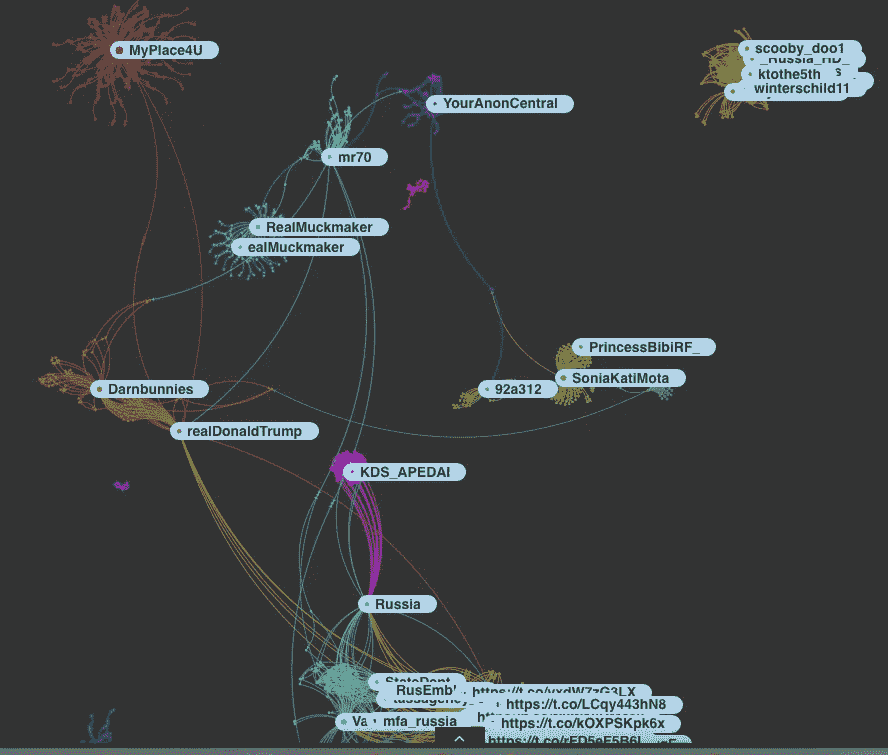

Figure 4\. Network of top Russia-related viral bots and cyborgs in August 2017\. Courtesy of Steve Kramer.

社区 1 是一个以名为 MyPlace4U 的 bot 帐户为中心的亲特朗普团体(见图 5)。

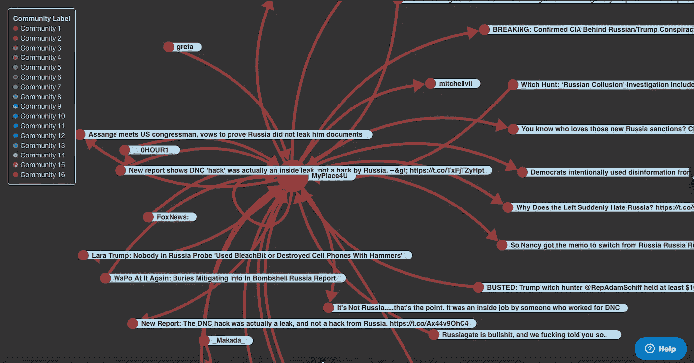

Figure 5\. Community 1 (pro-Trump bots). Courtesy of Steve Kramer

相比之下，Community 10 是一个以名为 RealMuckmaker 的 Twitter 账户为中心的反特朗普团体(见图 6)，该账户实际上是该数据集中最成功的电子人。

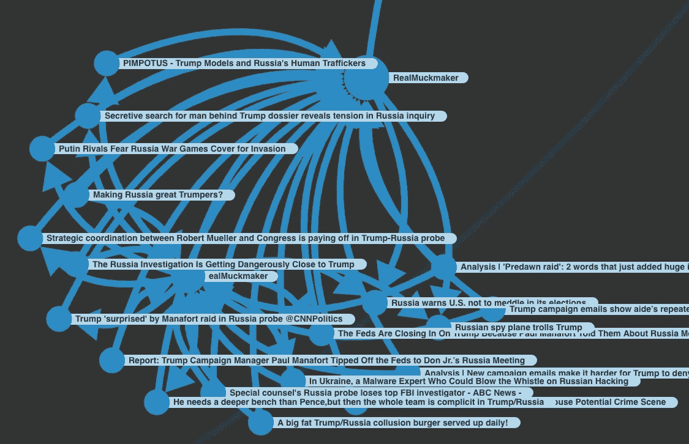

Figure 6\. Community 10 (anti-Trump bots). Courtesy of Steve Kramer

下表 3 列出了 2017 年 8 月 7 日至 19 日特朗普/俄罗斯推特网络中排名前 20 的病毒机器人和电子人。请注意，前 20 名病毒机器人和电子人中只有 6 人支持唐纳德·特朗普。支持特朗普的用户用红色突出显示。我选择了每个用户的样本推文文本，方法是计算每个推文与该用户其余推文的平均文本相似性，并使用 [Levenshtein 距离](https://en.wikipedia.org/wiki/Levenshtein_distance)和 [fuzzywuzzy Python 模块](https://github.com/seatgeek/fuzzywuzzy)选择平均相似性最高的推文。

## **表 3:2017 年 8 月前 20 名与俄罗斯相关的推特机器人和电子人**

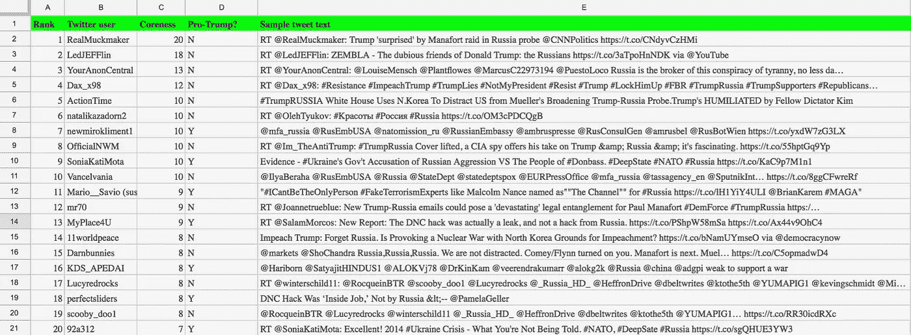

# 追踪与俄罗斯有关的机器人和电子人之间的战斗

为了了解不同的与俄罗斯有关的机器人和电子人群体在 Twitter 上传播信息的成功程度，我计算了表 3 中 6 个支持特朗普的用户和表 3 中其余 14 个反对特朗普(或中立)的用户获得的每日平均和最大核心值。图 7(互动版[此处](https://docs.google.com/spreadsheets/d/e/2PACX-1vQ8949v8gAWOVdBNLt9Jo0uyo2nSoJqjFHNzXYyoul4EnRsL8HXygPq6zHdAiQR9kh0NZn-uULxDvpM/pubchart?oid=1654298380&format=interactive))显示，总体而言，反特朗普团体在 2017 年 8 月 7 日至 19 日期间更成功地传播了其信息，8 月 11 日由@RealMucker 领导的最大高峰，该网站推广了一篇特定 [CNN 政治文章](http://www.cnn.com/2017/08/10/politics/trump-paul-manafort-russia/index.html)的链接，该文章涉及联邦调查局对前特朗普竞选经理保罗·马纳福特(Paul Manafort)住所的突袭。

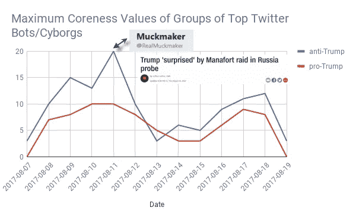

Figure 7\. Maximum coreness values of groups of Russia-related Twitter bots/cyborgs. Courtesy of Steve Kramer.

# 在 NFL 抗议争议中发现突出的机器人和电子人

我对 2017 年 9 月 14 日至 25 日期间超过 100 万条包含术语“特朗普”和“NFL”的推文应用了相同的基于熵的机器人检测和网络分析方法。下图 8 所示的 [Polinode 网络](https://www.polinode.com/networks/explore/59d10c289bcbe60011a8eca2/59d65f262e80fc001104aac9)显示了由前 20 名 NFL 相关机器人和电子人创建的网络中的 16 个不同的子群。九个团体反对 NFL 的抗议，而七个团体支持 NFL 球员跪下抗议。

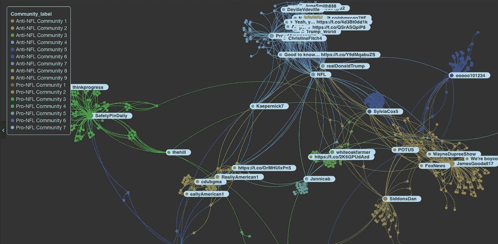

Figure 8\. Network of top Trump/NFL-related viral bots and cyborgs in September 2017\. Courtesy of Steve Kramer.

在俄罗斯相关的例子中，我计算了前 20 个与 NFL 相关的病毒机器人中支持 NFL 和反对 NFL 群体的最大每日核心值。图 9 显示，反 NFL(和亲特朗普)的机器人和电子人在传播其社交内容方面比亲 NFL 的群体更成功。更多详情请参考[我的数据.世界数据项目](https://data.world/drstevekramer/social-media-bot-detection-by-paragon-science)。

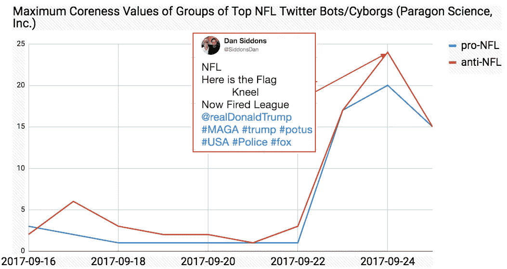

Figure 9\. Maximum Coreness Values of Groups of NFL-Related Twitter Bots/Cyborgs. Courtesy of Steve Kramer.

# 在 2016 年美国总统选举期间和之后揭露脸书机器人和电子人。

鉴于多个社交平台上关于俄罗斯参与去年选举的报道越来越多，我想将基于熵的机器人检测方法应用于与选举相关的脸书数据。我们的朋友和研究同事黄邦贤·摩根是[新知识](http://newknowledge.io/)的首席执行官和[民主数据](http://datafordemocracy.org/)的联合创始人，他友好地提供了一个数据集，其中包括 2016 年 7 月至 2017 年 4 月期间从唐纳德·川普的脸书页面收集的 1050 万条脸书公众评论。

不幸的是，因为我只有用户的脸书评论的文本内容和时间戳，所以我没有像我在前面的 Twitter 例子中那样的完整的社交网络结构。因此，不可能执行相同类型的 k 核心分解。我发现“喜欢”的数量并不是机器人或电子人成功程度的一个特别强有力或可靠的预测指标。具有最极端的文本熵 Z 分数的 20 个脸书用户在下面的表 4 中列出。顶级用户 Nadya Noor 的文本熵得分比其他用户的平均得分高出 253 个标准差。

## **表 4:来自川普脸书评论的 20 个最极端的文本机器人和电子人**

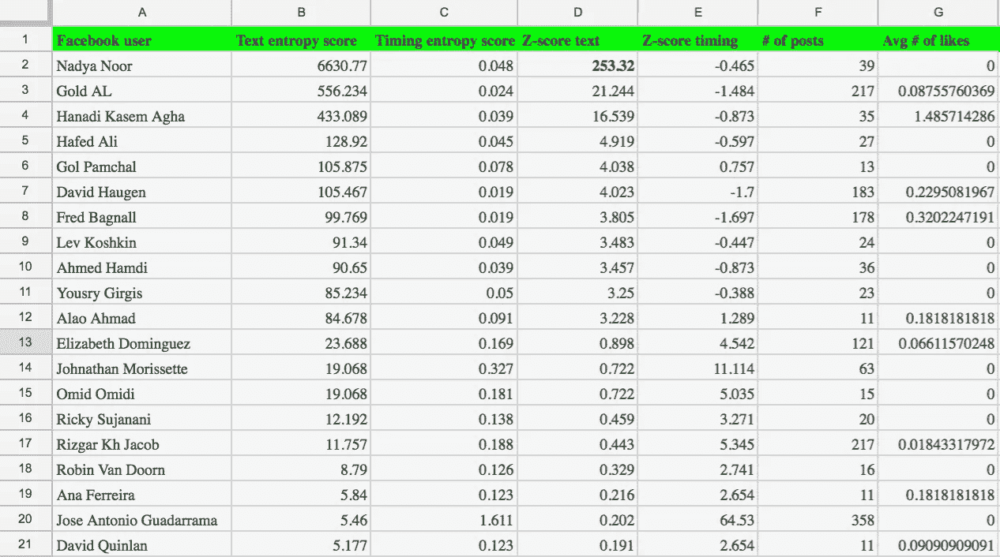

## 基于文本熵的最极端用户 Nadya Noor 在 2017 年 2 月期间用阿拉伯语发布了非常相似的文本(见表 5)。

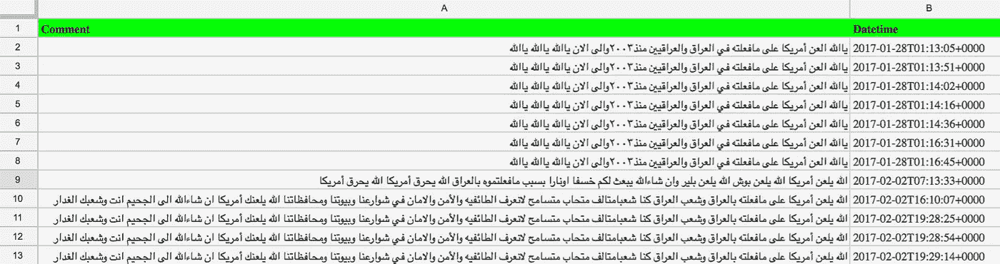

图 10 显示了该用户典型的强烈反美言论的谷歌翻译。

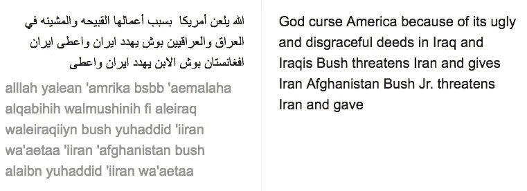

Figure 10\. Google translation of sample comment by Nadya Noor. Screenshot courtesy of Steve Kramer.

未来，我计划将社区检测算法应用于这些脸书机器人帖子中的文本内容和嵌入式 URL，以确定他们的主要讨论话题和政治倾向。

# 结论

在这篇文章中，我展示了如何使用信息熵来识别 Twitter 和脸书上的社交机器人和半机器人，然后使用网络分析和社区检测来找到成功的机器人群体。鉴于虚假信息和宣传通过社交媒体传播的极端风险，我们希望这一方法以及其他研究人员的工作能够提高透明度，并有助于保护民主和在线话语的真实性。我邀请希望合作研究这些数据集的研究人员申请成为我们在 data.world 上托管的[数据项目的合作者。](https://data.world/drstevekramer/social-media-bot-detection-by-paragon-science)

> 作者[史蒂夫·克莱默博士](https://goo.gl/5V9sX9)。[原载](https://www.oreilly.com/ideas/identifying-viral-bots-and-cyborgs-in-social-media)于[OReilly.com](https://goo.gl/r8hpBU)出版。